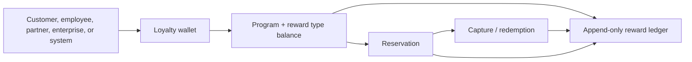
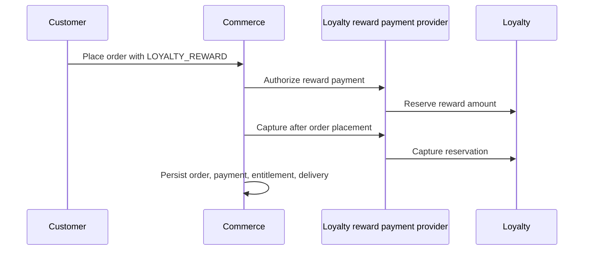

# Loyalty Wallets, Rewards, and Ledger

Maturity: operational first slice.

Nodics Loyalty gives a project a reusable way to reward people or business
actors for approved behavior, hold that value in a wallet, reserve it for a
business transaction, capture it when the transaction succeeds, release it when
the transaction fails, and explain every movement through an append-only ledger.

The business idea is simple: a customer may earn points for an order, an
employee may earn credits for a task, a partner may receive reward value for a
campaign, or an enterprise may hold a wallet for a shared program. Each wallet
has an owner type and owner code. The reward itself can be points, credits,
stamps, tokens, or a project-defined unit.

## Beginner mental model

For beginners, think of Loyalty as a bank passbook for non-cash reward value.
The wallet says who owns the value. The balance says how much of each reward
type is available, reserved, or spent. The ledger explains every movement so a
team can answer what happened later. Commerce, Engagement, Process, or a
project module may decide why a reward should move, but Loyalty records the
movement consistently.

## Business problem

Many implementations start with one points column on the customer profile.
That becomes painful as soon as the business needs multiple reward types,
expiry, coupon purchase, reversals, reservation during checkout, employee
rewards, or audit evidence. A single balance field cannot answer who changed
the balance, which program produced it, whether it is reserved, whether it was
spent correctly, or how to reverse a mistake.

Loyalty solves this by making the wallet a reusable value container and the
ledger the permanent explanation of change. Commerce, Engagement, Process,
or a customer project may decide why rewards are earned or spent, but Loyalty
owns the balance, reservation, redemption, and ledger evidence.

## Source map

| Area | Source location |
| --- | --- |
| Functional module group | `../nodics.loyalty/package.json` |
| Module ownership guide | `../nodics.loyalty/README.md` |
| Shared policy and enums | `../nodics.loyalty/modules/loyaltyCore/src/schemas/schemas.js` |
| Programs | `../nodics.loyalty/modules/loyaltyProgram/src/schemas/schemas.js` |
| Reward types | `../nodics.loyalty/modules/loyaltyRewardType/src/schemas/schemas.js` |
| Wallets and balances | `../nodics.loyalty/modules/loyaltyWallet/src/schemas/schemas.js` |
| Reward operation service | `../nodics.loyalty/modules/loyaltyWallet/src/service/defaultLoyaltyRewardOperationService.js` |
| Ledger schema and posting | `../nodics.loyalty/modules/loyaltyLedger/src/schemas/schemas.js` |
| Reservation schema | `../nodics.loyalty/modules/loyaltyReservation/src/schemas/schemas.js` |
| Redemption schema | `../nodics.loyalty/modules/loyaltyRedemption/src/schemas/schemas.js` |
| Internal API routes | `../nodics.loyalty/modules/loyaltyApi/src/router/routers.js` |
| Commerce reward payment provider | `../nodics.commerce/modules/payment/modules/paymentProviders/modules/loyaltyRewardProvider/README.md` |
| Live checkout acceptance | `../nodics.foundation/modules/nTooling/src/service/project/defaultProjectLoyaltyRewardCheckoutAcceptanceService.mjs` |

## Owner model



The wallet owner is stored as `ownerType` and `ownerCode`. This allows a wallet
to belong to a customer, employee, enterprise, partner, or system actor without
turning Loyalty into a customer-profile table.

Tenant and enterprise schema selection comes from the authenticated runtime
context. Do not add `tenant`, `enterpriseCode`, raw token, request payload, or
HTTP context fields to Loyalty wallet, balance, ledger, reservation, or
redemption rows.

## Runtime topology

Loyalty can run in the same local topology as the rest of Nodics or as a
separate microservice. In the Kickoff local topology, `loyaltyServer` runs the
framework-owned `nodics.loyalty` module group. Commerce can run on its own
server and call the Loyalty internal API through the configured server graph.

This is the important dependency direction:

| Journey part | Owner |
| --- | --- |
| Reward balance and ledger | `nodics.loyalty` |
| Coupon product, cart, checkout, order, payment transaction, entitlement, delivery | `nodics.commerce` |
| Buying a coupon with reward points | Commerce payment method and payment provider |
| Project earning rule or customer-specific reward policy | Project module or configuration |
| Runtime schema selection | Authenticated request context |

## Business journeys

### Earn

An approved business event grants reward value. The earning reason can come
from Commerce, Engagement, Process, or a project-specific module, but the
balance movement belongs to Loyalty. The ledger entry type is `EARN`.

### Reserve

Before a reward value is spent, Loyalty can reserve it. Reservation moves value
from available to reserved so a checkout or external process can continue
without double-spending the same points. The ledger entry type is `RESERVE`.

### Capture

When the downstream business journey succeeds, the reservation is captured.
Reserved value becomes spent value, a redemption record is created, and the
ledger receives a `CAPTURE` entry.

### Release

If the downstream journey fails or is cancelled before capture, the reservation
is released. Reserved value returns to available value, and the ledger receives
release evidence.

### Reverse

Corrections and refunds are compensating movements. Historical ledger rows
remain append-only; a new `REVERSE` entry explains the correction.

## Reward payment provider checkout pattern

Buying a coupon with points is not Loyalty module behavior. It is a Commerce
checkout journey using Loyalty as the reward-balance authority.



Use `paymentMethod: "LOYALTY_REWARD"` when checkout should pay for a product
with reward value. Commerce decides that the product can be bought, calculates
the cart, owns payment transaction evidence, creates the order, and delivers
the coupon or digital entitlement. Loyalty only owns the wallet balance,
reservation, redemption, and ledger.

## Developer guidance

Developers should start from the owner before adding code:

| Change | Put it here |
| --- | --- |
| New reward unit such as points, credits, or stamps | `loyaltyRewardType` data or project data |
| New program such as VIP rewards | `loyaltyProgram` data or project data |
| Balance mutation behavior used by every project | `loyaltyWallet` service contract |
| Ledger posting behavior | `loyaltyLedger` |
| Reserve, capture, release, reverse API | `loyaltyApi` |
| Coupon purchase with points | Commerce payment method/provider |
| Project-specific earn policy | Customer project extension module |
| Storefront labels and customer messaging | Project frontend or content data |

Use string decimal amounts for reward balances. Do not use floating point
arithmetic for points or credits. Use idempotency keys and correlation IDs for
mutating operations so retries do not double-spend rewards.

## Customization guidance

Customize Loyalty from the outside first:

1. Configure reward programs, reward types, expiry windows, and spend policies.
2. Add project-owned data packs for customer-specific reward catalogs.
3. Add a project extension module when a customer has unique earning,
   validation, expiry, or eligibility rules.
4. Add Commerce payment providers or payment-method configuration when reward
   value can buy products, subscriptions, coupons, or services.
5. Change the reusable framework module only when all projects need a new
   Loyalty contract.

Project customization must keep standard owner names stable. A customer project
may extend Loyalty behavior, but it should not rename the framework capability
or create a parallel wallet authority.

## Security and governance

Loyalty internal mutation APIs are service-to-service contracts. Customer or
admin tokens may read authorized wallet views when such routes are exposed, but
reserve, capture, release, and reverse operations should be called by trusted
services such as Commerce payment providers.

Permissions must be explicit. Service accounts need the Loyalty internal
permissions used by payment-provider handoff. Browser responses and logs must
not expose raw tokens, API keys, customer secrets, or provider payloads.

## Operational evidence

An operator needs enough evidence to decide whether a reward spend succeeded,
failed, or needs compensation:

| Evidence | Why it matters |
| --- | --- |
| Wallet balance | Shows available, reserved, and spent reward value |
| Reservation | Shows value was held for a target order or process |
| Ledger entries | Shows append-only movement history |
| Redemption | Shows captured reward usage |
| Payment transaction | Shows Commerce payment lifecycle |
| Order evidence | Shows checkout selected the Loyalty reward provider |
| Entitlement or delivery | Shows the product or coupon was actually fulfilled |

## Verification

For framework changes, run the focused Loyalty tests:

```sh
node nodics.loyalty/modules/loyaltyApi/test/loyaltyApiRouteContract.test.js
node nodics.loyalty/modules/loyaltyWallet/test/loyaltyRewardOperationContract.test.js
node nodics.loyalty/modules/loyaltyLedger/test/loyaltyLedgerContract.test.js
```

For Commerce checkout integration, run the provider test and the Kickoff live
acceptance:

```sh
node nodics.commerce/modules/payment/modules/paymentProviders/modules/loyaltyRewardProvider/test/loyaltyRewardPaymentProviderContract.test.js
cd ../nodics.kickoff
npm run acceptance:loyalty-reward-checkout
```

The live acceptance starts Platform, Loyalty, and Commerce, places an HTTP
checkout using `LOYALTY_REWARD`, verifies Mongo evidence across Loyalty and
Commerce models, and writes a browser-readable report to
`.nodics/tmp/loyalty-reward-checkout-live/index.html`.

When a journey is customer-visible, complete a browser pass as well. The page
or journey should show business-safe status, readable balance/payment evidence,
and no broken layout at desktop and mobile widths.

## Common mistakes

- Treating coupon purchase as Loyalty instead of Commerce payment behavior.
- Storing tenant or enterprise fields in Loyalty business rows.
- Moving balances without ledger evidence.
- Editing old ledger entries instead of posting reversals.
- Letting a project-specific reward policy become the framework default.
- Using floating point math for reward amounts.
- Calling internal mutation APIs directly from a public browser journey.

## Reader checklist

Business readers should leave this page knowing what reward wallets do and why
ledger evidence matters. Developers should know which module owns each change.
Operators should know which runtime and evidence to inspect. Project teams
should know how to customize reward programs and checkout spend behavior
without forking the standard Loyalty framework.
