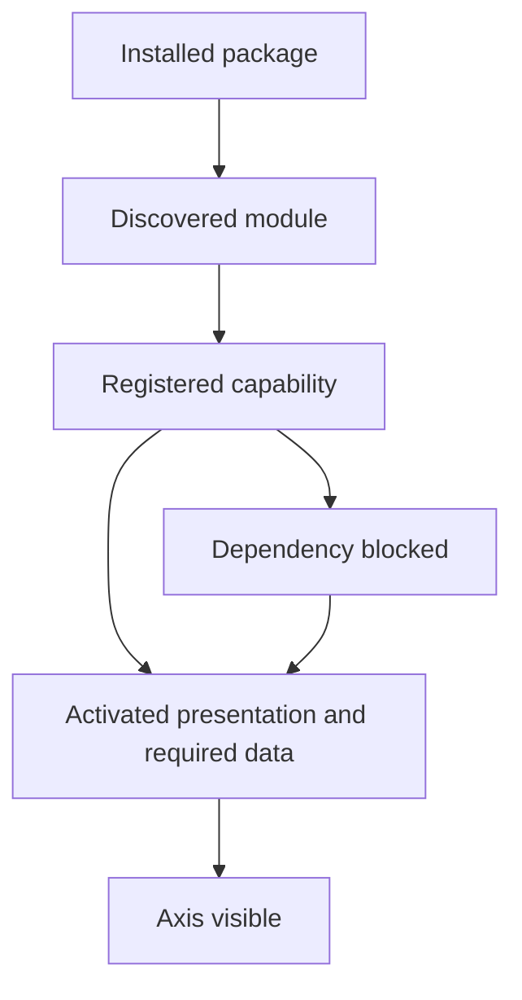
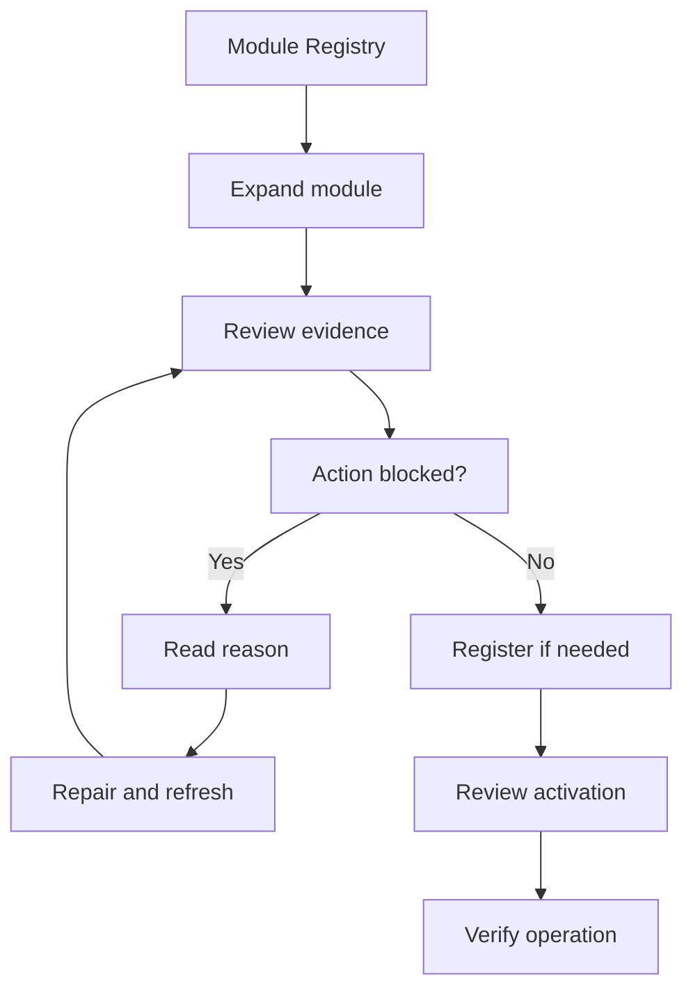

# Module Registry Journey

The Module Registry journey explains how Nodics turns installed modules into
visible, governed business capabilities. Axis can show a module, dependency,
activation, and setup state, but BackOffice owns the registry contract and the
backend modules own their schemas, data, routes, and services. For beginners,
think of the registry as the map that tells Axis what exists, what is active,
what is blocked, and which action is allowed next.

## Source map

| Area | Source location |
| --- | --- |
| BackOffice module package | `../nodics.platform/modules/backoffice/package.json` |
| Capability registry service | `../nodics.platform/modules/backoffice/src/service/registry/defaultBackofficeCapabilityRegistryService.js` |
| Registry store | `../nodics.platform/modules/backoffice/src/service/registry/defaultBackofficeRegistryStoreService.js` |
| Discovery service | `../nodics.platform/modules/backoffice/src/service/discovery/defaultBackofficeDiscoveryService.js` |
| Registry route tests | `../nodics.platform/modules/backoffice/test/backofficeRegistryRouteContract.test.js` |
| Functional lifecycle and complete paging | `../nodics.platform/modules/backoffice/src/service/registry/defaultFunctionalModuleCatalogueService.js` |
| Effective navigation and target availability | `../nodics.platform/modules/backoffice/src/service/registry/defaultBackofficeRegistryService.js` |

## Lifecycle



The business problem is confidence: an administrator needs to know whether a
capability is ready before asking a team to use it. Developers need a reliable
place to expose module metadata without giving Axis direct ownership of source
contracts. Operators need dependency evidence, activation state, and recovery
actions before production use.

## Registry contract

Each capability should expose stable identity, display metadata, owner module,
dependency requirements, runtime role, route availability, allowed actions, and
health state. BackOffice normalizes this into Axis-friendly data. Axis should
render sections, cards, badges, disabled actions, and setup messages from that
contract instead of hardcoding module rules.

```js
// Existing module-owned navigation contract, published through getCapability().
const navigationItem = {
  id: 'enterprises',
  label: 'Enterprises',
  route: '/profile/enterprises',
  workbenchTarget: { moduleName: 'profile', schemaName: 'enterprise' },
  requiredPermissions: ['profile.enterprise.read']
};
```

## Dependency and activation rules

Required modules represent local runtime dependencies. Remote runtime needs,
such as Online publication targets, should be represented separately as target
availability or integration readiness. This distinction matters in production
because a module can be locally active while its publication target is
unavailable. Business users should see the impact. Developers should see the
owner and missing dependency. Operators should see a retry or repair path.

Nodics should not introduce a second sequencing framework for functional
modules when the runtime already has one. BackOffice should project the
functional module's package `index` as `moduleIndex`, and Axis should use that
value for stable visual ordering. The project environment should use existing
`nodics.extends` metadata to load local module groups in dependency order.
Existing backend activation-data configuration remains available for genuine
whole-module prerequisites. Do not use it to block an entire optional group
because one feature calls another module. The standard Accelerators umbrella
does not require Commerce and Discovery; selected industry groups retain their
actual inheritance. Likewise, Location is not a whole-Waste activation gate.

BackOffice evaluates the publishing module and `workbenchTarget.moduleName`
against authorized availability. Lifecycle actions use their existing
`ownerModule`. Missing targets disable the affected item or action and supply
an explanation through `help.summary` or action `summary`; unrelated actions
remain usable. Recompute this after published menu overrides, so saved
presentation never freezes a module's old availability.

Internal integrations remain enforced by the owning API/provider. For example,
an approval-required operation cannot succeed without its approval authority,
even if the rest of its module is available. Declared partial read enrichment
may degrade; required references and mutations never silently succeed.

Use the existing metadata and service override paths, not a new dependency
catalogue or configuration layer. Keep package indexes for loading, runtime
leases for observed availability, and human registration/activation for
presentation enablement. None is a substitute for target API permissions.

## Customization and extension guidance

Developers can add new capability providers, discovery adapters, registry
fields, and readiness checks. Keep activation logic in BackOffice or the owning
module service. Customer projects can add metadata for their modules without
changing Axis navigation code. AI tools should update registry tests whenever
they add a new capability status, dependency type, or user action.

## Read the registry without confusing its states

An administrator should read registration, enablement, runtime health and data
readiness separately. A healthy process can advertise an optional module that
the business has not chosen to activate. Conversely, a registered module can
retain its records while all its observed instances are offline.

| Observation | Meaning | Next useful action |
| --- | --- | --- |
| Available for registration | Discovered functional capability is not yet registered in this scope. | Review ownership, prerequisites and activation-data impact before Register. |
| Registered but disabled | Registration exists; business presentation is not enabled. | Review activation readiness and permissions. |
| Runtime ACTIVE with Disabled presentation | Runtime observation and administrator choice differ; this is possible. | Do not interpret runtime health as activation. |
| Required | Protected foundation of the standard experience. | Do not use optional-module removal to bypass foundational requirements. |
| Blocked | A prerequisite has failed in the relevant lifecycle. | Read the named blocker and owner, not only the blocker count. |
| No observed runtime | No currently usable observation establishes availability. | Inspect Module Health and the responsible deployment. |
| Feature disabled with a target reason | A particular owner/target is unavailable. | Restore that owner or choose an independent operation. |

The standard protected roots are Foundation, Platform and WCMS. Process and
Localization are optional, but an operation requiring their authority still
fails closed. A change from protected to optional preserves an existing
registration and its enabled state; it does not uninstall or disable it.

## Axis administrator walkthrough

Prerequisites: an authenticated employee in the intended project and tenant,
permissions for the chosen registry action, a connected BackOffice, and a
disposable test environment for activation or failure exercises. Ordinary
business users need access only to their assigned operations, not registry
administration. Never share an administrator session to make an example work.



This screen flow is the visual companion to the steps below. It represents
the implemented journey, not a screenshot of a particular tenant. Labels and
counts can differ with the authorized project, installed modules and release.

1. Open **System & Integrations**, then **Module Registry**. Confirm the
   intended environment before any mutation.
2. Expand the module. Read the registration state, enabled/disabled state,
   observed servers, technical members and activation-data status independently.
3. For an available optional module, review **Register**. Registration and
   activation are distinct operations; do not assume one authorizes the other.
4. When blocked, identify the named prerequisite and its current state. A
   whole-module prerequisite must be genuine; a single optional remote feature
   is not a reason to force an unrelated business group to activate.
5. After successful registration, review the allowed activation action and its
   data impact. Execute only in the intended scope with the required authority.
6. Refresh and inspect navigation. An inactive module should not reappear from
   an old published menu. An enabled publisher may still contain a disabled
   target-dependent action.
7. Open the relevant business operation and verify its API outcome. Navigation
   presence is useful evidence, but not proof that create, save, approve or
   publish completed successfully.

### Example: unavailable target, independent action

Suppose a module-owned page has a read target and two declared lifecycle
actions. The save action is owned by that same target; a second action belongs
to a different module. If only the second action's owner is unavailable, the
page and save action stay available, subject to their existing permissions.
BackOffice marks the second action disabled and supplies its reason. If the
page's required target disappears, the page itself is disabled.

This metadata fragment illustrates the existing contract. `recordOwner` and
`approvalOwner` are placeholders for real technical module identities, not new
functional modules to install or literal production configuration:

```js
const item = {
  id: 'project-records',
  featureState: 'ACTIVE',
  workbenchTarget: { moduleName: 'recordOwner', schemaName: 'record' },
  lifecycleActions: [
    { id: 'save', ownerModule: 'recordOwner', featureState: 'ACTIVE' },
    { id: 'approve', ownerModule: 'approvalOwner', featureState: 'ACTIVE' }
  ]
};
```

Add these fields to an actual provider's existing, validated navigation/action
contract. This fragment deliberately omits API bindings, route, labels and
permissions; it is not a complete executable capability provider. The backend
uses the publishing module, `workbenchTarget.moduleName`, and action
`ownerModule`. It does not discover every secondary integration hidden inside
an arbitrary API implementation. Those integrations remain service-owned.

## Customize and extend safely

### Narrow an existing provider in a project overlay

Example outcome: a project wants to label the Waste collection-centre entry
**Collection Sites**, without renaming Waste, changing references, or editing
Axis code. Start with an existing project module loaded after Waste Core on the
runtime that publishes its capability. Its ownership metadata must allow the
service contribution, and its local composition must select the provider being
extended. A new file in an unselected module has no effect.

Place the following method override at
`modules/<projectModule>/src/service/defaultWasteBackofficeCapabilityService.js`.
The filename preserves the existing service identity. Inherited lifecycle,
`capabilityData()` and `buildCapability()` methods remain framework-owned:

```js
module.exports = {
  getCapability: function () {
    const effective = this.buildCapability(this.capabilityData());
    return Object.assign({}, effective, {
      navigation: effective.navigation.map(item =>
        item.id === 'waste-collection-centres'
          ? Object.assign({}, item, { label: 'Collection Sites' })
          : item
      )
    });
  }
};
```

This is a method-level example, not a full module scaffold. Keep the module's
standard copyright, JSDoc, package metadata and tests when adopting it. The
override changes only the label in a fresh projection. It preserves IDs,
permissions, workbench targets, parent relationships, action owners and
registration under the framework functional identity.

1. Confirm the effective service is the merged project provider, using the
   normal runtime service/load evidence rather than requiring framework source
   files directly from the project.
2. Test the provider with and without the project override. Only the selected
   label should differ. Repeated calls must not mutate shared source data.
3. Test an unauthorized user and an unavailable target: the custom label must
   not make either case usable.
4. If a governed published menu already overrides this label, it can still take
   presentation precedence. Review that menu through the normal publication
   journey; do not bypass it with hardcoded Axis navigation.
5. For rollback, remove the project method override, rebuild/restart its owning
   runtime and refresh discovery. Restore any separately published label change
   through the owning publication lifecycle, not a database edit.

### Tune catalogue page size without changing eligibility

The existing `backofficeFunctionalModuleCatalogue.eligibilityPageSize` property
defaults to 256. Set it in the normal project/server configuration layer hosting
BackOffice; use the worked 128-record example in Modular Architecture and
Ownership. This controls backend page size, not the maximum number of modules
shown. A project with 513 catalogue records must still return all scoped
records. Smaller pages trade more requests for smaller per-request payloads;
the final aggregate still occupies memory. This is not streaming or a guarantee
of unbounded catalogue size.

Custom discovery and provider adapters must preserve project, tenant and
authorization context on every page. A failed later page is not an empty final
page. Never reconcile all unseen records as offline from an incomplete read.

### Non-customizable security and ownership

Projects cannot use a saved menu to restore a missing provider, replace backend
authorization with a frontend flag, or auto-enable a disabled registration on a
heartbeat. The same requirements apply after published navigation overrides.
New module-owned navigation must be supplied by the authorized provider before
it is eligible for published presentation; arbitrary saved IDs are not a way
to create business capabilities.

## Troubleshooting and recovery

| Symptom | Check | Safe correction and proof |
| --- | --- | --- |
| Optional module is healthy but absent from left navigation | Registration, enabled state and employee permissions. | Complete the authorized lifecycle or assign proper access; do not add static menu entries. |
| Target action is disabled | Named target/owner, authorized readiness, provider configuration. | Restore the required owner and refresh; test the actual API afterward. |
| Blocked only because an unrelated optional group is missing | Existing activation-data prerequisites and real local composition. | Correct the owning project metadata if the dependency is artificial; retain genuine prerequisites. |
| Old menu still appears after deactivation | Current effective navigation versus saved presentation. | Refresh backend projection and verify source-provider eligibility; do not erase business data. |
| Some modules disappear from a large catalogue | Page-size settings, full-page traversal, failed later requests. | Fix the failed scoped read; verify last-page records and reconciliation. |
| One runtime replaces another runtime's technical members | Live lease set and aggregate functional identity. | Verify union of active observations and pruning of expired members. |
| Recovery did not activate a module | Persisted disabled state. | Expected behavior: activation remains an explicit administrator decision. |

Capture correlation identifiers, module identity and sanitized backend errors.
Do not include bearer tokens, employee secrets or unrelated customer records in
support screenshots. A lease view describes observed instances, not a complete
inventory of every process an operator intended to deploy.

## Repeatable acceptance examples

### Revision conflict during activation

`catalogueRevision` is the optimistic token for an administrator decision, not
a counter of heartbeats. Changing runtime membership or an observation timestamp
does not invalidate a decision. Changing registration, enablement, protection,
registered version or the advertised activation-package policy does. An
activation also checks runtime presence at its final conditional write, so a
runtime lost during import cannot produce a successful enablement.

Example: Commerce Online and Commerce Staged advertise the same release code.
Their different target servers are separate observations, not alternating
replacements of one package. After both observations arrive, repeated heartbeats
converge. A target's successful import receipt cannot satisfy another target's
failed import. Historical receipts are matched only to their recorded target.

If another administrator changes the module while activation is in progress,
the action still fails its revision check. Axis refreshes the catalogue and
clears the old success message; it does not silently retry a mutation. Review
the current registration and activation receipts before retrying. An import
can have completed before a final decision conflict, so a failed activation is
not proof that all data operations rolled back.

For project customization, the existing
`backofficeFunctionalModuleActivationData.modules[functionalModule].dataPackages`
descriptors override observed descriptors for the same release code. Put a
verified target in the BackOffice-hosting project configuration, not in Axis.
Retain the real release code accepted by nImport. If a project intentionally
requires multiple targets for one release, supply those target-specific
descriptors in that existing array. Do not invent another routing file.
Removing the override restores observed routing; review the resulting plan and
rerun readiness before activation. Configuration rollback does not undo imports.

Verify alternating heartbeats, two target-specific receipts, project routing
precedence, runtime loss during import and two administrators using the same
revision:

```bash
node --test nodics.platform/modules/backoffice/test/functionalModuleConcurrency.test.js
```

Run these non-live tests from the framework root:

```bash
node --test nodics.platform/modules/backoffice/test/navigationModuleAvailability.test.js
node --test nodics.platform/modules/backoffice/test/functionalModuleLifecyclePagination.test.js
```

For a project overlay, add tests for unchanged framework identity, the renamed
label, retained permission requirements, missing/restored targets, and unchanged
shared provider data. Exercise paging at 0, 1, page-size, page-size plus 1 and
multiple pages. Include two runtimes contributing different technical members.

For browser qualification, run the administrator walkthrough with a permitted
user and a restricted user in an isolated environment. Record registration,
activation, independent-operation and rejected-operation results separately.
Do not mutate the user's live installation merely to capture a failure screen.
No source-only test or screenshot proves every business operation was qualified.

## Implementation handoff

When a new module is added, the handoff should include package metadata,
runtime role, visible capability name, dependency list, health signal, setup
actions, and documentation page references. That makes the registry useful to
business users who need a clear journey, developers who need extension points,
operators who need production readiness, and QA owners who need repeatable
acceptance checks.

## Common mistakes

- Treating frontend menu entries as module activation evidence.
- Mixing local required modules with remote API target availability.
- Hiding dependency failures behind a generic setup error.
- Adding registry fields without route and service tests.
- Letting a business action appear enabled before required capability checks
  pass.

## Verification

Run BackOffice registry, discovery, capability, and availability tests. Then
use an isolated test environment, initialize module data, open Axis, and confirm the
registry view shows active, blocked, and unavailable states with safe messages.
Test optional targets absent, present, lost and restored without resetting
business records. Include more than one catalogue page and multiple runtime
instances: all lifecycle listings and lease reconciliation must read complete
pages, and one instance must not erase another instance's technical members.
Production readiness requires business clarity, developer source traceability,
operator evidence, and repeatable QA checks.
