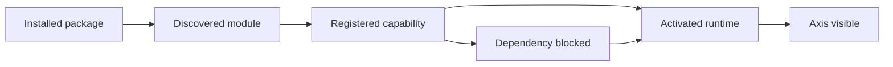

# Module Registry Journey

The Module Registry journey explains how Nodics turns installed modules into
visible, governed business capabilities. Axis can show a module, dependency,
activation, and setup state, but BackOffice owns the registry contract and the
backend modules own their schemas, data, routes, and services. For beginners,
think of the registry as the map that tells Axis what exists, what is active,
what is blocked, and which action is allowed next.

## Source map

| Area | Source location |
| --- | --- |
| BackOffice module package | `../nodics.platform/modules/backoffice/package.json` |
| Capability registry service | `../nodics.platform/modules/backoffice/src/service/registry/defaultBackofficeCapabilityRegistryService.js` |
| Registry store | `../nodics.platform/modules/backoffice/src/service/registry/defaultBackofficeRegistryStoreService.js` |
| Discovery service | `../nodics.platform/modules/backoffice/src/service/discovery/defaultBackofficeDiscoveryService.js` |
| Registry route tests | `../nodics.platform/modules/backoffice/test/registryRoute.test.js` |

## Lifecycle



The business problem is confidence: an administrator needs to know whether a
capability is ready before asking a team to use it. Developers need a reliable
place to expose module metadata without giving Axis direct ownership of source
contracts. Operators need dependency evidence, activation state, and recovery
actions before production use.

## Registry contract

Each capability should expose stable identity, display metadata, owner module,
dependency requirements, runtime role, route availability, allowed actions, and
health state. BackOffice normalizes this into Axis-friendly data. Axis should
render sections, cards, badges, disabled actions, and setup messages from that
contract instead of hardcoding module rules.

```js
const capability = {
  code: 'cms',
  ownerModule: 'nodics.wcms',
  status: 'ACTIVE',
  requiredModules: ['media', 'process'],
  runtimeRole: 'STAGED',
  actions: ['initialize', 'publish', 'refresh']
};
```

## Dependency and activation rules

Required modules represent local runtime dependencies. Remote runtime needs,
such as Online publication targets, should be represented separately as target
availability or integration readiness. This distinction matters in production
because a module can be locally active while its publication target is
unavailable. Business users should see the impact. Developers should see the
owner and missing dependency. Operators should see a retry or repair path.

## Customization and extension guidance

Developers can add new capability providers, discovery adapters, registry
fields, and readiness checks. Keep activation logic in BackOffice or the owning
module service. Customer projects can add metadata for their modules without
changing Axis navigation code. AI tools should update registry tests whenever
they add a new capability status, dependency type, or user action.

## Implementation handoff

When a new module is added, the handoff should include package metadata,
runtime role, visible capability name, dependency list, health signal, setup
actions, and documentation page references. That makes the registry useful to
business users who need a clear journey, developers who need extension points,
operators who need production readiness, and QA owners who need repeatable
acceptance checks.

## Common mistakes

- Treating frontend menu entries as module activation evidence.
- Mixing local required modules with remote API target availability.
- Hiding dependency failures behind a generic setup error.
- Adding registry fields without route and service tests.
- Letting a business action appear enabled before required capability checks
  pass.

## Verification

Run BackOffice registry, discovery, capability, and availability tests. Then
start a fresh schema, initialize module data, open Axis, and confirm the
registry view shows active, blocked, and unavailable states with safe messages.
Production readiness requires business clarity, developer source traceability,
operator evidence, and repeatable QA checks.
