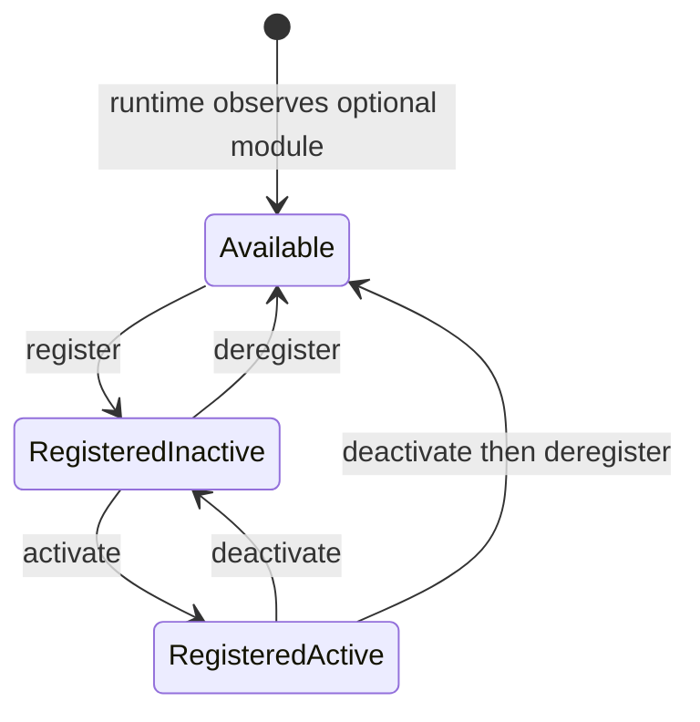
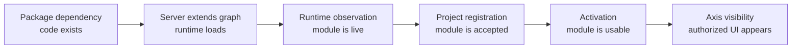

# Functional module registry

The functional module registry is the Platform/BackOffice contract that tells
Axis which high-level Nodics capabilities are known, registered, active, and
safe to show to business users. It is intentionally focused on functional
modules such as `nodics.foundation`, `nodics.platform`, `nodics.wcms`, and
`nodics.process`, not every small technical module inside those groups.

For a beginner, the registry is like the application control panel. It does
not download code and it does not hot-load a server process. It records the
project decision that a live capability is allowed to participate in the
project. Runtime servers still need to start with the right module graph.

## Why the registry exists

Without a registry, Axis would have to guess from menus, routes, package names,
or server responses which modules are safe for a project. That creates messy
behavior: a link may appear before the backend is ready, an operator may repeat
the same setup after every restart, or a customer may see technical modules
that only developers understand.

The registry separates two different facts:

- runtime observation: a server is currently running and has reported a
  capability;
- project registration: the project has durably accepted that capability.

Restarting a server renews its runtime observation. It should not ask the
operator to register the same module again.

## Lifecycle states

Optional functional modules move through a small lifecycle. The current Axis
module registry page follows this model.



| State | Beginner meaning | Axis action |
| --- | --- | --- |
| Available | A live server has reported the module, but the project has not accepted it. | Show Register. |
| Registered inactive | The project accepted the module but has not enabled it for use. | Show Activate or Deregister. |
| Registered active | The module is accepted and enabled. | Show Deactivate. |
| Deregistered | The project removed its durable acceptance while the runtime may still observe it. | Move back to Available. |

Core, Platform, and WCMS are mandatory for the local Axis journey. They should
not be treated like optional modules that a business user can deregister from
the same screen. Process is optional, so it can be observed, registered,
activated, deactivated, and deregistered while exposing workflow and cronjob
technical modules.

## Mandatory versus optional modules

The registry should stay business-readable. A business user should not need to
understand every technical module that helped Core or WCMS start.

| Module type | Example | User lifecycle |
| --- | --- | --- |
| Mandatory foundation | Core, Platform, WCMS | Installed and active by runtime contract; not deregisterable from Axis. |
| Optional functional capability | Process | Register, activate, deactivate, deregister. |
| Technical module | `cronjob`, `media`, `profile` internals | Not shown as separate business registry cards unless exposed by an owning functional module. |
| Customer extension | customer Platform extension | Customizes the standard identity; does not create a new displayed Platform name by default. |

Mandatory does not mean “hardcoded in Axis.” It means the current reference
BackOffice experience depends on those capabilities. Axis still discovers the
effective state from backend contracts, but it should not offer destructive
business actions that would remove the foundation required for login, registry
visibility, and WCMS-backed presentation.

## Business value

For business users, the registry reduces confusion. Axis can show “Platform,”
“WCMS,” or “Process” as understandable capabilities instead of exposing dozens of
technical internals such as validators, routers, cache providers, import
processors, or individual schema modules.

For a partner, this also protects adoption cost. A project can start with the
mandatory capabilities, then add optional capabilities when there is a business
reason. The decision is recorded in the database, so the project does not need
manual reconfiguration after every restart.

## Business example: deciding to enable Process automation

A small customer may start with login, content, media, and documentation only.
After a few weeks, the business asks for nightly cleanup of temporary media,
scheduled export retries, and approval workflows. Process becomes useful. The
project team starts `processServer`, Axis sees `nodics.process` as available,
and an authorized administrator registers and activates it.

The business decision is visible and reversible:

1. Before registration, Process is observed but not accepted by the project.
2. After registration, the project remembers that Process is part of its accepted
   capability set.
3. After activation, workflow and cronjob operations can become available according to
   permissions and data import state.
4. Deactivation pauses the capability without forgetting the registration.
5. Deregistration removes project intent while the runtime may still be
   technically live.

That lifecycle is safer than silently enabling features because a server
happened to start.

## Developer model

Developers should not confuse registry state with code availability. Package
dependencies and repository checkout decide which source is available.
Environment/server `extends` configuration decides which modules load in a
runtime. The registry records project authorization for a functional module
that the runtime has already observed.

That means a module can be visible as available only after a server starts and
reports it. If `processServer` is not running, Platform cannot honestly present
Process as a live optional capability. If Process is running but deregistered,
Axis should show it under available modules with the Register action.



Each step answers a different question. Code existing on disk does not mean a
server loaded it. A server loading it does not mean the project accepted it. A
project accepting it does not mean a user has permission to operate it.

## API and UI contract expectations

The registry API must give Axis enough information to render without guessing:

- functional module code and display name;
- mandatory or optional classification;
- observed runtime servers;
- current registration state;
- current activation state;
- active technical modules for explanation, not as primary business toggles;
- available actions for the current user and state;
- last observation and catalogue revision;
- safe status or error messages.

Axis should update its local state immediately after register, activate,
deactivate, or deregister operations. A browser refresh must not be required
to reveal the next valid action. If an operation fails, Axis should retain the
previous known state and show the backend error.

## DevOps and operator model

Operators should monitor both sides of the contract. A registered module that
has no live runtime observation may indicate a stopped server, network issue,
or broken health path. A live runtime observation for an unregistered optional
module means the server is up, but the project has not accepted the capability.

In production, audit events should capture who registered, activated,
deactivated, or deregistered a module. Those actions affect what Axis exposes
and what business users can operate, so they should be treated as governed
administrative changes.

## What the registry must not do

The registry must not become a package manager. It should not clone
repositories, rewrite server `extends`, or silently enable server categories.
It also must not expose every technical module as a business toggle. Technical
module loading remains a framework/runtime concern; functional module lifecycle
is the BackOffice-facing control.

## Security and audit expectations

Functional-module lifecycle operations change what employees can see and use,
so they are administrative actions. A production-ready registry should record:

- who performed the operation;
- enterprise and tenant context;
- previous state and next state;
- runtime evidence used during the decision;
- timestamp and correlation identity;
- safe failure reason when an operation is rejected.

Axis should display the resulting state, but the backend must remain the audit
authority. Browser state alone is not evidence that a module was registered,
activated, deactivated, or deregistered.

## Verification checklist

- Start Platform, WCMS, and Process from a fresh database.
- Confirm Core, Platform, and WCMS are registered and active by default.
- Confirm Process appears as available when its runtime is live.
- Register Process and verify it moves to registered inactive or active according
  to the operation response.
- Activate, deactivate, and deregister Process without refreshing the browser.
- Confirm deregistered Process returns to available while processServer remains
  observed.
- Restart servers and confirm durable registration state is preserved.

## Acceptance scenarios

| Scenario | Expected result |
| --- | --- |
| Fresh database with Platform and WCMS only | Core, Platform, and WCMS are active; Process is not shown as live. |
| processServer starts | Process appears as available optional module with workflow and cronjob technical modules. |
| User registers Process | Process moves out of available list and shows the next valid state without page refresh. |
| User activates Process | Process shows active and exposes active-state actions without page refresh. |
| User deactivates Process | Process remains registered but inactive. |
| User deregisters Process | Process returns to available if the runtime is still observed. |
| Servers restart | Mandatory state and registered optional state persist from database. |
| processServer stops | Registered state remains, but runtime observation should show unavailable or stale according to the API contract. |

## Common mistakes

- Treating `nodics.kickoff` as a functional module just because it starts
  servers.
- Renaming Platform to a customer name when a customer extension only
  customizes Platform behavior.
- Showing technical modules as first-class registry cards for business users.
- Assuming deregistration stops a process. It changes project state; process
  lifecycle is still an operator/runtime concern.

## Required data completion before activation

When a capability declares required data releases, activation preflights them
through nImport. Releases already current need no replay. Releases not installed,
updated or previously failed are executed through the existing importer. Every
required release must then be confirmed `CURRENT` before activation continues.
A running, queued, missing or non-executable result blocks activation.

For example, if Core import is still running when an administrator activates a
capability, the activation receipt remains running and activation is refused.
Wait for the owning import run to complete, inspect failures if present, then
retry against the current catalogue revision. A refresh, accepted request or
empty response is not import completion. This rule preserves the existing
catalogue revision and runtime/readiness checks; it adds no new importer.

## Runtime identity, activation and protected work

A runtime declares what it wants to host; Profile decides what its authenticated
service principal may host. Profile uses the existing `principalScopeAssignment`
record with `scopeType: RUNTIME_DEPLOYMENT`. Each replica has a distinct principal,
retained API-key proof and `runtimeIdentity.instanceCode`. The approved record
binds tenant, enterprise, project, environment, server, instance, module names and
explicit permissions. A business registration does not grant runtime identity.

An operator may author a grant through the existing governed Profile data/API
path. This example is an approval record, not a startup header or automatic
self-enrollment request:

```json
{
  "code": "warehouse-jobs-01",
  "principalType": "service",
  "principalCode": "warehouse-jobs-01",
  "scopeType": "RUNTIME_DEPLOYMENT",
  "scopeCode": "warehouse-jobs-01",
  "tenantCode": "warehouse",
  "enterpriseCode": "warehouseOperator",
  "inheritanceMode": "DIRECT",
  "status": "ACTIVE",
  "effect": "ALLOW",
  "runtimeScope": {
    "projectCode": "warehouse",
    "environmentCode": "production",
    "serverCode": "jobsServer",
    "instanceCode": "warehouse-jobs-01",
    "modules": ["cronjob", "workflow"],
    "permissions": ["auth.internal.token.read", "process.instance.start"]
  }
}
```

The module and permission arrays must describe the actual selected deployment,
including its announced dependencies and required operations. The example is
intentionally incomplete for a full server. Confirm permission names from the
effective owning routers. The principal itself must hold every permission in the
grant. Wildcard/group permissions do not propagate into the issued runtime JWT.
A matching DENY, expired grant, mismatched coordinate or several matching ALLOW
records rejects issuance. One service principal cannot represent multiple active
instances.

Provision the service principal and hashed API key through Profile's existing
identity pipeline. For the first Profile authority, place approved records in
trusted deployment initializer data; an existing authority can use its privileged
management flow. Keep raw proof in deployment secret storage and resolve it via
declarative environment/secret configuration. Do not commit it in a data pack or
copy another replica's proof. Existing customer bootstrap admin credentials do
not automatically become deployment approvals. A deployment must provision its
records and runtime identity before adopting scoped startup.

`defaultAuthDetail` supplies the instance's tenant-scoped proof and enterprise.
`runtimeIdentity.instanceCode` supplies its explicit identity. Local and remote
Profile issuance use the same authorization owner, including the initial authority
startup. Tenant initialization awaits governed Init release completion before
identity reconciliation and token issuance. A local Profile host has no direct
token-issuance shortcut. Restart reuses securely retained
proof and rechecks the grant; it does not repeat business registration. This
built-in path uses Profile API-key authentication. It does not implement a
single-use enrollment-grant provider.

Credentials default to five minutes and cannot outlive their assignment. One
asynchronous renewal loop refreshes before expiry with bounded concurrency and
jitter/backoff; shutdown waits for in-flight renewal. Grant changes invalidate
old credentials through Profile's existing principal update and shared security
stamp. Atomic allocation prevents two Profile instances from choosing the same
version, and atomic version writes prevent a stale issuer from reversing a
revocation. Strict auth cache configuration requires a shared engine with atomic
consume and atomic version writes, with local fallback disabled.

Registration responses project activation from the existing functional catalogue.
The registration agent refreshes this projection through its existing batched
heartbeat. The default operational-state lifetime is 30 seconds, configurable
from one to 60 seconds on both authority and runtime; the runtime uses the shorter
lifetime. A failed heartbeat does not extend the last response. Deactivation
therefore has bounded propagation, rather than an instantaneous cross-process
promise. Expired or absent state denies new protected work.

Cronjob checks this state and current JWT expiry/revocation/stamp immediately
before invoking a job target. It forwards the verified runtime identity to a
Process handoff and local target. A loaded schedule remains manageable while the
business capability is inactive. New targets stop; an already-admitted job
finishes or follows its existing recovery/cancellation contract. This performs
existing authentication-cache checks per execution, without adding a Profile or
registry HTTP round trip for each job. Performance acceptance must measure that
cost; source-level tests are not throughput or production availability evidence.

Process also checks its local `workflow` operational state before creating a new
instance, including a start requested by Cronjob. Caller permissions and audit
identity remain intact. Existing instances retain their task completion,
cancellation and recovery rules after business deactivation.

For HTTP calls, nRouter checks the requested module against the credential.
Runtime tokens do not carry identity groups. Their base route eligibility comes
from `authSecurity.internalToken.runtimeAccessGroups` (default `userGroup`), and
explicit action permissions must match the approved token list. Restricted-group
and human-only routes remain restricted. Legacy routes without an action
permission require approved module scope and an eligible base access group;
domain ownership and mutation checks still apply.

Operator-triggered application and remote activation imports preserve the authenticated
human bearer through configured nImport routes. Service callers or missing bearers
cannot execute setup imports. Read-only preflight retains the bounded runtime token;
destination permission, tenant and schema-access enforcement remains authoritative.
