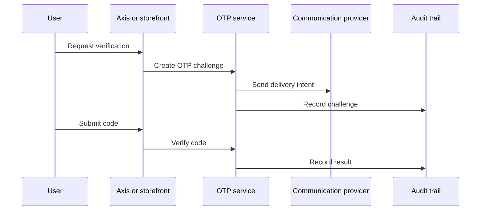

# OTP and Security Flow

OTP gives Nodics a time-bounded verification method for login, recovery,
approval, and sensitive operations. It supports security, but it is not a
complete identity system by itself. Profile and security modules own identity,
roles, groups, and permissions. OTP owns generation, delivery intent,
verification, expiry, retry, throttling, and audit. For beginners, an OTP is a
short-lived proof that a user controls a channel.

## Source map

| Area | Source location |
| --- | --- |
| OTP module | `../nodics.foundation/modules/nOtp/package.json` |
| Profile module | `../nodics.platform/modules/profile/package.json` |
| Security documentation | `docs/pages/nodics.platform/security-identity-access.md` |
| Communication providers | `../nodics.communication/modules/smtpCommsProvider/package.json`, `../nodics.communication/modules/smsCommsProvider/package.json` |

## Flow

The business problem is safer access without slowing every journey. Business
users need clear prompts and recovery paths. Developers need expiry and retry
contracts. Operators need throttling, audit, failed delivery, and abuse
evidence in production.

## Policy contract

| Policy | Purpose |
| --- | --- |
| Expiry window | Limits how long a code is valid. |
| Retry limit | Prevents guessing and noisy resends. |
| Channel policy | Selects email, SMS, or another verified channel. |
| Audit event | Records challenge and verification outcome. |
| Lockout rule | Protects high-risk operations after repeated failures. |

## Configuration behavior

OTP configuration should define expiry, retry limit, resend delay, channel
priority, lockout threshold, and audit retention. Configuration changes should
be governed because they directly affect account security and user experience.
Business users may see policy labels, developers own the enforcement service,
and operators verify the active configuration in production diagnostics.

## Customization and extension guidance

Developers can add channel providers, templates, throttling policies, lockout
rules, and risk checks. Business users should configure supported journeys
through governed settings, not through code changes. Operators should monitor
challenge volume, failure rate, delivery failure, and locked accounts. Never
store OTP secrets in data files or documentation examples.

## Implementation handoff

Each OTP journey should document trigger context, recipient lookup, channel
policy, expiry, retry limit, lockout rule, audit event, and safe browser
message. This helps business users trust the verification journey, developers
keep security logic centralized, operators investigate production abuse or
delivery problems, and QA owners test both success and failure without
exposing secret values.

## Evidence checklist

OTP evidence should include challenge id, user reference, channel type,
created time, expiry time, attempt count, delivery status, verification result,
and lockout decision. It should never include the raw code. Production support
needs enough detail to diagnose delayed delivery, repeated failures, and abuse
patterns while business users continue to see simple recovery instructions.

High-risk operations should also record why OTP was required. That context
helps developers keep policy centralized and helps operators distinguish a
normal verification journey from suspicious production behavior.

## Common mistakes

- Treating OTP as a replacement for identity and permission checks.
- Allowing unlimited resend or verification attempts.
- Exposing whether an account exists through error messages.
- Logging raw OTP codes.
- Forgetting communication provider failure handling.

## Verification

Run OTP, Profile, and communication provider tests for successful verify,
expired code, wrong code, retry limit, resend throttling, and delivery
failure. In browser tests, confirm the message is business-safe and no raw code
or sensitive account evidence appears. Production readiness requires audit,
throttling, developer tests, operator dashboards, and QA security evidence.
