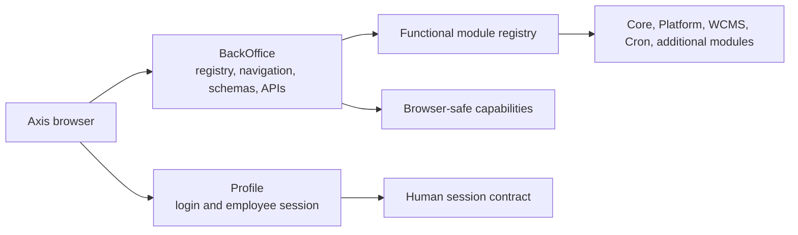
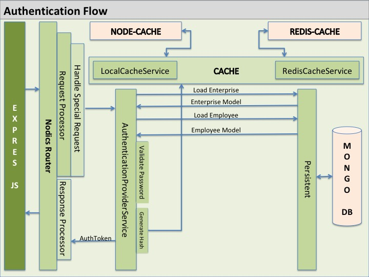
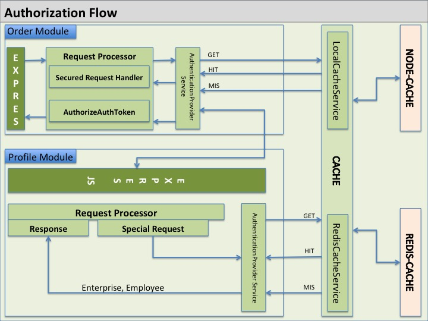
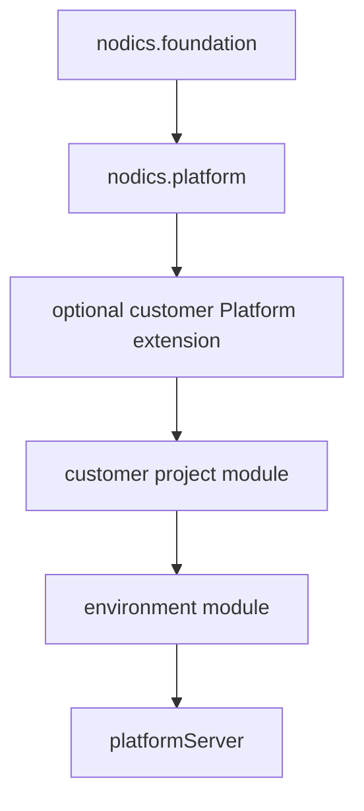

# Platform overview

`nodics.platform` extends Core and supplies the foundation for human-facing
employee operations. In the current reference stack, Platform includes Profile,
BackOffice, and the backend Axis module that owns Axis-specific importable
content and capability metadata.

For a beginner, Platform is the front desk of the backend. It authenticates
employees, exposes the BackOffice bootstrap contract, tells Axis which
functional modules are registered and active, and provides browser-safe
metadata so users can operate the project without guessing what is installed.

## Business purpose

Platform is where a Nodics project becomes operable by people. Core makes the
runtime possible; Platform makes it visible and governed for employees.

Platform helps the business answer:

- who can log in;
- which enterprise and tenant context is active;
- which functional modules are available to this project;
- which modules are mandatory, optional, registered, active, inactive, or
  unavailable;
- which navigation, actions, schemas, APIs, and documentation sources are safe
  for the current user;
- which administrative changes were made and by whom.

This prevents Axis from becoming a hardcoded menu. Axis asks Platform and
BackOffice what is allowed, then renders it.

## Beginner mental model

Think of the local reference stack like a building:

- Core is the foundation and utilities.
- Platform is the reception/security desk.
- Profile verifies who the employee is.
- BackOffice tells the employee which rooms they are allowed to see.
- WCMS provides content and documentation rooms.
- Cron provides scheduled background rooms.
- Axis is the screen the employee uses to navigate the building.

Axis does not decide which rooms exist. Platform/BackOffice returns the
authorized projection.

## Authentication and authorization flow

Platform is the first runtime most Axis users touch, so beginners often assume
login is a frontend problem. It is not. Axis collects credentials and renders
the session experience, but Profile and Platform own the authentication,
session, authorization, enterprise, and tenant checks.

The diagrams show the principle: a secured request must travel through the
approved request processor, session/token validation, cache/provider lookup,
and owning service. Axis hiding a menu is only a usability aid. The backend
must still reject unauthorized API access directly.

## What Platform owns

Platform owns the employee-facing backend foundation:

- Profile identity and employee authentication;
- BackOffice bootstrap and browser-safe discovery;
- functional module registry and lifecycle APIs;
- module health projections;
- API/Swagger discovery surfaces;
- administrative navigation and capability metadata;
- audit events for registry and BackOffice actions;
- backend-owned Axis product data through `modules/axis`;
- Platform documentation and module-level contracts.

Platform does not own WCMS content data, media storage, Cron job execution, or
customer-specific project behavior. It may show metadata for those modules, but
the owning module remains authoritative.

## Runtime loading and customization

A Platform server loads Core first, Platform second, and customer/project
layers later according to the effective server graph and module index order.

A customer extension can customize Platform behavior while the displayed
functional module identity remains `nodics.platform`. This is important: a
customized Platform is still Platform unless the customer intentionally defines
a new business capability.

## BackOffice and Axis boundary

BackOffice is the backend authority for the Axis bootstrap experience. Axis is
the browser renderer. This boundary protects security and maintainability:

| Concern | Owner |
| --- | --- |
| Employee login and session enforcement | Profile/Platform backend |
| Registry state and module lifecycle | BackOffice/Platform backend |
| Authorized navigation metadata | BackOffice/Platform backend |
| Page rendering, interaction, responsive UI | `nodics.axis` frontend |
| Axis documentation/content records | Platform `modules/axis` backend module |
| Framework documentation | `nodics.docs` |
| Customer documentation | Customer project |

If a page appears in Axis, that does not mean the frontend owns the data or the
business operation. Axis renders what the backend exposes.

## Developer model

When adding Platform behavior, first decide whether the change belongs to
Profile, BackOffice, the Axis backend module, or a customer extension.

Examples:

| Need | Likely owner |
| --- | --- |
| Login/session behavior | Profile |
| Module registry lifecycle | BackOffice |
| Axis product documentation data | Platform `modules/axis` |
| Axis React page rendering | `nodics.axis` frontend |
| Customer-specific Platform override | Customer extension module |
| Runtime server port or database | Customer environment/server config |

Do not add Platform logic to Axis because the user clicks the button in Axis.
The browser button is presentation. The operation belongs to the backend
module that owns the business rule.

## DevOps and security model

Platform is security-sensitive because it is the entry point for employee
authentication and BackOffice discovery. Operators should treat Platform as a
critical runtime:

- keep human credentials separate from service/Cron credentials;
- keep public browser configuration separate from private secrets;
- log authentication and registry lifecycle events;
- reject unauthorized direct route/API access even when Axis hides a menu;
- keep CORS, CSRF, CSP, cookie/session, token, and audience rules explicit;
- monitor Platform readiness before starting manual Axis evaluation;
- verify module registry persistence across restarts.

## QA acceptance checklist

Platform is healthy when:

1. Platform starts after Core and before customer project layers.
2. The reference admin can authenticate.
3. BackOffice bootstrap returns browser-safe authorized metadata.
4. Core, Platform, and WCMS are mandatory active modules in the reference
   stack.
5. Optional Process automation appears only when processServer is observed.
6. Registry lifecycle actions persist and update Axis without refresh.
7. Unauthorized registry/API operations fail closed.
8. Documentation-source registry exposes Framework, Swagger, Axis, and customer
   docs from the correct owners.
9. Module Health reflects backend runtime evidence without frontend guessing.
10. Fresh local acceptance passes after database reset.

## Common mistakes

- Treating BackOffice as a frontend concern because Axis displays BackOffice
  screens.
- Putting WCMS content records into `nodics.axis`.
- Renaming Platform when a customer extension only customizes Platform.
- Assuming a live runtime means the optional module is registered.
- Making Axis decide permissions or registry state locally.
- Storing secrets in browser-visible configuration.

Platform is the governance bridge between backend capability and employee
operation. Keep that bridge explicit, audited, and backend-owned.

## Verification

Verify Platform from both the API side and the Axis side. The API proof is
that Platform starts after Core, exposes secured Profile and BackOffice
contracts, rejects unauthorized access, and persists functional module
registry state. The Axis proof is that a reference employee can log in, obtain
authorized navigation, see mandatory modules, operate optional module
lifecycle actions without manual refresh, open documentation-source products,
and recover safely when Platform is unavailable.

For documentation or data changes, regenerate the owning content packs and
confirm Platform advertises the correct source owners: framework docs from
`nodics.docs`, Axis product docs from the Platform Axis backend module,
Swagger/API sources from registered runtime modules, and customer docs from
the owning customer project. If a documentation source appears only because
Axis hardcoded it, the Platform contract is incomplete.
