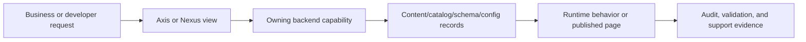
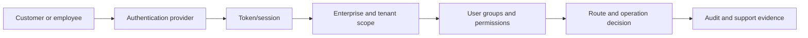

# Security, Identity, and Access Governance

Authentication, authorization, groups, documentation authoring roles, read-only Axis access, tenant isolation, and audit responsibilities. This page is intentionally written for beginners, business users, developers, operators, architects, QA owners, and AI tools. It explains the business problem first, then the technical ownership model, then the exact customization and verification responsibilities so nobody has to guess where a change belongs.

A platform that lets business users change content, configuration, and runtime behavior must prove who can read, edit, review, approve, publish, and operate each capability. Profile centralizes users, groups, permissions, token context, and enterprise or tenant assignments. Capability modules declare permission needs, while routes, services, and Axis workspaces enforce them consistently.

## Business context

For a business user, this topic answers what decision can be made, which operational journey is supported, and what risk is reduced. The practical value is faster delivery without losing governance: teams can understand the current capability, decide whether it applies to their project, and know when Axis, Nexus, content catalog, workflow, or runtime services are involved.

For beginners, the mental model is simple: the page title is the business capability, the table identifies who owns each part, and the diagram shows how a request or change flows. A reader should not need source-code knowledge to understand the journey, but the developer path is still available when customization is needed.

| Business question | Answer for this topic |
| --- | --- |
| What problem does it solve? | A platform that lets business users change content, configuration, and runtime behavior must prove who can read, edit, review, approve, publish, and operate each capability. |
| Who uses it? | Business users, administrators, developers, operators, QA owners, implementation partners, and AI-assisted delivery tools. |
| What changes can it support? | Profile centralizes users, groups, permissions, token context, and enterprise or tenant assignments. Capability modules declare permission needs, while routes, services, and Axis workspaces enforce them consistently. |
| What must be governed? | Permissions, validation, source ownership, publication state, runtime impact, audit evidence, and rollback boundaries. |

## Journey and ownership

Profile owns users, employees, groups, permissions, and identity context. Documentation author and read-only viewer roles extend this model without creating a separate documentation-only security authority. This keeps the reader-facing name friendly while preserving exact source ownership for developers and AI tools. Axis may render management screens or authenticated documentation, Nexus may render public Online content, and the backend content catalog remains authoritative for navigation, pages, access policies, and publication state.



| Responsibility | Owner | Notes |
| --- | --- | --- |
| Business capability name | Security, Governance, and Compliance | Used in navigation and dashboards so readers are not exposed to raw module names first. |
| Source owner | nodics.platform | Carries exact implementation, documentation, and validation evidence. |
| Technical module | profile | Holds the relevant schema, service, router, data, or contract detail where applicable. |
| Axis experience | Backend-declared workspace | Axis renders metadata and actions but does not become the authority. |
| Public experience | Online content delivery | Nexus renders only records approved for public access. |

## Data and configuration detail

Every topic must explain the data that changes behavior. Some topics are schema-driven, some are configuration-driven, some are publishable content, and some are operational records. The documentation must say which category applies before showing code. That keeps production operators and developers aligned on whether a change needs publication, restart, event propagation, approval, or only a project-layer override.

| Detail area | What to document | Verification signal |
| --- | --- | --- |
| Model or record | Type code, catalog, tenant, enterprise, state, owner, and lifecycle. | Schema contract or generated model test. |
| Configuration key | Default value, override location, environment scope, and runtime impact. | Config validation and runtime refresh evidence. |
| API or event | Route/event name, payload boundary, permission, idempotency, and failure mode. | Route, service, event, and authorization tests. |
| Publication and access | Staged/Online state, access mode, roles, groups, and permissions. | Content-pack validation and access-policy test. |

```js
permission: { code: "documentation.draft.create", group: "documentationAuthorUserGroup", publish: false }
```

## Customization and extension

Developers should customize from the project layer first. A customer project may add properties, services, validators, pipelines, renderers, data packs, or provider configuration when the extension respects the owning capability. Business users may update governed records in Axis when the record is designed for administration. Framework source changes are reserved for improving the reusable product capability itself.

| Customization type | Recommended path | Avoid |
| --- | --- | --- |
| Business label, navigation, or content area | Axis-managed content catalog item with publication workflow. | Hardcoding labels or page trees in the frontend. |
| Runtime setting | Module configuration with validation and governed runtime propagation. | Editing node-local files on each server by hand. |
| Domain behavior | Extension service, validator, pipeline step, or provider adapter. | Forking the standard module for customer-only logic. |
| Public visibility | Access policy with public/authenticated/role-based state. | Exposing internal or draft pages through Nexus. |

## Operations and governance

Operators need production-safe evidence, not only implementation notes. Each page must call out logging, tracing, permission checks, event propagation, data import/export, publication status, rollback behavior, and troubleshooting. If a capability affects multiple nodes, the documentation must explain how changes reach every node and how a partial failure is detected.

| Operational concern | Required documentation detail |
| --- | --- |
| Security | Authentication mode, permission code, role/group, tenant and enterprise isolation. |
| Audit | Actor, timestamp, source record, checksum, approval, route/event, and result. |
| Resilience | Retry, idempotency, compensation, fallback, cache invalidation, and rollback. |
| Observability | Logs, metrics, dashboard cards, health checks, and support evidence. |

## Common mistakes

- Treating a friendly navigation label as the technical source owner.
- Writing only developer details and skipping the business decision that the page supports.
- Updating Axis or Nexus code when the content catalog, schema, or backend capability should own the change.
- Forgetting access rules for public, authenticated, role-based, group-based, or permission-based pages.
- Skipping diagrams, comparison tables, source maps, or troubleshooting matrices because the topic feels obvious.
- Changing runtime behavior without explaining production impact, cluster propagation, and rollback.
- Leaving generated documentation without source evidence, validation commands, and maturity state.

## Verification

Verification starts with the document itself: it must include business context, technical ownership, a visual flow, data or configuration tables, customization guidance, common mistakes, and validation evidence. Developers then run the documentation generator and content-pack validator so the page becomes backend-owned data with checksum, lifecycle, navigation, access policy, publication state, and search metadata.

For implementation verification, run the owning module tests and any Axis or Nexus renderer tests that consume the page. Operators should confirm that production-like runtime behavior matches the documentation: permissions reject unauthorized access, Online pages do not expose Staged data, runtime changes propagate through governed events, and troubleshooting evidence is available without exposing secrets.

## Current implementation coverage

Security, identity, and access governance covers employees, customers,
enterprises, tenants, user groups, permissions, principal scope assignments,
authentication providers, browser sessions, internal runtime tokens, password
records, and identity migration evidence. This page also owns the
documentation roles discussed for Axis: super admin, admin reviewer/approver,
documentation author, and read-only Axis viewer. Admin may review, approve,
and publish; author can create and update documentation content; viewer can
inspect Axis applications without write permissions.



| Access topic | Source records | Documentation requirement |
| --- | --- | --- |
| Enterprise and tenant | Enterprise, Tenant, Address, Contact. | Isolation, activation, default tenant behavior, and migration risk. |
| Principal identity | User, Employee, Customer, Password, UserState. | Authentication, status, ownership, and protected data handling. |
| Group and permission | UserGroup and resolved permissions. | Exact permission codes, inherited access, and denial behavior. |
| Scope assignment | PrincipalScopeAssignment. | Which enterprise/tenant/domain a principal can act within. |
| Documentation access | Page access policy and lifecycle visibility. | Public, authenticated, role-based, group-based, permission-based, or restricted visibility. |

For Axis, every left-navigation entry and page action should map to a
backend-declared capability and permission. The frontend may hide unavailable
actions for usability, but backend authorization remains the decision point.
For Nexus, public pages must come only from Online content and must not expose
restricted documentation, secrets, internal routes, or draft implementation
notes.

Implementation evidence comes from profile route contracts, authentication
service tests, browser session tests, runtime internal token tests, user group
permission resolution, principal authorization scope contracts, recursive
interceptor tests, identity governance and migration tests, mandatory identity
bootstrap checks, and generated schema contracts for Enterprise, Tenant,
Customer, Employee, UserGroup, User, UserState, Password, and
PrincipalScopeAssignment.
