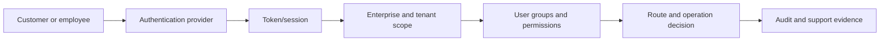
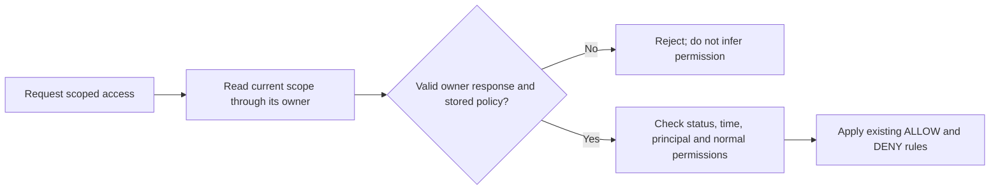
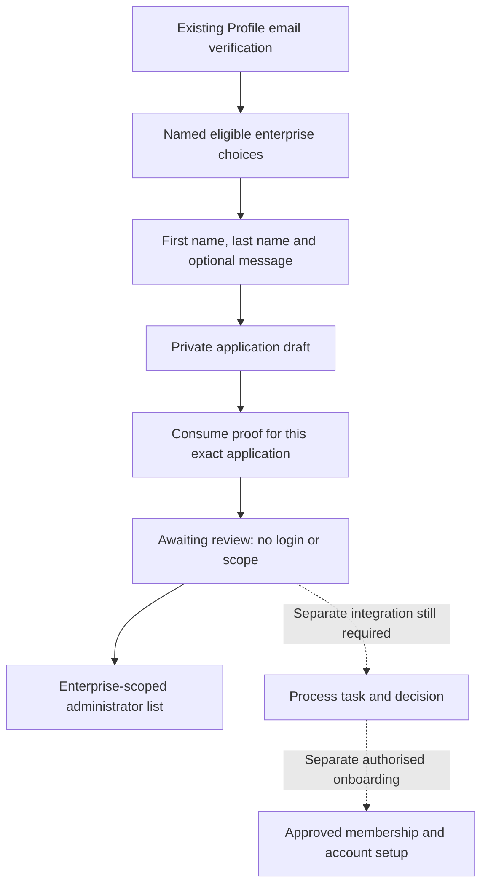
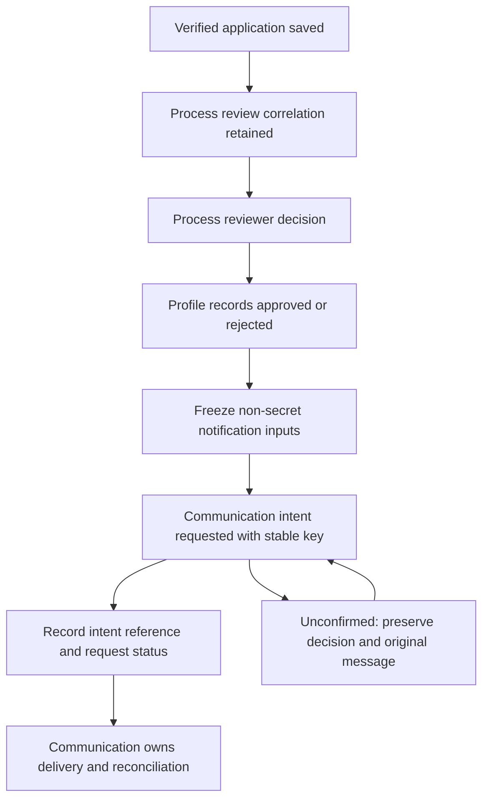

# Security, Identity, and Access Governance

## October 2026 Source Consolidation Boundary

For business users and operators, source availability is different from an
enabled enterprise journey. The current branch adds explicit target-owned consent,
held hierarchy changes, historical application retirement and staged historical
identity linking. Those capabilities retain independent false qualifications.
Beginners must not activate switches to bypass missing owner approval or unfinished
acceptance. Developers extend existing Profile owners; Kickoff remains lightweight.

### Target Consent And Relationship Changes

Profile stores private consent on existing Enterprise records, not another tree or
identity registry. New enterprise creation captures creationDefault=false with empty
rights; retries retain existing rights and later configuration changes never retrofit
them. Positive-default source requires an explicitly approved `creationRights` policy,
fresh human platform authority and a ready immediate-parent administrator; missing
approval or incomplete rights reject before setup writes. This policy remains null
by default. Source administration also recognizes fresh accepted assignments with
an explicit `ENTERPRISE_ADMIN` role classification, not a role label or broad group
alone. Targets can grant explicit ancestor VIEW/INVITE consent with role and exact-
recipient ceilings, bounded expiry and canonical source evidence. Independently
qualified MANAGE_ACCESS permits bounded onward commands, never operational authority,
automatic descendant access or Customer consent. Onward qualification stays false.

Consent routes GET/POST `/nodics/profile/v0/enterprise-administration/consent` use
management exposure, human access authentication, configured permission and no-store
responses. Generic CRUD cannot manufacture, replace or erase private proof. Operator
projections contain only current revision and bounded grant summaries, not canonical
locators, command hashes or credentials. Ancestor invitations revalidate ceilings at
acceptance and membership issue/switch/refresh. Independent typed consent stamps join
canonical and membership proofs; groups are never unioned across enterprises.

The target-aware GET `/enterprise-administration/:enterpriseCode/workspace` publishes
versioned presentation, revision, authorized source-assignment choices, explicit
commands and bounded options. Matching GET/POST `/:enterpriseCode/consent` routes
retain independent target admission; selecting a target is not permission. Grant
commands use an opaque `recipientAssignmentCode`, resolved by Profile, rather than a
browser-supplied canonical identity locator. Axis reviews one inspected revision and
one operation ID; a failed or uncertain response leads to inspection, not automatic
replay. Backend navigation remains hidden until enforcement is qualified.

Profile's secured pipeline contribution rechecks owner contexts after token
authentication on each request. This observes expiry/source loss and current relationship
evidence. Installed cross-runtime/module-boundary enforcement and distributed cache
behavior are not yet demonstrated; production qualification must cover all consumers.

Hierarchy GET/POST `/enterprise-administration/hierarchy` are separate fresh PASSWORD
platform-super-admin operations. A held operation advances relationship epoch, rejects
hierarchy reads while PENDING, revokes only retained path-dependent grants and repairs
their individual stamps before the final parent CAS. Interrupted commands retain their
exact original identity and targets; they are never stolen on timeout. Returning to an
old parent never revives old consent. Reverse subEnterprises is not a second authority.

Separately qualified POST `/enterprise-administration/hierarchy/recover` consumes an
exact retained operation ID and graph revision. Recovery is not a timeout-based lock
takeover. Terminal cancellation retains the original parent and advanced epoch, so
the abandoned command cannot acknowledge a late parent change or revive old grants.
Private cancellation facts must be verified by the consent owner before hierarchy
reads resume. Installed concurrency, source-loss and lost-acknowledgement acceptance
are still required; no recovery switch has been enabled.

### Historical Identity And Application Recovery

Historical canonical linking requires current proof of both original passwords,
reviewed inventory fingerprint and independently qualified retirement guards. It stages
the original target inactive, retires its local credential at the Password owner and
retains private recovery evidence. Canonical credentials and histories are preserved;
no membership, customer consent or active session follows from linking. Targets with
dependent checkpoints/memberships reject rather than being silently reassociated.
Customer eligibility now has a Profile-owned live admission path consuming published
Rules policies and current original account, credential, lockout and consent evidence.
It is not a fabricated KYC approval or an email-as-verification shortcut. Policy,
provider and installation qualification remain explicit; missing evidence rejects.

Application retirement can select an exact retained WITHDRAWN/EXPIRED historical
attempt with the current assignment revision. The owner uses its original Process
correlation and never mutates a resubmitted application's history or new decision.
Axis confirms the selected attempt and handles competing/uncertain results without
automatic replay. Inspection is retained source evidence, not live proof of retirement.

### Customize And Accept Safely

Existing later Profile modules contribute `config/properties.js`; preserve false
qualifications until accepted installed evidence. Tighten `administrationConsent`
maximumGrants, maximumLifetimeDays and allowedRoleCodes through layering. Exported
owner members may narrow behavior but cannot remove canonical proof, private evidence,
conditional acknowledgements, role/action/recipient ceilings or non-revival. Full
command and recovery detail is in Profile's `administration-consent-commands.md` and
`enterprise-membership.md`; those contracts do not authorize runtime migration.

For example, a later-loaded Profile extension can narrow limits and change labels
in its existing `config/properties.js` without replacing authentication or persistence:

```js
module.exports = {
  enterpriseManagement: {
    administrationConsent: {
      maximumGrants: 10,
      maximumLifetimeDays: 7,
      maximumDelegationDepth: 2,
      workspace: {
        presentation: { title: "Organisation Administration" },
      },
    },
  },
};
```

The module must extend Profile and load after it through the normal runtime hierarchy.
The example inherits disabled qualification and false creation defaults; it neither
grants permissions nor rewrites existing rights. Role classification does not add
permissions to imported groups. Approved action permissions remain governed group/
scope records. Validate default and later-layer composition, malformed configuration,
stale revisions, denied sources, expiry, cancellation and uncertain-write inspection
in the joint session before activation. Do not copy the full default configuration.

| Evidence                                        | Current Boundary                        |
| ----------------------------------------------- | --------------------------------------- |
| Source/fixtures                                 | Authored; behavioral fixtures NOT RUN   |
| Static governance                               | Reported separately after consolidation |
| Installed indexes/cache/owner retirement        | Qualification remains false             |
| Axis/Circa automated and visual acceptance      | Joint session, NOT RUN                  |
| Runtime imports, notification sends and release | Not authorized in this batch            |

## Enterprise Hierarchy Evidence

Profile's existing Enterprise owner resolves a child-to-root chain using fresh,
bounded, non-recursive Enterprise and Tenant reads. Parent and tenant references
use code coordinates, including resolved objects whose code is reloaded. The
singular `superEnterprise` is the traversal source; `subEnterprises` is not an
independent authority or proof of a bidirectional transaction.

`enterpriseManagement.hierarchy.maximumDepth` defaults to 32 records including
the child. Later Profile layers may narrow it within the integer range 1-128.
Missing/inactive/ambiguous dependencies, cycles, malformed references and overflow
reject; a second pass detects observed drift but is not an atomic graph snapshot.
Creation validates its proposed parent before tenant, enterprise and activation
writes, including self/descendant-parent refusal. Existing creation retries do not
retrofit rights or create another enterprise.

This framework dependency grants no parent administration or business-data access.
Target consent, bounded grant provenance, authority ceilings, serialized reparenting
and dependent-session invalidation remain separate implementation requirements.
Projects customize the existing exported Profile owner and layered depth setting;
they do not copy the hierarchy into Kickoff, Axis or Circa. The new fixtures are
authored for joint testing, not accepted runtime evidence.

## Explicit Structural Recovery Resumption

The independently qualified migration recovery command accepts an exact reviewed
audit code/fingerprint under fresh original PASSWORD platform authority. An
interrupted RECOVERING audit resumes only its original persisted operation fence.
It never clears a lease, takes another operation identity or infers canonical
identity linking from structural evidence.

The acknowledged completed prefix must still match audited post-state. Remaining
records must match exact pre/post facts: post-state is skipped; pre-state uses the
existing conditional owner write. Every progress checkpoint compares phase,
operation, fingerprint and previous applied count. All post-states are rechecked
before terminal acknowledgement; an already completed recovered audit permits
only read-only replay against unchanged post-state. Drift or owner failures reject.
This is not a transactional snapshot, credential restoration or runtime/index
qualification. ROLLING_BACK inspection remains separate and does not gain resume
authority from this change. Behavioral and concurrency acceptance stays required.

## Accepted Hierarchical Delegation Design

Enterprise parent/child relationships already belong to Profile. The approved
framework direction is target-consented ancestor administration, supporting
descendant depth without automatic subtree access. Employees still
receive explicit target-enterprise memberships and roles; parent relationships and
enterprise business roles do not automatically grant access. Administrative scope
is separate from operational and business-data access. This applies across Nodics,
not only to one application or accelerator.

Administrators must remain within their assignable-role/action ceiling. Preserve
grant provenance, separate enterprise session permissions and independent valid
grants. New subsidiaries do not automatically receive employee access. Reparenting,
revocation, expiry and source authority changes require grant revalidation and
affected access/refresh invalidation, without deleting existing customer or asset
history. Configuration and extensions remain in Profile's existing layers.

The enterprise's super administrator controls parent access. Consent defaults to
false; a layered global default is evaluated only when creating the enterprise to
initialize explicit rights. Changing that default does not rewrite existing rights
and it is not reapplied when reparenting. Later changes use explicit grant/revocation
commands. Immediate-parent access requires consent; higher ancestors must be
explicitly selected. Backend visibility follows valid scoped grants, not merely
hierarchy membership or frontend filters.

Access management is a separate permission with approved role, action, recipient
and enterprise ceilings. A parent grant does not automatically confer full super
administration or redelegation. Revocation invalidates dependent onward grants and
affected sessions, preserves independent memberships and never automatically revives
revoked grants. Reparenting removes old hierarchy-dependent authority; the new parent
requires fresh explicit consent. Protect the last active enterprise super
administrator against removal, suspension or demotion until a replacement is active;
exceptional recovery requires an audited platform-super-administrator action.

Authorized administrators of the designated PLATFORM_OWNER enterprise retain
platform-wide administration independent of parent consent. Mere enterprise
membership/business role is insufficient; tenant boundaries, route permissions,
account checks and auditing still apply. This is not automatic customer-data access
or impersonation authority.

Maturity: accepted design, not complete implementation or installed acceptance.
Current exact-target/platform checks are unchanged. A hierarchy-only permission
bypass is prohibited; complete scope, grant, session and mutation enforcement must
be implemented and qualified before activation. No customer-specific engine or
new parallel hierarchy is needed.

## Staged Customer Consent And Recovery

The enterprise lifecycle source includes separately qualified Customer consent
renewal/withdrawal. Renewal requires the current disclosed terms and inspected
revision; withdrawal retains purchases/history and Employee access while invalidating
old Customer proof. These are not deployed acceptance claims. Enable only after
the joint owner/browser tests and eligibility qualification.

Acceptance itself changes no Employee cookie. Explicit Customer session transition
is a separate Profile action: it validates exact origin and CSRF, consumes matching
Employee refresh proof, clears Employee cookies and writes distinct Customer cookies.
The returned access token belongs only in memory; refresh never leaves HttpOnly
cookies. An uncertain transition clears both cookie namespaces and requires sign-in
or supported recovery, never an automatic retry or staff-grant upgrade.

Structural identity recovery rechecks stored audited pre/post state and rejects drift.
It is not email-based linking, global uniqueness certification or automatic crash
recovery. Canonical index declarations remain disabled pending governed installed
index preparation. Historical identity linking requires separate ownership proof.

Operators can separately qualify Profile's read-only `/identity/migration/inspect`
with a saved auditCode/fingerprint and confirmed:true. It reports bounded positional
pre/post/drift observations, not identities, credentials or replay authority.
Inspection flags default false; recovery enablement cannot implicitly enable it.
Inspection alone leaves RECOVERING/ROLLING_BACK locked. Explicit reviewed
same-fence resumption is a separate recovery command; ROLLING_BACK remains
inspection-only here. Audit drift rejects, provider failures return
no partial report, and record observations are explicitly non-atomic. Neither an
all-post report nor static checks prove that an interrupted worker has stopped.

Authentication, authorization, groups, documentation authoring roles, read-only Axis access, tenant isolation, and audit responsibilities. This page is intentionally written for beginners, business users, developers, operators, architects, QA owners, and AI tools. It explains the business problem first, then the technical ownership model, then the exact customization and verification responsibilities so nobody has to guess where a change belongs.

A platform that lets business users change content, configuration, and runtime behavior must prove who can read, edit, review, approve, publish, and operate each capability. Profile centralizes users, groups, permissions, token context, and enterprise or tenant assignments. Capability modules declare permission needs, while routes, services, and Axis workspaces enforce them consistently.

## Business context

For a business user, this topic answers what decision can be made, which operational journey is supported, and what risk is reduced. The practical value is faster delivery without losing governance: teams can understand the current capability, decide whether it applies to their project, and know when Axis, Nexus, content catalog, workflow, or runtime services are involved.

For beginners, the mental model is simple: the page title is the business capability, the table identifies who owns each part, and the diagram shows how a request or change flows. A reader should not need source-code knowledge to understand the journey, but the developer path is still available when customization is needed.

| Business question            | Answer for this topic                                                                                                                                                                                                    |
| ---------------------------- | ------------------------------------------------------------------------------------------------------------------------------------------------------------------------------------------------------------------------ |
| What problem does it solve?  | A platform that lets business users change content, configuration, and runtime behavior must prove who can read, edit, review, approve, publish, and operate each capability.                                            |
| Who uses it?                 | Business users, administrators, developers, operators, QA owners, implementation partners, and AI-assisted delivery tools.                                                                                               |
| What changes can it support? | Profile centralizes users, groups, permissions, token context, and enterprise or tenant assignments. Capability modules declare permission needs, while routes, services, and Axis workspaces enforce them consistently. |
| What must be governed?       | Permissions, validation, source ownership, publication state, runtime impact, audit evidence, and rollback boundaries.                                                                                                   |

## Journey and ownership

Profile owns users, employees, groups, permissions, and identity context. Documentation author and read-only viewer roles extend this model without creating a separate documentation-only security authority. This keeps the reader-facing name friendly while preserving exact source ownership for developers and AI tools. Axis may render management screens or authenticated documentation, Nexus may render public Online content, and the backend content catalog remains authoritative for navigation, pages, access policies, and publication state.


```mermaid
flowchart LR
  Reader["Business or developer request"] --> Axis["Axis or Nexus view"]
  Axis --> Backend["Owning backend capability"]
  Backend --> Catalog["Content/catalog/schema/config records"]
  Catalog --> Runtime["Runtime behavior or published page"]
  Runtime --> Evidence["Audit, validation, and support evidence"]
```

| Responsibility           | Owner                                | Notes                                                                                   |
| ------------------------ | ------------------------------------ | --------------------------------------------------------------------------------------- |
| Business capability name | Security, Governance, and Compliance | Used in navigation and dashboards so readers are not exposed to raw module names first. |
| Source owner             | nodics.platform                      | Carries exact implementation, documentation, and validation evidence.                   |
| Technical module         | profile                              | Holds the relevant schema, service, router, data, or contract detail where applicable.  |
| Axis experience          | Backend-declared workspace           | Axis renders metadata and actions but does not become the authority.                    |
| Public experience        | Online content delivery              | Nexus renders only records approved for public access.                                  |

## Data and configuration detail

Every topic must explain the data that changes behavior. Some topics are schema-driven, some are configuration-driven, some are publishable content, and some are operational records. The documentation must say which category applies before showing code. That keeps production operators and developers aligned on whether a change needs publication, restart, event propagation, approval, or only a project-layer override.

| Detail area            | What to document                                                               | Verification signal                             |
| ---------------------- | ------------------------------------------------------------------------------ | ----------------------------------------------- |
| Model or record        | Type code, catalog, tenant, enterprise, state, owner, and lifecycle.           | Schema contract or generated model test.        |
| Configuration key      | Default value, override location, environment scope, and runtime impact.       | Config validation and runtime refresh evidence. |
| API or event           | Route/event name, payload boundary, permission, idempotency, and failure mode. | Route, service, event, and authorization tests. |
| Publication and access | Staged/Online state, access mode, roles, groups, and permissions.              | Content-pack validation and access-policy test. |

```js
permission: { code: "documentation.draft.create", group: "documentationAuthorUserGroup", publish: false }
```

## Customization and extension

Developers should customize from the project layer first. A customer project may add properties, services, validators, pipelines, renderers, data packs, or provider configuration when the extension respects the owning capability. Business users may update governed records in Axis when the record is designed for administration. Framework source changes are reserved for improving the reusable product capability itself.

| Customization type                          | Recommended path                                                       | Avoid                                                |
| ------------------------------------------- | ---------------------------------------------------------------------- | ---------------------------------------------------- |
| Business label, navigation, or content area | Axis-managed content catalog item with publication workflow.           | Hardcoding labels or page trees in the frontend.     |
| Runtime setting                             | Module configuration with validation and governed runtime propagation. | Editing node-local files on each server by hand.     |
| Domain behavior                             | Extension service, validator, pipeline step, or provider adapter.      | Forking the standard module for customer-only logic. |
| Public visibility                           | Access policy with public/authenticated/role-based state.              | Exposing internal or draft pages through Nexus.      |

## Operations and governance

Operators need production-safe evidence, not only implementation notes. Each page must call out logging, tracing, permission checks, event propagation, data import/export, publication status, rollback behavior, and troubleshooting. If a capability affects multiple nodes, the documentation must explain how changes reach every node and how a partial failure is detected.

| Operational concern | Required documentation detail                                                      |
| ------------------- | ---------------------------------------------------------------------------------- |
| Security            | Authentication mode, permission code, role/group, tenant and enterprise isolation. |
| Audit               | Actor, timestamp, source record, checksum, approval, route/event, and result.      |
| Resilience          | Retry, idempotency, compensation, fallback, cache invalidation, and rollback.      |
| Observability       | Logs, metrics, dashboard cards, health checks, and support evidence.               |

## Common mistakes

- Treating a friendly navigation label as the technical source owner.
- Writing only developer details and skipping the business decision that the page supports.
- Updating Axis or Nexus code when the content catalog, schema, or backend capability should own the change.
- Forgetting access rules for public, authenticated, role-based, group-based, or permission-based pages.
- Skipping diagrams, comparison tables, source maps, or troubleshooting matrices because the topic feels obvious.
- Changing runtime behavior without explaining production impact, cluster propagation, and rollback.
- Leaving generated documentation without source evidence, validation commands, and maturity state.

## Verification

Verification starts with the document itself: it must include business context, technical ownership, a visual flow, data or configuration tables, customization guidance, common mistakes, and validation evidence. Developers then run the documentation generator and content-pack validator so the page becomes backend-owned data with checksum, lifecycle, navigation, access policy, publication state, and search metadata.

For implementation verification, run the owning module tests and any Axis or Nexus renderer tests that consume the page. Operators should confirm that production-like runtime behavior matches the documentation: permissions reject unauthorized access, Online pages do not expose Staged data, runtime changes propagate through governed events, and troubleshooting evidence is available without exposing secrets.

## Current implementation coverage

Security, identity, and access governance covers employees, customers,
enterprises, tenants, user groups, permissions, principal scope assignments,
authentication providers, browser sessions, internal runtime tokens, password
records, and identity migration evidence. This page also owns the
documentation roles discussed for Axis: super admin, admin reviewer/approver,
documentation author, and read-only Axis viewer. Admin may review, approve,
and publish; author can create and update documentation content; viewer can
inspect Axis applications without write permissions.


```mermaid
flowchart LR
  Principal["Customer or employee"] --> Auth["Authentication provider"]
  Auth --> Session["Token/session"]
  Session --> Scope["Enterprise and tenant scope"]
  Scope --> Groups["User groups and permissions"]
  Groups --> Decision["Route and operation decision"]
  Decision --> Audit["Audit and support evidence"]
```

| Access topic          | Source records                                 | Documentation requirement                                                                   |
| --------------------- | ---------------------------------------------- | ------------------------------------------------------------------------------------------- |
| Enterprise and tenant | Enterprise, Tenant, Address, Contact.          | Isolation, activation, default tenant behavior, and migration risk.                         |
| Principal identity    | User, Employee, Customer, Password, UserState. | Authentication, status, ownership, and protected data handling.                             |
| Group and permission  | UserGroup and resolved permissions.            | Exact permission codes, inherited access, and denial behavior.                              |
| Scope assignment      | PrincipalScopeAssignment.                      | Which enterprise/tenant/domain a principal can act within.                                  |
| Documentation access  | Page access policy and lifecycle visibility.   | Public, authenticated, role-based, group-based, permission-based, or restricted visibility. |

For Axis, every left-navigation entry and page action should map to a
backend-declared capability and permission. The frontend may hide unavailable
actions for usability, but backend authorization remains the decision point.
For Nexus, public pages must come only from Online content and must not expose
restricted documentation, secrets, internal routes, or draft implementation
notes.

Implementation evidence comes from profile route contracts, authentication
service tests, browser session tests, runtime internal token tests, user group
permission resolution, principal authorization scope contracts, recursive
interceptor tests, identity governance and migration tests, mandatory identity
bootstrap checks, and generated schema contracts for Enterprise, Tenant,
Customer, Employee, UserGroup, User, UserState, Password, and
PrincipalScopeAssignment.

Profile refresh sessions use the Profile-owned `auth` cache channel. Its module
configuration references nAuth's strict channel defaults through nConfig; do not
copy those defaults into a customer environment or redirect identity ownership.
The deployment must still enable the distributed provider. Later Profile channel
overrides use normal layering, preserving atomic consume and no local fallback.

Browser sessions resolve credentialed origins through nRouter's existing
`resolveCorsOrigins` service. Endpoint-derived origins and explicit origin lists
share one policy; explicit denials and endpoint disables take precedence.
Profile continues to enforce cookie security, CSRF and refresh rotation.

During a governed Local reset, the provider's private authority may reach scope
cleanup after Employee deletion. Profile must prove principal absence through an
authoritative read and await nAuth shared-stamp revocation. It must reject failed
reads or revocation, and a request field cannot forge reset authority. Existing
principals and ordinary scope mutations still require exactly one acknowledged
Employee update. This rule is independent of reset inventory ordering.

Scoped runtime route admission recognizes `userGroup` and
`serviceAccountUserGroup` as base route classes. These labels do not become JWT
groups or expand permissions. nRouter still enforces the approved module, explicit
action permission, accepted token type and deployment exposure. Administrator and
human-only groups remain ineligible; later deployment policy may narrow the list.

## Enterprise-scope expiry and reliable access decisions

**Functional owner:** `nodics.platform`; technical owner: Profile. This section
explains the source-level scope safeguards on the lifecycle feature branch.
Generated-runtime, browser and business-reader acceptance remain separate.

A scope identifies a responsibility within an enterprise or another business
boundary. It does not prove identity, create an employee or replace ordinary
route permissions. All those controls still apply.

### Worked example: temporary responsibility

Suppose an existing direct enterprise scope starts at `2026-09-30T08:00:00Z`
and ends at `2026-10-01T08:00:00Z`. These are illustrative UTC values.

1. Before the start, that scope grants no access.
2. At the exact start, it may become effective, subject to identity, enterprise,
   role and other permission checks.
3. At the exact end, it has expired. The end is exclusive; there is no extra
   request or one-second grace period.
4. Renewal requires the existing authorised scope-management operation.
   Registration retry or account recovery does not extend a scope.

A missing boundary can be open where the existing policy permits. A supplied
invalid date cannot be treated as missing. Each boundary is checked separately,
so a missing end cannot hide a malformed start, or vice versa.


```mermaid
flowchart LR
  R[Request scoped access] --> O[Read current scope through its owner]
  O --> V{Valid owner response and stored policy?}
  V -->|No| D[Reject; do not infer permission]
  V -->|Yes| T[Check status, time, principal and normal permissions]
  T --> A[Apply existing ALLOW and DENY rules]
```

This authored flow explains the control order. It is not a rendered deployment
screenshot or evidence that a live account was tested.

### Failure and recovery

If a stored DENY carries a malformed time, resolution fails instead of discarding
it and exposing a matching ALLOW. An unavailable database or failed owner response
is likewise not an empty successful scope list. Keep the operation closed and
provide the authorised maintainer with a non-secret request reference. Correct
policy records only through their owning administrative service; do not edit a
database directly or suppress a denial to make the screen work.

An inactive record and a record without a stored ACTIVE state cannot be revived
by applying configuration defaults while reading it. This is different from
applying valid defaults when intentionally creating a new record.

### Customize and extend safely

Keep validation in `DefaultPrincipalScopeGovernanceService` and reuse the existing
scope registry and permission rules. A project may supply legitimate effective
dates through supported owner operations. It may not customize a read failure into
permission or make an invalid time mean unlimited access. Delegation policy and
membership revocation are separate concerns: disabling new invitations for a role
does not, by itself, revoke an existing assignment.

Validate changes with `principalScopeLifetimeContract.test.js` and the existing
`principalAuthorizationScopeContract.test.js`. Installed persistence, interface
behaviour, diagram rendering and guide publication require their own evidence.

## Employee self-application intake

### Withdrawal, Corrected Attempts And Deadlines

Profile now contains independently qualified application lifecycle source, with
matching Axis rendering. This is employee access onboarding, not deactivation
of an already approved enterprise. Deployment acceptance has not been established.

Applicants can withdraw their own pending application using the advertised
withdrawal command and displayed revision after mailbox proof. Approval and
withdrawal share revision/hash concurrency checks: a stale action rejects rather
than overwriting a newer outcome. Axis asks for confirmation and requires progress
inspection after an uncertain response. Identical acknowledged withdrawals are
read-only; other mailboxes and approved/claimed registrations are ineligible.

Rejected, withdrawn or expired attempts can be corrected after new mailbox
verification, subject to current enterprise eligibility and attempt limits.
Each fresh attempt retains its predecessor's details, outcome and Process
correlation privately, has a new attempt-bound hash and consumes fresh proof.
Safe history shows attempt, outcome, submission/closure/deadline timestamps and
reviewer feedback, never private proof, workflow handles, tenant or credentials.

Framework configuration lives at
`enterpriseManagement.applications.lifecycle`: `qualified: false`,
`maximumAttempts: 5`, `maximumHistoryBytes: 65536`, `expiryDays: null`.
An explicitly chosen 1-365 day expiry freezes its deadline at draft creation.
Changing configuration does not retrofit existing applications. Profile lazily
enforces deadlines on resolution, status, submission, reviewer-list reads and
decision application. It never expires approved/registered access. Idle records
are not proactively swept by this source; no cron job or business deadline has
been invented. Later project/runtime layers can narrow limits and override
presentation through normal partial exports, without copying the lifecycle owner.

Application history is protected from generic CRUD through private owner-write
admission. A delayed claimed Process callback for a closed old attempt completes
with no access outcome rather than approving a fresh attempt. Independently false
`applications.review.retirementQualified` enables source-owned retirement after
committed closure. Its signed Process route requires original context and one
waiting governed task; task CAS competes with completion, and matching private
closure evidence allows staged lost-ack recovery. Claimed remote actions require
inspection. Closure is not rolled back by retirement uncertainty. Existing Axis
recovery adds the revision-bound RETRY_REVIEW_RETIREMENT command for qualified
closed reviews. Superseded historical attempts and idle sweeps remain separate;
generic governed-review cancellation is not bypassed. Before activation, jointly verify races, stale
callbacks, lost acknowledgements, expiry boundaries, correction/history, exact
installed permissions, keyboard/focus and narrow Axis layouts.

See the [account access contract](../../../../nodics.platform/modules/profile/llm/contracts/account-access-journeys.md)
for exact commands, bounds, customization and remaining integration gates.

This Profile capability saves a new person's request to join an enterprise. It
is disabled by default. The source-tested intake and read-only administrator
list do not yet constitute the complete Axis/Process approval journey.
Do not enable the business journey until its actual client and workflow
integration have passed their separate acceptance checks.

For the applicant, email verification proves control of the mailbox. It does not
make the person an employee. For an administrator, a pending request means that
verified details are available for review; it does not mean a workflow decision
was made, a password was created, or access was granted.


```mermaid
flowchart TD
  Email[Existing Profile email verification] --> Eligible[Named eligible enterprise choices]
  Eligible --> Details[First name, last name and optional message]
  Details --> Draft[Private application draft]
  Draft --> Proof[Consume proof for this exact application]
  Proof --> Pending[Awaiting review: no login or scope]
  Pending --> List[Enterprise-scoped administrator list]
  Pending -. Separate integration still required .-> Review[Process task and decision]
  Review -. Separate authorised onboarding .-> Access[Approved membership and account setup]
```

The solid arrows describe intake. The dashed arrows are required follow-on
integration, not a claim that approval or employee activation is implemented by
this intake service. Process remains the task and decision authority.

### Worked request and failure recovery

Suppose Maya requests access to Example Company. The enterprise must already
exist and explicitly permit applications. Maya enters her email once through
Profile's existing start/verify continuation. Only after successful verification
does the response offer enterprise names. An existing employee or customer goes
to existing-account authentication instead; this path never creates a duplicate.

The frontend must use the backend-advertised application submit path. Its finite
request consists of the current continuation, selected enterprise, first and last
names, and optional note. It must not submit a password, role, approval, reviewer,
tenant or verification flag. For example, the non-secret details are:

```json
{
  "enterpriseCode": "exampleCompany",
  "firstName": "Maya",
  "lastName": "Example",
  "note": "Joining the operations team"
}
```

The protected continuation is additionally required and stays in client memory;
it is deliberately omitted from this example. A saved result has stage
`APPLICATION_PENDING` and item status `AWAITING_REVIEW`. The administrator's
read-only list is `GET /nodics/profile/v0/enterprise-access/applications`.
The owning route still checks employee authentication, access groups, permission
and enterprise scope. A platform-authorised administrator may filter enterprises;
an ordinary enterprise administrator cannot select another enterprise's records.

| Situation                                                             | Safe outcome                                                                            |
| --------------------------------------------------------------------- | --------------------------------------------------------------------------------------- |
| Proof is missing, expired or belongs to another continuation          | No application becomes reviewable; verify again.                                        |
| The code was consumed but its response was lost                       | Inspect the exact original consumption receipt; do not create a second execution grant. |
| The submission response was lost after persistence                    | Exact revision/marker readback confirms the same submission without another record.     |
| The enterprise no longer accepts applications                         | Stop before submission; the earlier choice is not continuing authority.                 |
| An invitation, registration or conflicting application already exists | Preserve it and report a conflict, rather than replacing its history.                   |
| Persistence is unavailable or returns an unrelated record             | Fail safely; no success or empty permitted directory is inferred.                       |
| An administrator attempts another enterprise's review list            | Deny the request unless the authenticated platform context explicitly permits it.       |

### Customize and extend safely

The Profile defaults live in `enterpriseManagement.applications`. A later project
layer may narrow permitted initial roles, choice counts, note length and page
size, and refine the declarative presentation. The enterprise record's
`employeeApplicationPolicy` contains its explicit `enabled`, `method` and
`roleCode` selection. For a standard operator application, use the existing
`OPERATOR` responsibility with the supported `PASSWORD` method; no role catalogue
belongs in Axis. Absence of enterprise policy means no applications.

Do not customise away proof, immutable request binding, existing-record
preservation, enterprise filtering or the distinction between application and
approval. Configuring an eligible enterprise does not install a Process
workflow, grant runtime credentials, enable SMTP, or complete a frontend.

Run `node --test nodics.platform/modules/profile/test/enterpriseApplicationIntake.test.js`
from the framework root, followed by the existing registration/setup regressions.
These tests use actual services with controlled persistence and transport. Real
installed-schema, distributed-runtime, browser and business-reader acceptance
remain separate. This section is authored source, not evidence of publication.

## Personal memberships and enterprise context

The source now provides a separate My enterprise memberships task. This is not
the administrator's team screen: it shows only the current person's assignments
and invitations. A reviewed acceptance links a responsibility to the existing
canonical person; it neither creates another password nor changes the active
browser context. After uncertain acceptance, inspect current state before
explicitly resuming a prepared acceptance. Suspended access cannot be entered.

Entering an accepted enterprise is a second reviewed action. Profile verifies
matching PASSWORD Employee access/refresh contexts, exact current assignment
revision and canonical identity, approved browser origin and CSRF. It rotates
the HttpOnly refresh credential and returns only target access data. Axis hides
the old workspace, cancels/clears caches and loads the target's authenticated
bootstrap. It never unions permissions or changes the project's endpoints.

A failed or lost switch acknowledgement requires normal sign-in rather than
automatic retry or restoration of the old UI. Customer/external switching is
unavailable, and a legacy canonical baseline without a managed assignment is
entered through normal sign-in. Runtime qualification remains disabled, including
`enterpriseManagement.memberships.browserContextSwitchQualified`; source is not
joint-session or customer acceptance. The detailed owner/security/customization
contract is Profile's `llm/contracts/enterprise-membership.md`.

## Current-enterprise team administration

Profile now supplies the source contract for a native Axis team task through the
existing Employees capability. This is default-disabled implementation source,
not a deployed or accepted feature. See Profile's
`llm/contracts/enterprise-membership.md` for the owner and extension contract.

Once the installed membership inventory, session bindings, assignment claim
index and serialized team writes are qualified, and `profileMembership` exposure
is explicitly enabled, an admitted administrator can read the current enterprise's
bounded team workspace. The signed access context selects the enterprise. A URL,
query field or browser draft cannot select another tenant or grant authority.

Rows carry an assignment revision and backend-provided actions. The designated
default administrator and the last active administrator cannot be suspended or
revoked through team commands. Handover targets an existing active administrator;
it changes the designation, not credentials or the target's permissions. Missing
legacy administrator evidence blocks the task pending reconciliation.

Axis reviews the selected person and action before submitting one command. A
lost acknowledgement is an uncertain result, not a failed write: inspect current
state or explicitly resume the same command with the same operation ID and
revision. Never generate a fresh command to escape a pending operation or assume
that a completed marker proves success. Browser recovery state is in memory;
reload/crash and loss of actor authority require the still-pending operator
recovery work before qualification.

Later Profile layers customize
`enterpriseManagement.teamAdministration.presentation` and exported service
members, preserving permission, scope, revision, designation and serialization
invariants. Kickoff does not need copied team services or a separate registry.
This task does not implement invitation acceptance or browser enterprise-context
switching. Behavioral, keyboard, narrow-layout and installed-runtime acceptance
remain deferred to the joint validation session.

## Application review recovery: decisions and messages are separate

Consider Maya's request to join Example Enterprise. Profile saves her verified
application. Process owns the reviewer task and its decision. Communication owns
the subsequent message. A message failure cannot undo a completed review, and a
message marked accepted cannot establish that Maya has an active employee account.

A lost Process-start response is reconciled using the same saved instance identity
and pinned definition version. It does not justify creating another review. An
incomplete start is a Process recovery incident, not permission to replay nodes.
An authorised recovery command must use the current application revision and the
administrator's own permitted enterprise context; another enterprise is denied.


```mermaid
flowchart TD
  A[Verified application saved] --> B[Process review correlation retained]
  B --> C[Process reviewer decision]
  C --> D[Profile records approved or rejected]
  D --> E[Freeze non-secret notification inputs]
  E --> F[Communication intent requested with stable key]
  F --> G[Record intent reference and request status]
  F --> H[Unconfirmed: preserve decision and original message]
  H --> F
  G --> I[Communication owns delivery and reconciliation]
```

The return arrow reuses one Communication request identity. It never calls SMTP
directly, creates another approval or repeats employee provisioning.

### Developer and support integration

The Profile recovery route is
`POST /nodics/profile/v0/enterprise-access/applications/:applicationCode/actions`.
Its body contains only `operation` and the current integer `revision`.
`RETRY_REVIEW_START` reconciles the existing submitted review.
`RETRY_NOTIFICATION` requests the existing approved/rejected outcome message.
The route does not accept an approval, password, role, recipient or template.
Its response is a fresh management projection, not a new employee or permission.
The matched Axis action and authoritative revision view must be connected before
this API can be presented as a complete business-user task.

| Observed condition                               | Correct interpretation and recovery                                                                 |
| ------------------------------------------------ | --------------------------------------------------------------------------------------------------- |
| Review start is not confirmed                    | Retain the application and its pinned correlation; reconcile that same Process instance.            |
| Approval saved, message unconfirmed              | Keep the approval; retry the same Communication intent through authorised recovery.                 |
| Intent already has a reference                   | Do not request a second provider send from Profile; use Communication's existing delivery recovery. |
| Application changed after the operator loaded it | Refresh the owning record before another command; do not overwrite the newer revision.              |
| Applicant already registered                     | Do not send obsolete setup instructions as a new notification.                                      |
| New application intake paused                    | Existing review visibility is separate from allowing new applications.                              |

### Customize and extend safely

Use the existing layered review/mail settings for connection selection and safe
presentation changes. Existing message snapshots remain immutable across retries;
a later wording change applies to later decisions. Override exported owner methods
only while preserving human scope, exact revision, Process correlation, single
Communication intent and non-secret evidence. The focused source regression is
`profile/test/enterpriseApplicationReviewRecovery.test.js`; it does not replace
installed-provider, browser, accessibility or business-reader acceptance.

## Read-only legacy identity assessment

Profile now has an additive source-only assessment command at
`POST /nodics/profile/v0/identity/migration/assessment`, accepting `{}` only.
It remains disabled by default under
`identityGovernance.migration.assessment.enabled`. Approved operators need a human
platform-context access token, `runtimeConfigAdminUserGroup` and the existing
`identity.migration.preview` permission. Customers, service credentials and tenant
administrators outside the platform context cannot use it as an identity directory.

The existing migration owner reads counted, bounded inventories through generated
Profile services across the authority's declared tenants. Two matching metadata
passes produce counts and redacted conflict references for email collisions,
customer/employee coexistence, credential references, groups, assignments and
interrupted registration. References are opaque and correlate only within one run.
No email, password, hash or raw provider error is returned. An unavailable tenant,
incomplete page or changed second pass rejects the assessment rather than proving
that an account is absent.

This is not a transactional snapshot or an executable migration plan. Every
successful report retains `atomicSnapshot: false` and `readyForApply: false`.
The command performs no repair, account linking, credential rewrite, index change
or registration enablement. Preserve existing histories and interrupted operations;
an email match never authorizes identity merging. Operator-reviewed reconciliation,
administrator coverage, final-write concurrency and live acceptance remain separate.

### Customize and extend safely

Partners customize the existing layered limits or narrow exported migration-service
members, not customer copies of the inventory implementation. The exact API,
projection, limits, recovery and extension contract is maintained in Profile's
`llm/contracts/identity-assessment.md`; fixture coverage is authored in
`test/identityAssessmentContract.test.js`. Neither source documentation nor fixtures
claim that target inventory or installed-runtime testing has taken place.

For example, in `<project>/modules/<profile-extension>/config/properties.js`,
reduce the approved per-pass capacity without activating the route:

```js
module.exports = {
  identityGovernance: {
    migration: { assessment: { enabled: false, maximumRecords: 10000 } },
  },
};
```

The remaining framework limits are inherited. Project/runtime service overrides
use the same existing service identity and exported members. They may add stricter
checks but cannot permit system-token access, partial success, secret output or
automatic identity linking. On a bound failure, review capacity with the operator;
on a changed observation, retry a fresh read during an approved quieter window.

## Scope changes and evidenced team recovery

Profile owns security propagation for persisted scope saves/upserts, updates and
removals. A validated mutation captures old and new human/customer/group targets
privately, then invalidates before writing and again after writing. Group targets
include current inheriting groups. Counted fresh inventories reject truncation,
repeated identifiers, changing counts and configured overflow. Flat `$set` and
`$unset` scope updates are supported; dotted fields and other operators reject.

An ordinary original-account mutation uses its generated principal owner and
awaits exactly one acknowledged update plus shared security stamps. This is
conservative: all proofs bound to that original account may expire. A linked
Employee projection instead advances its accepted target membership revision;
credentials and other enterprise projections are not rewritten. Linked Customer
scope mutation remains unavailable pending governed reverse participation.
Scope hooks do not invalidate all sessions after a global configuration change.

For users, a scope change can require sign-in or selecting the enterprise again.
A failed mutation can leave earlier security invalidations applied; administrators
must inspect the owning scope record before deciding whether to resubmit. Missing
principals do not produce fictitious acknowledged updates. Runtime deployment
scopes keep their existing private reset and service-principal path.

For operators, `POST /nodics/profile/v0/enterprise-team/reconcile-committed`
accepts only `{enterpriseCode, teamRevision, operationId}`. It requires fresh
PASSWORD platform-administrator authority, current assignment permission and
independent recovery qualification. New operations retain reviewed input privately.
The owner verifies the saved input/hash/actor and exact committed membership state,
repairs its stamp, rechecks actor and assignment, then finalizes the held operation
through the existing conditional enterprise write. The response contains no
private identity/input/hash. The command never resubmits a membership mutation.

Flow: operator reviews recorded operation -> Profile admits fresh platform proof
-> verifies committed assignment evidence -> repairs stamp -> rechecks authority
and assignment -> conditionally records the original outcome. Any uncertainty
stops before lease completion. A pending handover, absent input, stale revision,
uncommitted write or changed assignment remains locked; timeouts never authorize
takeover. General actor-loss recovery and a matching operator UI remain open.

### Customize and extend safely

For a stricter inventory bound, use a small later Profile property contribution:

```js
module.exports = {
  identityGovernance: {
    securityStampInventory: { pageSize: 50, maximumPages: 20 },
  },
  enterpriseManagement: {
    teamAdministration: { operatorRecoveryQualified: false },
  },
};
```

Use `<project>/modules/<profile-extension>/config/properties.js`; inherit the
framework owners instead of copying services into Kickoff. Limits are positive
integers at most 1000 each. Preserve bounded complete reads and private provenance.
Later exported scope/team members may impose stricter admission but cannot bypass
canonical credential ownership, acknowledged writes, evidence verification or
revision guards. Reject overflow until capacity and operator authority are reviewed;
do not treat raising a limit as runtime acceptance.

Framework-maintainer fixtures cover direct/group/linked targets, old/new selectors,
save preimages, failed acknowledgements, forged targets, default-off recovery,
wrong platform/method, missing input, tampered evidence and late assignment changes
in `profile/test/humanScopeInvalidationContract.test.js` and
`profile/test/teamCommittedRecoveryContract.test.js`. These fixtures are authored,
not executed acceptance. Installed distributed cache/persistence, competing writes,
user/operator browser acceptance and global-policy invalidation remain separate
gates. Documentation is authored source only; no content-pack publication or
runtime qualification follows from this guide.

## Live Context Admission And Privacy Boundary

The October source increment adds generic nAuth/nService validation after JWT,
revocation and security stamps. A typed session requires a qualified installed
owner and exact matching `{valid:true,owner,code,version}` evidence. The validator
receives detached, deeply frozen bounded JSON-safe claims; it cannot change the
verified identity, tenant, groups or permissions returned by authorization.
Unsupported, missing, malformed or failed owners reject without a stamp-only
fallback or private error details.

Profile contributes `DefaultProfileSessionContextValidationService`, which calls
the live membership, participation or native customer eligibility owner and returns
only the matched proof, not canonical records. Qualification remains false. The
implemented nService bridge uses existing module topology and transport; remote
consumers pass the original signed access token to the fixed private Profile route
`POST /internal/session-context/validate`. A separately authenticated runtime principal
needs `profile.sessionContext.validate`. Profile independently verifies the subject
token, checks exact tenant/enterprise scope and performs live owner admission. Neither
service credentials nor unsigned caller claims can impersonate the subject.
There is no public unsigned-claims endpoint. Later framework/runtime layers must
preserve fresh owning admission and fail-closed validation, not duplicate identity
registries in a customer project.

Consent provenance retains the governed authorization-policy version. Effective
policy changes must advance that version across issuers and consumers; restoring
old policy values must not roll back the version or revive old grants. Read-only
workspaces project expiry and exact revoke authority without silently writing an
expiry transition.

Enterprise team evidence and historical identity-retirement markers are stripped
from public generated reads. Exact private owner requests retain the evidence
needed for guards and recovery. nConfig's logger has source corrections for
structured, serialized/quoted JSON and Error redaction, but fixtures remain unrun.
The router now admits sensitive routes before body parsing through Logger's private
request context, and carries exact admission into derived owner requests. Logger
suppresses supported private capture before buffering; providers must use a detached
`runSensitiveOperation` request. The credential retirement primitive uses revision CAS
and metadata-only acknowledgement rather than putting a stored hash in a query.
Installed raw-body/APM/proxy capture, custom sinks, Password writer coverage and
distributed cache behavior still require qualification. Source availability does not
certify end-to-end privacy or distributed access.

### Configure The Live Context Bridge

The generic contribution lives in nAuth `config/properties.js`; Profile contributes
the local owner, while nService owns topology and authenticated transport. Keep
`sessionContextValidation.qualified`, `remoteQualified` and
`captureProtectionQualified` false until the installed acceptance matrix passes.
`connectionName` defaults to `profileModuleName`; it selects an existing connection,
not a second endpoint catalogue. `timeoutMs` is bounded to 1-60000 milliseconds.
`allowInsecureLoopback` defaults false. HTTPS must preserve certificate verification,
and sensitive transport does not follow redirects or carry credentials in a URL.

Once a coordinated native-customer rollout is approved, Profile's
`requiredPrincipalTypes:["customer"]` must be mirrored across all consumers. A
contextless customer token then rejects instead of bypassing current eligibility.
Do not upgrade old tokens silently or enable consumers ahead of the issuing owner.
Human/service context requirements remain explicit policy, not a blanket platform
login redesign. Failure of the selected owner, malformed evidence, changed scope or
missing private admission fails closed; existing revocation and stamp checks still run.

### Native Customer Issue And Refresh

Qualified native customer issuance retains `profile.customerEligibility` with the
original customer code/auth revision and both original identity/customer bindings.
Issuance rereads the original account, current credentials, lockout and current groups
after authentication. It registers existing stamp bindings before creating the pair
and performs live eligibility admission again before returning credentials. Refresh
revalidates retained context, resolves the same original account and rereads current
state; it never substitutes an Employee membership or unions enterprise groups.
Failed final admission removes the newly created refresh record. Disabled policy
preserves legacy behavior, but is not evidence of installed lifecycle enforcement.

### Repair Committed Consent Stamps

Use GET `/enterprise-administration/:enterpriseCode/consent/stamps/repair` to inspect
bounded committed grants. Admission requires a fresh PASSWORD-authenticated target
administrator or independent platform super-admin and the separately configured
`profile.enterpriseAdministration.repairSecurityStamps` permission. A grant carries
only code, revision, status and explicit `canRepair`; private evidence stays in Profile.

POST the same path with `enterpriseCode`, inspected `revision`, retained `operationId`
and an explicit unique `grantCodes` selection (1-100). Repair verifies the committed
source again and advances stamps monotonically. It neither replays grant/revoke nor
changes enterprise hierarchy, adopts another command or steals a pending lease.
Only an exact COMPLETE receipt acknowledges the reviewed selection. Uncertainty
requires fresh inspection and explicit confirmation of the original command.
`stampRepairQualified` and `externalInvalidationQualified` remain false until accepted
writer coverage, persistence and cache evidence. Customer participation is independent
of enterprise administration consent throughout these flows.

### Canonical Contact Verification And Notification Preferences

Profile's `DefaultProfileVerifiedContactService` uses the existing Contact linked
from the original canonical identity. A native Customer owns that Customer's
contacts; an Employee-backed Customer participation uses the original Employee's
contacts without receiving employee permissions. Current actor, customer
participation, original locator and complete association are rechecked. Login or
email equality is never identity or verification evidence. Channel selection uses
the unique lowest-priority active EMAIL/PHONE contact; ties and missing associations
reject rather than silently selecting an address.

The protected Customer-only POST routes under
`/customer/contacts/verification/` are `inspect`, `begin`, `verify`, `consent` and
`suppression`. All need qualified private capture, current access/stamps, configured
`profile.customer.contact.manage` and explicit API exposure. The browser supplies
its ownerId and channel, never an address, template or canonical locator. Inspect
returns safe progress; begin includes expectedRevision; verify adds original
commandId and transient code. Secrets and proofs stay out of responses and records.
Consent adds purpose, its reviewed purposeVersion, explicit granted and operationReference; suppression adds
purpose and explicit suppressed. Both require the inspected expectedRevision.

GET `/customer/contacts/verification/workspace` publishes the self-owned projection
ID, admitted channels, explicit purpose versions/labels and twenty bounded plain-text
presentation fields. It accepts no selectors and performs no delivery or mutation.
Circa must use this metadata rather than guessing an ID from login/email or supplying
its own notification-purpose policy. A hidden/disabled application feature is not
backend authorization; every command still proves current self ownership.

Circa's shared account/preferences view consumes that workspace across Web and
mobile/Telegram. `VITE_CIRCA_CONTACT_PREFERENCES_ENABLED` defaults off and controls
presentation only. Customers select an admitted channel, inspect original progress,
review a one-shot verification or preference command, and inspect again after an
uncertain result. No destination input or technical owner ID is displayed. Consent
pins the reviewed purpose version as well as the Contact revision; changed policy
requires fresh review. Clearing suppression never grants consent. Held verification
checkpoints remain inspect-only when their original proof cannot safely be recovered.

An Employee-to-Customer browser handoff first reviews the current participation
workspace. `currentTerms` and `canSwitch` are fresh owner projections, not inference
from COMPLETE status. When current consent is ready, POST
`/employee/browser/customer-participation/switch` consumes the original Employee
refresh proof and issues Customer-only authority. The endpoint stays within the
existing Employee cookie path, with existing CSRF protection; cookie scope is not
widened to all Profile operations. Changed/withdrawn consent requires explicit review,
not forced renewal of unchanged terms or silent conversion of staff tokens.

The owning sequence is:

```text
Customer -> protected Profile self command -> canonical Contact selection
         -> Contact ISSUE_PENDING CAS -> Communication challenge ISSUE
         -> original delivery checkpoint -> Communication template delivery
         -> submitted code -> VERIFY_PENDING CAS -> Communication VERIFY
         -> CONSUME_PENDING CAS and frozen completion -> Communication CONSUME
         -> Contact VERIFIED readback -> separate explicit purpose consent
Commerce committed event -> stored buyer proof -> current Contact proof/consent
                         -> source reread -> original Communication intent
```

Contact stores only private versioned binding, checkpoint digests/deadlines,
acknowledged verification and consent/suppression. Generic Contact mutation cannot
manufacture or erase it; Customer/Employee reassociation and recursive public reads
must use the installed guards and redaction. Actual Contact CAS and complete
readback are required. A receipt may reconcile only the exact original held consumed
command; it does not execute consumption again, extend deadlines or grant consent.
Missing transient proof or interrupted expiry remains held for reviewed recovery,
not an automatic command replacement or CRUD reset.

The resources live under Profile `src/templates/email/contact-email-verification`
and `src/templates/sms/contact-sms-verification`. Manifests identify
`profile.contact.emailVerification` and `profile.contact.smsVerification`, purpose
PROFILE_CANONICAL_CONTACT and declared verificationCode/expiresAt parameters.
HTML/text/subject/message files follow the normal layered resource loader; content
does not belong in properties, and Employee templates are not a Contact fallback.
Communication still owns rendering, provider delivery and durable intent status.
Queued/provider-accepted is not independent mailbox receipt.

### Customize Contact And Eligibility Safely

Use a later Profile module's `config/properties.js`, not copied Kickoff services.
All `profileVerifiedContacts` qualification gates and its API exposure default false.
`maximumVerifiedAgeSeconds` is deliberately unset until a reviewed policy selects
it. Sender/provider/secret references and recipients remain approved runtime inputs.
The two declared DIGITAL_COUPON_PURCHASED/REFUNDED purposes are transactional
descriptors, not granted consent or marketing subscription. Every declared purpose
requires explicit self consent for its current version. Suppression overrides it;
clearing suppression never grants permission.

For example, a custom project may narrow maximumContacts, remove SMS from selected
purpose channels and override only `en/email.html` plus `en/email.txt` beneath the
same template directory. Preserve manifest identity, purpose, parameters and secure
rendering. A genuine regulated evidence provider may extend the existing Rules
property catalogue; it may not turn a missing proof into verified or approve every
customer. Published policy and scope selections are intentionally unapproved here.

The registered generic provider is `profile.customerEligibility`, catalogue version
1, with explicit PROFILE_CUSTOMER_ELIGIBILITY_ALLOW/DENY outcomes. It loads current
account/identity/consent/contact facts into a private transient Rules context, not
browser-supplied evidence. Denial overrides approval; absence of a matched approved
published policy is not eligibility. Regulated KYC vendor integration is a separate
later-layer provider, never a fictional framework certificate.

Joint acceptance must include native and Employee-backed customers, missing/changed
contacts, tied priority, consent withdrawal, suppression, purpose version change,
provider rejection, lost consume/delivery acknowledgement, recursive CRUD/cache
privacy and cross-runtime financial-source drift. All behavioral and visual evidence
remains NOT RUN. The detailed implementation and recovery contract is Profile's
`verified-contact-consent.md`; source availability authorizes no sending or migration.
