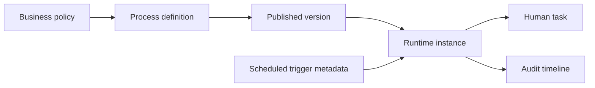
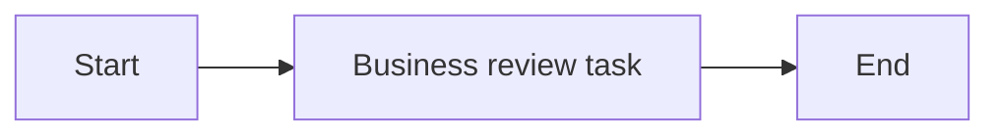

# Business Value and Adoption Model

Nodics Process exists to make business operations visible, governed, reusable,
and changeable without scattering workflow rules across many domain services.
A beginner can think of it as the operating playbook for work that crosses
people, systems, approvals, time, and exceptions.

## The business problem

Most enterprises already have processes, but those processes are often hidden:

- an approval rule lives in one service;
- a retry rule lives in a scheduler;
- an escalation rule lives in an email template;
- a support team tracks manual work in a spreadsheet;
- a developer knows which service has to be called next.

That structure works until the business asks simple questions:

| Business question | Without Process | With Nodics Process |
| --- | --- | --- |
| Where is this onboarding request stuck? | Ask several teams and inspect logs. | Open the instance and task timeline. |
| Who owns the next action? | Read custom code or tribal knowledge. | The current task shows assignee/queue. |
| Can we change the approval path? | Deploy risky domain-service changes. | Update and publish a governed definition version. |
| Which version ran last month? | Difficult to prove. | Immutable version and audit evidence are stored. |
| Can operations pause automation? | Maybe, if the scheduler has a switch. | Trigger metadata is visible and governed. |

## What Process gives business users

Process gives business users a shared language:

- **definition**: the designed workflow;
- **version**: the published immutable contract that actually ran;
- **instance**: one running or completed business case;
- **task**: one human action waiting for a person, queue, or team;
- **trigger**: a relationship saying automation can start a process;
- **audit event**: evidence of what changed and who did it.

## Why this reduces cost

The cost benefit is not only automation. The real saving comes from reducing
the number of places where people have to look, change, test, and explain a
business process.

Process helps reduce operating cost by:

1. making work state visible;
2. reducing custom one-off orchestration code;
3. separating workflow orchestration from domain action ownership;
4. preserving version history for audit and rollback discussions;
5. allowing standard Axis screens to manage definitions, tasks, and triggers.

It can also reduce capital expenditure because partner projects can reuse the
same Process engine instead of building a new workflow layer for every domain.

## Adoption path

Start small. A good first process has one start, one human task, and one end.

Once that works, add richer behavior in layers:

1. add assignment policy;
2. add SLA and escalation;
3. add scheduled trigger metadata;
4. add domain action providers;
5. add gateway rules;
6. add analytics and operational dashboards.

This avoids the classic workflow failure: trying to model the whole company on
day one.

## Business-user acceptance

A business user should be able to:

- see active process definitions;
- understand which workflows are drafts and which are published;
- open a task list and know who must act next;
- see whether scheduled automation is active or paused;
- understand that Process coordinates work while domain modules still own
  actual business behavior.

## Continue

- [Runtime Instance and Task Lifecycle](runtime-lifecycle.md)
- [Process and Cron Shared Runtime](process-cron-runtime.md)

## Common mistakes

- Measuring automation only by technical execution counts instead of business outcomes and recovery cost.
- Automating an unstable journey before ownership, approval, and exception handling are explicit.

## Verification

Validate the proposed journey with business users, developers, and operators; prove the happy path, rejection path, recovery path, audit evidence, and measurable operational benefit.
The operator must also confirm that alerts and recovery ownership are practical.

## Customization and extension

Customers should extend Process by adding project-owned workflow definitions,
action adapters, task assignment policies, escalation rules, and dashboards.
The extension must keep domain state in the owning module, preserve Process
audit evidence, and allow business users to understand what changed without
reading raw graph JSON or source code.
