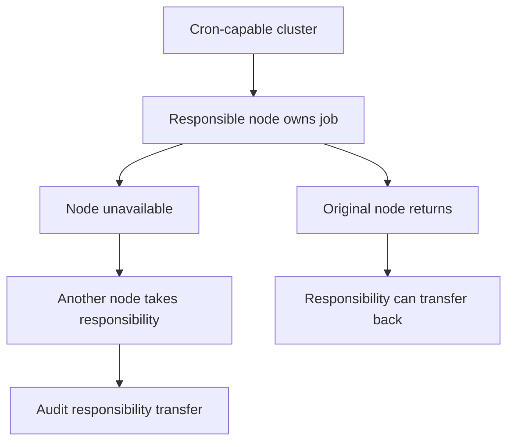

# Cron Node Responsibility and TEE

Cron Node Responsibility and TEE explain how scheduled work can remain safe
when the runtime has more than one node. TEE means Task Execution Engine. It is
a solution use case built on Nodics process and cron capabilities, not a
separate framework product. This page belongs under Cron because node
responsibility, handoff, recovery, and scheduled execution are operational
concerns.

For business users, the value is continuity. A scheduled business operation
should not silently stop because one node went down. For developers and
operators, the value is a clear contract for ownership, failover, audit, and
recovery.

## Responsibility flow

## Business and technical model

| Concern | Required behavior |
| --- | --- |
| Ownership | Exactly one node should own a responsibility at a time. |
| Failover | Another eligible node can take responsibility when the owner is unavailable. |
| Recovery | Responsibility transfer must be audited and observable. |
| TEE reference | TEE documentation should link here as a concrete scheduled execution use case. |
| Configuration | Eligibility, heartbeat, retry, and timeout values must be documented. |

## Customization and extension

Projects can add cron jobs, execution policies, node eligibility rules, and
business-specific recovery behavior. Those changes should use Process/Cron
contracts and project modules. A project should not create unmanaged timers
that run outside the responsibility model, because operators would lose audit,
retry, and failover evidence.

## Operator view

Operators need to see which node owns which responsibility, when ownership
changed, which jobs are pending, which jobs failed, and whether a recovered
node resumed its expected role. Dashboard, logs, audit entries, and health
checks should align.

## Project configuration points

Every project that relies on scheduled automation should document the
configuration that controls ownership behavior. At minimum, include the node
eligibility rule, heartbeat interval, timeout threshold, retry window,
responsibility transfer policy, and the event or message used to notify other
nodes. If the project changes the lock provider, storage provider, or cluster
coordination strategy, the page must explain the business reason and the
rollback path.

## Reader and implementation contract

A beginner should understand that scheduled work is a governed capability, not
just a timer. A business user should understand why responsibility transfer
protects operations. A developer should understand the node ownership model,
heartbeat or availability signal, event behavior, and job state transitions.
An operator should see enough evidence to decide whether a job is healthy,
transferred, stuck, failed, or ready for retry.

TEE documentation should refer to this operational model because TEE is one of
the strongest business use cases for reliable scheduled and task execution. If
future implementations add more responsibility states, lock providers, or
cluster coordination rules, this page and the TEE solution page must be
updated together.

## Common mistakes

- Treating cron as a single local timer instead of a governed runtime
  capability.
- Running the same job on multiple nodes without ownership control.
- Failing over without an audit record.
- Documenting TEE without linking back to Cron responsibility and Process task
  lifecycle.
- Hiding heartbeat and timeout configuration from operators.

## Verification

Verify node responsibility with tests that simulate owner loss, takeover,
recovery, and transfer-back behavior where supported. Browser or API evidence
should show the current owner, job state, audit trail, and failure handling.
TEE solution documentation should reference this page for scheduled execution
responsibility.
