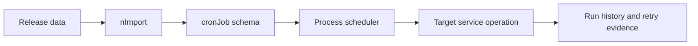

# CronJob Data Authoring

CronJob data authoring explains how scheduled automation definitions are
created through module release data or through a governed Axis journey. The
Process runtime owns execution. The data file only declares the job,
schedule, target, retry, and policy metadata. For beginners, a CronJob is a
record that says what should run and when; the runtime decides whether this
node is allowed to execute it.

## Source map

| Area | Source location |
| --- | --- |
| CronJob package | `../nodics.process/modules/cronjob/package.json` |
| CronJob operations page | `docs/pages/nodics.process/cronjob-operations.md` |
| Project customization | `docs/pages/nodics.process/project-cron-customization.md` |
| Runtime lifecycle | `docs/pages/nodics.process/process-cron-runtime.md` |
| Media jobs example | `../nodics.wcms/modules/media/data/init-v001/headers/jobs/mediaCleanupRetentionJobHeader.js` |
| Import process | `../nodics.foundation/modules/nData/nImport/import/src/service/import/defaultImportService.js` |

## Data shape



```js
module.exports = {
  mediaCleanupRetentionJob: {
    code: 'mediaCleanupRetentionJob',
    active: true,
    cronExpression: '0 0 * * *',
    targetService: 'DefaultMediaCleanupLifecycleService',
    targetOperation: 'execute',
    retryPolicy: { maximumAttempts: 3 }
  }
};
```

The business problem is dependable automation. Business users expect cleanup,
indexing, messaging, publication support, and recovery jobs to run without
manual supervision. Developers need simple release data for default jobs.
Operators need schedule visibility, node responsibility, retry state, and
failure evidence before production acceptance.

## Header contract

The top-level key in a header routes to the module where the schema exists.
For CronJob data, that target is normally the Process CronJob module. The
header defines `schemaName`, `operation`, optional tenants, record file prefix,
and the idempotent query.

```js
module.exports = {
  cronjob: {
    mediaJobs: {
      options: {
        enabled: true,
        schemaName: 'cronJob',
        operation: 'saveAll',
        dataFilePrefix: 'mediaCleanupRetentionJobData'
      },
      query: { code: '$code' }
    }
  }
};
```

## Runtime behavior

Cron execution should be idempotent, observable, and bounded. The runtime
selects responsible nodes, prevents duplicate execution where configured,
records start and completion evidence, applies retry policy, and moves failed
jobs into a recoverable state. A job record should not contain executable
business logic. It should point to a service operation that owns the behavior.

## Customization and extension guidance

Developers can add new scheduled jobs by adding a record, a header entry, the
target service, tests, and operational documentation. A customer project can
override schedule frequency through release data or Axis only when the owning
capability permits it. Operators can disable, retry, or reschedule based on
policy, but should not edit service code in production.

## Implementation handoff

Each job should be handed over with its business purpose, target service,
expected runtime role, schedule, retry policy, idempotency rule, timeout,
ownership, and monitoring signal. That detail helps business users understand
why the job exists, developers maintain the service safely, operators recover
production failures, and QA owners test execution without depending on timing
luck.

## Common mistakes

- Putting business logic into the job data file.
- Creating a schedule without idempotency or retry behavior.
- Forgetting node responsibility and duplicate execution controls.
- Using environment-specific service names in shared module data.
- Hiding failed job history from operators.

## Verification

Import CronJob data into a fresh schema, inspect job records, start the
Process runtime, confirm one responsible node runs the job, force a controlled
failure, and verify retry and evidence. Production readiness requires business
visibility, developer-owned service tests, operator recovery actions, and QA
proof that disabled jobs do not execute.
