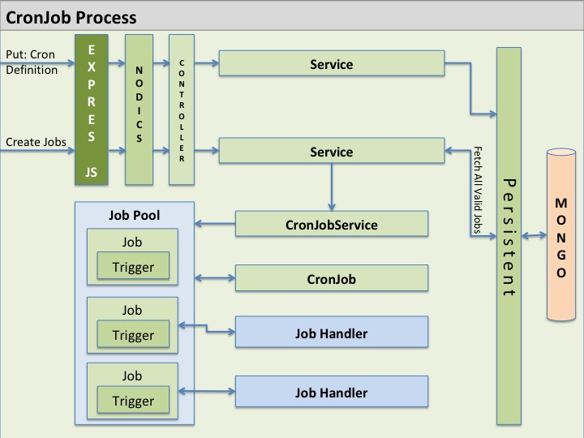
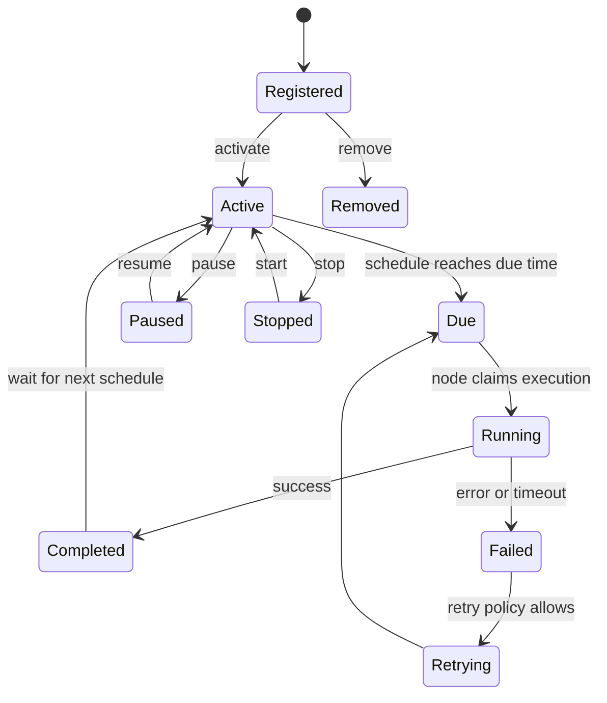
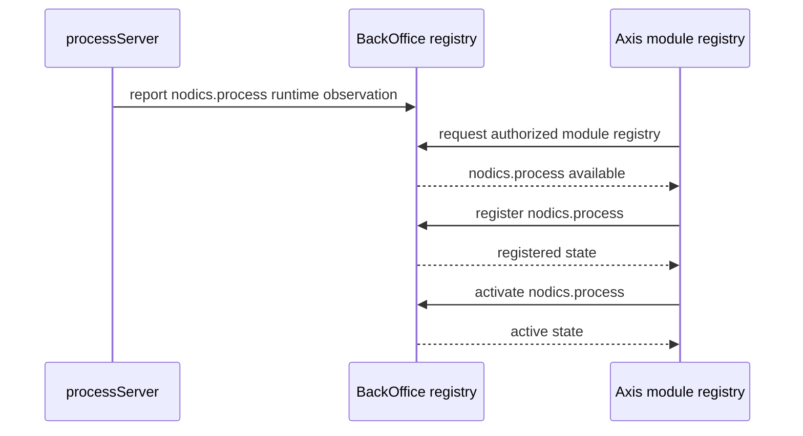
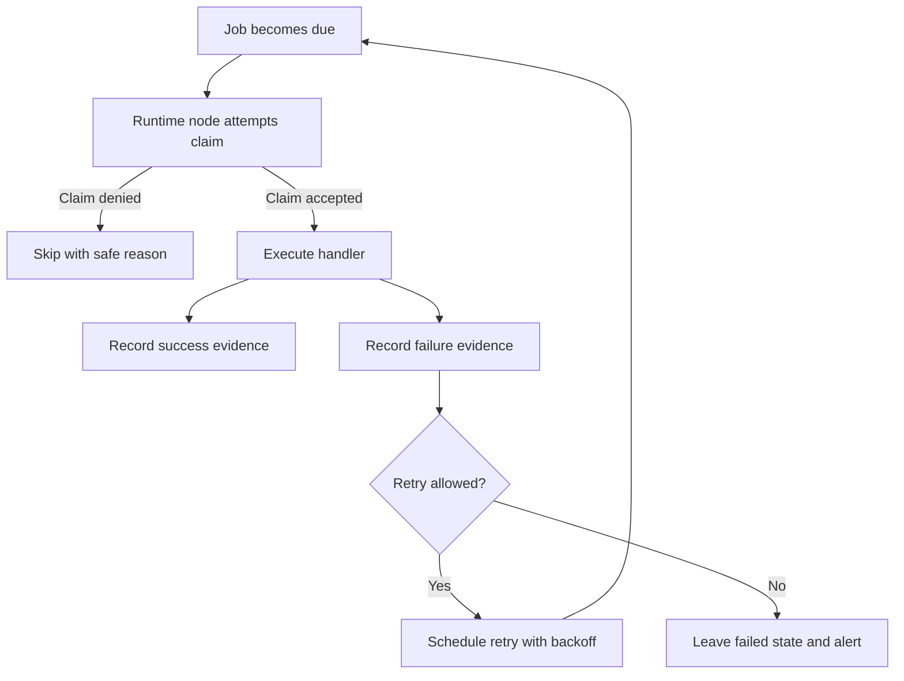
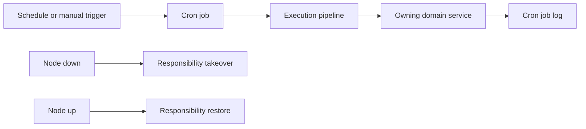

# Cron operations

Cron is the Nodics optional functional module for scheduled and manually
triggered backend work. It extends Core and contributes the `cronjob`
technical module. A project registers Cron when it needs scheduled jobs,
background maintenance, retries, cleanup, synchronization, or other timed
business processes.

For a beginner, Cron is the part of Nodics that asks “what should happen
later, repeatedly, or in the background?” A user may click a button in Axis,
but many real enterprise actions must happen without a user staring at the
screen: cleanup temporary media, retry failed exports, synchronize external
systems, send reminders, rebuild projections, or close expired workflows.

## Why Cron is optional

Core, Platform, and WCMS are mandatory for Axis-driven onboarding and governed
content. Cron is different. Many deployments do not need scheduled work on day
one, so Cron should appear in the module registry as an optional functional
module when a cron runtime is live. Registering or activating Cron persists
project intent; restarting servers should not ask the same registration
question again.

## Ownership model

Cron owns scheduler mechanics, lifecycle routes, persisted job definitions,
runtime containers, execution state, logging, events, and failure handling.
The server hosts Cron, but the server is not the functional owner. Node
placement fields decide where a job may run; they do not create another module
identity.

Customer jobs belong in project modules. Reusable scheduler behavior belongs
in `nodics.process/modules/cronjob`. If a partner needs custom scheduling behavior, they may
create a customer extension module that loads after Cron and overrides the
approved service contract.

For developers, the important rule is that Cron should orchestrate the timing
and execution contract, while the owning business module should own the actual
business operation. A media cleanup job should call media-owned cleanup logic.
A workflow reminder job should call workflow-owned reminder logic. Cron should
not become a dumping ground for unrelated domain behavior.

## Job lifecycle

A job definition normally describes:

- job code and active state;
- schedule, start, optional end, and trigger type;
- handler or target module operation;
- tenant, enterprise, and node placement;
- retry, timeout, priority, and overlap expectations;
- last execution status and safe operational evidence.

Cron supports create or register, update, run, start, stop, pause, resume, and
remove through secured backend operations. Manual run and scheduled execution
must share the same tenant, permission, node, logging, and failure contracts.

For beginners, the important point is that a job definition and a job run are
not the same thing. The definition says what should happen and when. A run is
one execution attempt with its own start time, status, logs, retries, and
outcome. Production support usually investigates runs, but operators manage
definitions.

## Example job: nightly media cleanup

A realistic first Cron job might clean expired temporary media.

| Field | Example value | Why it matters |
| --- | --- | --- |
| Code | `media.temporary.cleanup` | Stable identity for logs, permissions, and support. |
| Trigger | Daily at 02:00 local environment time | Runs outside peak usage. |
| Owner module | `media` or project extension | Keeps business behavior with the module that owns the data. |
| Idempotency | Delete only records already marked expired | Safe if the job runs twice. |
| Timeout | 10 minutes | Prevents a stuck cleanup from occupying the scheduler forever. |
| Retry | Two retries with backoff | Handles temporary storage/database failures without hiding persistent bugs. |
| Audit | Count scanned, deleted, skipped, failed | Lets operators prove what happened. |

The job should not accept arbitrary paths or delete files by frontend request.
It should ask Media for expired records through a governed service and let the
storage provider perform safe cleanup.

## Business journey: why scheduled work needs governance

Scheduled work often starts innocently: “run this cleanup every night.” In a
real enterprise system, the same job may touch many tenants, delete data,
retry external calls, create reports, or send notifications. That makes Cron a
business-risk capability, not only a timer.

| Business need | Cron responsibility | Owning business module responsibility |
| --- | --- | --- |
| Nightly media cleanup | Schedule, claim, execute, retry, log. | Media decides which records are expired and safe to delete. |
| Export retry | Run retry window and record attempts. | Import/export module decides retry eligibility and file semantics. |
| Reminder emails | Schedule and throttle execution. | Workflow or notification module owns message content and recipient rules. |
| Projection rebuild | Run controlled background task. | Owning data module owns rebuild logic and consistency rules. |

Cron should make the work happen at the right time with safe operational
evidence. It should not absorb every domain rule just because the work happens
in the background.

## Developer journey: adding a project cron job

When a project adds a scheduled job, follow this sequence:

1. Identify the business module that owns the actual operation.
2. Expose a safe service method in that module.
3. Add the job definition in the project or owning module data/configuration.
4. Configure schedule, tenant/enterprise scope, node placement, timeout,
   retry, overlap, and audit expectations.
5. Register or import the job through governed data flow.
6. Test manual run and scheduled execution with the same security and tenant
   context.
7. Verify restart behavior by stopping and starting processServer.
8. Document support steps, alert thresholds, and reconciliation behavior.

Do not pass executable code, raw URLs, filesystem paths, or untrusted handler
names through job records. Job definitions should point to known backend
contracts.

## Registering Process automation as an optional module

Core, Platform, and WCMS are mandatory in the Axis reference stack. Process is
optional. That means Axis may discover a live processServer and show Process as
available to register. When a user registers and activates Process, the project
intent is stored in the BackOffice/runtime registry. Restarting the server
should not ask again unless the state was removed. Cronjob is a technical module
inside that Process registration.

The lifecycle is:

1. processServer starts and reports `nodics.process` as live.
2. BackOffice observes the runtime module catalogue.
3. Axis shows Process under available modules.
4. A user registers Process into the project.
5. A user activates Process.
6. Cronjob-owned navigation, APIs, docs, and initialization data become visible
   according to permissions and content import state.
7. Deactivation hides runtime availability without forgetting registration.
8. Deregistration removes the project registration and returns Process to the
   available state while the server remains live.

The server observation starts the conversation. Registration and activation
record project intent. The two should not be collapsed into one hidden action.

## Production safety

Scheduled jobs are deceptively simple. A timer firing every minute is easy;
making it safe in production is the real work. Jobs that change external state
must define idempotency keys, duplicate-run policy, timeout behavior, retry
safety, compensation or reconciliation steps, and alerting.

Multi-node deployments must treat scheduler memory as disposable. Persisted
job definitions are authoritative; in-memory schedules are rebuilt from
runtime state. Node failover can help, but it is not a universal exactly-once
guarantee. Network partitions, process termination, downstream timeouts, and
uncertain completion must be handled by the job contract.

## Execution safety model

The claim step matters in multi-node environments. Without it, two nodes may
run the same job. Even with a claim, job handlers should still be idempotent
because distributed systems can fail after a side effect but before a status
update is recorded.

## Operations runbook outline

Every production cron capability should have a small runbook:

| Runbook area | Required detail |
| --- | --- |
| Job purpose | What business outcome the job supports. |
| Owner | Functional module or project that owns the business operation. |
| Schedule | Frequency, timezone, blackout windows, and manual run policy. |
| Data scope | Tenant, enterprise, site, catalog, or environment boundaries. |
| Idempotency | What makes repeat execution safe. |
| Retry | Retry count, backoff, retryable errors, non-retryable errors. |
| Timeout | Maximum duration and stuck-run recovery. |
| Observability | Logs, metrics, alerts, dashboards, and correlation fields. |
| Recovery | Re-run, skip, reconcile, or compensate instructions. |
| Release impact | What happens during deploy, rollback, or schema/content migration. |

## Security model

Cron lifecycle routes require authentication and authorization. A human may
authorize a Cron operation, but the job itself must use governed internal
service-token flow when calling another module. Do not accept arbitrary URLs,
service names, credentials, executable code, or node identifiers from
untrusted request data.

## DevOps model

Operations teams should monitor scheduler readiness, active job count, due
jobs, started jobs, completed jobs, failed jobs, skipped jobs, schedule delay,
duration, retry count, overlap denial, temporary ownership, node handoff, and
downstream latency. Logs should carry tenant, enterprise, job code, trigger
type, assigned node, attempt, correlation identity, and safe outcome.

Before production use, every real job should have tests for schedule boundary,
manual run, unauthorized access, cross-tenant access, duplicate execution,
timeout, retry, partial failure, restart, drain, node loss, node return,
downstream recovery, idempotency, and reconciliation.

## Axis and BackOffice view

Axis should show Cron as a functional module, not as every internal technical
schema. Once registered and active, Cron-owned navigation and workbench
capabilities can appear through BackOffice and WCMS data just like other module
capabilities. Axis remains the renderer; Cron remains the runtime authority.

## Acceptance checklist

Before Cron is considered ready beyond local demo use, verify:

- Cron appears in the functional module registry only when the runtime is
  observed.
- Register, activate, deactivate, and deregister operations persist and update
  Axis without manual refresh.
- Job definitions are persisted and rebuilt after runtime restart.
- Manual run and scheduled run share the same authorization, tenant, logging,
  and failure contracts.
- Duplicate execution is prevented or made harmless through idempotency.
- Failed runs produce useful diagnostics without exposing secrets.
- Node loss, restart, timeout, retry, and downstream failure behavior are
  tested.
- Business handlers remain in the owning business module.

## Common mistakes

- Putting domain cleanup or workflow logic directly inside Cron instead of the
  owning business module.
- Treating an in-memory schedule as the authority instead of persisted job
  definitions.
- Assuming one node means production will never run duplicate work.
- Running jobs without idempotency, timeout, retry, and audit decisions.
- Letting Axis construct arbitrary job handler names or URLs.
- Forgetting that Cron registration is optional project state, not process
  startup.

## Verification

For local verification, start processServer from the reference customer project
and confirm that the functional module registry observes `nodics.process` with
the `cronjob` technical module. Register it, activate it, deactivate it, and
deregister it without refreshing the browser. After deregistration, Process
should return to the available list while processServer is still observed.
Restart servers and confirm that durable registration state behaves as expected.

For job-level verification, test both manual and scheduled execution. A
production-ready job must prove authorization, tenant context, duplicate-run
protection, timeout, retry, logging, downstream failure behavior, and safe
restart. If the job performs business work, test the owning business module as
well; Cron proves scheduling and execution governance, not the correctness of
every domain operation it triggers.

## TEE Reference And Node Responsibility Coverage

Cron is a primary building block for the Task Execution Engine use case. It
executes scheduled and manual jobs, coordinates runtime state, records
CronJobLog evidence, and participates in node responsibility transfer. When a
node goes down, configured responsibilities can be taken over by another node;
when it returns, ownership can be restored. That behavior must be documented
for every scheduled automation that affects commerce, publication,
localization, media cleanup, discovery rebuild, or engagement operations.

| Topic | What to document | Evidence |
| --- | --- | --- |
| Job definition | Code, handler, module, tenant, schedule, timeout, and retry. | CronJob schema and configuration contracts. |
| Execution | Pipeline, input, output, idempotency, and downstream owner. | Runtime service and process trigger contracts. |
| Node ownership | Normal node, temporary owner, takeover, and restoration. | Node-down/up and failover tests. |
| Operations | Manual start, pause, logs, blocked reason, and recovery action. | CronJobLog and Axis workbench behavior. |

Every TEE-oriented job page should link back to this Cron topic and to the
Pipeline, Events/Messaging, and Process topics that explain the rest of the
execution model.
