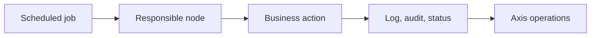

# Cron Operations

Cron Operations is the overview for scheduled business automation in Nodics.
It explains why scheduled work is governed, where responsibility belongs, and
which detailed pages to read before adding or operating jobs.

## Scheduled work model

| Concern | What the documentation must explain |
| --- | --- |
| Schedule | Timezone, activation, retry, and pause behavior. |
| Responsibility | Which node owns execution and how failover works. |
| Business impact | Which records, systems, or customers can be affected. |
| Operations | How an operator sees status, failures, and retry controls. |

## Business perspective

Cron is not just a timer. It runs business operations such as cleanup, export,
notification, synchronization, recalculation, or escalation. Business users
need to know what runs automatically, when it runs, who can pause it, and what
happens when it fails.

## Developer perspective

Developers should implement scheduled work through Process and Cron contracts,
not ad hoc startup timers. Project jobs must document configuration, service or
pipeline ownership, idempotency, permissions, events, tests, and Axis
visibility.

## Continue with

- **Cron Node Responsibility and TEE** for cluster ownership, failover,
  transfer-back, and the Task Execution Engine use case.
- **Project Cron Customization** for customer-owned job definitions,
  configuration, permissions, and tests.
- **Scheduled Automation and Cron Triggers** for trigger concepts.
- **Process and Cronjob Shared Runtime** for the boundary between Process and
  Cron capabilities.

## Operational evidence

Cron evidence should be written for the person on call as much as the developer. Include job code, schedule, timezone, enabled state, owning node, last run, next run, current status, retry count, error summary, affected business records, and audit reference. If the job triggers a pipeline or external integration, document the downstream evidence too. This keeps automated operations understandable when the business asks whether an expected nightly or hourly action actually happened.

## Reader and implementation contract

A beginner should understand that Cron is a governed automation capability. A business user should know what automatic process is running, which decision it supports, and how failure affects customers or operations. A developer should document job definition, trigger, service or pipeline, configuration keys, permissions, idempotency, and events. An operator should know current owner, last run, next run, failure reason, retry option, and audit record.

Cron documentation must be updated whenever a new scheduled job is added or a project changes schedule, provider, retry, or responsibility behavior. If the job is a good TEE use case, this page should link to TEE so the business value of reliable task execution is clear.

## Documentation maintenance rule

Keep this topic current whenever implementation, configuration, Axis workflow, publication behavior, or customer-facing rendering changes. The page should remain small enough to scan, but it must still carry enough business context, technical ownership, customization guidance, visual structure, operational evidence, and verification detail for a reader to act without guessing. When the detail becomes too large, create a sibling topic and link it from this page instead of turning the overview back into a long mixed article.

This extension guidance must stay linked to the owning project or capability page whenever a customer customizes the behavior.

## Common mistakes

- Starting unmanaged timers from application startup.
- Running the same scheduled job on multiple nodes without ownership.
- Hiding job state from Axis.
- Documenting the code path but not the business risk and retry behavior.

## Verification

Verify Cron with registration, disabled state, execution, retry, failure,
cluster responsibility, audit, logs, and browser-visible operator status. A
beginner should understand why the job exists; a developer should know where to
extend it; an operator should know how to control it.
