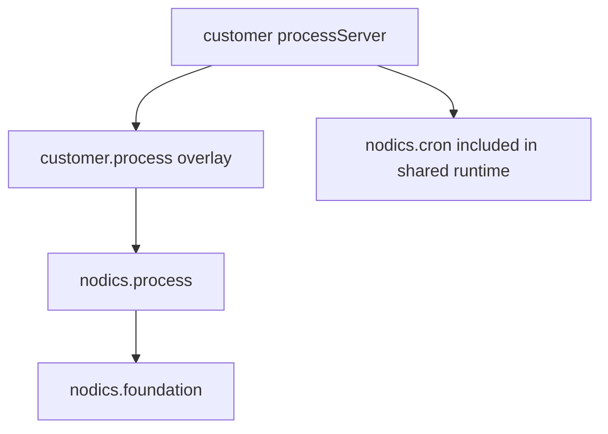

# Custom Project Extension Guide

Customer projects may customize Process behavior without renaming the functional
module. A customer module can extend or override standard behavior, but Axis and
BackOffice should still show the capability as Process.

## Example topology

The server can include Cron and Process together for operational simplicity,
while ownership remains clear.

## What belongs in a customer extension

- custom task assignment rules;
- domain-specific action adapters;
- additional graph validation policies;
- extra audit metadata with safe redaction;
- environment-specific timer/SLA rules;
- customer documentation and sample workflows.

## What should not be customized casually

- published version immutability;
- permission checks;
- audit event creation;
- backend graph validation;
- module identity exposed to Axis.

Changing those weakens trust in the automation platform.

## Documentation ownership

Framework Process docs belong in nodics.process. Customer process docs belong in
the customer project module or project documentation pack. Axis only renders
imported content; it should not own backend documentation data.

## Extension decision and lifecycle

| Need | Correct extension point | Authority that remains unchanged |
| --- | --- | --- |
| Change a runtime property | Customer environment or server configuration | Process configuration contract |
| Implement a business action | Owning customer or domain module adapter | Domain validation and side effects |
| Add an API projection | Customer API module using Process services | Process lifecycle and persistence |
| Change visual presentation | Axis component or renderer customization | Backend Process graph and permissions |
| Add scheduled execution | Cron-owned job calling an active Process trigger | Process trigger and Cron schedule ownership |

Start with the smallest reversible customization. A beginner developer should
first prove that a property or registered adapter is insufficient before
overriding a service. A service override must preserve method contracts, status
definitions, tenant isolation, authorization, idempotency, audit behavior, and
error semantics. If the customer implementation changes those capabilities, it
is no longer a safe overlay and needs an explicit contract change in the owning
framework module.

The runtime graph must show the customer module loading after the standard
Process modules. Availability through a package dependency is not enough; the
module and server `extends` relationships determine functional composition and
service precedence. Test both the default framework path and the customized
path so future framework releases cannot silently break only one of them.

Operational ownership must also be explicit. The customer team owns its
adapter dependencies, secrets, deployment configuration, alerts, runbooks, and
rollback. Process continues to own definition and instance state, task
lifecycle, incidents, retries, and audit. Axis continues to render authorized
contracts and must not become a fallback persistence layer when the customized
backend is unavailable.

A production-ready extension includes a failure scenario and recovery proof.
Stop the external dependency, confirm bounded retry and incident creation,
restore it, perform the authorized recovery action, and verify the same process
continues without duplicate domain side effects. Repeat after a runtime restart
and after a framework upgrade candidate.

## Common mistakes

- Forking framework Process services when a customer module overlay is sufficient.
- Renaming the standard functional module or moving backend authority into Axis.

## Verification

Run framework and customer-project contract tests, prepare the effective runtime graph, and prove the extension works after a fresh database bootstrap without modifying framework-owned behavior.
A beginner developer, business reviewer, and production operator should each be able to identify the owner and supported extension point.
