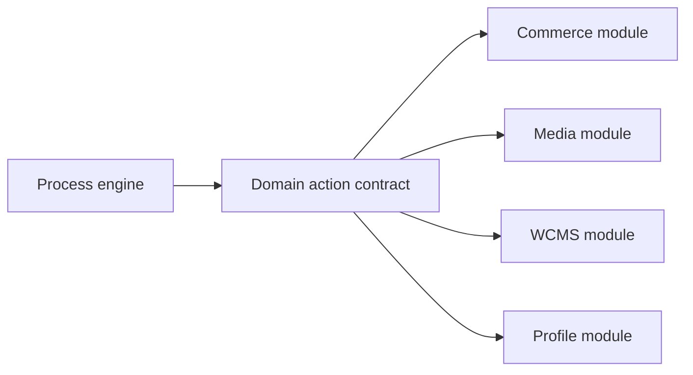

# Developer Customization Guide

This guide explains where developers should extend Process behavior. The most
important rule is simple: Process owns orchestration state, but domain modules
own business action behavior.

## Where code belongs

| Need | Owning place |
| --- | --- |
| Process schemas and status definitions | `nodics.process/modules/workflow` |
| Runtime lifecycle, validation, assignment, audit | `nodics.process/modules/workflow` |
| HTTP routes, controllers, facades | `nodics.process/modules/workflow` |
| Cron job definitions and scheduler execution | `nodics.process/modules/cronjob` |
| Order, commerce, content, profile, media side effects | Owning domain module |
| Customer-specific policy override | Customer module loaded after framework module |
| Browser rendering and editor interactions | `nodics.axis` |

Do not put runtime source directly under `nodics.process/src`. The module group
root is for composition, contracts, package metadata, documentation, and shared
defaults.

## Customization-first approach

Before writing new code, ask:

1. Can this be changed by a property?
2. Can this be changed by a provider?
3. Can this be changed by an interceptor or pipeline?
4. Can a customer module override only one service method?
5. Is a new framework feature actually needed?

Example: a customer wants task assignment to go to a site-specific queue.

Do not edit the standard Process task lifecycle directly. Instead, create a
customer module that overrides assignment policy and loads after Process.

```js
/*
    Customer Project - Process Customization
 */

'use strict';

/**
 * @module customer.process/src/service/defaultCustomerTaskAssignmentService
 * @description Resolves task assignee from enterprise, site, and process category.
 * @override Loaded after nodics.process to customize assignment without forking framework source.
 */
module.exports = {
    resolveAssignee: function (request, taskModel) {
        const site = request.runtimeOperation && request.runtimeOperation.site;
        if (site === 'uae-store') return 'uaeOperationsQueue';
        return taskModel.assignee || 'defaultProcessQueue';
    }
};
```

## Domain action boundary

Process can decide that an ACTION node should be executed. It must not directly
own a commerce refund, media upload, content publication, logistics shipment,
or telco provisioning command.



The Process engine should store orchestration evidence. The domain module
should validate permissions, data, side effects, rollback, and audit for its
own action.

## API extension rule

Add a Process API only when:

- the behavior is process-owned;
- route permission is added to the identity catalog;
- status codes live in `statusDefinitions.js`;
- controller/facade/service layers remain separated;
- tests cover positive, negative, boundary, and permission behavior.

## Generated artifacts

Generated service/facade files are loader-visible runtime artifacts. If the
generator is available for the affected schema, regenerate from schema source.
If a generated-style file must be repaired manually during migration, mirror
the nearest generated artifact exactly and add tests that prove the runtime
service is available.

## Developer acceptance checklist

- Source is in the nearest owning module.
- No customer-specific rule is hardcoded in standard Process.
- Axis is not storing workflow truth.
- New permissions exist in the identity catalog.
- Status/error codes live in status definitions.
- Fresh bootstrap and live smoke prove the change.

## Continue

- [Visual Workflow Designer Contract](visual-designer.md)
- [DevOps and Runtime Topology](devops-topology.md)

## Common mistakes

- Editing generated data or framework defaults instead of the owning source or project overlay.
- Putting domain actions, credentials, executable expressions, or authorization decisions in workflow metadata.

## Verification

Run syntax, graph, lifecycle, permission, retry, compensation, and fresh-bootstrap tests. Confirm the same definition behaves safely with the default implementation and an approved customer customization.
A beginner should start with the smallest configuration or module overlay before replacing a service.

## Business context

The business problem is upgrade-safe change. Customers need project-specific
behavior without forking framework modules or losing supportability. The
customization path lets business teams ask for tenant policies, approvals,
actions, dashboards, and exception handling while developers keep source
ownership, permissions, rollback, and verification evidence in the correct
module.
