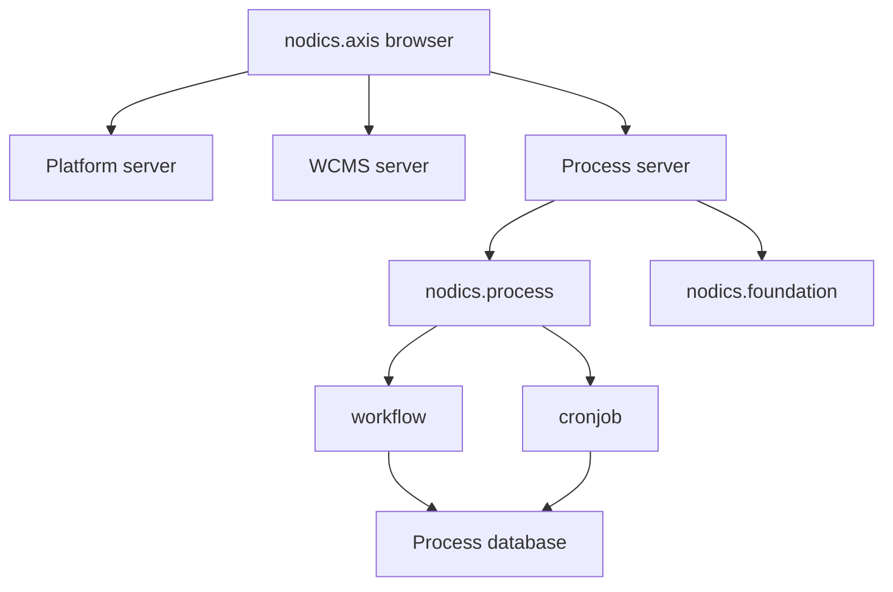

# DevOps and Runtime Topology

Operations teams need Process to be understandable after deployment, not only
during development. This page explains how Process should be deployed, observed,
tested, and sustained.

## Runtime shape

In local Kickoff, Process runs in the Business Process & Automation runtime.
That server can include `nodics.process` and `nodics.foundation`; `nodics.process`
loads the sibling `workflow` and `cronjob` modules.

Sharing a runtime is a deployment decision, not an ownership merge. Process
still owns process instances, tasks, triggers, and audit. Cronjob still owns job
definitions, scheduler state, firing, retry, and job execution lifecycle.

## Fresh bootstrap evidence

The local fresh acceptance test drops only local Kickoff databases, starts the
runtime servers, imports documentation packs, verifies Axis routes, logs in as
admin, exercises Process APIs, and runs Cron lifecycle operations.

This is the minimum confidence gate before saying the local stack is healthy.

## What to monitor

| Signal | Why it matters |
| --- | --- |
| Process server readiness | Axis process screens depend on this API. |
| Definition publish failures | Bad graph contracts block operations. |
| Waiting task count | Shows work stuck with humans or queues. |
| Failed/cancelled instance count | Reveals broken policy or domain integration. |
| Trigger status distribution | Shows scheduled automation posture. |
| Audit event volume | Confirms runtime evidence is being written. |

## Failure and recovery

If Axis can load but Process APIs fail, Axis should show recovery or unavailable
states. Do not fake process data in the browser.

If Process starts but trigger creation fails, check:

1. `workflow` includes the `processTrigger` schema;
2. generated trigger service/facade artifacts are loader-visible;
3. route permissions exist in the identity catalog;
4. the referenced definition exists and is safe to use;
5. fresh acceptance passes from zero database state.

## Release discipline

Process changes are release-sensitive because they can affect long-running
instances. Always ask:

- Is the schema backward compatible?
- Are published versions immutable?
- Can older instances still be inspected?
- Does a new route have a dedicated permission?
- Does the change preserve tenant and audit boundaries?
- Can a customer override the behavior without editing framework source?

## Continue

- [Process and Cronjob Shared Runtime](process-cron-runtime.md)
- [Developer Customization Guide](developer-customization.md)

## Deployment qualification evidence

Before production promotion, capture the effective module graph, sanitized
configuration source order, health and readiness results, imported release
versions, database migration state, Process registration, queue or
scheduler dependencies, and smoke-test correlation identifiers. Keep this
evidence environment-specific and reproducible; a screenshot of listening ports
is not a deployment record.

Exercise at least one controlled dependency outage and one runtime restart.
Verify that inflight work is either resumed, retried within policy, or surfaced
as an incident, and that no second scheduler or duplicate execution path starts
during recovery.

## Common mistakes

- Starting a standalone cronjob server when cronjob is intentionally composed into Process.
- Treating a listening port as proof that persistence, imports, health, permissions, and recovery work.

## Verification

Use the bounded fresh-bootstrap acceptance path, verify health and readiness, inspect error-level startup logs, confirm Process observation with workflow and cronjob technical modules, and exercise restart and dependency-failure recovery.
A beginner operator should follow the documented server order before changing topology.

## Customization and extension

Projects may extend topology with additional servers, queues, workers,
database roles, cache providers, search providers, or deployment targets. The
extension must keep runtime ownership explicit, avoid duplicate scheduler or
workflow authorities, and document the business impact of each environment
dependency.
