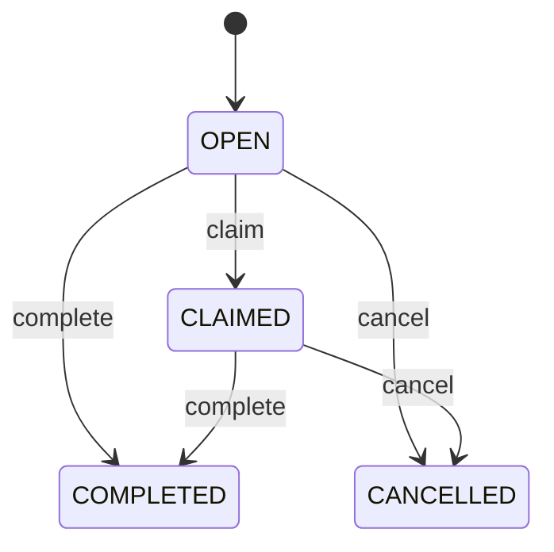
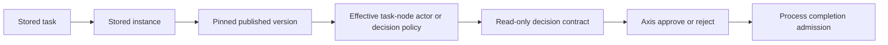

# Build Your First Human Task Flow

For governed reviewer tasks, claim now uses the stored actor policy before writing:
the reviewer must have current enterprise/permission authority and cannot be the
requester. A claim cannot select another reviewer as a shortcut around assignment.
Concurrent changes reject rather than returning a fabricated claimed task. Inspect
the actual stored task after an uncertain response. Completion binds the inspected
assignee and instance/node. This does not establish atomic cancellation across an
instance and its tasks; cross-owner lifecycle acceptance remains separate.

Completion and cancellation require an acknowledged single task write followed by
fresh owner readback before audit or advancement. Failed responses or changed
decision/actor/timestamp refuse success. Generic task and instance cancellation
cannot cancel governed actor-policy reviews: the owning domain must first define
its withdrawal/cancellation contract. This does not yet implement application
withdrawal, expiry or resubmission by itself. Profile owns those domain commands.
Process adds a separately default-disabled signed-source retirement route for
exact closed review correlation. It cancels the waiting task with CAS before
retiring its instance, recovers only matching own closure evidence, and refuses
completed competing decisions or in-flight remote actions. Private persistence
hooks guard retirement markers. This is staged reconciliation, not a cross-owner
transaction; inspect uncertain outcomes using the source owner's recovery command.

Human tasks are the bridge between automation and people. A task tells an
operator, reviewer, merchandiser, support agent, or approver what needs human
attention.

## Example business scenario

A content editor changes a page. The change should not go live until someone
reviews it. The process creates a task called `Review content`. The reviewer can
claim it, assign it, or complete it. Generic cancellation is available only for
non-governed tasks; governed reviews require a domain-owned cancellation contract.



## Task fields you should understand

| Field          | Why it matters                                           |
| -------------- | -------------------------------------------------------- |
| `code`         | Stable task identifier for audit and support.            |
| `instanceCode` | Links the task to the running process instance.          |
| `nodeCode`     | Shows which workflow step produced the task.             |
| `assignee`     | Person, queue, or group expected to work on it.          |
| `status`       | Current state such as `OPEN`, `CLAIMED`, or `COMPLETED`. |
| `dueAt`        | Optional SLA date for operations.                        |

## How Axis should present task work

### Backend-owned approval decisions

Process task list, task detail and instance-detail tasks may contain this exact
read-only decision contract:

```json
{
  "contractVersion": 1,
  "kind": "APPROVAL",
  "approveLabel": "Approve",
  "rejectLabel": "Reject",
  "reasonLabel": "Reason",
  "rejectionReasonRequired": true,
  "maximumReasonLength": 1000
}
```

Process derives it from the stored task's instance and immutable published
definition version, then the effective task-node actor or decision policy. Node
policy overrides version policy. A complete three-field actor policy or an
owner-declared `policy.decisionContract` determines this contract; a permission,
task name, code prefix or assignee alone cannot. Stored or caller-supplied
decision contracts are not authority. Legacy tasks with neither pinned
declaration have no decisionContract.

Axis renders the supplied labels and collects `{ approved: boolean,
reason?: string }` through the existing Process completion API. Rejection needs
a nonblank reason; provided reasons must not exceed 1000 characters. Process
retains independent task admission, state and transition enforcement. The pinned
actor policy, where present, separately enforces authenticated human review,
tenant, enterprise, permission and no-self-review. A decision descriptor alone
does not grant these protections or manufacture requester context.
Seeing the contract does not mean the viewer can approve. No Profile callback
should be called directly from the browser.



Process reads instance/version evidence freshly within the authorized tenant,
requires one successful matching record, and bounds projection to 100 tasks.
Missing, failed, ambiguous or mismatched evidence rejects the read instead of
inventing approval controls. Inspect the original stored task/version and owner
diagnostic before retrying. After uncertain completion, inspect state rather
than automatically repeating the decision. These source fixtures do not certify
installed provider behavior or live browser acceptance.

An owner can add this exact seven-field declaration in a new qualified immutable
version of its existing definition. Contract version, kind, rejection requirement
and maximum length remain fixed as shown above; labels must be nonblank and at
most 200 characters. There is no purpose/category expansion. Existing waiting
instances stay pinned to their original version. A migration needs separately
governed cancellation and confirmed old task/instance state before a fresh domain
request. Do not edit the waiting instance or use generic completion to migrate.
The projection fixtures do not validate that migration.

Axis should show tasks as business work, not as raw database rows. A good task
screen answers:

1. What process created this task?
2. What business object is affected?
3. Who owns it now?
4. What action can I take safely?
5. What happened before this task?

The detail timeline answers the fifth question by reading Process audit events.

## Developer customization

Customer modules can customize assignment without editing standard Process
source. For example:

- route enterprise onboarding approvals to an enterprise admin queue;
- route product publishing approvals to merchandising;
- route logistics exceptions to warehouse operations;
- route refund approval tasks to finance.

The customization should live in the customer or domain module, not in Axis.
Axis renders authorized actions; Process owns task lifecycle.

## End-to-end task example

Consider a high-value refund that requires finance approval. The Order module
owns refund eligibility and the Payment module owns provider execution. Process
creates the approval task with bounded business references, candidate group,
due date, and expected outcome choices. It does not copy the full Order or
payment credentials into task data.

An authorized finance user opens Axis, claims the task, reviews backend-owned
context, and chooses approve or reject. The claim request includes the current
task version so two users cannot both become the assignee. Completion includes
the expected task state, chosen outcome, correlation identifier, and a bounded
comment. Process records the transition and invokes the next registered domain
adapter; Axis does not calculate the next node.

| Test path               | Expected result                                | Evidence                                      |
| ----------------------- | ---------------------------------------------- | --------------------------------------------- |
| Authorized claim        | Task becomes assigned once.                    | Assignee, version, timestamp, and audit event |
| Competing claim         | Stale request is rejected.                     | Stable conflict code and unchanged assignee   |
| Unauthorized completion | No state or domain side effect changes.        | Permission denial and security audit          |
| Valid approval          | Process advances to the approved path.         | Completion event and next-node correlation    |
| Expired task            | Policy-driven escalation or rejection occurs.  | Due-date evaluation and escalation evidence   |
| Runtime restart         | Open task remains available in the same state. | Durable task and process instance projection  |

Operators should monitor open-task age, overdue volume, claim conflicts,
completion latency, failed continuations, and escalation backlog. Alerts must
identify the tenant and stable task or process reference without exposing
sensitive task payloads. A business administrator may change assignment policy
through a governed definition or customer configuration, but cannot bypass
permissions or rewrite completed history.

## Common mistakes

- Letting the browser assign, complete, or reopen tasks without backend validation and expected-state checks.
- Omitting tenant, permission, correlation, expiry, escalation, or audit requirements.

## Customize and extend safely

Keep overrides in a project-owned module that extends Workflow, for example
`modules/companyWorkflow/src/service/operation/defaultProcessRuntimeLifecycleService.js`.
The existing exported `taskDecisionContract` helper is a presentation extension
point; `projectTaskDecisions` remains responsible for fresh pinned-source reads.
An inherited-helper override can change a label without introducing an actor
policy or changing completion authority:

```js
// Within the customer's existing inherited-service override pattern:
const contract = inheritedTaskDecisionContract.call(this, policy);
return contract ? { ...contract, approveLabel: "Confirm approval" } : undefined;
```

Resolve `inheritedTaskDecisionContract` through the project's established service
extension mechanism, not a copied Process implementation. Labels must be nonblank
and no longer than 200 characters for Axis. Keep the exact contract shape,
rejection-reason requirement and 1000-character ceiling. Do not derive authority
from labels or change requester/enterprise admission in a presentation override.

Changes to domain reviewer policy require a newly qualified published version;
existing instances retain their original version. The generic labels above need
no Profile metadata. Domain owners may declare the approved seven-field
`policy.decisionContract` in a newly qualified version, not modify released data.
Test unchanged legacy omission, valid and malformed pinned actor policy,
node precedence, foreign/missing version evidence, blank or oversized rejection,
uncertain completion inspection and inherited customization. The isolated
`processTaskDecisionContract.test.js` fixture covers source projection; installed
provider and browser decisions remain separate acceptance steps.

## Verification

Create a task, test authorized claim and completion, reject an unauthorized actor and stale update, then confirm assignment history, process continuation, and operator-visible audit evidence.
This is the minimum beginner verification before adding assignment customization.
