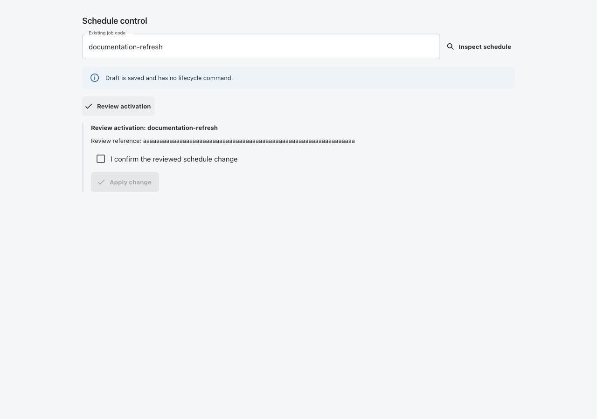
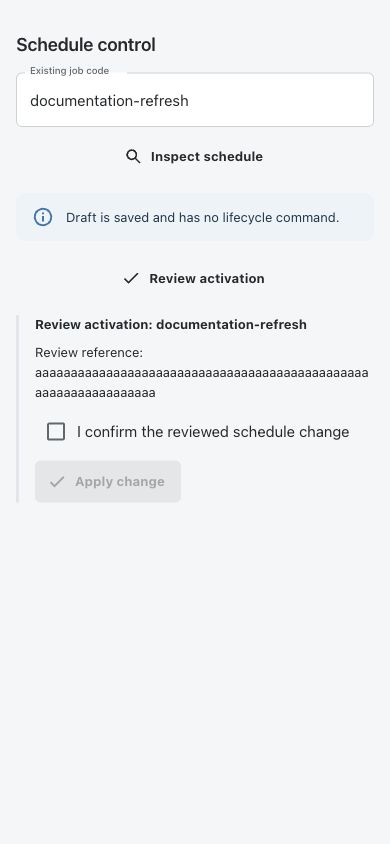
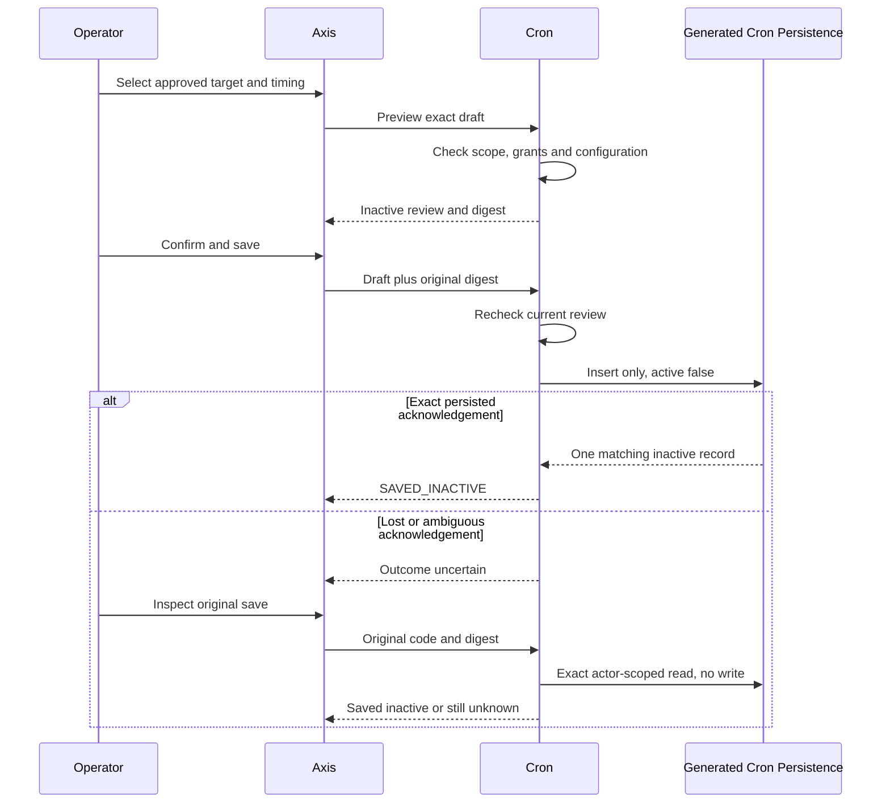
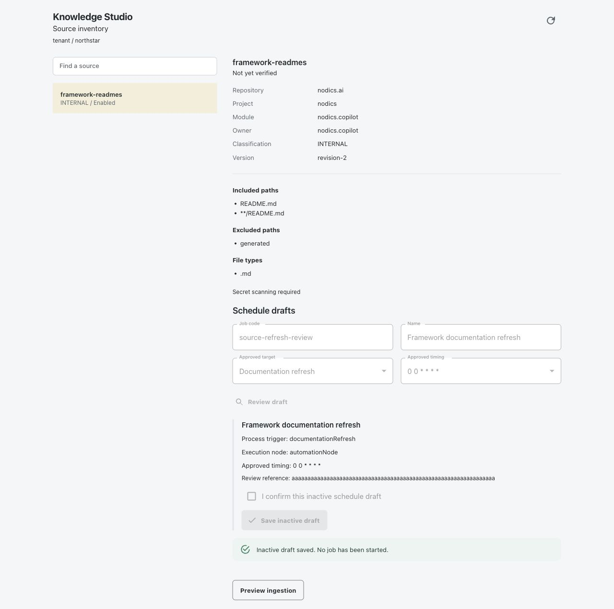
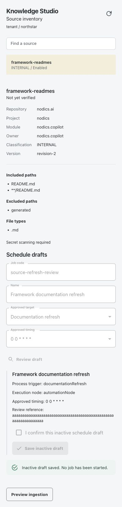
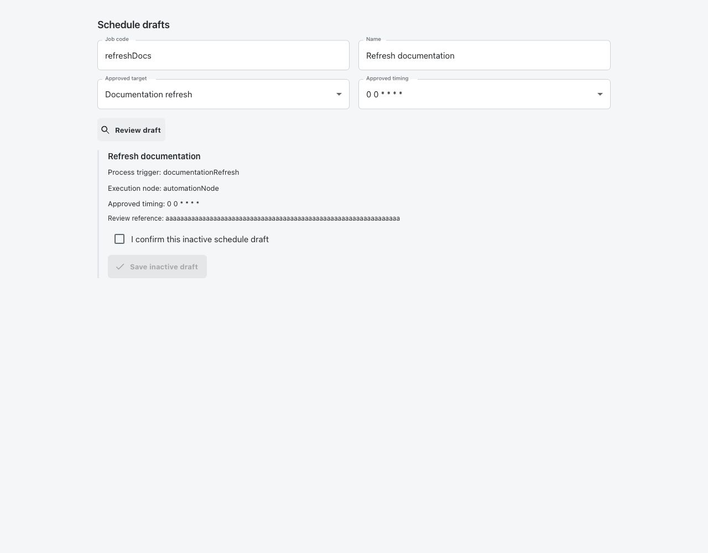
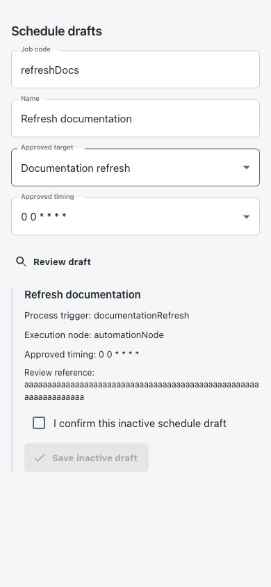

# Inactive Process Schedule Drafts

Reviewed activation and original-command recovery are shown below using the
real Axis renderer with synthetic responses. These captures do not prove a
deployed timer, customer ingestion or multi-node execution. The desktop viewport
is 1280x900; mobile is 390x844 with no horizontal overflow.




Functional owner: `nodics.process`. Cronjob owns the persisted schedule and its
runtime lifecycle. Process owns trigger relationships and immutable workflow
versions. A Copilot refresh continues to require current Knowledge source access
and policy admission at execution time.

## Business Outcome

An operator can prepare an approved automation schedule without starting work.
The journey separates choosing a target, reviewing the exact schedule and saving
an inactive definition. A lost response leads to original-save inspection rather
than a second submission. This reduces accidental activation during setup.

This is an optional inactive-draft capability, not a complete Copilot scheduling
wizard. It does not create or publish a Process workflow/trigger, assign a source,
prove provider readiness, enable a scheduler or grant runtime credentials.
The existing generic Cron form remains a different operation: saving an active
NEW job there can schedule work immediately. Use **Schedule drafts** for this flow.

Beginners should complete the review without saving first and ask their Cron
operator to explain the selected timing and runtime timezone. Business operators
do not need database or scheduler credentials for this journey.

## Prepare the Deployment

Administrators and implementation partners perform these steps before operators
use the form. Installation alone leaves provisioning disabled.

1. Deploy the compatible Cron API and Axis renderer. The authoritative connection
   comes from authenticated BackOffice discovery, not a browser-entered URL.
2. Qualify Cron's generated persistence provider and existing unique job-code
   index. Insert-only saves must reject duplicate identities, not update them.
   Verify generated ownership/access hooks and inactive save behavior in the
   target deployment. A local unit test is not live database qualification.
3. Prepare the Process definition/version/trigger through its own governed APIs.
   Validate required domain grants and runtime admission independently. A valid
   trigger code in a draft is not proof that this step succeeded.
4. For Copilot refresh, establish the approved source assignment and expected
   policy digest using the Knowledge and Process contracts. Source/policy changes
   can make the eventual callback reject; drafting does not bypass that check.
5. In the appropriate deployment-owned configuration layer, set scoped targets
   under `cronjob.scheduleDrafts.targets`. Each target fixes one tenant/enterprise,
   Process trigger, node, bounded context and a list of approved timings.
6. Review frequency, capacity and the scheduler runtime's timezone. Expressions
   use the existing Cron parser; there is no new per-draft timezone control.
7. Enable `cronjob.scheduleDrafts.enabled` through the deployment's existing
   governance. Independently assign `cronjob.lifecycle.manage` to appropriate
   verified employees. Generated Cron access rules still apply.

Do not widen employee permissions to repair a missing configuration. No target
is shown for another enterprise, and disabled deployments return no choices.

## Create an Inactive Draft

1. Open the authorized **Process and Automations > Cron jobs** workspace.
2. Find **Schedule drafts**. If no approved targets are available, ask the
   deployment administrator to inspect scoped configuration and current grants.
3. Enter a new job code and a descriptive name. Codes start with a letter and
   allow letters, digits, periods, underscores and hyphens, up to 128 characters.
4. Choose **Approved target**, then **Approved timing**. The node and Process
   trigger are supplied by the backend; the browser cannot choose another handler.
5. Select **Review draft**. This does not persist anything. Review the displayed
   Process trigger, execution node, timing and name.
6. Tick **I confirm this inactive schedule draft**, then select **Save inactive
   draft** once. Editing any input invalidates the old review and confirmation.
7. Look for **Inactive draft saved. No job has been started.** The receipt is
   accepted only when the backend returns the exact inactive persisted record.
   The form stays frozen to prevent a second insertion of the same draft.
8. Stop here for provisioning. Trigger qualification and eventual activation are
   separate Process/Cron administrative actions, not follow-up automatic effects.



## Prepare a Draft From Knowledge Studio

The same owner-controlled journey is available beside an approved knowledge
source. Administrators enable this optional entry point only after completing
the deployment preparation above. This entry point does not add an activation
step or relax any Cron or Knowledge permission.

1. Configure the approved Cron target with an optional `sourceBinding`. Its
   `moduleName` is `copilotApi`, `sourceCode` is the exact approved source code,
   and `policyDigest` is the current source fingerprint. Configure the same
   source and fingerprint in the target's Process context as `sourceCode` and
   `expectedPolicyDigest`. No source content or credentials belong in the binding.
2. Enable `copilot.knowledge.studio.sourceScheduleDraftsEnabled` in the governed
   deployment layer. This defaults false and is independent of Cron provisioning.
3. Give the appropriate operator both the existing source-management and Cron
   lifecycle permissions through the normal authorization workflow. The source
   must also be visible under current source/group restrictions. Axis requires an
   available authorized Cron navigation contribution and connection.
4. Open **AI > Knowledge Studio**, select the approved source, then find
   **Schedule drafts**. Only targets with the exact current module, source and
   fingerprint are offered. A missing match is not a reason to use another source.
5. Follow the review, confirmation and inactive-save steps above. Review remains
   bound to the approved target and current actor. The Process context is not
   editable from this form.
6. After a source policy change, have its owner qualify the new assignment and
   update the approved target through normal configuration governance. Old target
   bindings disappear from the source view; they are not silently rewritten.
7. Preserve the original receipt before switching sources or leaving an uncertain
   save. Source changes discard the transient form. Use original-save inspection,
   never another insertion, to investigate an already-dispatched command.

```javascript
// Part of one deployment-approved Cron target; illustrative values only.
sourceBinding: {
    moduleName: 'copilotApi',
    sourceCode: 'approvedDocumentationSource',
    policyDigest: '<current 64-character lowercase source fingerprint>'
},
context: {
    sourceCode: 'approvedDocumentationSource',
    expectedPolicyDigest: '<the same current fingerprint>'
}
```

This association does not provision a workflow, prove a trigger's published
version, establish the runtime principal or replace callback source admission.
Saved inactive is still the only successful persistence result of this flow.

The following captures use the real Knowledge Studio and Cron components with
synthetic source/target responses. They show an acknowledged inactive save, not
a deployed trigger or running job. Desktop (1280 pixels) and mobile (390 pixels)
checks reported no horizontal overflow or browser warnings.





## Recover an Uncertain Save

1. Keep the page open. A timeout or invalid response does not prove the insert
   failed. Axis preserves the original code and digest in memory and locks edits.
2. Select **Inspect original save**. This reads the original actor-scoped record;
   it does not resend the creation command or activate a scheduler.
3. An unchanged inactive NEW definition can be confirmed even if provisioning
   was disabled after the save. Current employee authorization is still required.
4. Missing, foreign, edited or activated records remain uncertain. Inspection is
   not a terminal failure verdict and never unlocks another insertion.
5. Retain the original code/review digest through approved operator evidence if
   the page must be closed. Browser reload, logout or connection change discards
   transient review state. Do not choose a new code simply to bypass uncertainty.
6. Escalate unresolved evidence to the owning Cron operator. Review provider
   acknowledgements and the original scoped definition; do not replay from logs.

The fingerprint protects against accidental drift when inspecting the stored
definition. It is not a tamper-proof audit record or a private durable journal.
Privileged generic Cron administrators retain their own edit authority.

## API and Limits

All paths are relative to the authorized Cron module's `/v0` base. Every route is
secured with the lifecycle-management grant and independent service admission.

| Method and Path | Input | Result |
| --- | --- | --- |
| GET `/schedules/drafts/capabilities` | None | Versioned enterprise-scoped choices and labels |
| POST `/schedules/drafts/preview` | Code, name, target code, approved expression | Non-mutating review digest |
| POST `/schedules/drafts` | Same input, digest, `confirmed: true` | One inactive insert or uncertainty |
| POST `/schedules/drafts/inspect` | Original code and digest | Original inactive receipt or uncertainty |

Configuration is bounded to 100 targets, 24 unique expressions per target, 16 flat
business-context entries and 256 characters per context string. Names/labels are
bounded to 160 characters, expressions to 120. Credentials, provenance overrides,
untrusted target nodes and executable handlers are never browser input. No
automatic retry, offline queue, fallback generic save or HTTP redirect is used.

| Symptom | Meaning | Safe Response |
| --- | --- | --- |
| No approved targets | Disabled or unmatched tenant/enterprise configuration | Inspect owner configuration; do not broaden scope |
| Review rejected | Invalid input, denied access or malformed target | Correct configuration/input, then obtain a new review |
| Save review no longer matches | Actor, target or configuration changed | Inspect if a save was dispatched; never silently reuse old review |
| Save response lost or malformed | Insert may already exist | Inspect the original code and digest |
| Inspection remains unknown | No unchanged matching inactive record proven | Preserve evidence and use owner-led investigation |
| Draft saved but no execution | Expected: inactive provisioning only | Qualify trigger and activation separately |

## Customize and Extend Safely

Backend administrators and developers override only actual deployment selection in their
own module or server `config/properties.js`. Keep framework defaults inherited.
The following intentionally disabled example contains illustrative identifiers,
not a ready-to-activate customer configuration:

```javascript
module.exports = {
    cronjob: {
        scheduleDrafts: {
            enabled: false,
            targets: [{
                code: 'approvedDocumentationRefresh',
                label: 'Documentation refresh',
                tenantCode: 'exampleTenant',
                enterpriseCode: 'exampleEnterprise',
                runOnNode: 'approvedAutomationNode',
                triggerCode: 'approvedRefreshTrigger',
                expressions: ['0 0 * * * *'],
                context: { sourceCode: 'approvedDocumentationSource' }
            }],
            presentation: { title: 'Prepared automation schedules' }
        }
    }
};
```

For a Copilot target, add the exact policy digest required by its published action
contract only after source assignment. Never store provider keys, passwords or
runtime tokens in context. Configuration cannot make source access or Process
publication optional. There is no wildcard enterprise target.

Frontend partners can wrap the typed `CronScheduleDraftPanel` in customer-owned
layout, preserving authorized connection selection, bounded text, accessible
controls, scope resets and uncertainty locks. Do not move the target registry,
permission decisions, persistence or scheduler into Axis or a kickoff module.

## Common Mistakes

- Treating a draft as activation: inactive persistence intentionally starts no job.
- Using a new job code after a timeout: the original insert may already exist;
  inspect the original receipt instead of manufacturing a duplicate schedule.
- Putting service credentials in business context: use the existing verified
  runtime principal and target-module authorization, not stored secrets.
- Assuming a valid trigger code proves publication: qualify the Process version
  and source assignment through their owners before activation.

## Verification and Evidence Boundary

These sanitized captures show the actual Axis draft renderer with a synthetic
approved target, not a signed-in runtime. Desktop at 1280 pixels and mobile at
390 pixels showed no horizontal overflow. Browser verification exercised both
acknowledged save and lost-response/original-save inspection. An initial empty
select warning was corrected and a clean-page run reported no console errors.





Maintainers and QA run Cron schedule-draft, route/controller, activator/runtime
and Process trigger tests. Cover unauthorized/cross-enterprise callers, modified
configuration after preview, duplicate inserts, partial/negative acknowledgements,
original-scope inspection, disabled provisioning and a still-running provider.
Axis tests cover typed response rejection, explicit confirmation, input/session
changes, offline denial and one-shot save/inspection. Exercise desktop and mobile
with the synthetic fixture before signed-in acceptance.

Source/fixture validation does not establish unique-index deployment, failover
durability, published workflow readiness, actual scheduled callbacks or manual
business acceptance. Recorded manual refresh has its own
[Process-backed journey](../nodics.copilot/recorded-manual-refresh.md). Legacy
refresh history and legacy-index migration remain separate from inactive
provisioning. Reviewed activation is described below; saving never activates.

## Reviewed Activation and Recovery

The **Schedule control** section uses the existing Cron pool. Separately qualify
unique job indexes, conditional updates, runtime credentials and unique owning
node identity, then enable `cronjob.scheduleDrafts.activationEnabled` (default
false). The original verified human, tenant and enterprise must match the saved
draft. Another administrator cannot implicitly adopt its receipt.

1. Open Schedule control in Cron jobs or below a source-linked saved draft.
2. Enter the original job code and select **Inspect schedule**. This is read-only
   and remains available with activation disabled.
3. Select **Review activation**. Cron rechecks approved timing, target context and
   node; Process reads the exact active trigger, published definition/version and
   graph without starting an instance.
4. Review the reference, tick confirmation and select **Apply change** once.
   Actor, persisted revision, definition, dates, target and graph bind the review.
5. Active status requires the matching original command and an actually active
   timer. It does not prove that a callback or knowledge refresh succeeded.
6. To stop future ticks, inspect, select **Review deactivation**, confirm and
   apply. This remains possible after activation is disabled or the target is
   removed. A callback already running may finish; this is not compensation.
7. After a lost response, inspect the original code. **Reconcile original
   command** only finalizes matching runtime evidence; it never dispatches a
   scheduler command. A missing timer cannot prove activation. An uncertain
   activation can instead be explicitly reviewed for deactivation. Overlapping
   lifecycle commands on the owning node are rejected, not queued.

Fixed authenticated POST routes: `/schedules/lifecycle/preview`, `/execute`,
`/inspect`, `/reconcile`. Preview accepts exactly
`{code, expectedRevision, intent}`, with `ACTIVATE` or `DEACTIVATE`. Execute adds
`confirmed: true` and `reviewDigest`. Inspect accepts `{code}`; reconcile accepts
`{code, expectedRevision}`. Extra keys, stale reviews and contradictory responses
fail closed. All routes require `cronjob.lifecycle.manage` and owner admission.

Private `jobDetail.scheduleLifecycle` records revision, actor, intent, digest and
timestamps before one dispatch. Lost acknowledgement retains `DISPATCHING` and
public `OUTCOME_UNKNOWN` until original proof is sufficient. Actual timer state
and matching definition are checked independently of generic success strings.
Existing startup/failover ownership remains unchanged; a local pool is not a
cross-node health assertion. Generic Cron administration is a separate trusted
surface, not a tamper-proof lifecycle ledger.

Customize `scheduleDrafts.lifecyclePresentation` while retaining all keys and
bounded text. Tests cover concurrency, failed start pipelines, stale versions,
gate/revocation changes, missing timers, reconciliation and offline refusal.
Qualify actual callback execution separately before live activation.

Related: [Cron operations](cronjob-operations.md),
[Scheduled automation](scheduled-automation.md), and
[Copilot knowledge recovery](../nodics.copilot/knowledge-generation-recovery.md).
