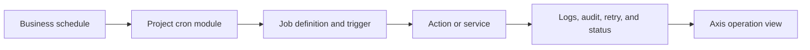

# Project Cron Customization

Project Cron Customization explains how a customer project adds scheduled
business work without editing reusable Process or Cron framework source. This
topic is separate from cron operations because developers need a clear path
for creating project-owned jobs, configuration, validation, testing, and
operational evidence.

For a business reader, scheduled work might mean nightly cleanup, catalog
sync, email follow-up, price recalculation, analytics export, or workflow
reminder. For a developer, it means a job definition, trigger, action,
permission, retry behavior, logs, and tests.

## Project job model

## Implementation checklist

| Area | What to define |
| --- | --- |
| Job owner | Project module and business capability. |
| Trigger | Schedule, timezone, activation state, and retry window. |
| Action | Service, adapter, or pipeline step to execute. |
| Permissions | Who can view, pause, resume, retry, or cancel. |
| Data impact | Records changed, idempotency key, and rollback behavior. |
| Verification | Unit tests, integration tests, logs, and browser evidence. |

## Customization and extension

Start in the customer project. Add a project cron module or project Process
extension that declares the job and points to a service or pipeline owned by
the project capability. Use configuration for schedules and provider choices.
Use events when the job must notify other nodes or invalidate runtime state.
Use Axis metadata so administrators can see status and action buttons.

## Operator and QA impact

Operators need to know whether a job is active, when it last ran, what it
changed, and how to retry safely. QA owners need acceptance data that proves a
fresh schema can register the job, execute it, recover from failure, and avoid
duplicate side effects.

## Configuration ownership

Project teams should keep cron behavior configurable from the project layer
wherever the schedule or provider choice can change between customers or
environments. Document the configuration key, default value, accepted values,
runtime reload behavior, and who is allowed to change it from Axis. If a job
updates commerce, content, media, or integration data, include the target
catalog, tenant, site, and approval or publishing dependency so operators can
understand the business blast radius before running it.

## Reader and implementation contract

A beginner should be able to recognize the difference between a business
schedule and a technical execution mechanism. A business user should know who
can pause, resume, retry, or inspect the job. A developer should know where to
define the trigger, where the service or pipeline lives, and how to keep the
job idempotent. An operator should know which dashboard, log, audit record, or
API proves the job state.

Project cron documentation should be updated every time a customer adds a new
scheduled operation. The page must include the schedule, timezone, input data,
side effects, retry policy, permission model, runtime owner, and acceptance
evidence. Without those details, a scheduled operation becomes production
risk instead of enterprise automation.

## Common mistakes

- Adding a timer in application startup code.
- Hardcoding a schedule where a project configuration should own it.
- Missing idempotency for jobs that call external systems.
- Forgetting Axis visibility for business operators.
- Testing only success and not retry, cancellation, or disabled state.

## Verification

Verify a project cron customization by loading the project module in the
Process runtime, confirming the job registration, running the trigger or manual
execution path, checking logs and audit evidence, and validating that disabled
or failed jobs behave as documented.
