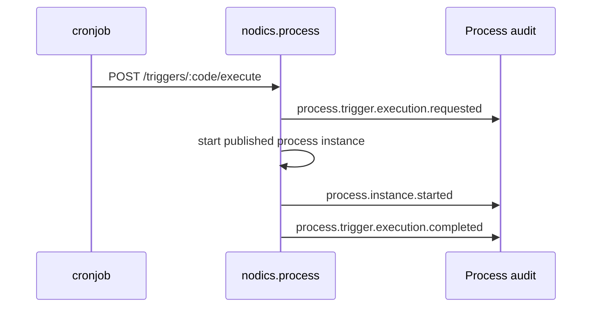

# Scheduled Automation and Cron Triggers

Scheduled automation connects time-based execution to business workflows. Nodics
keeps the ownership boundary explicit:

- nodics.process owns process definitions, trigger relationships, instances,
  tasks, and audit.
- nodics.process/modules/cronjob owns job scheduling, firing, retry timing, and
  scheduler runtime.

## Why this split exists

If Process owned Cron jobs directly, workflows would become a hidden scheduler.
If Cron owned process definitions, scheduled jobs would become a hidden workflow
engine. Keeping the boundary clear makes the system easier to test, operate, and
customize.



## Trigger lifecycle

| State | Meaning |
| --- | --- |
| `DRAFT` | Relationship exists but is not executable. |
| `ACTIVE` | Authorized scheduler can execute it. |
| `PAUSED` | Keep metadata but do not execute. |
| `ARCHIVED` | Historical relationship; cannot be updated or executed. |

Axis should make this lifecycle obvious. A business user should not need to
guess why an automation did not run.

## Runtime execution contract

The execution API requires an active trigger. The scheduler should pass a
correlation or idempotency key.

```http
POST /nodics/process/v0/triggers/dailyContentApproval/execute
Authorization: Bearer <runtime-token>
content-type: application/json

{
  "correlationId": "cron-fire-2026-08-09T10:00:00Z",
  "context": {
    "source": "cron",
    "businessDate": "2026-08-09"
  }
}
```

Process starts the referenced workflow and records audit evidence. Cronjob
remains responsible for deciding when to call this endpoint and how to retry
scheduler failures.

## Cron-owned job declaration

When workflow and cronjob run together in `processServer`, a Cron job can execute a
Process trigger without using a browser-only shortcut:

```js
{
  code: 'dailyContentApprovalJob',
  trigger: { expression: '0 10 * * *' },
  jobDetail: {
    processTrigger: {
      triggerCode: 'dailyContentApproval',
      context: {
        sourceDescription: 'Daily content approval automation'
      }
    }
  }
}
```

This declaration is intentionally small. The business process remains in
Process. The schedule remains in cronjob. Domain-specific work remains in the
domain module that Process calls through explicit ACTION adapters.

## What business users should see in Axis

Axis should explain two related but different records:

| Axis concept | Backend owner | What the user controls |
| --- | --- | --- |
| Scheduled trigger relationship | `nodics.process` | Which process definition is allowed to start from a schedule. |
| Cron job | `nodics.process/modules/cronjob` | When the schedule fires and how scheduler lifecycle is operated. |
| Manual execute now | `nodics.process` | Test an active trigger immediately with audit evidence. |

This helps a business user understand why activating a trigger relationship is
not the same thing as starting a scheduler, and why a Cron job may still need to
exist before real time-based automation fires.

## Common mistakes

- Treating trigger activation as proof that a scheduler exists and is healthy.
- Duplicating schedule state in Process and Cron or losing tenant, correlation, idempotency, and audit context.

## Verification

Activate a Process trigger, verify the Cron-owned schedule handoff, execute it once with idempotency evidence, reject unauthorized or inactive execution, and confirm retry and recovery behavior.
A beginner developer and production operator should both understand which evidence belongs to Process and which belongs to Cron.
Also repeat the check after processServer restarts and after a missed schedule window. Confirm the scheduler follows the configured misfire policy, does not replay a completed correlation unexpectedly, and exposes a recoverable incident when downstream execution fails. Metrics and logs must remain tenant-safe, bounded, and free of trigger payload secrets.
