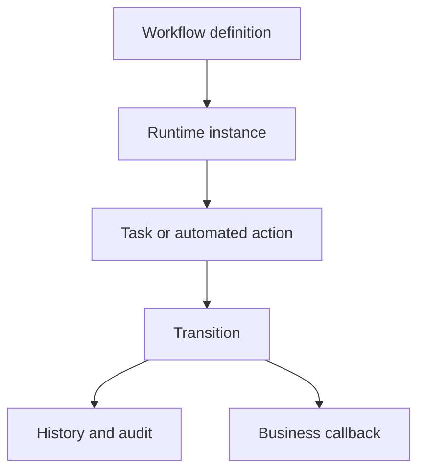

# Workflow and BPM Source Map

Workflow and BPM coordinate tasks, approvals, transitions, callbacks, and
history for business processes. Process capabilities can approve publication,
route contact submissions, drive scheduled automation, or support operational
recovery. For beginners, a workflow is a governed path from one state to
another, with evidence about who or what moved it.

## Source map

| Area | Source location |
| --- | --- |
| BPM module | `../nodics.foundation/modules/nbpm/package.json` |
| Process docs | `docs/pages/nodics.process/process-overview.md` |
| First workflow guide | `docs/pages/nodics.process/first-workflow.md` |
| Human task guide | `docs/pages/nodics.process/first-human-task.md` |
| Runtime lifecycle | `docs/pages/nodics.process/runtime-lifecycle.md` |
| Action adapters | `docs/pages/nodics.process/action-adapters.md` |

## Workflow model



The business problem is governed change. Approvals, reviews, retries, and
manual decisions must be visible and repeatable. Developers need a clear
definition and callback contract. Operators need stuck-task detection,
incident recovery, and production audit evidence.

## Contract

Workflow definitions should declare states, transitions, actors, actions,
timeouts, callbacks, and evidence. They should not hide business data changes
inside transition metadata. The owning module should expose a service or
callback that performs the business operation after the workflow allows it.

```js
const transition = {
  code: 'approvePublication',
  from: 'REVIEW_IN_PROGRESS',
  to: 'APPROVED',
  permission: 'cms.publication.approve',
  callback: 'DefaultCmsPublicationWorkflowCallbackService.afterApprove'
};
```

## Customization and extension guidance

Developers can add process definitions, action adapters, human task forms,
timeout policies, callbacks, and recovery tools. Business users should see
tasks, decisions, and comments in Axis. Operators should inspect runtime
instances, retries, failed callbacks, and audit history. AI tools should not
invent workflow transitions without checking permissions and callback owners.

## Implementation handoff

Each workflow handoff should document definition code, states, transitions,
actor rules, callback service, timeout behavior, retry policy, and recovery
queue. Business users get a clear decision journey, developers preserve module
ownership, operators get production incident evidence, and QA owners can test
happy path, rejection, timeout, callback failure, and retry behavior.

## Evidence checklist

Workflow evidence should include definition version, instance id, current
state, actor, transition, permission result, callback result, retry count,
timeout timestamp, and audit history. Operators should be able to identify
whether work is waiting for a person, a dependency, or a failed callback.
Business users should see task status and decision history without needing to
read process engine internals.

This evidence is especially important when a workflow protects publication,
refund, approval, or recovery actions. The user journey should remain simple,
but the technical record must be strong enough for production support.

## Common mistakes

- Putting business mutations in workflow metadata instead of owner services.
- Creating transitions without permission checks.
- Losing callback failure evidence.
- Allowing production tasks to remain stuck without an operator queue.
- Bypassing workflow for publishable or audited changes.

## Verification

Run workflow, human task, action adapter, and callback tests. In a fresh
schema, start a workflow, complete a human task, execute an automated action,
force a callback failure, and confirm retry or incident evidence. Production
readiness requires business decision clarity, developer contracts, operator
recovery, and QA audit proof.
