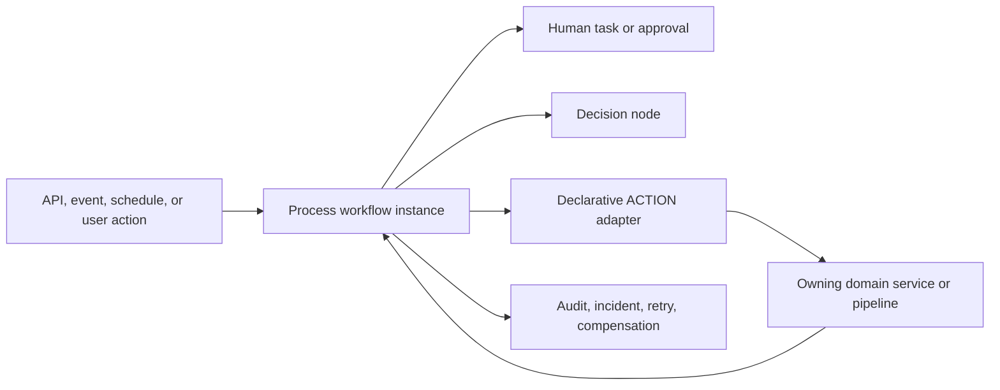
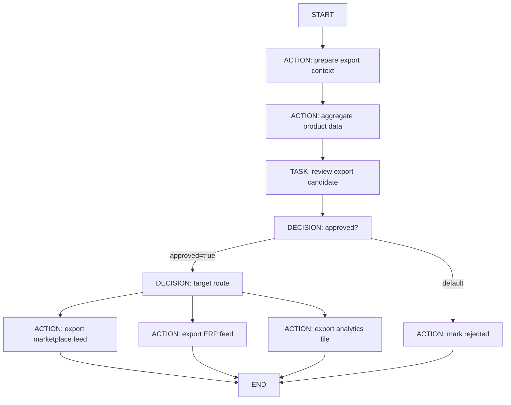
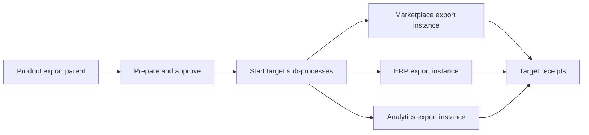

# Workflow Orchestration Patterns

Workflow orchestration explains how Nodics models long-running business work
that may involve people, approvals, waits, recovery, and several domain
systems. It uses the same clarity expected from pipeline documentation, but it
is not the same runtime mechanism. A pipeline executes bounded technical logic.
A workflow governs business lifecycle, persisted state, tasks, decisions,
ACTION adapters, retries, compensation, and audit evidence.

The simplest rule is: pipelines execute steps now; workflows remember business
work over time. A workflow may call pipelines or services, but the workflow
definition should remain declarative. It should say which business step comes
next, which actor or adapter owns it, which context is allowed, and what
evidence must be recorded.

For beginners, think of a workflow as a tracked business case. The case has a
definition, a version, a current step, assigned work, decisions, and an audit
timeline. A product export workflow is therefore not only a file download. It
is a governed case that gathers product facts, waits for approval, sends data
to selected targets, and records what happened.

## Pipeline and workflow boundary

| Concern | Pipeline | Workflow |
| --- | --- | --- |
| Runtime duration | Short-lived execution inside one request, event, import, job, or service call. | Long-running business lifecycle that can wait for people, timers, dependencies, and recovery. |
| State | Usually `request` and `response` objects during one execution. | Persisted `processDefinition`, immutable version, `processInstance`, `processTask`, incident, and audit records. |
| Ownership | `nPipeline` owns execution; the calling module owns business behavior. | `workflow` owns orchestration state; domain modules own business actions. |
| Branching | `success` links or `response.targetNode`. | Declared graph transitions, DECISION nodes, task decisions, and runtime context. |
| Failure | Enriched error returned to caller. | Incident, retry, compensation, dead-letter, and operator evidence. |
| UI visibility | Usually logs, diagnostics, or capability-specific screens. | Axis process/task console and business progress cards. |



## Workflow lifecycle

Every serious workflow follows the same lifecycle:

| Step | Runtime action | Developer meaning |
| --- | --- | --- |
| 1. Define | Create a draft process definition with stable codes, graph nodes, transitions, owner module, category, and policy. | The workflow is business-readable and backend-validated. |
| 2. Validate | Backend graph validation checks supported node types, START/END rules, transition integrity, and safe ACTION references. | Axis can draw the graph, but backend validation is the authority. |
| 3. Publish | A valid draft becomes an immutable `processDefinitionVersion` with a checksum. | Runtime instances must point to an immutable version, never a mutable draft. |
| 4. Start | API, schedule, event, or domain service starts a `processInstance` with bounded context. | Pass business keys and filters, not secrets or raw provider payloads. |
| 5. Execute | Process enters TASK, DECISION, ACTION, TIMER, SUB_PROCESS, or END nodes. | Process records state; domain modules execute business actions through registered adapters. |
| 6. Wait | Human tasks, timers, and dependency waits keep the instance durable. | Axis shows the next action and operator evidence. |
| 7. Branch | DECISION nodes select transitions from task decisions or context. | Split to two or many targets without hiding control flow in code. |
| 8. Recover | ACTION failures create incidents and bounded retry or compensation options. | Operators recover through Process APIs, not direct database edits. |
| 9. Complete | The instance reaches END and writes final audit evidence. | Business users can prove who acted, which version ran, and what was exported or published. |

## Product export use case

A product export is a good workflow example because the request is not simply
"write a file." A business user may ask for apparel products to be exported to
several destinations. The export needs product data, pricing, inventory,
classification, media references, locale/market filters, target-specific field
rules, approval, and retryable delivery.

The business flow can split to two, three, or many targets. One request may
export a marketplace feed, a partner ERP feed, and a marketing analytics file.
Each target can have its own filter, format, adapter, retry policy, and
delivery evidence.



## Workflow definition example

The definition stays declarative. It does not contain JavaScript functions,
database queries, provider URLs, or credentials. ACTION nodes reference
registered adapters. The adapters can call Commerce services, nExport, media,
or a target connector, but the graph stores only the allowed operation names
and policy.

```js
module.exports = {
  definitions: [{
    code: 'commerceProductExport',
    name: 'Commerce Product Export',
    category: 'commerce-export',
    ownerModule: 'product',
    policy: {
      assignmentPolicy: 'QUEUE',
      requiredApprovals: 1,
      requireReasonOnReject: true,
      contextAllowlist: [
        'tenant',
        'catalogCode',
        'market',
        'locale',
        'targets',
        'filters',
        'requestedBy',
        'correlationId'
      ]
    },
    graph: {
      nodes: [
        { code: 'start', type: 'START', name: 'Start' },
        {
          code: 'prepareExportContext',
          type: 'ACTION',
          name: 'Prepare Export Context',
          action: { moduleName: 'commerce.product', operation: 'prepareExportContext' }
        },
        {
          code: 'aggregateProductData',
          type: 'ACTION',
          name: 'Aggregate Product Data',
          action: { moduleName: 'commerce.product', operation: 'aggregateProductExportData' }
        },
        {
          code: 'reviewExport',
          type: 'TASK',
          name: 'Review Product Export',
          assignee: 'commerceExportApprovalQueue'
        },
        { code: 'approvalDecision', type: 'DECISION', name: 'Approval Decision' },
        { code: 'targetSplit', type: 'DECISION', name: 'Target Split' },
        {
          code: 'exportMarketplace',
          type: 'ACTION',
          name: 'Export Marketplace Feed',
          action: { moduleName: 'data.export', operation: 'exportMarketplaceProductFeed' },
          retry: { maximumAttempts: 3, delayMs: 5000 }
        },
        {
          code: 'exportErp',
          type: 'ACTION',
          name: 'Export ERP Feed',
          action: { moduleName: 'data.export', operation: 'exportErpProductFeed' },
          retry: { maximumAttempts: 3, delayMs: 10000 }
        },
        {
          code: 'exportAnalytics',
          type: 'ACTION',
          name: 'Export Analytics File',
          action: { moduleName: 'data.export', operation: 'exportProductAnalytics' },
          retry: { maximumAttempts: 2, delayMs: 5000 }
        },
        {
          code: 'markRejected',
          type: 'ACTION',
          name: 'Mark Export Rejected',
          action: { moduleName: 'commerce.product', operation: 'markExportRejected' }
        },
        { code: 'end', type: 'END', name: 'End' }
      ],
      transitions: [
        { code: 'start_to_prepare', source: 'start', target: 'prepareExportContext' },
        { code: 'prepare_to_aggregate', source: 'prepareExportContext', target: 'aggregateProductData' },
        { code: 'aggregate_to_review', source: 'aggregateProductData', target: 'reviewExport' },
        { code: 'review_to_decision', source: 'reviewExport', target: 'approvalDecision' },
        {
          code: 'approved_to_split',
          source: 'approvalDecision',
          target: 'targetSplit',
          condition: { field: 'approved', equals: true }
        },
        { code: 'rejected_to_mark', source: 'approvalDecision', target: 'markRejected', default: true },
        {
          code: 'split_to_marketplace',
          source: 'targetSplit',
          target: 'exportMarketplace',
          condition: { field: 'target', equals: 'marketplace' }
        },
        {
          code: 'split_to_erp',
          source: 'targetSplit',
          target: 'exportErp',
          condition: { field: 'target', equals: 'erp' }
        },
        { code: 'split_to_analytics', source: 'targetSplit', target: 'exportAnalytics', default: true },
        { code: 'marketplace_to_end', source: 'exportMarketplace', target: 'end' },
        { code: 'erp_to_end', source: 'exportErp', target: 'end' },
        { code: 'analytics_to_end', source: 'exportAnalytics', target: 'end' },
        { code: 'rejected_to_end', source: 'markRejected', target: 'end' }
      ]
    }
  }]
};
```

This example shows a split to three targets. For two targets, remove one target
ACTION node and reconnect the default transition. For more targets, add target
ACTION nodes and transitions from `targetSplit`. Keep every target explicit so
Axis and operators can see which destination failed or completed.

## Starting the export workflow

The workflow starts with bounded context. The context should carry business
keys and filter intent, not raw query code.

```http
POST /nodics/process/v0/instances
Authorization: Bearer <access-token>
x-enterprise-code: default
content-type: application/json

{
  "definitionCode": "commerceProductExport",
  "instanceCode": "product-export-summer-2026",
  "context": {
    "tenant": "default",
    "catalogCode": "agoraApparelProductCatalog",
    "market": "AE",
    "locale": "en",
    "targets": ["marketplace", "erp", "analytics"],
    "filters": {
      "categoryCode": "summer-shirts",
      "lifecycleState": "ONLINE",
      "modifiedSince": "2026-08-01T00:00:00.000Z"
    },
    "requestedBy": "admin",
    "correlationId": "export-2026-08-28-001"
  }
}
```

## Data aggregation contract

Aggregation belongs to the product or commerce adapter, not to Process. The
adapter can call product, pricing, inventory, media, localization, and search
projection services through their public service or module contracts.

```js
module.exports = {
  aggregateProductExportData: async function (request, execution) {
    const context = execution.context || {};
    const products = await SERVICE.DefaultProductDiscoveryService.search({
      tenant: context.tenant,
      query: {
        catalogCode: context.catalogCode,
        market: context.market,
        locale: context.locale,
        filters: context.filters
      }
    });
    const prices = await SERVICE.DefaultCustomerPriceSummaryService.getForProducts({
      tenant: context.tenant,
      productCodes: products.data.records.map(product => product.code),
      market: context.market
    });
    const availability = await SERVICE.DefaultCustomerAvailabilitySummaryService.getForProducts({
      tenant: context.tenant,
      productCodes: products.data.records.map(product => product.code),
      market: context.market
    });
    return {
      status: 'COMPLETED',
      output: {
        productCount: products.data.records.length,
        priceCount: prices.data.records.length,
        availabilityCount: availability.data.records.length
      }
    };
  }
};
```

The snippet is intentionally adapter-shaped. Real services may expose slightly
different method names by project, but the ownership rule remains the same:
Product owns product selection, Pricing owns price decisions, Inventory owns
availability, Media owns media references, and Process owns only orchestration
evidence.

## Filters and target policies

Filters should be explicit and bounded. A workflow context can carry business
filters such as catalog, category, lifecycle state, locale, market, date range,
brand, channel, or approval state. It should not carry arbitrary database
operators supplied by a browser.

| Filter area | Example | Owner |
| --- | --- | --- |
| Catalog scope | `catalogCode: agoraApparelProductCatalog` | Product or catalog module |
| Publication state | `lifecycleState: ONLINE` | Publish/domain module |
| Market and locale | `market: AE`, `locale: en` | Commerce and localization |
| Inventory | `availableOnly: true` | Inventory |
| Pricing | `priceListCode: retail-ae` | Pricing |
| Date range | `modifiedSince` | Owning domain service |
| Target selection | `targets: marketplace, erp, analytics` | Workflow context and target adapters |

Target adapters should own destination-specific mapping:

## Action adapters

Process ACTION nodes are safe only when the requested adapter is explicitly
registered. This keeps the workflow definition readable while preserving
backend control over which service method may execute. The adapter service can
call Product, Pricing, Inventory, Media, nExport, or an external provider, but
the graph itself never stores executable code.

```js
module.exports = {
  process: {
    actionAdapters: {
      allowedActions: [
        {
          moduleName: 'commerce.product',
          operation: 'aggregateProductExportData',
          service: 'CommerceProductExportWorkflowAdapterService',
          method: 'aggregateProductExportData'
        },
        {
          moduleName: 'data.export',
          operation: 'exportMarketplaceProductFeed',
          service: 'MarketplaceProductExportAdapterService',
          method: 'export'
        },
        {
          moduleName: 'data.export',
          operation: 'exportErpProductFeed',
          service: 'ErpProductExportAdapterService',
          method: 'export'
        },
        {
          moduleName: 'data.export',
          operation: 'exportProductAnalytics',
          service: 'AnalyticsProductExportAdapterService',
          method: 'export'
        }
      ]
    }
  }
};
```

## Multi-directional split patterns

There are two safe ways to model multiple export targets.

| Pattern | Use when | Shape |
| --- | --- | --- |
| Explicit target branches | The target list is known and small. | One DECISION node with one ACTION per target. |
| Sub-process per target | The target list is large, tenant-specific, or needs independent approval/retry. | Parent workflow prepares context; each target starts a child workflow. |

For two to five stable destinations, explicit branches are easier to inspect.
For many partner feeds, child workflows give operators one instance per target
and make retries safer.



## Customization and extension

| Need | Extension point | Do not do |
| --- | --- | --- |
| Add a new export target | Add a target ACTION adapter and transition, or add a target sub-process. | Hide a new target in one generic adapter with no visible workflow state. |
| Change product selection | Update product/export adapter filter policy. | Put raw database query logic into workflow graph metadata. |
| Add inventory or pricing enrichment | Call Inventory or Pricing from the aggregation adapter. | Copy Inventory or Pricing data into Process records. |
| Require approval by target | Add target-specific TASK nodes or child workflows. | Use one approval result for all targets when policies differ. |
| Change retry behavior | Declare bounded retry on target ACTION nodes. | Retry silently inside adapters without Process incident evidence. |
| Add destination credentials | Store secrets in provider configuration. | Put credentials or URLs into process graph JSON. |
| Export file rendering | Use `nExport` or target-owned renderer services. | Make Process format CSV, JSON, Excel, or provider payloads directly. |

## Error and recovery

Each target ACTION can fail independently. Process records the failed node,
adapter, definition version, instance, error code, attempt, retry policy,
compensation adapter, and redacted evidence. Operators should see whether the
marketplace export failed while ERP and analytics completed, or whether the
aggregation step failed before any target ran.

For critical exports, prefer target sub-processes when one destination should
not block another. For single-instance explicit branching, document whether
targets run one at a time or whether the parent starts child instances.

## Verification

Verify this workflow at four levels:

1. Graph validation rejects broken nodes, missing transitions, unknown ACTION
   references, duplicate START nodes, and executable metadata.
2. Adapter tests prove product aggregation, filter validation, pricing lookup,
   inventory lookup, media reference handling, target rendering, and bounded
   output.
3. Runtime tests start the workflow, complete approval, route to each target,
   force one target failure, retry it, and confirm audit/incident evidence.
4. Browser acceptance proves Axis shows the export instance, target status,
   review task, failure state, retry action, and final receipts clearly.

After documentation changes, regenerate and validate the documentation content
pack so the Process guide is available through Axis and Online documentation:

```bash
npm --prefix nodics.docs run docs:generate
npm --prefix nodics.docs test
```

## Common mistakes

- Treating a workflow as a larger pipeline and losing durable state.
- Putting product, price, inventory, or media business rules inside Process.
- Hiding multiple targets behind one opaque export action.
- Passing arbitrary database filters from Axis into an adapter.
- Retrying target delivery inside provider code without Process incident
  evidence.
- Storing provider URLs, credentials, or executable handler names in the graph.
