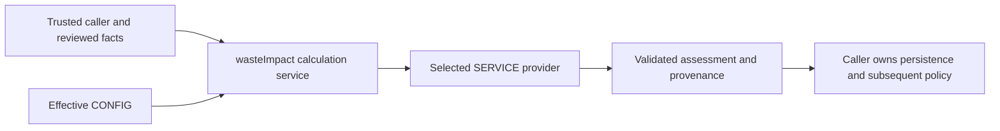

# Waste impact providers and mock carbon estimates

## Purpose and ownership

For beginners, an impact assessment records a calculated environmental metric
and the inputs behind it. The business value is a reproducible estimate that
can support demonstrations and integration development while an authorized
provider is selected. The functional owner is `nodics.waste`; its technical
owner `wasteImpact` supplies the contract, dispatcher and mock implementation.

The mock multiplies kilograms by an illustrative configured factor and returns
`KG_CO2E`. It always reports `ESTIMATED`, `isMock: true`, and
`publicClaimAllowed: false`. The supplied factor `1` is a simulation default,
not a researched emissions coefficient. An assessment does not create a carbon
credit, wallet balance, reward, approval, or public claim. Business users need
a consuming journey; this service does not add a new customer screen.

Accelerator, provider and project policies retain ownership of real coefficients,
methodologies and claims. Configuration is not restricted to a sample-data
module. Use the normal framework, project/module, environment, server, node and
supported tenant/runtime configuration hierarchy. `nConfig` remains the sole
configuration authority; `SERVICE` remains the provider service registry.

## Execution and prerequisites

Activate Waste and load its services through the existing runtime hierarchy.
An `EXTERNAL_PROVIDER` profile chooses provider execution. Static, weight and
quantity profiles keep their existing behavior; they do not automatically use
the configured mock. Consumers should await either calculation path.



Minimal service invocation inside an initialized runtime:

```javascript
const result = await SERVICE.DefaultWasteImpactCalculationService.calculate({
    resultCode: 'assessment-001',
    sourceRef: { module: 'wasteSubmission', schema: 'wasteSubmission', code: 'submission-001' },
    profile: { code: 'mock-impact', formulaType: 'EXTERNAL_PROVIDER', revision: 1 },
    facts: { verifiedWeight: 2.5, weightUnit: 'KG', categoryCode: 'DEVICE' },
    evidenceRefs: [],
    idempotencyKey: 'assessment-once', correlationId: 'trace-001'
}, trustedRuntimeContext);
```

With module defaults, this yields `2.500` KG_CO2E and an estimated assessment.
The secured Waste API facade supports the same asynchronous result. Its
controller obtains tenant context from `authData.tenant`; a tenant or provider
field in the HTTP body cannot change effective settings. Existing route
security and authorization still apply. The calculation itself does not fetch
or authorize arbitrary source records: callers must supply reviewed facts and
an authorized source/profile. There is no new persistence or idempotency store.

## Customize and extend safely

In an already registered later-loaded module, add only the needed delta to
`config/properties.js`. This is a configuration excerpt, not an installable
module. The owning runtime must include the module in its existing boot chain.

```javascript
module.exports = { wasteImpact: { calculation: {
    timeoutMs: 3000,
    failureMode: 'ERROR',
    mock: {
        factorSetVersion: 'illustrative-device-v2',
        factors: { default: null, categories: { DEVICE: 2 } },
        defaultWeightsKg: { categories: { DEVICE: 0.5 } },
        precision: 3,
        roundingMode: 'HALF_UP'
    }
} } };
```

After the supported configuration reload or runtime restart, 2.5 kilograms in
category DEVICE produces `5.000`. With no weight and quantity 3, the configured
unit weight yields 1.5 kilograms and `3.000`. An unknown category without an
item-specific rule fails because the default factor was explicitly disabled.
Recover by supplying a matching rule and version or corrected input. Restore
the previous configuration delta to roll back; historical assessments retain
their original provenance. Existing later-layer rules continue to merge normally.

| Setting under wasteImpact.calculation | Behavior |
| --- | --- |
| providerService | Loaded service name; default DefaultWasteImpactMockProviderService |
| timeoutMs | Integer 1 through 2147483647; default 5000 |
| failureMode | ERROR throws; RESULT returns FAILED with empty metrics |
| mock.factors | itemTypes, then categories, then default; zero remains valid |
| mock.defaultWeightsKg | Same lookup order; used only when weight is absent |
| mock.missingWeightMode | ERROR or ESTIMATE_FROM_QUANTITY; quantity fallback requires a configured positive weight |
| mock.precision | Integer 0 through 12, default 3 |
| mock.roundingMode | HALF_UP, FLOOR or CEIL |
| mock.factorSetVersion | Version identifying illustrative factor policy |
| mock.metricCode | Output metric code, default ESTIMATED_CO2E_SAVED_KG |

Weight precedence is verifiedWeight, receivedWeight, then weight. Explicit zero
is valid and never falls through. Inputs must use kilograms; unit conversion
belongs upstream. Invalid selected rules fail rather than falling through to a
less specific rule. Quantity estimation records the quantity, unit weight and
rule source. Decimal multiplication and rounding avoid binary floating-point
boundary artifacts after finite-number normalization. Precision-scaled results
above Number.MAX_SAFE_INTEGER are rejected, so this is not arbitrary-precision
scientific accounting. Do not use copied configuration registries, dynamic
require paths, browser policy or framework edits to customize an application.

## Replacing the mock with an authorized provider

A developer adds a loader-visible adapter such as
`src/service/partnerCarbonProviderService.js` in the owning later-loaded module,
then selects `providerService: 'PartnerCarbonProviderService'` through the same
configuration hierarchy. The adapter implements `calculate(request, context)`.
It may return an object or Promise. `context.settings` and the request are
detached immutable snapshots; `context.runtimeContext` carries the trusted
scope and `context.signal` supports cooperative cancellation.

The adapter receives sourceRef, profile, facts, evidenceRefs, idempotencyKey and
correlationId. It returns this protocol shape (illustrative response):

```javascript
{
    provider: { code: 'PARTNER_CARBON', version: '1', isMock: false },
    formulaVersion: 'provider-method-v1',
    calculationStatus: 'CONFIRMED',
    metrics: [{ metricCode: 'ASSESSED_CO2E', value: '7.250', unitOfMeasure: 'KG_CO2E' }],
    assessmentRef: 'provider-assessment-001',
    methodologyRef: 'provider-method-001'
}
```

Metrics require unique nonempty codes, units and finite decimal values.
Values remain nonnegative unless a configured environmental indicator explicitly
allows a signed value for that exact code and unit. Optional calculation.input and calculation.parameters carry the
allowlisted weight/factor provenance defined in the service contract. Other
raw provider fields are not retained. Public claims remain disabled even for a
confirmed response; confirmation is not certification. Partial exported-method
overrides also use the normal service loader. The facade resolves the effective
calculation service, so those overrides remain reachable without copying it.

Selecting an adapter does not qualify an external provider. Its operator must
configure secure credential references, enforce its methodology, propagate
cancellation and idempotency, and qualify its external contract. No real
provider account or network integration is included in the mock implementation.

## Failure, recovery and operational evidence

Invalid configuration, missing services, malformed metrics, provider errors
and timeouts have stable module-owned error codes. There is no implicit retry
or fallback to mock. Default ERROR mode throws a normalized error; RESULT mode
returns a FAILED assessment with empty metrics and an errorCode. Invalid base
configuration fails before dispatch even in RESULT mode. Raw provider error
messages and credentials are not included in the normalized result.

An operator should trace correlationId, idempotencyKey, provider version,
formulaVersion and the input/configuration fingerprints. The configuration
fingerprint covers selected identity and recorded applied calculation parameters,
not secret settings or every arbitrary adapter option. An adapter should encode
methodology changes in its formula/version references. Save result provenance
through the caller's normal governed persistence path. This service neither
writes records nor exports logs, dashboards, or automatic alerts.

On timeout, cooperative adapters receive an abort signal. An adapter that
ignores it may continue external work after the caller receives failure; handle
that through provider cancellation and reconciliation. Correct configuration
or provider health before retrying with the caller's idempotency policy.
Rollback must preserve assessment history and cannot relabel old simulated
results as provider-confirmed evidence.

## Common mistakes

- Treating the illustrative default factor as an emissions coefficient.
- Assuming a provider result creates rewards or certified credits.
- Putting provider selection in payload data or requiring a customer module.
- Changing an existing WEIGHT_FACTOR profile and expecting provider dispatch.
- Supplying grams without normalizing to kilograms.
- Calling local contract tests proof of live external-provider qualification.

## Verification

From the framework root run:

```bash
npm --prefix nodics.waste test
node nodics.foundation/modules/nConfig/test/layeredCustomizationContract.test.js
```

The provider suite covers default and category/item calculations, explicit zero,
missing/invalid inputs, quantity estimation, decimal boundaries, configuration
deltas, trusted tenant isolation, immutable snapshots, stable fingerprints,
asynchronous adapter replacement, partial overrides, missing adapters, timeout,
invalid responses and normalized failure modes. Existing Waste tests protect
built-in formulas and API envelopes. The nConfig contract separately checks
actual layered configuration and artifact-loading mechanics.

These checks establish local contract behavior. They do not prove a live HTTP
runtime, imported sample dataset, provider account, customer UI or production
readiness. Framework maintainers and AI tools must regenerate module context
when source changes and generate/validate documentation packs before release.
Authored documentation, generated-pack checks, rendered review and governed
publication are separate evidence; this source page alone does not publish it.


## Environmental properties and credit status

Environmental disclosure is optional additive result metadata, configured under
`wasteImpact.calculation.environmentalAssessment`. Generic defaults disable it;
the eWaste accelerator enables eleven emissions, resource and recovery indicators.
The disclosure maps existing provider metric codes into customer labels, units and
evidence requirements. It does not supply new formulas, measurements or factors.
Operators can replace mappings to match a qualified adapter through normal layered
configuration; provider selection and metric computation retain their existing owners.

For example, a provider returning `WATER_SAVED_L: 0` with unit `L` produces a real
zero display value. Omitting that metric produces null and `NOT_ASSESSED` with its
evidence requirements. The mock CO2e result is `ILLUSTRATIVE`; other missing
indicators do not inherit its factor or quantity. A signed net emissions benefit
requires `allowNegative: true` on its mapping. Negative benefits remain visible;
unit mismatches and unexpected negative quantities fail validation.

The result retains input/factor provenance, optional methodology, assessment,
geography, baseline, treatment, boundary, year and dataset references. These
provider-supplied references are context, not independent validation. Consumer
screens distinguish estimates, demonstrations and missing evidence. Approved
assets retain their existing `impactRef` to the owner-persisted result.

Credit eligibility and issuance stay `NOT_ASSESSED`, with null quantity and
registry reference. Converting an estimated kilogram value into tonnes does not
establish credits. Registry verification and issuance require a separate governed
integration. No ledger or public-claim permission is introduced here.

A mapping has a stable key and `metricCode`, `label`, `unitOfMeasure`, `requirements`
array and optional boolean `allowNegative`. The enclosing configuration requires
`enabled: true`, a `version` string and an `indicators` object. Use at most 32 unique
metric codes, labels of at most 120 characters and at most eight requirements of
180 characters each. Correct invalid mappings or units and rerun the assessment;
no implicit fallback generates missing environmental values.

## Immutable assessment history and acceptance

`DefaultWasteImpactAssessmentService` owns persisted reassessment and acceptance
operations. It composes the existing calculator and generated Waste repositories;
provider adapters still perform no persistence. Staff commands resolve an approved
submission and exactly one associated asset, then enforce Profile permission and
collection-point scope. Reads require `waste.review.queue.read`, reassessment
requires `waste.verification.record`, and acceptance requires `waste.review.approve`.

A reassessment reads stored reviewed facts and current trusted provider configuration.
It creates a new `wasteImpactResult` with asset reference, previous accepted reference,
input facts, source revision, reason, actor and command fingerprint. It never changes
the accepted `asset.impactRef`, original `metadata.approvedEstimate`, or reward state.
An explicit acceptance changes `impactRef` and its read snapshot `acceptedEstimate`,
while preserving original approval evidence. `wasteImpactSelection` records each
acceptance. Results and selections are read-only in generic schema authoring; assets
must be mutated through their owning lifecycle operations.

Exact asset revisions and actor-bound idempotency keys serialize commands. An
asset-persisted pending command freezes the result/event before downstream persistence.
Recovery completes that snapshot even after provider configuration changes. A failed
provider result remains visible in history but cannot be accepted. Selection requires
completed original reward settlement; changed input facts reject a stale candidate.
Replaying an old successful selection never restores it over a newer accepted result.

History is paginated (20 records per page), includes the legacy approval result and
returns the accepted result independently of the current page. Customer callers must
first authorize current asset ownership before calling `historyForAsset`; staff
callers use the scoped `history` entry point. The public projection excludes actor,
command key and raw input facts. No reassessment or acceptance issues credits,
revalues a wallet, or changes a settled reward. The original approval result remains
the reward settlement source even after subsequent assessment selection.

Provider and dataset identity are separate. Preserve provider code/version,
formula version, source dataset/version, original and normalized factors, geography,
baseline, treatment, boundary, weight source/range/confidence and timestamps.
`CARBON_EQUIVALENT_TCO2E` is a unit conversion metric, never an issued-credit quantity.
Electronic WARM coefficients and mappings belong to the eWaste provider adapter.
