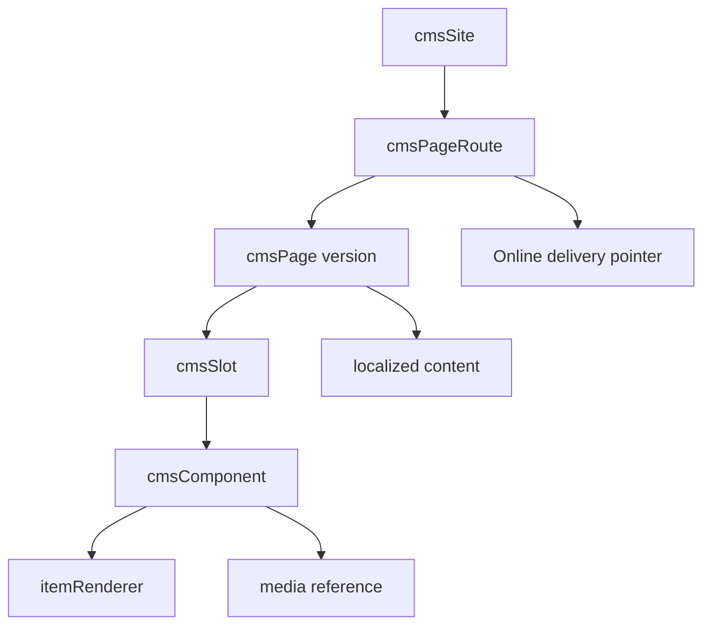

# CMS Source Map and Authoring Contract

CMS is the backend authority for sites, pages, routes, templates, slots,
components, renderers, content localization, migration, publication manifests,
and Online delivery pointers. Axis can offer the business authoring journey,
Nexus can render the public website, and Agora can consume storefront content,
but CMS owns the data contract. This page gives beginners a precise map of
where the implementation lives and gives developers enough detail to customize
content safely.

## Source map

| Capability | Source location |
| --- | --- |
| Schemas and routers | `../nodics.wcms/modules/cms/src/schemas/`, `../nodics.wcms/modules/cms/src/router/` |
| Delivery APIs | `../nodics.wcms/modules/cms/src/controller/delivery/`, `../nodics.wcms/modules/cms/src/service/delivery/` |
| Designer composition | `../nodics.wcms/modules/cms/src/controller/designer/`, `../nodics.wcms/modules/cms/src/service/designer/` |
| Publication workflow | `../nodics.wcms/modules/cms/src/controller/publication/`, `../nodics.wcms/modules/cms/src/service/publication/` |
| Documentation governance | `../nodics.wcms/modules/cms/src/service/documentation/` |
| Migration | `../nodics.wcms/modules/cms/src/controller/migration/`, `../nodics.wcms/modules/cms/src/service/migration/` |
| Init and sample data | `../nodics.wcms/modules/cms/data/init-v001/`, `../nodics.wcms/modules/cms/data/sample-v001/` |
| Contract tests | `../nodics.wcms/modules/cms/test/` |

## Content model



The business value is governed composition. A content administrator should be
able to prepare a page in Staged, preview it, request approval, and publish a
controlled version. A developer should know which schema owns each object and
where to extend validation, delivery, or rendering. An operator should know
which publication, cache, and route evidence proves that production is serving
the approved version.

## Authoring contract

Data files can create CMS objects for module releases and project releases.
Axis can create the same objects through backoffice APIs. Both lanes must land
in the same schemas and obey the same validation. Data definitions should
contain structure and business metadata, not runtime logic.

```js
module.exports = {
  cms: {
    pages: {
      options: {
        enabled: true,
        schemaName: 'cmsPage',
        operation: 'saveAll',
        dataFilePrefix: 'defaultCmsPageData'
      },
      query: { code: '$code', tenant: '$tenant', catalogVersion: '$catalogVersion' }
    }
  }
};
```

The header says where records go. The record says what should exist. The CMS
service decides whether the object is valid. The publication workflow decides
when it becomes Online. This separation keeps business users, developers, AI
tools, and operators from creating parallel authorities.

## Publication and delivery

CMS publication starts in Staged. The publication adapter loads the selected
root version, resolves dependencies, validates graph limits, builds a
deterministic manifest, includes media references, and sends the manifest to
the Online target. The target imports the manifest, validates integrity,
activates delivery scopes, and invalidates the relevant delivery cache. Staged
must not write Online storage directly.

Delivery services then resolve the active route pointer, load the Online
snapshot, apply localization and renderer hints, and return a bounded response
to consumers. Nexus and Agora should handle unavailable routes with friendly
messages, but they should not invent pages when CMS has no approved route.

## Customization and extension guidance

Developers can customize CMS by adding schemas, item renderers, composition
rules, validation handlers, migration adapters, or publication adapters. The
extension should live in the owning module or customer project and should add
tests beside the capability it changes. Business users should see the result
as new fields, components, page templates, workflow states, or validation
messages in Axis.

When adding a component type, define the renderer, allowed properties,
localization behavior, media relation behavior, authoring validation, and
publication dependency collection. When adding a migration path, define source
classification, mapping rules, conflict behavior, partial failure handling,
and retry evidence.

## Operational checks

| Check | Owner | Evidence |
| --- | --- | --- |
| Page can be authored | CMS authoring | `cmsPage`, slot, component, route records exist in Staged. |
| Page can be published | CMS publication | Manifest has dependencies, hash, revision, and approval state. |
| Page can be delivered | CMS Online | Active delivery pointer resolves to the expected route. |
| Page can render media | CMS plus Media | Media codes are included and Online media paths resolve. |
| Page can be recovered | Operator | Rollback or withdraw endpoint has lineage evidence. |

## Common mistakes

- Creating components without renderer or media dependency rules.
- Adding a route without an active page version.
- Treating a Staged preview as Online publication.
- Putting logic or environment-specific URLs into data record files.
- Updating Nexus or Agora to hide a CMS data problem instead of fixing CMS
  authoring, import, or publication.

## Verification

Run CMS contract tests for authoring, delivery, migration, publication
manifest, workflow callbacks, localization, and storefront delivery. Then run
a fresh-schema import, publish a sample page, open the consuming application
in the browser, and prove that production delivery reads an active Online
manifest with the expected page, component, media, and route evidence.
