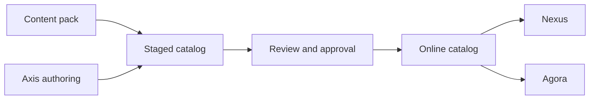

# Content Catalog Model

The content catalog model explains how Nodics stores and delivers CMS-backed
content such as pages, components, documentation, navigation, media
references, headers, footers, Nexus content, and Agora storefront content. It
exists because public applications must not hardcode business content when the
content is expected to be managed, approved, published, localized, searched,
and governed from Axis.

For a beginner, the safe model is: content is prepared in Staged, reviewed and
approved, then published Online. Nexus and Agora consume Online content only.
Axis is the management surface, but WCMS and backend content packs own the
records.

## Catalog objects

| Object | Purpose | Business impact |
| --- | --- | --- |
| Site | Defines the public or authenticated experience being delivered. | Separates Nexus, Agora, documentation, and partner sites. |
| Catalog | Holds versioned content for a site or product area. | Lets teams manage Staged and Online content separately. |
| Page | Represents a route-level content experience. | Controls what users see for a URL. |
| Component | Provides renderable content blocks. | Lets business users assemble page areas. |
| Media | Connects files and metadata to content. | Enables images, documents, and assets without frontend bundling. |
| Access policy | Controls public or authenticated visibility. | Prevents draft or restricted content from leaking. |

## Data flow

## Customization and extension

Projects can add content catalogs for their own corporate sites, storefronts,
documentation sets, and partner experiences. The project pack should include
pages, components, routes, media records, media assets, publication metadata,
and access policy. The installer may prepare this structure, but the project
must own its content rather than depending on reference Kickoff sample data.

## Operator view

Operators should be able to inspect which content pack imported a record,
which catalog version is Staged, which release is Online, which route is
active, and whether the media artifact exists. If a public site does not
render, the investigation should start with site, catalog, route, page,
component, media, and publication state.

## Reader and implementation contract

A beginner should come away knowing that the content catalog is the data model
behind what Axis manages and what Nexus or Agora can render. A business user
should understand that changing content, navigation, header, footer, or page
visibility is a governed business operation. A developer should understand
that content records, media records, routes, and renderer metadata must be
created together. An operator should understand that Online delivery is proven
by catalog version, route, page, component, media artifact, and access policy.

When a project introduces a new corporate site or storefront, the content pack
must be complete. Import should prepare media files, media objects, pages,
components, navigation, routes, publication metadata, and access rules. A
partial pack creates a user journey that looks initialized but still cannot
render the real public experience.

## Common mistakes

- Rendering Nexus or Agora content from frontend constants after a fresh schema.
- Importing page records without the required media records and files.
- Treating Staged content as visible public content.
- Using one catalog for unrelated sites without access and lifecycle clarity.
- Forgetting that navigation and headers are also content.

## Verification

Verify the content catalog model by importing a complete site pack, approving
and publishing it Online, then opening the public route. The browser should
render backend-owned content. A fresh schema should show a professional
maintenance page until Online content exists.
