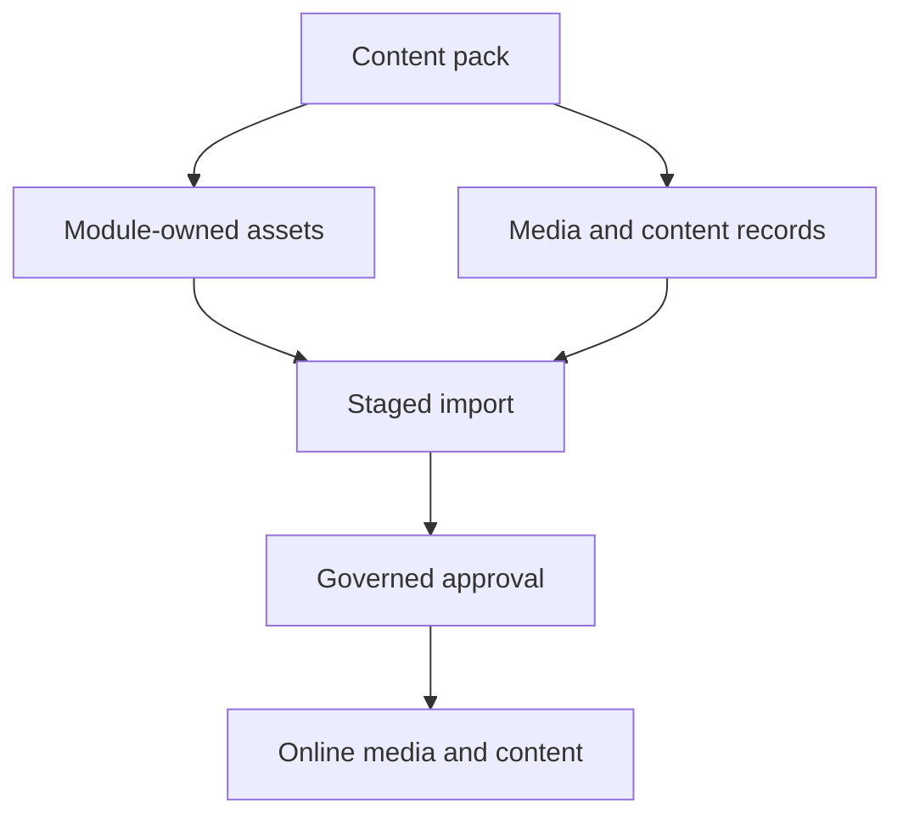

# Media Import and Publication

Media Import and Publication explains how a content pack prepares a complete
site experience, including media files, media records, page references, and
Online delivery state. Importing Nexus or Agora data should prepare the whole
site, not only text records.

## Import flow

## Complete site preparation

| Asset type | What must be imported |
| --- | --- |
| Images | Physical file, media record, alt text, usage relation, and visibility. |
| Blogs and news | Article records, media references, categories, dates, and publication state. |
| Header and footer | Navigation, branding, links, and any referenced logo media. |
| Storefront content | Pages, components, content areas, media, and route mapping. |

## Business perspective

When an administrator clicks initialize for Nexus or Agora, the expectation is
that the business application becomes ready for review. The import should make
visible what was created, what is missing, what is waiting for approval, and
what will become public after publishing. A customer-friendly unpublished page
is acceptable before Online approval; hardcoded demo content is not.

## Developer perspective

Developers should keep seed media beside the module that owns the business
content, normally under the module data or asset folder. The importer must copy
assets, create media records, connect them to pages or business objects, and
report failures with enough detail to retry safely. If a customer generates a
new corporate site, the installer should copy or generate the right content
pack and media assets instead of forcing changes into environment properties.

## Operational evidence

A complete import should leave a trace that business and technical users can both inspect. The evidence should include package version, checksum, target site, target catalog, number of media records, number of physical files copied, missing asset list, publication task, approval decision, and browser route tested after Online activation. If any of those are missing, the import may look successful while the site still fails to render images, articles, or navigation assets for customers.

## Reader and implementation contract

A beginner should understand that content-pack import must prepare a complete experience, not only database rows. A business user should know what becomes ready after import and what still waits for approval. A developer should document the asset folder, manifest, media object, page reference, site, catalog, channel, and importer behavior. An operator should know how to retry import, inspect failures, and prove that Online pages can actually load their media.

This topic must be kept in sync with Nexus, Agora, documentation, and future accelerator setup. Whenever a module adds blogs, news, banners, product images, logos, or documents, the import documentation must include physical assets, metadata records, relation creation, publication state, and browser evidence.

## Customization and extension guidance

A project can extend media import by adding new seed asset folders, validation rules, content-pack manifests, or post-import checks. Document the owner module, asset path, manifest fields, import command or Axis action, target site, target catalog, and publication dependency. This keeps Nexus, Agora, and future accelerators complete when a customer creates their own content package.

## Common mistakes

- Importing page records while leaving images outside the content pack.
- Using local environment config to describe customer-specific site media.
- Showing a storefront header, footer, blogs, or news from frontend defaults
  when no Online content exists.
- Marking import successful before media verification is complete.

## Verification

Verify import with a fresh schema. Initialize the content pack, inspect import
history, confirm media records and physical files, publish Online, then open
the Nexus or Agora page in the browser. A developer should also test missing
asset handling and retry behavior.
