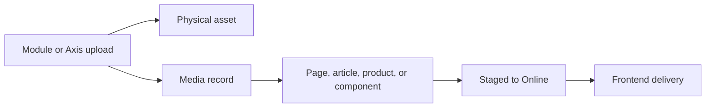

# Media Management

Media Management explains how Nodics stores, relates, publishes, and delivers
images and files used by Nexus, Agora, Axis, documentation, and other business
experiences. This page is the overview. Detailed asset storage and publication
journeys live in the sibling topics.

## Media model

| Area | Rule |
| --- | --- |
| Physical asset | Must be present, copyable, and tied to the owning module or upload source. |
| Media record | Must describe business meaning, visibility, and usage context. |
| Publication | Must move media data and referenced assets together. |
| Frontend | Must render backend-published media or a deliberate fallback state. |

## Business perspective

For business users, media is part of the customer experience. A banner, blog
image, product image, documentation screenshot, or news asset should not appear
by accident or disappear after publishing. Axis should make the media status
clear: uploaded, related to content, staged, approved, online, retired, or
missing.

## Developer perspective

Developers should not bury storefront images in frontend-only folders when the
image is business content. Module-owned seed media belongs with module data and
must be imported with the related content pack. Runtime uploads need media
records, storage provider behavior, access rules, and delivery URLs that match
the site and tenant.

## Continue with

- **Media Storage and Delivery** for provider selection, URL generation, access,
  and runtime delivery behavior.
- **Media Import and Publication** for seed assets, content packs, media object
  creation, publication, and fresh-schema verification.
- **WCMS Content Management** for pages, content areas, and components that use
  media.

## Operational evidence

The page should show how a user proves media is not only configured but actually usable. Evidence includes the source module or upload owner, the media code, the related content item, the active provider, the resolved delivery URL, and the browser result. For project customization, add the exact place where the customer changes the provider, asset source, access rule, or validation rule. That evidence matters because media problems usually appear as broken customer pages, not obvious backend errors.

## Reader and implementation contract

A beginner should understand that media is both a file and a governed record. A business user should know why an image is visible, unpublished, retired, or missing. A developer should know where the source asset lives, which media record represents it, which content item references it, and which provider delivers it. An operator should know how to inspect physical availability, Online state, access mode, and browser loading errors.

Every media topic must include source ownership, storage provider, media record fields, usage relation, visibility, publication behavior, fallback state, and browser verification. If a customer can replace or upload the asset from Axis, the page must also explain permissions, validation, size constraints, and rollback.

This extension guidance must stay linked to the owning project or capability page whenever a customer customizes the behavior.

## Common mistakes

- Importing content data without the referenced media records and files.
- Keeping business images hardcoded in Nexus or Agora source.
- Publishing a page without validating media delivery in the browser.
- Documenting a media use case without storage provider and access rules.

## Verification

Verify media by checking the physical asset, media record, usage relation,
publication state, frontend URL, browser rendering, and missing-asset fallback.
A beginner should understand why the image appears; a developer should know
where it comes from; an operator should know how to diagnose it.
