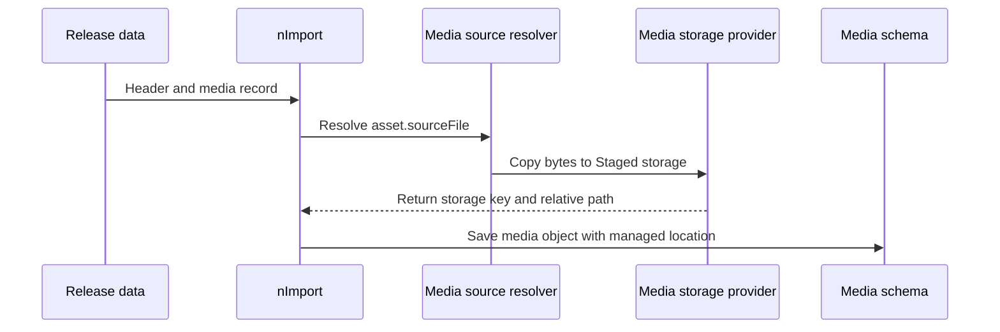

# Media Operations Runbook

Media has a different lifecycle from normal records because a media object has
both metadata and a physical artifact. The record can be declared in a module
or project data folder, but the bytes must be copied to the correct storage
location before the schema object becomes useful. For beginners, think of media
as two linked things: a governed object in the database and a file in managed
storage. Both must move from authoring assets to Staged and from Staged to
Online before a production page or product can safely render it.

## Business problem

The business problem is trust in visual and downloadable content. A storefront
banner, product image, corporate logo, or document link may look like simple
presentation, but a broken file can stop a launch, confuse customers, or make
an approved page look unfinished. The media runbook solves that problem by
making every physical file traceable from data release to Staged storage,
Online storage, delivery URL, and recovery evidence.

## Source map

| Capability | Source location |
| --- | --- |
| Media schemas and routes | `../nodics.wcms/modules/media/src/schemas/`, `../nodics.wcms/modules/media/src/router/` |
| Upload and storage lifecycle | `../nodics.wcms/modules/media/src/service/storage/` |
| Storage providers | `../nodics.wcms/modules/media/src/service/storage/provider/` |
| Storage key strategies | `../nodics.wcms/modules/media/src/service/storage/strategy/` |
| Reference lookup and sets | `../nodics.wcms/modules/media/src/service/reference/`, `../nodics.wcms/modules/media/src/service/set/` |
| Publication transfer | `../nodics.wcms/modules/media/src/service/publication/` |
| Import asset hydration | `../nodics.foundation/modules/nData/nImport/import/src/service/media/` |
| Jobs and policies | `../nodics.wcms/modules/media/data/init-v001/`, `../nodics.wcms/modules/media/data/standard/` |
| Contract tests | `../nodics.wcms/modules/media/test/` |

## Import contract

The data definition is declarative. It can declare `code`, `name`,
`folderCode`, `formatCode`, `businessPurpose`, `ownerType`, `ownerReference`,
and an `asset.sourceFile` that points inside the release-owned assets folder.
It should not declare final storage keys, public URLs, provider-owned paths, or
runtime-specific delivery links. Those fields belong to the importer and media
runtime.

## Storage and provider model

| Provider area | Responsibility | Operator evidence |
| --- | --- | --- |
| Local provider | Store development and local runtime files. | Relative path, checksum, file existence. |
| Cloud provider | Store production-ready managed objects. | Bucket/key, checksum, access policy. |
| NAS provider | Store enterprise shared storage objects. | Mount path, storage key, permission result. |
| Key strategy | Build deterministic paths per tenant/schema/date. | Strategy code and generated key. |
| Cleanup lifecycle | Retain referenced media and remove expired artifacts. | Job run, pointer count, deleted file count. |

Configuration selects providers and roots, but business data should not change
when a provider changes. This keeps customer projects portable across local,
Staged, Online, and disaster recovery environments.

## Publication and DR

Publication is a controlled copy, not a path rewrite by the frontend. CMS or a
business object publication identifies required media codes. Media publication
loads the Staged media object, copies the physical artifact to the Online
provider, records the Online storage coordinates, and replicates to disaster
recovery storage when configured. The Online media object must reference the
Online location. Staged paths should never leak into production responses.

## Operations

Operators should inspect media import history, storage provider health,
reference lookup, publication transfer receipts, cleanup jobs, and delivery
responses. A failed image can be caused by missing source bytes, a bad asset
manifest entry, storage permission failure, missing media reference, inactive
Online object, or route publication missing the media dependency. A safe UI
message should explain the visible effect. Technical evidence should carry the
media code, release folder, source file, provider code, storage key, checksum,
and correlation id.

## Customization and extension guidance

Developers can add media formats, folders, storage policies, key strategies,
providers, reference lookups, or publication transfer adapters. Keep new
business rules in the owning service or policy, not inside seed records. Add
tests for upload, import hydration, provider summary, publication transfer,
cleanup lifecycle, and delivery. Business users should interact with media
through Axis workbenches, while data releases continue to support developer
and AI-assisted baselines.

## Common mistakes

- Creating a media record while forgetting the physical file.
- Putting generated URLs or absolute local paths in release data.
- Publishing a page without publishing its required media artifacts.
- Deleting unreferenced files without checking active Online pointers.
- Treating provider configuration as business data.

## Verification

Use a fresh schema and a clean media storage root. Import a release with media
assets, confirm the physical files are copied to Staged, verify media records
contain managed paths, publish a page or product that references the media,
confirm Online storage receives the file, and open the browser route. Run the
media import source resolver, media release hydration, publication transfer,
delivery, cleanup lifecycle, and route contract tests before production use.
