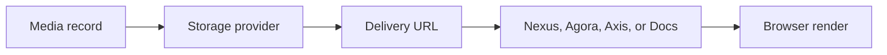

# Media Storage and Delivery

Media Storage and Delivery explains how Nodics serves images and files after
they have been registered as media records. It focuses on provider behavior,
access control, URL construction, cache behavior, and frontend delivery.

## Delivery flow

| Concern | Documentation requirement |
| --- | --- |
| Provider | Name local, cloud, or future provider behavior and configuration key. |
| Path | Explain generated path, module-owned seed path, or upload location. |
| Access | State whether the asset is public, authenticated, role-scoped, or internal. |
| Cache | Explain browser, CDN, or application cache invalidation if applicable. |
| Failure | Show missing, unpublished, forbidden, and retired media behavior. |

## Business perspective

Business users care that media appears in the right channel at the right time.
A public Nexus hero image, an Agora product image, and an internal Axis
document screenshot may have different visibility rules. Documentation must
explain the business consequence of changing an image, retiring it, or moving
it between public and authenticated delivery.

The business problem this solves is broken trust: a published page with missing
or inaccessible media looks unfinished even when the content records are valid.

## Developer perspective

Developers should implement media delivery through a provider contract rather
than hardcoded paths. A project can later move from local storage to a cloud
provider or secured file gateway if the provider selection, configuration, and
URL generation are documented. The media record should be the contract the
frontend consumes, not the filesystem path.

## Operator perspective

Operators need a quick path to diagnose broken media. The page should tell
them which provider is active, whether the physical artifact exists, whether
the media record is Online, whether the page that references it is Online, and
whether the frontend is receiving a usable URL.

## Operational evidence

The documentation should provide enough evidence for a support user to separate provider failure from content failure. Include sample status values, expected HTTP behavior, access mode, and whether the URL is public or generated for an authenticated request. When a provider is replaced in a project layer, document the configuration change and the migration plan for already imported assets. This prevents a future team from changing storage successfully while still breaking every published page that expects older URLs.

## Reader and implementation contract

A beginner should understand that the delivery URL is not the source of truth; the media record and provider contract are. A business user should know whether an asset is safe for public display or limited to authenticated users. A developer should document provider selection, path generation, delivery route, cache policy, and how a different provider can be plugged in later. An operator should know which checks prove the asset is reachable and which failure means record, provider, access, or cache trouble.

This page must be updated whenever a new provider, access mode, CDN strategy, signed URL rule, or cache invalidation pattern is introduced. The documentation should include diagrams and tables because media failures are easiest to solve when the user can see how record, storage, route, and browser are connected.

## Customization and extension guidance

A project can customize media delivery by replacing the storage provider, changing URL generation, adding signed delivery, or changing cache behavior. Document the configuration key, provider implementation, access rule, migration path, and rollback behavior. The frontend should continue to consume media records and delivery URLs from the backend contract, even when the provider changes.

## Common mistakes

- Treating a static asset path as the media contract.
- Changing storage provider without documenting migration and rollback.
- Publishing public pages that reference authenticated-only media.
- Caching old media after a governed content update.

## Verification

Verify delivery by opening the rendered page, checking image load status,
inspecting the media record, confirming access mode, and testing the configured
provider. Include browser evidence for business acceptance and API/provider
evidence for developer and operator acceptance.
