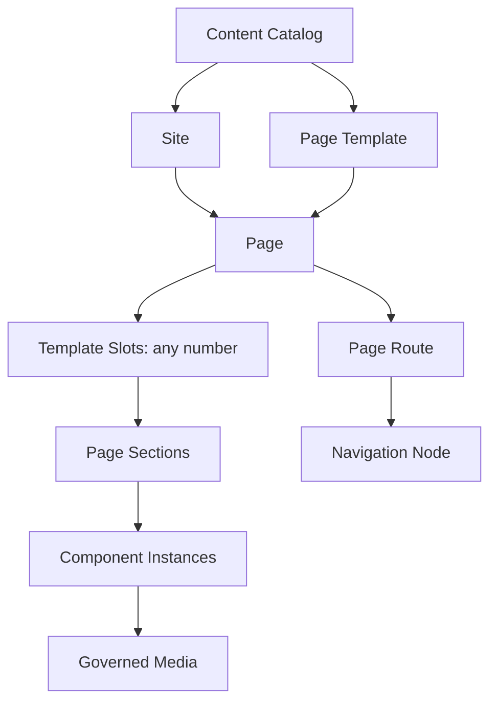
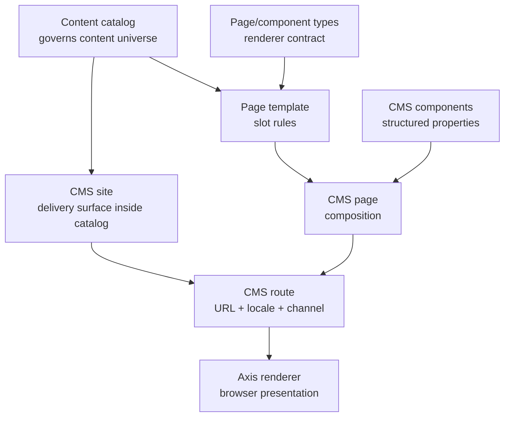
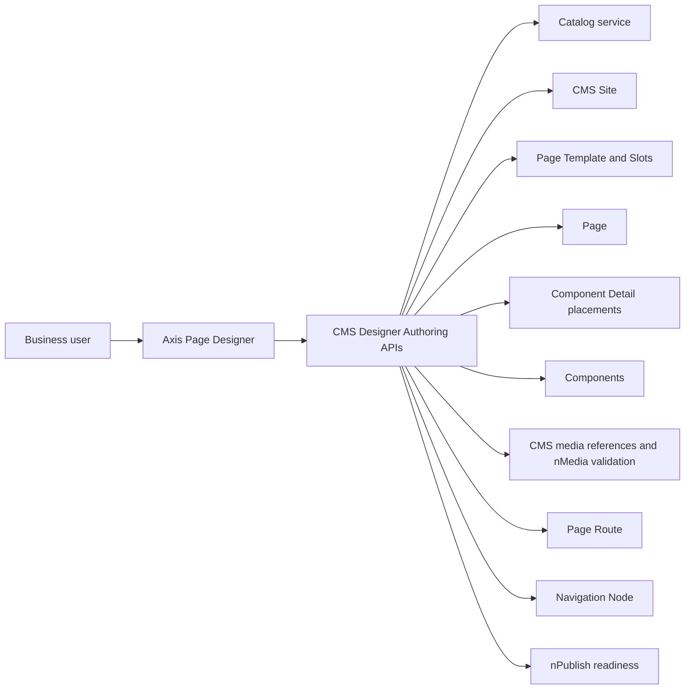
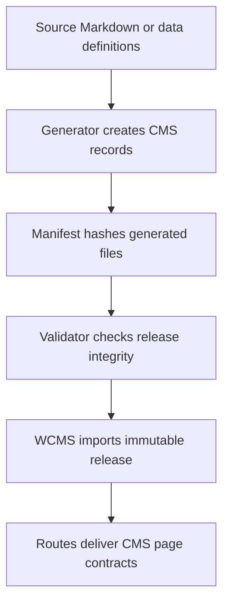
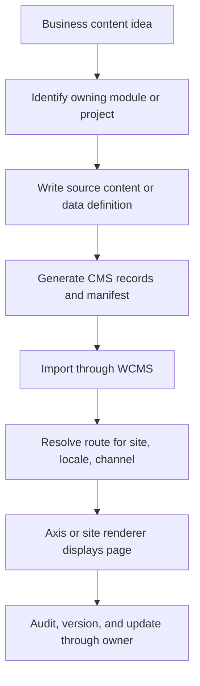

# WCMS content management

WCMS is the Nodics functional module for governed web content. It owns the
backend records that describe sites, content catalogs, page types, templates,
slots, pages, components, navigation, routes, restrictions, publication, and
delivery. A frontend such as Nodics Axis renders the resolved contract, but the
backend decides which content exists and when it is active.

## Problem it solves

Most enterprise applications eventually need content that changes faster than
code releases. Login pages, documentation, dashboards, banners, help text,
navigation, and site experiences should be governed without asking developers
to rebuild the frontend every time copy or composition changes. WCMS gives
Nodics a backend-owned content model that can be imported, versioned, searched,
published, and delivered safely.

## Core ownership rule

If a CMS record is imported into a database, it belongs to a backend module or
backend project. `nodics.axis` may provide renderers, but it must not own
database-importable site, page, component, catalog, or route data. Framework
documentation belongs in `nodics.docs`, Axis product documentation belongs in
`nodics.platform/modules/axis`, and customer project documentation belongs in
the customer project.

This rule keeps runtime ownership clear. It also allows a partner to replace
or extend a frontend without losing the governed content source.

## What WCMS manages

- Sites: named delivery surfaces such as Axis documentation or a storefront.
- Content catalogs: governed containers that group pages and components.
- Page and component types: contracts that describe what kind of record is
  being rendered.
- Templates and slots: layout-level rules for where components can appear.
- Pages and components: authored content and structured properties.
- Routes: URL, locale, channel, site, and page mappings.
- Navigation nodes: menu structures and discovery metadata.
- Restrictions: access and delivery constraints around content.
- Publication state: the difference between authored content and content that
  is safe to deliver.

## Catalog-first content model

WCMS uses a catalog-first model. The Content Catalog is the governed content
container. A Site is one delivery or authoring surface inside that content
universe. Templates, slots, component types, renderer mappings, pages, routes,
navigation, restrictions, media references, and publishing evidence all belong
under that catalog-governed model.



The slot count is never fixed by Axis or by a generic framework assumption. A
template can declare one slot, three slots, ten slots, or a specialized set of
slots such as `navigation`, `article`, `relatedResources`, `hero`, `body`,
`gallery`, `checkoutSummary`, or anything a module/project template needs.
Designer behavior must read those slot definitions from CMS and validate
against the backend contract.

Conceptually, the hierarchy is:

```text
Content Catalog
  ├── Sites
  │   └── Pages
  │       ├── Route
  │       ├── Navigation Node
  │       └── Template Usage
  │           └── Slots
  │               └── Sections
  │                   └── Components
  │                       └── Media References
  └── Reusable definitions
      ├── Page Templates
      ├── Slot Definitions
      ├── Component Types
      └── Renderer Mappings
```

This matters for beginners because it explains why a page record alone is not
enough. A page is only useful when it belongs to a Site, that Site belongs to a
Content Catalog, the selected template declares slots, and the components fit
those slot rules.

## How a page becomes visible



A page cannot exist meaningfully without the surrounding records. A route needs
a site. A site needs a catalog. A page needs a type and usually a template. A
template needs slots. Components need type codes and renderer mappings. This is
why a data pack with pages but no content catalog is incomplete. It might look
like “some records imported,” but the content model is not healthy.

## Beginner example: documentation content

Nodics documentation is a good first example because it is visible in Axis and
still follows the backend ownership rule.

1. `nodics.docs` owns framework documentation markdown.
2. Its generator converts markdown into CMS records: catalog, site, page type,
   component type, renderer mappings, template, components, pages, and routes.
3. WCMS imports the generated core data pack.
4. Axis opens `/docs`, requests the route from WCMS, and renders the returned
   page contract.
5. If the markdown changes, the content pack version and checksum change, then
   the environment imports the new governed release.

Axis does not read markdown files from `nodics.docs`. Axis reads the backend
delivery contract. That distinction is the heart of the modularisation work.

## Axis Page Designer foundation

Axis Page Designer is the business-friendly authoring surface over this same
catalog-first model. It is intentionally not a pixel-perfect website builder.
It is a guided composition workspace that helps a user select a Content
Catalog, select or create a Site, select a template, understand the template's
dynamic slot list, add page sections, add components, associate governed
media, assign a route, assign navigation, and validate whether the draft is
ready for publishing.



The Designer may make authoring feel easier, but it must not introduce a
parallel content model. It must save through CMS, Catalog, Media, and
Publishing contracts. If a customer wants a different page-design flow,
they can override the Designer service methods or provide different backend
templates, slot definitions, component type groups, and renderer mappings.
They should not fork Axis to invent storage, route, media, or publishing
authority in the browser.

The first endpoint a Page Designer should call is the WCMS-owned Designer
authoring model. That model tells Axis which records are currently available:
content catalogs, sites, page templates, slot definitions, page types,
component types, component type groups, media folders, media formats, media
types, navigation parents, and publishing-readiness hints. The browser can
turn those records into dropdowns, chips, and helper text, but the records
still come from backend-owned Catalog, CMS, Media, Navigation, and Publishing
services. This protects business users from typing magic strings and protects
the framework from frontend-owned persistence.

The user journey should stay soft. A business user should not be forced to
understand every schema before creating a page. The recommended Designer flow
is:

1. load WCMS defaults and show one recommended starting path;
2. let the user change the catalog, site, template, page code, route, slots,
   and primary component only when needed;
3. auto-filter dependent choices, such as sites by catalog and slots by
   template;
4. show media and navigation information as helpful hints, not as mandatory
   noise;
5. validate the draft and show backend evidence in a readable panel;
6. unlock Save only for the exact draft that WCMS validated.

This makes the screen feel like a guided assistant rather than a raw database
editor. Advanced users can still open the owning workspaces for catalogs,
sites, templates, components, media, routes, and navigation when they need
full control.

Ownership also controls how we write tests. CMS tests prove the authoring
model contract. Axis tests prove that the frontend can parse and render the
metadata safely. A reference customer project, such as a local demo project,
only proves that its composed runtime can observe the model. It must not
describe that acceptance check as if the customer project owns the WCMS
contract.

## Required record chain

| Record | Beginner explanation | Common failure if missing |
| --- | --- | --- |
| Catalog | The container that says this content belongs together. | Sites or pages look orphaned and governance becomes unclear. |
| Site | The named delivery surface, such as Axis docs or a customer website. | Routes cannot resolve a delivery target. |
| Type code | The contract that tells Axis what kind of page or component this is. | Axis cannot choose the correct renderer safely. |
| Renderer mapping | The allowed browser renderer for a type. | Axis refuses or falls back because the backend did not authorize a renderer. |
| Template and slots | The layout contract for where components are allowed. | Components may exist but not render in a predictable layout. |
| Component | The structured content or properties to render. | Page loads but has no meaningful body. |
| Page | The composition of components. | Route can resolve but there is no page to display. |
| Route | The URL, locale, channel, and delivery state. | Direct navigation shows recovery or not-found behavior. |

## Developer model

Developers should treat WCMS data like code-owned configuration until the
business explicitly moves a capability into operator-managed authoring. A
module ships source documentation or content definitions, generates importable
records, and exposes the pack through the governed import system. The generated
records are then loaded into WCMS. Runtime delivery reads the database records,
not the frontend repository.

When a project needs custom content, place the source and generated pack in the
owning project, such as `nodics.kickoff`. Do not modify framework packs to add
customer-specific pages.

## Content-pack release model

WCMS data releases are immutable. If the source content changes, the generated
records and checksum change, so the release version must change too. This
protects operators from installing two different sets of content under the
same trusted version.



If import says a release is invalid, treat that as useful protection. Fix the
source, generator, version, or manifest rather than bypassing checksum
validation.

## Business model

WCMS reduces release friction. Business users can work with governed content
surfaces while developers preserve reusable module boundaries. A partner can
run many customer-facing websites, internal applications, and documentation
experiences through the same content foundation while still keeping project
ownership clean.

## Business journey: from content idea to visible page

A business user usually does not think in terms of catalogs, routes, renderer
mappings, and templates. They think: “I need a page that explains this
capability, uses the right brand, appears in the right navigation, and can be
changed safely later.” WCMS turns that business need into governed records.



This is why WCMS is a framework capability instead of a frontend folder. The
page must be visible to users, but the authority for what the page means, who
owns it, how it is versioned, and how it is imported belongs to the backend
module or project.

## Example: three documentation sites

The reference Axis documentation navigation may show Framework, Swaggers,
Nodics Axis, and a customer project guide. That visible navigation is a user
experience decision. The backend data ownership is separate:

| Visible documentation area | Backend owner | Content purpose |
| --- | --- | --- |
| Framework | `nodics.docs` | Reusable Nodics framework concepts, quick start, architecture, customization, operations, module guides. |
| Swaggers | BackOffice/API discovery | Runtime API reference grouped by registered backend capability. |
| Nodics Axis | `nodics.platform/modules/axis` | Axis product behavior, renderer contracts, shell behavior, schema workbench, documentation rendering. |
| Customer project | customer project | Project setup, local demo behavior, project data, custom modules, customer-specific examples. |

No documentation area should store importable CMS data in `nodics.axis`.
Axis may render all of these areas, but it does not own the content records.

## Developer journey: adding a module-owned page

When a developer adds documentation or content for a functional module, the
safe process is:

1. Confirm the backend owner of the subject.
2. Add or update source content under that owner.
3. Regenerate generated CMS data and manifests with the owner-provided script.
4. Run content-pack validation.
5. Start WCMS and import through Axis or an approved backend import API.
6. Open the route in Axis or the target site.
7. Verify navigation, page body, renderer mapping, authorization, and route
   recovery behavior.

Hand-editing generated CMS records may seem faster, but it breaks release
integrity. If generated output is wrong, fix the source or generator.

## DevOps model

WCMS should be deployed as a runtime server when content delivery or content
management is required. Axis depends on Platform for identity and on WCMS for
governed presentation content. Local Kickoff normally starts Platform, WCMS,
Cron where needed, and Axis as the frontend renderer.

Production deployments should define backup, migration, publication, cache,
search, media storage, and import history policies. Content packs should have
semantic releases, checksums, and repeatable import behavior so an environment
can be rebuilt from source-controlled module data.

## Operations checklist

| Check | Expected evidence |
| --- | --- |
| WCMS process | Server starts and exposes content/import APIs on the configured port. |
| Content catalogs | Every site has an owning catalog; pages are not orphaned. |
| Routes | Each visible URL resolves to a page for site, locale, and channel. |
| Renderer mappings | Axis receives only renderer types the backend has authorized. |
| Import history | Content-pack install records include version, checksum, status, and outcome. |
| Media | Components reference media records, not private storage paths. |
| Recovery | Missing route, missing renderer, unauthorized access, and stale content fail safely. |
| Backup | Database, media storage, and generated release evidence can be restored together. |

WCMS incidents should be investigated by record chain. Start with the route,
then page, template, components, renderer mapping, site, catalog, and import
history. That is usually faster than searching the frontend first.

## QA scenarios

A WCMS change should be tested with more than one happy route:

1. page route resolves for the expected site, locale, and channel;
2. missing route shows recovery rather than broken layout;
3. missing renderer mapping fails safely;
4. content pack validates before import;
5. same version with changed checksum is rejected;
6. project documentation imports separately from framework and Axis docs;
7. generated files are recreated from source without manual drift;
8. Axis renders the delivered contract without direct filesystem access.

## What not to do

- Do not put WCMS import data in `nodics.axis`.
- Do not create a second content registry in the frontend.
- Do not hardcode page availability in Axis when WCMS can deliver it.
- Do not let a route imply ownership; route ownership comes from the backend
  module or project that owns the pack.
- Do not let generated records drift from their source catalogue.
- Do not create pages or components without catalogs and sites.
- Do not treat documentation content as special static frontend content just
  because Axis renders it.

## Common mistakes

The most common WCMS mistake is treating a visible page as a frontend asset
instead of a backend-owned content chain. Another common mistake is importing
pages and components without catalogs, sites, templates, slots, renderer
mappings, and routes. That creates partial data that may look present in the
database but cannot be delivered safely.

Do not duplicate content ownership in Axis. Do not let a customer project edit
framework documentation. Do not let framework documentation include
customer-specific setup as if every adopter used the same project. Do not
ignore version and checksum failures; an invalid release is the system
protecting itself from drift.

## Verification

Verify WCMS by walking the complete delivery chain. A route should resolve to
a site, catalog, page, template, slots, components, type codes, renderer
mappings, restrictions where applicable, and safe media references. Imported
releases should record semantic version, checksum, source owner, status, and
history. Axis should render the delivered contract and show recovery when a
route, renderer, or content source is missing.

For documentation specifically, verify each product separately: framework
documentation from `nodics.docs`, Axis product documentation from the Platform
Axis backend module, Swagger/API documentation from registered runtime
modules, and customer-project documentation from the owning customer project.
The fact that Axis displays all of them together does not make Axis the data
owner.
