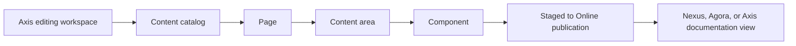

# WCMS Content Management

WCMS Content Management explains how Nodics manages business-owned pages,
content areas, components, navigation, visibility, and publication. It is the
entry page for content teams, Axis administrators, developers, operators, and AI
tools that need to understand the content model before changing it.

## WCMS model

| Concept | Meaning | Who cares |
| --- | --- | --- |
| Content catalog | Backend-owned hierarchy for pages and components. | Architects, developers, AI tools. |
| Page | Route-level business experience. | Business users and content authors. |
| Content area | A controlled placement region inside a page. | Page designers and frontend developers. |
| Component | Editable business content or functional renderer. | Authors, administrators, and operators. |
| Publication | Governed movement from Staged to Online. | Reviewers, publishers, and QA. |

## Business perspective

WCMS exists so customer-facing and internal content is managed through a
governed backend model, not through frontend hardcoding. A business user can
prepare pages, update navigation, manage components, request approval, and
publish Online content through Axis. Public Nexus pages, Agora storefronts,
Axis documentation, and internal pages can share the same content principles
while using different access and visibility rules.

## Technical perspective

Developers should treat WCMS as the authority for content structure. Frontends
render pages, areas, and components from backend data. If a page, navigation
item, header, footer, hero, article, banner, or documentation link is visible
without Online content, it should be either a governed fallback state or a
deliberate recovery shell.

## Continue with

- **Content Catalog Model** for page, area, component, catalog, and hierarchy
  records.
- **Page Designer and Components** for creating editable areas and component
  renderers.
- **Site Publication and Visibility** for Staged, Online, public, authenticated,
  and role-based delivery.
- **Media Management** for image, file, and asset ownership used by content.

## Reader and implementation contract

A beginner should understand that WCMS is the backend-owned content authority for page structure, not a frontend convenience layer. A business user should know how a content change moves from Axis editing to Staged preparation, approval, Online visibility, and public or authenticated rendering. A developer should know which model owns catalog, page, area, component, route, visibility, and media references. An operator should know where to verify publication state and missing-content fallback behavior.

Every WCMS page must explain the business journey and the implementation contract together. That includes content catalog ownership, editable component rules, route mapping, role visibility, publishing workflow, media dependencies, Axis customization surface, and browser evidence for Nexus, Agora, Axis, or documentation views.

This extension guidance must stay linked to the owning project or capability page whenever a customer customizes the behavior.

## Common mistakes

- Hardcoding business pages, header, footer, or storefront content in Nexus or
  Agora.
- Creating content without publication state and visibility metadata.
- Importing page data but forgetting media objects and physical assets.
- Treating Axis as the content owner instead of the editing and operations
  surface.

## Verification

Verify WCMS by importing content to Staged, approving publication, opening the
Online route, checking role visibility, confirming media renders, and inspecting
audit evidence. A beginner should see the page journey, a business user should
see how to change it, a developer should see the schema and renderer contract,
and an operator should see publication status.
