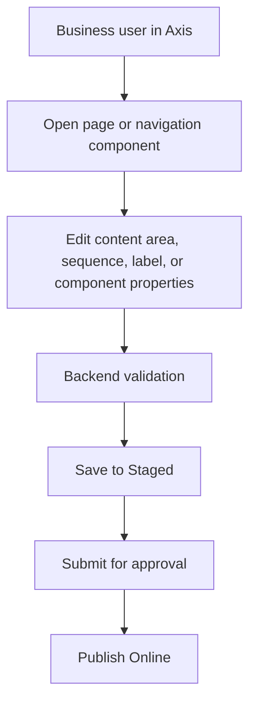

# Page Designer and Components

Page Designer and Components explain how Axis can let business users manage
page structure without making the frontend the owner of content. This topic is
separate from the general WCMS overview because it is the user-facing authoring
journey. A business user thinks in terms of content areas, navigation, headers,
footers, banners, cards, and links. A developer thinks in terms of component
types, renderers, slots, properties, validation, and publication.

Both views must meet in the content catalog.

## Authoring journey

## Component contract

| Area | Business meaning | Technical meaning |
| --- | --- | --- |
| Content area | A region of a page that can hold components. | Slot or composition metadata. |
| Component | A visible piece of content or interaction. | Typed record with renderer, properties, and validation. |
| Renderer | How the component appears in Axis, Nexus, or Agora. | Frontend implementation selected by backend metadata. |
| Sequence | Ordering of visible items. | Backend-managed position or relation. |
| Access | Who can view or edit the content. | Access policy and permission checks. |

## Customization and extension

Projects can introduce new component types and renderers when the business
experience needs them. The backend record must declare the component type,
properties, renderer key, channels, validation rules, publication behavior,
and access policy. Axis can render the editing journey, but the component
definition and data remain backend-owned.

## Business and operator impact

This model lets business users change content safely without asking developers
to redeploy for every label, image, navigation order, or campaign message.
Operators still have governance because edits go through Staged and Online
publication, and each change can be audited by actor, timestamp, target site,
component, and route.

## Reader and implementation contract

A beginner should understand that Page Designer is not a separate CMS hidden
inside Axis. It is a user-friendly view over backend-owned content catalog
records. A business user should see familiar concepts such as page, slot,
component, sequence, visibility, and publish status. A developer should see
component type, renderer key, property schema, validation, and project
extension path. An operator should see audit, publication state, Online route,
and rollback evidence.

Every component type needs a stable contract. The documentation should show
which properties are configurable, which renderer consumes them, what happens
when a property is missing, which channels can render the component, and how
the component behaves across Axis, Nexus, Agora, and authenticated views.

## Common mistakes

- Hardcoding headers, footers, navigation, or hero sections in public apps.
- Creating an Axis editor that saves records without publication workflow.
- Allowing a renderer property that the backend contract does not validate.
- Showing draft Staged components on Nexus or Agora.
- Forgetting responsive and accessibility checks for new renderers.

## Verification

Verify a component journey by creating or updating a component from Axis,
saving it to Staged, approving publication, refreshing public delivery, and
checking the browser. Tests should cover renderer fallback, invalid
properties, permission failures, and Online-only visibility.
