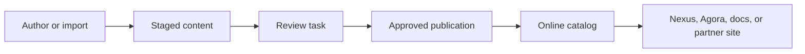

# Site Publication and Visibility

Site Publication and Visibility explain when content becomes visible to Axis,
Nexus, Agora, and public users. This page belongs under WCMS because visibility
is not only a frontend route decision. It depends on site, catalog, page,
component, media, access policy, Staged state, approval, Online state, and
runtime delivery.

For a beginner, the rule is simple: if content is not Online for the target
site and access policy, the public application should not display it. It may
show a customer-friendly maintenance page, but it must not leak Staged or
fallback sample content.

## Visibility flow

## Visibility matrix

| State | Axis authoring | Axis reading | Nexus/Agora public | Notes |
| --- | --- | --- | --- | --- |
| Not imported | Recovery or setup journey. | Not available except setup guidance. | Maintenance page. | User needs initialization. |
| Staged | Editable by permitted users. | Preview only where supported. | Not visible. | Approval required. |
| Approval in progress | Review decision needed. | Review evidence visible to permitted users. | Previous Online remains active. | Same screen should guide the user. |
| Online | Managed with audit and history. | Available by access policy. | Visible by access policy. | Navigation should refresh after mutation. |

## Customization and extension

Projects can define public, authenticated, role-based, group-based,
permission-based, or restricted visibility. The content pack and Axis editing
surface must expose this clearly. A customer corporate site may choose public
marketing pages, authenticated partner pages, and internal Axis-only
documentation within the same governance model.

## Operator view

When a public page is missing, operators should inspect the site code, route,
catalog, Online version, page record, component records, media artifacts,
access policy, and publication audit. A green import does not always mean the
public route is Online; import only prepares the Staged copy unless the
workflow explicitly publishes.

## Reader and implementation contract

A beginner should understand the difference between imported, Staged,
approval, Online, and retired content before diagnosing a public page. A
business user should know whether a missing page means content is not ready,
approval is pending, or visibility is restricted. A developer should know
which records must be created for a route to render. An operator should know
which Online evidence proves the page is live.

Visibility documentation must cover both positive and negative outcomes. It is
not enough to say how a page appears. The page must also explain what a public
application shows when content is missing, when access is restricted, when a
publication is rejected, and when a previous Online version remains active
while a new Staged release is waiting for review.

## Common mistakes

- Expecting an imported Staged page to appear on Nexus immediately.
- Showing stale navigation until the user manually refreshes after approval.
- Hiding approval tasks in a separate workflow page without context.
- Treating Swagger/OpenAPI as a CMS publication item.
- Forgetting that media visibility must follow the page and access policy.

## Verification

Verify visibility with a fresh schema and a browser. Before publication, Nexus
and Agora should show the maintenance state. After import, approval, and Online
publication, the public pages, headers, footers, images, and links should come
from backend records. Unauthorized users must not see restricted pages.
