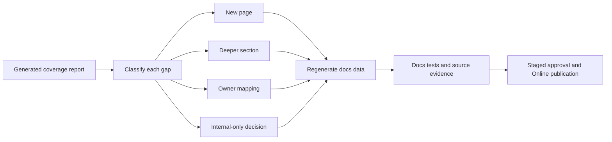

# Documentation Gap Backlog

This backlog turns the source-backed coverage audit into executable
documentation work. It captures the remaining categories that must be closed so
Nodics documentation explains not only what the product is, but how developers,
business users, operators, QA owners, and AI tools can safely work with the
framework.

For beginners, the mental model is simple: the coverage report tells us where
the source is richer than the documentation, and this backlog tells us what to
do next. A source boundary may need a new page, a deeper section in an existing
page, an explicit owner mapping, or an internal-only decision. The backlog is
not a marketing roadmap. It is a release-quality checklist for source-backed
documentation.

## Backlog flow



## Classification policy

| Classification | Meaning | Required action |
| --- | --- | --- |
| `needs-page` | A user-visible or developer-extensible capability has no clear page. | Create authored Markdown, catalogue metadata, source evidence, generated records, and validation. |
| `needs-deeper-section` | A page exists, but it lacks exact source map, data, service, operation, or validation detail. | Extend the existing page with how-to, how-it-works, customization, errors, and tests. |
| `needs-page-or-owner-mapping` | The source is significant, but ownership may belong under a broader page. | Decide owner, then either create a page or add explicit mapping to the owning page. |
| `internal-only-candidate` | The module is likely a utility or provider implementation. | Document the owner page that covers it, or mark it internal with justification. |
| `covered` | Existing docs and source evidence are sufficient for the current maturity state. | Keep validation and browser evidence current when behavior changes. |

## P0 closure items

| Status | Item | Source areas | Documentation outcome |
| --- | --- | --- | --- |
| Closed by P0 docs batch | Nexus data and content guide | `nodics.kickoff/modules/nexus.web` | Covered by `applications.nexus-data-content-guide` with Nexus project content, media assets, headers, records, publication, Online delivery, and browser validation. |
| Closed by P0 docs batch | Axis setup and user-safe error contracts | `nodics.platform/modules/backoffice`, `nodics.platform/modules/axis`, `nodics.exp/nodics.axis` | Covered by `applications.axis-setup-error-contracts` with setup states, blockers, retry behavior, required capability checks, technical evidence, and customer-safe messages. |
| Closed by P0 docs batch | CMS exact source map | `nodics.wcms/modules/cms` | Covered by `wcms.cms-source-map-authoring-contract` with page, route, component, slot, template, renderer, publication manifest, migration, delivery cache, and documentation governance details. |
| Closed by P0 docs batch | Media operations runbook | `nodics.wcms/modules/media`, `nodics.foundation/modules/nData/nImport/import/src/service/media` | Covered by `wcms.media-operations-runbook` with upload, import hydration, storage providers, cleanup, replication queue, delivery failures, and DR evidence. |
| Closed by P0 docs batch | Import/export provider guides | `nodics.foundation/modules/nData/nImport`, `nodics.foundation/modules/nData/nExport` | Covered by `data.import-export-provider-guides` with JavaScript, JSON, CSV, Excel, generated exports, parsers, field allow-lists, masking, and rollback boundaries. |
| Closed by P0 docs batch | Commerce authoring and fulfillment | `nodics.commerce/modules/baseCommerce`, `nodics.commerce/modules/fulfillment` | Covered by `commerce.data-authoring-fulfillment` with product, price, inventory, search projection, fulfillment execution, consignments, exceptions, return receipts, and browser proof. |
| Closed by P0 docs batch | Documentation publishing runbook | `nodics.docs`, `nodics.wcms/modules/cms`, `nodics.process/modules/nPublish` | Covered by `docs.documentation-publishing-runbook` with Markdown source, generated content-pack data, Staged import, review, Online activation, rollback, and Axis/Nexus rendering. |

## P1 closure items

| Status | Item | Source areas | Documentation outcome |
| --- | --- | --- | --- |
| Closed by P1 docs batch | Module Registry journey | `nodics.platform/modules/backoffice`, registry-related Platform services | Covered by `platform.module-registry-journey` with registration, activation, dependency state, required capability checks, and Axis visibility. |
| Closed by P1 docs batch | Commerce Search guide | `nodics.commerce/modules/baseCommerce/modules/commerceSearch` | Covered by `commerce.search-guide` with ranking rules, projections, publish flow, index ownership, storefront effect, and recovery. |
| Closed by P1 docs batch | Localization depth | `nodics.localization/modules/localizationCore`, `nodics.localization/modules/localizationApi` | Covered by `localization.runtime-authoring` with locale records, fallback, content/product localization, import data, API boundaries, and browser proof. |
| Closed by P1 docs batch | Payment Core and provider split | `nodics.commerce/modules/payment` | Covered by `commerce.payment-provider-boundaries` with payment decisions, method/provider separation, reconciliation, safe customer payload, and provider extension. |
| Closed by P1 docs batch | Customer List and Profile-Commerce boundary | `nodics.commerce/modules/checkout/modules/customerList`, `nodics.platform/modules/profile` | Covered by `commerce.customer-list-profile-boundary` with why customer list exists in Commerce and what Profile continues to own. |
| Closed by P1 docs batch | NMS runtime monitoring | `nodics.foundation/modules/nNms` | Covered by `foundation.nms-runtime-monitoring` with node monitoring, topology, health, operational evidence, and recovery actions. |
| Closed by P1 docs batch | Service runtime and overrides | `nodics.foundation/modules/nService`, `nodics.foundation/modules/nService/vService` | Covered by `foundation.service-runtime-overrides` with service discovery, virtual services, generated services, override precedence, and extension safety. |
| Closed by P1 docs batch | Cache provider runbooks | `nodics.foundation/modules/nCache`, Redis, Hazelcast, Node cache | Covered by `foundation.cache-provider-runbooks` with provider boundaries, cache key strategy, invalidation, failure behavior, and production configuration. |
| Closed by P1 docs batch | Database provider boundaries | `nodics.foundation/modules/nDatabase` | Covered by `foundation.database-provider-boundaries` with MongoDB, virtual DB, Cassandra, Elasticsearch, provider contracts, configuration, and validation. |
| Closed by P1 docs batch | OTP and security flow | `nodics.foundation/modules/nOtp` | Covered by `security.otp-security-flow` with OTP generation, verification, expiry, retry, throttling, audit, and security controls. |
| Closed by P1 docs batch | Communication providers | `nodics.communication/modules/smtpCommsProvider`, `nodics.communication/modules/smsCommsProvider` | Covered by `communication.provider-runbooks` with SMTP/SMS provider behavior, templates, retries, failed delivery evidence, and extension rules. |
| Closed by P1 docs batch | Engagement and contact submission | `nodics.engagement/modules/contactSubmission` | Covered by `engagement.contact-submission-operations` with contact forms, moderation, workflow, notification, audit, and recovery. |
| Closed by P1 docs batch | Workflow and BPM source map | `nodics.foundation/modules/nbpm`, `nodics.process` | Covered by `process.workflow-bpm-source-map` with workflow definitions, transitions, tasks, callbacks, history, and operator visibility. |
| Closed by P1 docs batch | Cron job data authoring | `nodics.process/modules/cronjob` | Covered by `process.cronjob-data-authoring` with job records, schedules, execution policy, retry, idempotency, and Process server ownership. |
| Closed by P1 docs batch | Release and upgrade compatibility | `nodics.foundation/modules/nSetup`, all module data folders | Covered by `framework.release-upgrade-compatibility` with version freeze, upgrade path, rollback, checksum drift, generated manifests, and extension compatibility. |

## P2 closure items

| Status | Item | Source areas | Documentation outcome |
| --- | --- | --- | --- |
| Closed by P2 docs batch | Fulfillment Core owner mapping | `nodics.commerce/modules/fulfillment/modules/fulfillmentCore` | Covered by `commerce.fulfillment-core-source-map`, plus explicit source evidence on fulfillment and data-authoring pages. |
| Closed by P2 docs batch | Domain Commerce accelerator owner mapping | `domainCommerceCore`, electronics product, telco catalog, telco subscription | Covered by `accelerators.domain-commerce-source-map` with accelerator ownership, Commerce boundary, sample data, and validation. |
| Closed by P2 docs batch | Tooling runtime depth | `nodics.foundation/modules/nTooling` | Covered by `foundation.tooling-runtime-contracts` with command, manifest, application-builder, AI-context, and quality-gate contracts. |
| Closed by P2 docs batch | EMS runtime and client depth | `nodics.foundation/modules/nEms`, `emsClient`, broker providers | Covered by `foundation.ems-runtime-client-runbook` with broker runtime, client, tenant, retry, and operator evidence. |
| Closed by P2 docs batch | Internal-only register | Discovery internals, payment methods/providers, NMS runtime, Kickoff environment/runtime packages | Covered by `reference.internal-source-boundary-register` with owner mappings and promotion rules. |

## Closure workflow

1. Start from the generated source coverage report.
2. Pick the highest-priority open item.
3. Inspect source files, schemas, services, routers, data, assets, tests, and
   frontend consumers.
4. Decide whether the work is a new page, deeper section, owner mapping, or
   internal-only classification.
5. Update authored Markdown and catalogue metadata.
6. Regenerate documentation data and source coverage reports.
7. Run docs tests and any owning module tests needed for the behavior.
8. For runtime-visible changes, import into Staged, publish Online, and verify
   Axis, Nexus, or Agora from the browser.
9. Commit the smallest coherent documentation batch.

## Common mistakes

- Treating this backlog as optional once a high-level overview exists.
- Closing a source gap without reading the current source files and tests.
- Creating public documentation for a module that should be an internal utility
  without explaining the broader owner.
- Forgetting business users when writing deep developer detail.
- Forgetting developers when writing a business-friendly page.
- Forgetting operators and QA owners when documenting publishable or
  production-visible behavior.
- Showing external references as source design instead of industry-standard
  expectation checks.

## Verification

Run the documentation gates after each closure batch:

```bash
npm --prefix nodics.docs run audit:source-coverage
npm --prefix nodics.docs run docs:generate
npm --prefix nodics.docs test
git -C nodics.ai diff --check
```

The backlog is healthy when the generated report, this page, catalogue
metadata, generated WCMS records, and runtime evidence agree. Business users
should see clear journeys, developers should see exact source paths and
extension points, operators should see evidence and recovery steps, QA owners
should see validation commands, and AI tools should see boundaries that prevent
unsafe source or data changes.
