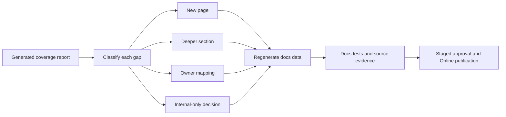

# Documentation Gap Backlog

This backlog turns the source-backed coverage audit into executable
documentation work. It captures the remaining categories that must be closed so
Nodics documentation explains not only what the product is, but how developers,
business users, operators, QA owners, and AI tools can safely work with the
framework.

For beginners, the mental model is simple: the coverage report tells us where
the source is richer than the documentation, and this backlog tells us what to
do next. A source boundary may need a new page, a deeper section in an existing
page, an explicit owner mapping, or an internal-only decision. The backlog is
not a marketing roadmap. It is a release-quality checklist for source-backed
documentation.

## Backlog flow



## Classification policy

| Classification | Meaning | Required action |
| --- | --- | --- |
| `needs-page` | A user-visible or developer-extensible capability has no clear page. | Create authored Markdown, catalogue metadata, source evidence, generated records, and validation. |
| `needs-deeper-section` | A page exists, but it lacks exact source map, data, service, operation, or validation detail. | Extend the existing page with how-to, how-it-works, customization, errors, and tests. |
| `needs-page-or-owner-mapping` | The source is significant, but ownership may belong under a broader page. | Decide owner, then either create a page or add explicit mapping to the owning page. |
| `internal-only-candidate` | The module is likely a utility or provider implementation. | Document the owner page that covers it, or mark it internal with justification. |
| `covered` | Existing docs and source evidence are sufficient for the current maturity state. | Keep validation and browser evidence current when behavior changes. |

## P0 closure items

| Item | Source areas | Documentation outcome |
| --- | --- | --- |
| Nexus data and content guide | `nodics.kickoff/modules/nexus.web` | Explain Nexus project content, media assets, headers, records, publication, Online delivery, and browser validation. |
| Axis setup and user-safe error contracts | `nodics.platform/modules/backoffice`, `nodics.platform/modules/axis`, `nodics.exp/nodics.axis` | Explain setup states, blockers, retry behavior, required capability checks, technical evidence, and customer-safe messages. |
| CMS exact source map | `nodics.wcms/modules/cms` | Split page, route, component, slot, template, renderer, publication manifest, migration, delivery cache, and documentation governance details. |
| Media operations runbook | `nodics.wcms/modules/media`, `nodics.foundation/modules/nData/nImport/import/src/service/media` | Explain upload, import hydration, storage providers, cleanup, replication queue, delivery failures, and DR evidence. |
| Import/export provider guides | `nodics.foundation/modules/nData/nImport`, `nodics.foundation/modules/nData/nExport` | Explain JavaScript, JSON, CSV, Excel, generated exports, parsers, field allow-lists, masking, and rollback boundaries. |
| Commerce authoring and fulfillment | `nodics.commerce/modules/baseCommerce`, `nodics.commerce/modules/fulfillment` | Explain product, price, inventory, search projection, fulfillment execution, consignments, exceptions, return receipts, and browser proof. |
| Documentation publishing runbook | `nodics.docs`, `nodics.wcms/modules/cms`, `nodics.process/modules/nPublish` | Explain Markdown source, generated content-pack data, Staged import, review, Online activation, rollback, and Axis/Nexus rendering. |

## P1 closure items

| Item | Source areas | Documentation outcome |
| --- | --- | --- |
| Module Registry journey | `nodics.platform/modules/backoffice`, registry-related Platform services | Explain registration, activation, dependency state, required capability checks, and Axis visibility. |
| Commerce Search guide | `nodics.commerce/modules/baseCommerce/modules/commerceSearch` | Explain ranking rules, projections, publish flow, index ownership, storefront effect, and recovery. |
| Localization depth | `nodics.localization/modules/localizationCore`, `nodics.localization/modules/localizationApi` | Explain locale records, fallback, content/product localization, import data, API boundaries, and browser proof. |
| Payment Core and provider split | `nodics.commerce/modules/payment` | Explain payment decisions, method/provider separation, reconciliation, safe customer payload, and provider extension. |
| Customer List and Profile-Commerce boundary | `nodics.commerce/modules/checkout/modules/customerList`, `nodics.platform/modules/profile` | Explain why customer list exists in Commerce and what Profile continues to own. |
| NMS runtime monitoring | `nodics.foundation/modules/nNms` | Explain node monitoring, topology, health, operational evidence, and recovery actions. |
| Service runtime and overrides | `nodics.foundation/modules/nService`, `nodics.foundation/modules/nService/vService` | Explain service discovery, virtual services, generated services, override precedence, and extension safety. |
| Cache provider runbooks | `nodics.foundation/modules/nCache`, Redis, Hazelcast, Node cache | Explain provider boundaries, cache key strategy, invalidation, failure behavior, and production configuration. |
| Database provider boundaries | `nodics.foundation/modules/nDatabase` | Explain MongoDB, virtual DB, Cassandra, Elasticsearch, provider contracts, configuration, and validation. |
| OTP and security flow | `nodics.foundation/modules/nOtp` | Explain OTP generation, verification, expiry, retry, throttling, audit, and security controls. |
| Communication providers | `nodics.communication/modules/smtpCommsProvider`, `nodics.communication/modules/smsCommsProvider` | Explain SMTP/SMS provider behavior, templates, retries, failed delivery evidence, and extension rules. |
| Engagement and contact submission | `nodics.engagement/modules/contactSubmission` | Explain contact forms, moderation, workflow, notification, audit, and recovery. |
| Workflow and BPM source map | `nodics.foundation/modules/nbpm`, `nodics.process` | Explain workflow definitions, transitions, tasks, callbacks, history, and operator visibility. |
| Cron job data authoring | `nodics.process/modules/cronjob` | Explain job records, schedules, execution policy, retry, idempotency, and Process server ownership. |
| Release and upgrade compatibility | `nodics.foundation/modules/nSetup`, all module data folders | Explain version freeze, upgrade path, rollback, checksum drift, generated manifests, and extension compatibility. |

## P2 closure items

| Item | Source areas | Documentation outcome |
| --- | --- | --- |
| Fresh-schema setup per runtime | Platform, WCMS Staged, WCMS Online, Process, Commerce, Engagement | Add runtime-specific import order, seed data, publication, and acceptance evidence where existing quick-start docs are too broad. |
| Environment, server, and node discovery | `nodics.kickoff/envs`, framework server/node configuration | Explain how physical hierarchy, environment config, server composition, and runtime roles are discovered. |
| Permission and access matrix | Profile, BackOffice, WCMS, documentation access policies | Explain roles, groups, permissions, access modes, public/authenticated/restricted behavior, and publication visibility. |
| Search indexing operations | Discovery and Commerce Search modules | Explain index jobs, reindex, projection freshness, failure recovery, and ownership. |
| Migration and import reconciliation | Import, migration, CMS migration, Commerce data | Explain source classification, mapping tables, partial failures, retry, and data correction. |
| Export and data privacy | Export providers, media-owned generated files | Explain allow-lists, masking, retention, download permissions, and audit. |
| Observability | NMS, import runs, publication receipts, logs, dashboards | Explain correlation IDs, status evidence, health checks, support cards, and escalation. |
| Disaster recovery | Media publication, Online storage, replication queue | Explain Online media replication, DR queues, recovery receipts, and failure escalation. |
| Frontend consumption contracts | Axis, Nexus, Agora | Explain that Axis consumes BackOffice metadata, Nexus consumes Online WCMS, and Agora consumes Online commerce/content. |
| Data quality rules | All module data folders | Explain required fields, stable keys, idempotent queries, relation integrity, and no runtime logic in data files. |
| Testing standards | All modules and frontends | Explain unit, contract, generator, fresh-schema, publication, browser, accessibility, and regression expectations. |
| Troubleshooting matrices | Every operational capability page | Add what failed, who owns it, user-safe message, technical evidence, and recovery action. |
| Decision-maker overview pages | Product and capability overview docs | Explain business value, ownership model, platform differentiation, risk controls, and implementation confidence. |
| Internal-only register | Low-score utility modules | Decide and document which technical modules do not need public pages and where they are covered. |

## Closure workflow

1. Start from the generated source coverage report.
2. Pick the highest-priority open item.
3. Inspect source files, schemas, services, routers, data, assets, tests, and
   frontend consumers.
4. Decide whether the work is a new page, deeper section, owner mapping, or
   internal-only classification.
5. Update authored Markdown and catalogue metadata.
6. Regenerate documentation data and source coverage reports.
7. Run docs tests and any owning module tests needed for the behavior.
8. For runtime-visible changes, import into Staged, publish Online, and verify
   Axis, Nexus, or Agora from the browser.
9. Commit the smallest coherent documentation batch.

## Common mistakes

- Treating this backlog as optional once a high-level overview exists.
- Closing a source gap without reading the current source files and tests.
- Creating public documentation for a module that should be an internal utility
  without explaining the broader owner.
- Forgetting business users when writing deep developer detail.
- Forgetting developers when writing a business-friendly page.
- Forgetting operators and QA owners when documenting publishable or
  production-visible behavior.
- Showing external references as source design instead of industry-standard
  expectation checks.

## Verification

Run the documentation gates after each closure batch:

```bash
npm --prefix nodics.docs run audit:source-coverage
npm --prefix nodics.docs run docs:generate
npm --prefix nodics.docs test
git -C nodics.ai diff --check
```

The backlog is healthy when the generated report, this page, catalogue
metadata, generated WCMS records, and runtime evidence agree. Business users
should see clear journeys, developers should see exact source paths and
extension points, operators should see evidence and recovery steps, QA owners
should see validation commands, and AI tools should see boundaries that prevent
unsafe source or data changes.
