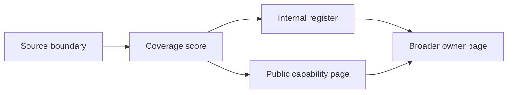

# Internal Source Boundary Register

The internal source boundary register classifies low-score technical modules
that are implementation details of broader product capabilities. A module can
be real and important without needing its own business-facing documentation
page. For beginners, this page says where those modules are explained and why
they are not presented as standalone product journeys.

## Business problem

The business problem is clarity. Too many public pages for tiny adapters make
the product harder to understand, while hiding implementation modules makes
developers and operators lose traceability. This register balances both needs:
business users see the owning capability, developers see exact source paths,
operators know the production owner, and QA owners know which tests should
cover the implementation detail.

## Classification flow

## Register

| Internal source boundary | Covered by owner page |
| --- | --- |
| `../nodics.discovery/modules/discoveryMapping/` | `discovery.search-indexing` |
| `../nodics.discovery/modules/discoveryQuery/` | `discovery.search-indexing` |
| `../nodics.discovery/modules/discoveryRuntime/` | `discovery.search-indexing` |
| `../nodics.commerce/modules/payment/modules/paymentMethods/` | `commerce.payment-provider-boundaries` |
| `../nodics.commerce/modules/payment/modules/paymentMethods/modules/bankTransferPayment/` | `commerce.payment-provider-boundaries` |
| `../nodics.commerce/modules/payment/modules/paymentMethods/modules/cardPayment/` | `commerce.payment-provider-boundaries` |
| `../nodics.commerce/modules/payment/modules/paymentMethods/modules/cashOnDeliveryPayment/` | `commerce.payment-provider-boundaries` |
| `../nodics.commerce/modules/payment/modules/paymentMethods/modules/walletPayment/` | `commerce.payment-provider-boundaries` |
| `../nodics.commerce/modules/payment/modules/paymentProviders/modules/paymentProviderCore/` | `commerce.payment-provider-boundaries` |
| `../nodics.commerce/modules/payment/modules/paymentProviders/modules/stripeProvider/` | `commerce.payment-provider-boundaries` |
| `../nodics.commerce/modules/payment/modules/paymentProviders/modules/cyberSourceProvider/` | `commerce.payment-provider-boundaries` |
| `../nodics.commerce/modules/payment/modules/paymentProviders/modules/paypalProvider/` | `commerce.payment-provider-boundaries` |
| `../nodics.commerce/modules/payment/modules/paymentProviders/modules/visaProvider/` | `commerce.payment-provider-boundaries` |
| `../../nodics.kickoff/envs/kickoffDockerLocal/` | `framework.local-quick-start` |
| `../../nodics.kickoff/envs/kickoffDockerLocal/commerceServer/` | `framework.local-quick-start` |
| `../../nodics.kickoff/envs/kickoffDockerLocal/commerceStagedServer/` | `framework.local-quick-start` |
| `../../nodics.kickoff/envs/kickoffDockerLocal/wcmsOnlineServer/` | `framework.local-quick-start` |
| `../../nodics.kickoff/envs/kickoffDockerLocal/wcmsStagedServer/` | `framework.local-quick-start` |
| `../../nodics.kickoff/envs/kickoffLocal/commerceServer/` | `framework.local-quick-start` |
| `../../nodics.kickoff/envs/kickoffLocal/commerceStagedServer/` | `framework.local-quick-start` |
| `../../nodics.kickoff/envs/kickoffLocal/wcmsOnlineServer/` | `framework.local-quick-start` |
| `../../nodics.kickoff/envs/kickoffLocal/wcmsStagedServer/` | `framework.local-quick-start` |
| `../../nodics.kickoff/modules/kickoffApi/` | `applications.nexus-data-content-guide` |
| `../../nodics.kickoff/modules/kickoffCore/` | `applications.suite` |
| `../../nodics.kickoff/modules/kickoffInt/` | `applications.suite` |

## Classification contract

An internal-only boundary must have a broader owner page, a reason it is not a
standalone user journey, and enough source evidence for developers and AI
tools to find it. The owner page carries business explanation, customization
guidance, operator recovery, and production verification. The internal module
keeps implementation-specific README, AGENTS, tests, and generated context.

## Customization and extension guidance

Developers can promote an internal boundary to a public page when it gains
business workflow, configuration, operator runbook, or external integration
importance. Until then, keep extension guidance under the owner capability.
Business users should not see provider fragments as separate products.
Operators should still see enough diagnostics to recover production behavior.

## Promotion rules

Promote an internal boundary when it introduces a business workflow, tenant
configuration, public API, customer-visible state, operator recovery path, or
partner integration. Keep it internal when it is only a provider adapter,
environment package, generated runtime helper, or query implementation covered
by a parent capability. The owner page must carry the business explanation;
this register carries the traceability decision.

## Common mistakes

- Creating public pages for every small provider and making navigation noisy.
- Hiding internal modules without owner mapping.
- Treating score alone as documentation priority.
- Forgetting tests because a module is internal.
- Letting an internal module own business authority.

## Verification

Run the source coverage audit and confirm internal-only candidates have an
owner page or this register entry. Then run documentation validation and
hardening. Production readiness requires business-friendly navigation,
developer source traceability, operator ownership, QA tests, and AI-tool
guardrails for every internal implementation detail.
