# Source-Backed Documentation Coverage Audit

This audit is the working contract for revisiting the whole Nodics codebase and
finding functionality that is missing from documentation. It is intentionally
source-backed: code, schemas, services, controllers, routes, data releases,
assets, tests, and frontend journeys are treated as evidence that documentation
may need to exist or be deepened.

The current documentation set already explains many architecture principles.
The next maturity step is coverage depth. A developer should be able to create
or customize data, services, providers, APIs, pages, media, product catalog,
pricing, inventory, workflow, search, localization, import/export, or
publication behavior by following the docs and tracing the referenced source.
A business user or decision maker should be able to understand what the
capability does, who owns it, whether it is ready, and what risk is governed.

For beginners, the mental model is simple: source files are evidence, docs are
the map, and generated documentation data is the published route into Axis,
Nexus, and the web. Developers use the map to customize safely. Operators use
it to verify runtime behavior. Business users use it to decide whether a
capability is ready for adoption.

## Audit method

```mermaid
flowchart LR
  Source["Repository inventory"] --> Signals["Schemas, services, routes, data, assets, tests"]
  Signals --> Docs["Published documentation catalogue"]
  Docs --> Coverage["Coverage matrix"]
  Coverage --> Backlog["Missing or shallow topics"]
  Backlog --> Improve["Source-backed page updates"]
  Improve --> Generate["Generated documentation data"]
  Generate --> Publish["Staged to Online publication"]
```



The audit compares implementation signals against documented topics:

| Signal | Why it matters |
| --- | --- |
| `src/schemas/schemas.js` | A persisted or generated model usually needs business meaning, field behavior, ownership, security, import/export, and validation docs. |
| `src/service/*.js` | Service behavior often defines customization, provider boundaries, publication, policy, error handling, and runtime evidence. |
| `src/controller` and `src/router` | Routes need user journey, authorization, request/response, error, and observability documentation. |
| `data/<release>/headers` and `records` | Release data needs authoring, import, lifecycle, idempotency, and rollback documentation. |
| `assets/` and media manifests | Physical media requires file, metadata, staging, publication, replication, and browser validation docs. |
| `test/` | Tests reveal implemented behavior that should be documented before the topic is called operational. |
| Frontend apps | Axis, Nexus, and Agora journeys need backend source ownership, permission, state, and browser behavior docs. |

The inventory is repeatable through the generated source coverage report:

```bash
npm --prefix nodics.docs run audit:source-coverage
npm --prefix nodics.docs run audit:source-coverage:check
```

The report is generated at
`nodics.docs/docs/reports/source-backed-documentation-coverage-report.md` with
a JSON companion file for automated review. Developers may still use `rg` and
`find` during investigation, but the report is the durable evidence committed
with documentation work.

This is a triage method, not a blind rule. A utility module may be covered by a
broader capability page. A business topic may be implemented by several
technical modules. The audit still requires each implementation signal to trace
to a clear documentation owner.

## Coverage standard

Every mature topic should include:

| Required section | Reader it helps |
| --- | --- |
| Business problem and outcome | Business user, decision maker, product owner |
| Beginner mental model | New developer, business evaluator, AI tool |
| Source map | Developer, architect, support engineer |
| How to do it | Developer, administrator, implementation partner |
| How it works | Architect, operator, QA owner |
| Data and configuration contracts | Developer, operator, AI tool |
| API, service, event, and publication flow | Developer, integrator, operator |
| Customization and extension points | Developer, partner, customer project owner |
| Visual flow or screenshot guidance | Everyone |
| Common mistakes and failure modes | Developer, operator, support |
| Validation commands and acceptance proof | QA owner, release owner, operator |
| Official external references when useful | Architect, decision maker, implementation partner |

## Audience levels

Each page must deliberately serve more than one reader. It is acceptable for a
page to go deeper for developers, but it should never become source-code notes
only.

| Audience level | Required answer |
| --- | --- |
| Business overview | What decision, journey, value, cost reduction, risk reduction, or operating improvement the capability supports. |
| Developer how-to | Which files to edit, which contracts to respect, and how to test the change locally. |
| Operator runbook | Which server role, runtime state, logs, health checks, retries, rollbacks, and production evidence matter. |
| QA validation | Which unit, contract, generated-data, fresh-schema, publication, and browser checks prove the behavior. |
| AI-tool guidance | What can be safely generated or refactored, what must remain backend-owned, and what evidence must be preserved. |

## Ownership checklist

Every page must identify source ownership before it explains customization.
That keeps Axis, Nexus, Agora, customer projects, and backend modules from
becoming parallel authorities.

| Ownership layer | Documentation must state |
| --- | --- |
| Business capability | The human-facing capability name and business journey. |
| Functional module | The owning Nodics capability or project module. |
| Technical module | The package or nested module where implementation lives. |
| Schema and service | The data model and service behavior that own validation and persistence. |
| Route and controller | The API surface and permission boundary, if user or system calls exist. |
| Data and assets | Release folders, headers, records, manifests, physical assets, and generated files. |
| Frontend consumer | Axis, Nexus, Agora, or another application that renders approved backend data. |
| Tests and reports | Contract tests, generated reports, and runtime acceptance commands. |

## Creation and publication lanes

Every data-bearing topic must show both creation lanes. Module release data is
authored by developers or AI tools under the owning module or project `data/`
folder. Business-created data is authored through Axis or another governed
BackOffice journey. Both lanes must converge on the same backend schemas,
validators, permission policies, workflows, publication lifecycle, and audit
evidence.

Publishable data must always explain Staged, approval, and Online activation.
Documentation data, CMS pages, media, product content, and storefront-visible
records should not be described as direct Online writes. Operational data such
as cron schedules, runtime configuration, and internal evidence may have a
different lifecycle, but the page must say that clearly.

## Media and asset rule

Media-bearing topics must separate four things:

| Media layer | Meaning |
| --- | --- |
| Physical asset | Source file under a release-owned `assets/` folder. |
| Media object | Backend schema record that represents stored media metadata and provider-owned storage fields. |
| Media reference | Relationship from a business object, page, component, product, or article to the media code. |
| Publication transfer | Staged-to-Online copy, checksum validation, placement evidence, and replication obligation. |

Release data may reference physical files, but it must not author provider
paths, Online URLs, storage keys, or replication behavior. Those remain importer
and media-runtime responsibilities.

## Error message standard

Backend logs may carry technical error codes and internal detail. Axis, Nexus,
and Agora should show business-safe messages that explain the user state and
the next action without leaking internals. A documentation page that covers a
runtime-visible journey must document:

| Error concern | Required detail |
| --- | --- |
| User-safe message | What the user should see in Axis, Nexus, or Agora. |
| Technical evidence | Error code, correlation id, logs, import run, workflow task, or publication receipt for support. |
| Recoverability | Retry, repair data, register capability, approve publication, restart service, or escalate. |
| Ownership | Which backend module or project data release must be fixed. |

## Fresh schema and browser proof

For major user-visible capabilities, documentation is not complete until the
page explains fresh-schema verification and browser verification. Fresh-schema
checks prove installation, import order, generated manifests, required
capabilities, and publication readiness. Browser checks prove the actual Axis,
Nexus, or Agora journey that users experience.

| Proof type | Examples |
| --- | --- |
| Fresh schema | Initialize the runtime, import `init-v001`, `core-v001`, and selected `sample-v001` sections, confirm idempotency, and check data counts. |
| Publication | Approve and publish Staged records to Online through `nPublish`; verify Online records and media coordinates. |
| Browser | Open Axis setup, Module Registry, Documentation, Nexus public pages, and Agora product journeys with real backend data. |
| Regression | Run package tests, generated documentation checks, source coverage report checks, and runtime acceptance scripts. |

## First inventory snapshot

A generated source coverage scan of current framework and reference project
roots found 172 module or package boundaries and 94 published documentation
pages. The committed report currently identifies 22 source boundaries that
need a page or explicit owner mapping, 6 high-surface boundaries that need
deeper documentation sections, 28 internal-only candidates, and 116 covered
boundaries. This does not mean exactly 22 new pages are required; it means
those areas need owner confirmation and documentation mapping.

| Priority | Area | Why it is important | Documentation action |
| --- | --- | --- | --- |
| P0 | Agora Apparel, Electronics, and Telco data packs | Large `sample-v001` data and media assets exist, but the accelerator page is broad. | Add domain authoring guides for product, content, media, search, publication, and browser validation. |
| P0 | CMS module | Many schemas, services, controllers, routes, data files, and tests implement authoring, delivery, publication, and documentation governance. | Split exact CMS authoring, delivery, publication manifest, and migration coverage where broader WCMS pages are shallow. |
| P0 | Import/export providers | `jsImport`, `jsonImport`, `csvImport`, `excelImport`, and export variants are implementation surfaces under the import/export capability. | Add provider-specific how-to and customization sections under Data Import, Export, and Migration. |
| P0 | Commerce product, price, inventory, fulfillment | The business journey depends on several modules and data files. | Add source-backed create/update/publish guides and relation maps. |
| P0 | Axis setup and registry error states | Manual testing exposed customer-visible setup failures and message quality concerns. | Document status states, required capabilities, retry paths, and user-safe error contracts. |
| P1 | `nController` | Large controller infrastructure surface with little direct documentation signal. | Map it into Routing and API Governance or create a controller runtime page. |
| P1 | `nbpm` and workflow foundations | Process behavior is broad and business-critical. | Connect workflow docs to BPM schemas, services, and tests. |
| P1 | `nTest` | Test scaffolding is important for developers and AI tools. | Add a developer testing harness guide. |
| P1 | Localization Core and API | Localization has schemas, services, data, and public behavior. | Deepen localization docs with source map, data imports, fallback, and customization. |
| P1 | Discovery configuration and Commerce Search | Search ranking and discovery rules affect customer journeys. | Add exact rule authoring, publication, and projection docs. |
| P1 | Communication and Engagement details | Provider and operational modules exist beyond high-level overview. | Add provider, event, retry, template, and moderation detail. |

## Documentation backlog workflow

1. Inventory the implementation surface with `rg --files`, module package
   metadata, schema files, service files, controllers, routers, data folders,
   assets, and tests.
2. Map each signal to an existing documentation page.
3. Mark the page as covered, shallow, missing, or intentionally internal.
4. For shallow pages, add source map, how-to, how-it-works, customization, and
   validation sections.
5. For missing business topics, add a new page and catalogue metadata.
6. Regenerate documentation content-pack data.
7. Validate the generated records and run the docs tests.
8. Import the generated content through Staged and publish Online when runtime
   evidence is required.

## External reference policy

Official external references help readers understand industry-standard
expectations for terms, data movement, administration, auditability, and
operator evidence. They do not define Nodics behavior, architecture, code, data
shape, or product direction. Nodics must never be presented as a copy,
derivative, or reimplementation of another framework.

Use vendor docs only to calibrate standards and reader expectations: what an
enterprise buyer expects from import/export, how administrators usually reason
about product data, what operators expect from repeatable migrations, and what
quality bar public documentation should meet. Every page must still identify
the Nodics owner, source files, runtime contract, and validation evidence.

Good reference examples:

- [SAP Commerce importing data](https://help.sap.com/docs/SAP_COMMERCE/d0224eca81e249cb821f2cdf45a82ace/c4f121fb358e46069fc01acf8c5c254b.html)
- [Shopify product CSV import/export](https://help.shopify.com/en/manual/products/import-export/using-csv)
- [Salesforce B2C Commerce import and export](https://help.salesforce.com/s/articleView?id=cc.b2c_import_and_export.htm&type=5)
- [Contentful import and export with CLI](https://www.contentful.com/developers/docs/tutorials/cli/import-and-export/)
- [Contentful migration scripts](https://www.contentful.com/developers/docs/tutorials/cli/scripting-migrations/)

## Common mistakes

- Counting a page as complete because the business idea is described but no
  source files, tests, data, or services are mapped.
- Creating one page per technical module when a broader capability topic would
  be clearer for business users.
- Hiding an implemented route, schema, or service because it is "internal" but
  still developer-extensible or operator-visible.
- Linking to vendor references as if they define Nodics behavior or design.
- Updating generated documentation data without changing the authored Markdown
  and catalogue metadata.
- Forgetting Axis, Nexus, or Agora browser evidence for a capability that is
  visible to users.

## Troubleshooting

| Symptom | Likely cause | Action |
| --- | --- | --- |
| A source file has no matching page | The capability is missing documentation or is covered under an unclear title. | Map it to an owner page or add a new catalogue entry. |
| A page exists but developers still ask where to customize | The page is shallow. | Add source map, services, data files, extension points, and validation commands. |
| Docs say a feature is operational but tests show partial behavior | Maturity state is inaccurate. | Downgrade maturity or add the missing implementation and evidence. |
| Axis renders a confusing error | Error contract is not documented or the backend emits technical text. | Document the user-safe status and fix the backend or Axis mapping. |
| Generated records are stale | Authored docs changed without regeneration. | Run the docs generator and validator before import. |

## Acceptance rule

The documentation program is complete only when every implemented user-visible
or developer-extensible capability has either a source-backed page or a clear
entry in this audit explaining why it is internal. Each accepted page must be
generated into documentation data, imported through the governed data process,
and published through Staged-to-Online when it is intended for Axis, Nexus, or
public web consumption.

## Verification

Run documentation verification after each audit improvement:

```bash
npm --prefix nodics.docs run docs:generate
npm --prefix nodics.docs test
git -C nodics.ai diff --check
```

For runtime-visible topics, also run the owning module tests, fresh-schema
import checks, publication checks, and browser qualification for Axis, Nexus,
or Agora. A topic is accepted only when the authored page, generated CMS data,
source evidence, and runtime behavior agree.
