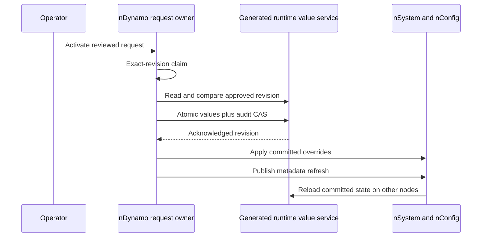
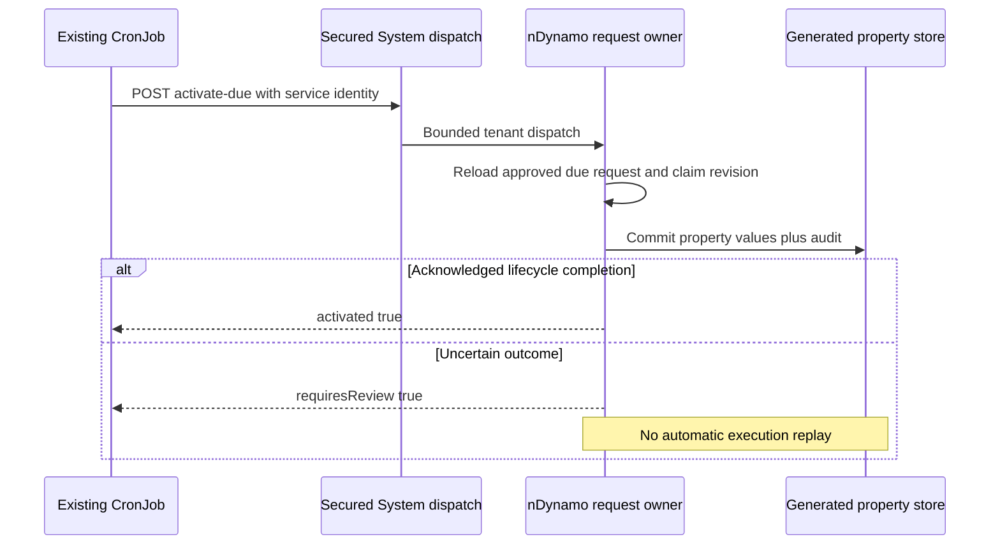

# Durable Property Activation

## Consumer Review And History

Consumers may submit `expectedPreviewDigest`, computed with the activation owner's
canonical digest of the current preview. The owner rebuilds the preview and
rejects a mismatch before saving the request. This does not replace independent
approval, revision-safe activation or schedule checks.

`requestEnterpriseCode` is recorded from trusted `authData` when present, never
from the property payload. It describes request origin, not the effect scope:
tenant-runtime changes can affect other enterprises. Consumers may filter their
history by this origin and must recheck returned records before projection.
Legacy unbound requests are not implicitly assigned to the current enterprise.
Generated history reads retain original authentication and require acknowledged
success; a storage failure is not an empty history page.

## Public Metadata Literals

Sensitive-key scanning remains mandatory for proposals and audit snapshots.
An owning module may declare deployment-controlled
`runtimePropertyGovernance.publicMetadataLiterals` for public constants whose
field names would otherwise match a sensitive-key pattern. Each entry has an
exact dotted `path` and a small `values` list of primitive literals. A `*` path
segment matches only a numeric array index, never arbitrary keys. At most 50
declarations and 10 values per declaration are allowed; invalid declarations
fail. The Knowledge owner uses this only for array-source `secretScanPolicy`
equal to `REQUIRED`. Other values, credential keys and similarly named paths
remain rejected. Governance declarations are not runtime-editable property data.

## Ownership and Scope

nDynamo owns approved intent, exact-revision persistence and its embedded change
audit. nSystem delegates application and metadata-event refresh. nConfig remains
the effective layered-property authority. No Copilot-owned configuration store,
raw database client, alternate scheduler or customer-module implementation exists.

This is an opt-in backend dependency for administration. It supports reviewed
path removal, compensating rollback, bounded scheduled dispatch and evidence-only
recovery. It does **not** complete enterprise delegation or the Axis policy editor.
Existing legacy in-memory behavior remains when opt-in is false.
The scalar/encrypted `runtimeConfiguration` schema workflow remains separate.

## Deployment Prerequisites

1. Deploy matching nDynamo and nSystem source together. Preserve runtime property
   approval permissions; enabling storage does not grant configuration authority.
2. Before schema/index activation, inspect and back up the existing private
   `runtimeConfigurationValue` and `configurationActivationRequest` collections
   through the database owner's governed maintenance workflow. The runtime-value
   unique `code` index is partial: it applies only to `ownerModule: dynamo` and
   `schemaCode: tenantProperties`, preserving existing scalar-record behavior.
   The activation-request code index remains unique. Existing duplicate governed
   codes must be reviewed, not deleted or silently selected as current.
3. Both private schemas retain their default control-plane tenant restriction.
   A deployment enabling durable properties for additional active tenants must
   explicitly compose their existing schema definitions for those tenants through
   the supported schema layering/lifecycle. Provision their generated models and
   indexes before enabling persistence. This feature never broadens tenant scope
   automatically and has no cross-tenant storage fallback.
4. Confirm generated `get`, insert `save` and exact-revision `update` return the
   standard success envelopes and matched-count acknowledgements. A simulated
   service is not evidence of a qualified deployed adapter.
5. Set deployment configuration, outside governed property proposals:

```javascript
runtimePropertyGovernance: {
    persistence: {
        enabled: true,
        maximumChanges: 1000,
        maximumBytes: 1048576
    }
}
```

6. Restart the isolated acceptance runtime. nSystem post-initialization restores
   committed values for active tenants. An enabled but missing, malformed or
   unreadable store rejects restoration. Confirm startup failure is surfaced by
   the hosting lifecycle before admitting production traffic.
7. Qualify all participating runtime nodes and tenant activation paths. Module
   post-initialization is covered locally; live later tenant activation and
   rolling multi-node readiness still need operational acceptance.

The default remains disabled. This change does not migrate data, create live
permissions, restart services, or enable any deployment automatically.

## Operator Journey

1. Create a property preview through the existing runtime configuration API.
   Storage is refreshed first. The preview captures both current effective
   values and the committed persistence revision.
2. Create and review an activation request through the existing nDynamo workflow.
   The request retains the configuration digest and preview. Approval never
   substitutes for execution permission or an authenticated actor.
3. Activate the approved request using the existing nSystem activation command.
   nDynamo first claims its exact lifecycle revision as ACTIVATING.
4. Durable application requires that persisted claim. A changed stored revision
   or changed effective preview refuses the update; create a newly reviewed
   request rather than force an old preview.
5. Values and the actor/approval/request/snapshot audit entry are persisted in one
   insert or compare-and-set update. No database transaction spanning separate
   audit and value records is assumed.
6. Only an acknowledged commit applies locally. Inspect `durable`, `revision`
   and `propagation` in the owner result. `PUBLISHED` means a successful publisher
   response, **not** that every node applied the value. `PENDING` preserves the
   durable commit and requires operational refresh/recovery.
7. Other nodes reload authoritative storage on the existing metadata-only
   `runtimeConfigurationChanged` event. Event payloads never supply executable
   configuration. Startup also reloads the committed record.



## Merge, Exclusion and Secret Rules

Object patches merge at changed paths. Arrays replace completely: a shorter
selection drops the old tail and `[]` selects none. This is also honored by the
legacy approved-property application path. The preview owner translates literal
arrays into nConfig's existing explicit replacement declarations and delegates
merging to `DefaultConfigurationBindingService`; it does not add a configuration
loader or alter ordinary authored-array compatibility. User-supplied `$config`
bindings are rejected by runtime proposal validation. Unrelated settings remain.
Replacing a scalar/subtree preserves replacement intent across subsequent edits
and restarts, so removed descendants do not silently reappear from defaults.

Only bounded JSON values enter property governance. Nested arrays are inspected
for secret-bearing and prototype-mutating keys. Cycles, excessive depth, unsafe
dotted/bracket keys and non-JSON values are rejected before persistence. The
existing sensitive path policy remains restrictive; it can reject token-named
fields even when numeric. Do not weaken that policy to enable a budget editor.
Budget configuration needs its owner-specific validated administration contract.
Resolved credentials must use the existing encrypted/secret-reference owner.

Governed proposals cannot change `runtimePropertyGovernance` itself. Audit and
record size are bounded. Capacity exhaustion refuses a new change; this feature
does not silently prune evidence or claim an implemented archival workflow.

## Failure and Recovery

| Observation | Meaning | Operator action |
| --- | --- | --- |
| Stale preview | Effective or committed state changed | Refresh and create a new reviewed request |
| Lost write acknowledgement | Commit may have happened | Do not replay; inspect request claim and authoritative value revision |
| ACTIVATING remains | Owner or final acknowledgement was uncertain | Investigate request/value evidence; do not reset the claim automatically |
| PENDING propagation | Commit is durable, publication unconfirmed | Restore/refresh participating nodes from storage and verify their state |
| Missing previously read state | Storage deletion or wrong namespace | Fail closed and repair the owner store through governed operations |
| Audit capacity exceeded | Retained record reached configured bound | Review an archival/migration plan outside this feature |

Direct snapshot rollback remains rejected when durable mode is enabled: it would
change only memory and lose authority on restart. Use the reviewed commands below.

## Remove Settings and Roll Back a Change

These operations require the existing request-create, approve and activate
permissions at their respective secured nSystem endpoints. Runtime configuration
permission is control-plane authority, not enterprise-delegated Copilot authority.
Do not grant it broadly just to make a budget or knowledge editor available.

1. Read the existing activation request and review its recorded impact. Obtain
   the committed property revision from its activation result or governed owner
   evidence. Never guess a revision or accept a browser-supplied old snapshot.
2. For removal, submit a normal property activation request with this versioned
   `configuration` shape (example paths are inert framework test settings):

```json
{
  "configurationType": "propertyConfiguration",
  "configurationCode": "tenantProperties",
  "reason": "Remove obsolete optional settings",
  "configuration": {
    "$propertyPatch": {
      "version": 1,
      "values": [],
      "missingPaths": ["optionalFeature.legacySetting"]
    }
  }
}
```

3. `values` contains exact `{ "path": "...", "value": ... }` assignments, not
   recursive merges. `missingPaths` deletes effective keys. Paths cannot overlap,
   repeat, access prototypes, address array elements, select secrets or change
   governance controls. Replace whole arrays. Maximum 1,000 path operations.
4. Inspect the generated before/after preview. Removal stores a durable absence
   marker, so a lower-layer default cannot resurrect the key on restart. It is
   **not** an instruction to remove an override and inherit a default. To restore
   a desired default explicitly, review that value as a separate change.
5. To reverse a committed revision instead, create a request with
   `configurationType: "propertyConfiguration"`, a reason and
   `rollbackRevision: "<64-character committed revision>"`, omitting configuration.
   nDynamo resolves the inverse from its tenant-bound audit. Newly introduced keys
   become removals; prior values become exact assignments.
6. Review and approve this new request normally. Preparation makes no write to
   effective properties. Activation uses the same claim, digest and CAS checks.
7. If an affected path changed since the target revision, rollback is rejected.
   Unrelated changes may be preserved, but the preview itself must still match
   the current committed revision at activation. Re-review stale proposals.

Removing or replacing a subtree containing a secret is rejected before its old
value could enter preview/audit. Use the existing credential owner, not a property
rollback, for credential lifecycle. Both deletion and compensating rollback require
durable mode; legacy in-memory property patches do not accept path commands.

## Schedule Approved Activation

CronJob remains the only scheduler. `notBefore` specifies the earliest eligible
instant, not an exact delivery-time guarantee. Dispatch delay includes schedule
cadence, downtime, queue backlog and owner execution time.

1. Complete persistence/schema prerequisites above. Deploy both nDynamo and nSystem
   changes and activate the source-defined due-request compound index through
   the existing schema/index lifecycle. Do not alter records through a raw driver.
2. Enable `runtimePropertyGovernance.scheduledActivation` in deployment properties:
   `{ enabled: true, maximumBatch: 25 }`. The default is disabled. Batch size is
   validated from 1 through 100; this limits a single invocation, not total queue size.
3. Through the existing CronJob administration API, create an inactive job on an
   explicitly selected runtime node. Choose an appropriate schedule, for example
   `trigger.expression: "0 * * * * *"` for once per minute. Set `runOnInit: false`.
4. Use an existing authenticated internal target, without stored human credentials:

```javascript
jobDetail: {
    internal: {
        module: 'system',
        method: 'POST',
        uri: '/config/runtime/request/activate-due',
        body: {},
        timeoutMs: 30000
    }
}
```

5. Select the exact owning System runtime through CronJob's existing connection
   metadata where multiple runtimes are registered. Provision the service identity
   through the canonical identity owner with `runtime.config.request.activate`,
   the route access group and permitted runtime-configuration exposure. Job
   lifecycle management alone never grants target activation permission.
6. Test one manual job run while the queue is empty; then activate its schedule.
   Create and approve a property request with a canonical UTC `notBefore` instant.
   The standard request creation, approval and actor audit remain mandatory.
7. Inspect CronJob outcome and the request lifecycle after its due time. A dispatch
   returns `checkedAt`, trusted tenant, bounded per-request `activated` results,
   and `limited`. A failed entry has `requiresReview: true`, never raw diagnostics
   or configuration content. The outer successful response means the dispatch was
   performed; inspect individual results for activation failures.
8. Pause the CronJob to stop automatic dispatch. This does not cancel approved
   requests or prevent a separately authorized explicit activation.

Only active, approved, due property requests are selected. Unscheduled changes,
other configuration types, future dates and already-claimed requests are excluded.
Every row is revalidated before dispatch, and the normal owner reloads/claims it
again. No client query, limit, tenant or property override is accepted. A duplicated
or foreign inventory response rejects the whole page before any execution.

Two requests approved against the same property revision are not automatically
rebased: after one succeeds, another may become stale and require review. Claimed
failures are not selected again. A failure before a claim can appear on another
dispatch; it cannot execute without its normal successful claim. Deployment
monitoring should track oldest approved age and all claimed/uncertain requests.



## Recover an Uncertain Commit

1. Inspect the request state first. Do not reset an ACTIVATING claim or rerun its
   mutation after a timeout, process exit or lost acknowledgement.
2. Call the secured System command
   `POST /config/runtime/request/reconcile-property` with
   `{ "activationRequestCode": "<request code>" }` using activation permission.
3. The owner refreshes authoritative tenant property evidence, verifies the intact
   approved patch digest, exactly one matching committed audit entry, original
   activating actor, approver and both captured snapshots.
4. Exact evidence permits an exact-revision transition from ACTIVATING to ACTIVATED.
   Recovery records the current operator in the existing lifecycle evidence. It
   does not repeat the property commit or overwrite the original activating actor.
5. An already completed request with matching evidence returns the same committed
   revision without another transition. The receipt includes `replayed: false`.
6. Missing, duplicated, foreign or mismatched evidence refuses recovery and leaves
   the claim untouched. It does not prove that execution failed. Investigate the
   database/service transport through its existing owner; never manufacture audit.

Cluster event publication still does not prove every node is current. Verify
effective values and readiness on each participating runtime, including after
restart. The unit fixture with two application watermarks tests ordering logic,
not a deployed multi-node database or message broker.

## Customization and Verification

Later layers can extend the exported service methods, including `mergeOverrides`,
while retaining approval, tenant, no-replay and acknowledgement requirements.
Do not replace generated persistence with a local Map; `appliedRevisions` is only
an in-process obsolete-read watermark. It is not the durable authority.

Run `node --test nodics.foundation/modules/nDynamo/test/runtimePropertyPersistence.test.js`
and the complete nDynamo/nSystem owner suites. Tests cover concurrent first writes,
stale approvals, lost acknowledgements, startup recovery, tenant isolation, invalid
stored paths/audit, missing records, array exclusions, subtree replacement and
later-layer overrides, reviewed removal/rollback, bounded due dispatch and
evidence-only recovery. They use generated-service doubles. Deployed indexes,
real database concurrency, distributed event delivery and runtime startup remain
separate acceptance gates.
