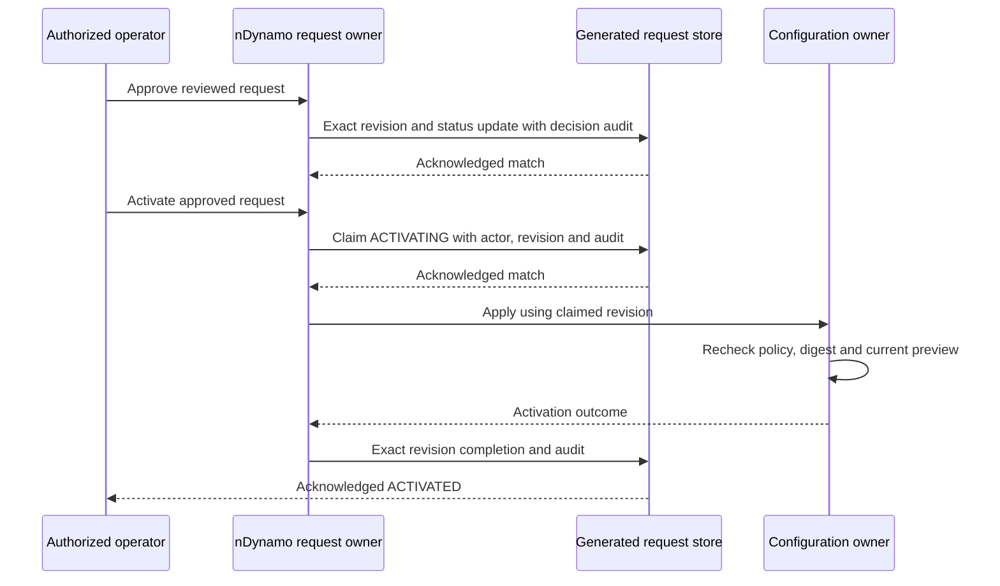

# Revision-Safe Activation

## Ownership and Scope

nConfig owns configuration layering. nDynamo owns requests, decisions and
activation claims; nSystem applies supported property changes. Copilot must use
these owners rather than persist a second effective-property store.

This contract provides one revision-checked activation claim per approved
request. It does **not** provide durable scheduled execution, distributed
property application, automatic recovery, or an atomic transaction between the
runtime's in-memory property update and the separate activation log by itself.
Opt-in [durable property activation](durable-property-activation.md) extends this
lifecycle with atomic property/audit persistence, reviewed deletion and rollback,
CronJob-invoked due dispatch and explicit evidence-only recovery. Its deployment
prerequisites and acceptance limits apply independently.

## Operator Journey

1. Use the existing secured control-plane preview for the intended tenant and
   configuration type. Inspect changed paths, previous values, risks and warnings.
   Never put credentials in property changes, reasons or correlation identifiers.
2. Create an activation request with the reviewed configuration and a reason.
   The owner stores its digest, revision zero and REQUESTED lifecycle entry.
3. Optionally supply `notBefore`, an exact UTC timestamp such as
   `2026-10-04T08:00:00.000Z`. This is an earliest-activation guard, **not** a
   scheduler. An authorized operator activates the request, or a separately
   provisioned CronJob invokes the opt-in durable property's due-dispatch command.
4. Approve or reject through the dedicated decision endpoint. The update matches
   code, revision, current status and approval status. Competing decisions cannot
   both win; refresh after a conflict, rather than resubmitting automatically.
5. Activate an approved request when due. The owner first claims ACTIVATING and
   increments the revision, atomically including actor and lifecycle evidence.
6. Only the claimed actor and revision can reach the protected owner activation.
   For properties, both the approved previous snapshot and proposed next snapshot
   must still match. A changed runtime requires a new preview and request.
7. On acknowledged success, inspect ACTIVATED and the owner's activation result.
   If the response is lost or application fails, follow the recovery procedure.

The current nAuth policy requires an authenticated actor. It does not require
different requester, approver and activator identities. Deployments needing
separation must use the existing authorization policy extension and test it;
the workflow must not advertise separation merely because it has multiple steps.

## Uncertain Outcomes

- A failed or ambiguous claim acknowledgement never starts the owner operation.
- Once claimed, the request cannot be automatically activated a second time.
- A failed owner call or lost completion acknowledgement can leave ACTIVATING.
  This is a recovery signal, not proof that nothing happened.
- Inspect the actual owner state and available audit evidence before deciding
  recovery. Do not manually reset the status to APPROVED or replay the mutation.
- A property audit rejection propagates instead of leaving an unresolved promise.
  The in-memory property assignment may already have happened. No automatic
  rollback is inferred. The existing audit owner can also report a skipped audit;
  this lifecycle change does not turn that into guaranteed durable audit storage.
- A new request is not a substitute for investigating an uncertain old request.

## Deployment and Migration

1. Back up the generated request records and identify pending legacy requests.
2. Deploy the revision/lifecycle/notBefore schema and generated service contract
   together with all control-plane callers. Generic activation-request CRUD is
   disabled; use dedicated permissioned endpoints. The activation-log schema's
   existing generic routes are unchanged by this work and are not an immutable
   audit guarantee.
3. Qualify the unique `code` index and acknowledged, exact-revision updates in
   the actual storage adapter. Cache is disabled for request-state decisions.
4. Legacy requests without revision and lifecycle evidence fail closed. Re-preview
   and recreate unexecuted requests through the owner after reviewing their state;
   never manufacture historical actor/audit entries with a blanket migration.
5. Verify concurrent decisions and activations across deployed runtime instances.
   Unit service doubles are not proof of database isolation or distributed apply.
6. Keep scheduled and recurring policy UI unavailable until durable job execution,
   restart persistence and multi-node application have their own acceptance.

## Customize and Verify

Later-layer overrides may extend the owning methods, but must retain trusted
tenant/actor identity, immutable request intent, exact revisions, bounded lifecycle
evidence and no automatic replay after an unknown acknowledgement. Never bypass
the activation policy with a browser-supplied trusted flag.

Focused coverage lives in `test/runtimeActivationConcurrency.test.js`,
`test/runtimePropertyConfigurationGovernance.test.js` and the existing activation,
policy and schema-access lifecycle tests. Run all nDynamo tests, generated schema
contracts, documentation governance and generated context validation. Before
production, test real generated storage, stale previews, missing actors,
duplicate requests, future notBefore values, lost acknowledgements and restart
behavior. No schema migration or runtime deployment is implied by source tests.
