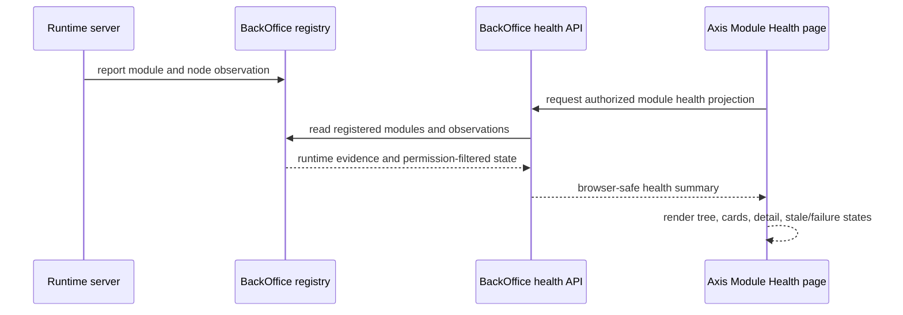
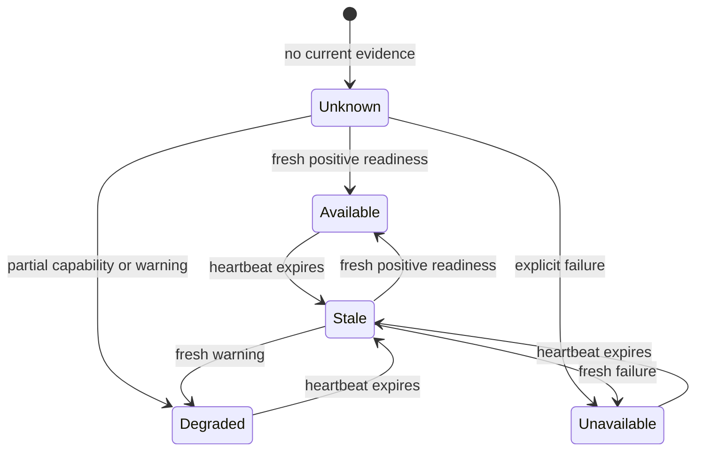

# Module Health

## Why Module Health exists

Modern Nodics projects are modular. A local demo may start Profile, BackOffice,
WCMS, Media, Cron, and documentation services on one machine. A production
topology may run the same functional capabilities across separate servers,
multiple nodes, separate databases, and separate release schedules. Business
users should not need to understand every server process, but administrators
and operators still need a safe way to answer a simple question:

> Is the capability I need actually available for this project right now?

Module Health gives an authorized employee a responsive view of registered
Nodics functional modules and observed runtime instances. It helps operators
see whether Profile, BackOffice, WCMS, Media, Cron, Workflow, Commerce, or
another capability is healthy, degraded, unavailable, stale, or unknown. It
also shows which environment, server, and node produced the observation.

The page is deliberately not a second monitoring product. It is the Axis view
of backend-governed runtime evidence.

## Purpose and ownership

Axis does not decide health. Nodics runtime services own readiness, individual
modules own their own deeper diagnostic rules, and BackOffice owns the
sanitized availability observation and registry projection that is safe for a
browser.

Axis owns only:

- typed consumption of the BackOffice health contract;
- rendering, filtering, searching, expanding, collapsing, and selecting rows;
- accessible status presentation;
- clear loading, empty, unavailable, and failure states;
- bounded refresh behavior initiated by the user or frontend query policy.

Axis displays the backend-provided package label and renders the
loader-discovered parent/child hierarchy. It never sends a label or canonical
path as the operational identifier. Detail, refresh, query keys, and
authorization continue using the original backend module name and runtime
identifier.

## Beginner mental model

There are three different ideas that are easy to mix together:

- A functional module is a business capability such as Platform, WCMS, Media,
  Cron, Workflow, or Commerce.
- A technical module is a smaller code module loaded inside a functional
  module, such as Profile, BackOffice, CMS, Media, or CronJob.
- A runtime instance is an observed server/node process that is currently
  running or was recently seen.

Module Health presents these ideas together but does not make them identical.
A functional module can be registered even when one runtime node is down. A
runtime can be live but not yet registered into the project. A technical module
can exist as part of a mandatory functional module without being separately
registered by a business user.

## Runtime evidence flow



The browser sees only the projection returned by BackOffice. It does not call
databases, inspect server processes, execute shell commands, or ping every
module on its own.

## Navigation and access

BackOffice contributes **Module Health** under **System & Integrations**
through backend-owned Axis capability metadata. Axis does not hardcode the
menu. The route is returned only to employees with the permission required by
the BackOffice registry contract.

The route is `/operations/module-health`. Employee session and screen-lock
guards protect direct navigation. Backend authorization remains mandatory even
when a browser route is manually typed.

## Frontend structure

```text
src/operations/moduleHealth/
  ModuleHealthRoutePage.tsx
  ModuleHealthTree.tsx
  api/
    moduleHealthClient.ts
    moduleHealthContracts.ts

test/operations/moduleHealth/
  api/
    moduleHealthClient.test.ts
```

Contracts reject malformed counts, identifiers, states, and freshness.
The client supplies the in-memory employee token, enterprise header, request
timeout, no-store policy, and redirect rejection. It stores no credentials and
rejects unsafe module path segments.

TanStack Query owns server state. Summary data loads once; instance details
load only for the selected module, avoiding an unbounded request per module.
Window focus and explicit actions refresh data. Axis adds no independent
health poller.

An on-demand **Check now** action is enabled only when the selected module has
at least one client-callable runtime endpoint. Non-client modules still show
their registration heartbeat and observed state, but Axis does not request a
refresh that the backend cannot perform.

## What an operator sees

The page should help an operator move from summary to evidence:

1. Summary cards show total registered modules, available modules, degraded
   modules, unavailable modules, and stale observations.
2. The hierarchy shows functional modules and technical module children using
   labels returned by the backend.
3. Search narrows the tree by label, module code, canonical path, environment,
   server, node, or state.
4. Selecting a module opens one inline detail region so the evidence remains
   visually connected to the selected row.
5. The detail region shows observed runtime nodes, heartbeat freshness,
   readiness state, source server, and stable reason.
6. A governed refresh action is available only when the backend says it is safe
   and supported.

Axis should be calm in bad moments. When a module is unavailable, the user
needs a stable explanation and a safe next action, not a stack trace or an
invented fix.

## State model



The important rule is that stale evidence is not healthy evidence. If a node
was healthy yesterday and has not reported today, Axis must not present it as
healthy. The backend decides the actual freshness window; Axis renders the
state and explanation.

## Operator workflow

1. Open **System & Integrations > Module Health**.
2. Review totals and module states.
3. Expand or collapse module groups.
4. Search by label, code, canonical path, environment, server, node, or state.
   Matching descendants retain their ancestor chain.
5. Select a concrete module. Its detail region expands directly beneath that
   module so the hierarchy and runtime evidence remain visually connected.
   Selecting the same module again collapses the detail region; selecting
   another module moves the single expanded detail region to that module.
6. Review each registered node's heartbeat, readiness observation, state,
   freshness, and stable reason.
7. Choose **Check now** only when the backend enables that operation.

Expired and intentionally deregistered nodes are not active instances. Axis
does not infer expected cluster membership from previously observed nodes.

## Example incident

Suppose Cron was added to a customer project. The Cron server starts and
reports itself, but the business administrator has not registered the Cron
functional module yet.

Expected behavior:

- Module Registry can show Cron as available to register.
- Module Health can show the runtime observation as live evidence.
- Cron operation pages remain hidden or unavailable until the module is
  registered, active, and authorized.
- Axis does not silently activate Cron because a runtime was observed.

Now suppose Cron is registered and active, but the Cron server is stopped.

Expected behavior:

- Module Registry still shows Cron as registered because registration is
  persisted project state.
- Module Health shows Cron as stale, unavailable, or unknown based on backend
  evidence.
- Axis does not remove Cron from the registry only because the server is down.
- A restart can restore runtime evidence without requiring registration again.

This distinction is central to the Nodics lifecycle. Registration is project
intent; health is runtime evidence.

## Responsive, accessible, and failure behavior

- Summary cards wrap, while the module hierarchy and inline detail region use
  the full available width on every breakpoint.
- State always has text in addition to color.
- Search is visibly labelled; rows are keyboard-operable buttons.
- Loading uses announced progress and failures use alerts.
- Dates use the browser locale.
- BackOffice failure never falls back to invented health.
- Unauthorized access remains a backend rejection.
- Malformed responses fail closed.
- Stale evidence is `UNKNOWN`, `STALE`, or another backend-provided non-healthy
  state, never healthy.
- Refresh failure preserves the existing view and shows a bounded message.
- Clicking a row must not scroll the left navigation to the top; navigation and
  content scrolling are independent layout concerns.

## Backend authority and API contract

The backend contract must provide enough information for Axis to render safely
without guessing:

- stable module identifier;
- display label;
- functional module group;
- technical module children;
- registration state;
- activation state;
- runtime observation state;
- environment and server identity;
- node identity when available;
- last observed time;
- freshness/state reason;
- whether a check-now operation is allowed;
- permissions attached to the caller.

Axis may rename labels for presentation only when the backend provides a
browser-safe label. It must continue to send stable identifiers back to the API.

## Customize and extend safely

Partners may change styling or compose presentation around typed contracts.
They must not:

- call databases or infrastructure providers from Axis;
- reproduce the module registry;
- ping every module as a second health authority;
- persist access tokens or raw diagnostics;
- infer configured cluster membership from stale observations;
- bypass permissions;
- show module actions before registration and activation allow them;
- treat display labels as operational identifiers.

If a partner needs deeper module diagnostics, the correct extension path is a
backend endpoint owned by the functional module, browser-safe BackOffice
capability metadata, then an Axis renderer that consumes that endpoint.

## Operational acceptance checklist

Before releasing Module Health changes, verify:

1. registered healthy modules render as healthy;
2. registered unhealthy modules render as degraded or unavailable;
3. stale observations do not render as healthy;
4. live but unregistered optional modules do not become operational pages;
5. mandatory modules cannot be deregistered by the browser;
6. unauthorized users cannot see the route or call the API;
7. malformed responses fail closed;
8. search preserves the visible ancestor chain;
9. only one module detail panel is expanded at a time;
10. check-now is disabled when backend metadata does not allow it;
11. page refresh and route navigation preserve the authenticated workspace;
12. left navigation and content scroll independently;
13. production build and contract tests pass.

## Common mistakes

- Mistake: "The server is running, so the module is registered."
  Correction: runtime observation and project registration are separate states.
- Mistake: "The browser can ping the module to know health."
  Correction: health evidence must come through governed backend contracts.
- Mistake: "A label is enough to call a module."
  Correction: labels are presentation text; stable identifiers drive API calls.
- Mistake: "A stale healthy heartbeat is still healthy."
  Correction: stale evidence is not current evidence.
- Mistake: "Module Health can hide backend permission errors."
  Correction: Axis must render safe failure states and the backend must still
  enforce authorization.

## Verification

Module Health changes must prove the complete lifecycle: mandatory modules are
visible and protected, optional modules move from available to registered to
active and back, deregistered live modules return to the available list without
manual refresh, unavailable modules render safe degraded states, and all
actions refresh the page model without losing the authenticated route. Include
negative coverage for unauthorized users, malformed backend projections, stale
heartbeats, disabled check actions, search filtering, independent left-nav and
content scrolling, and production build behavior.
