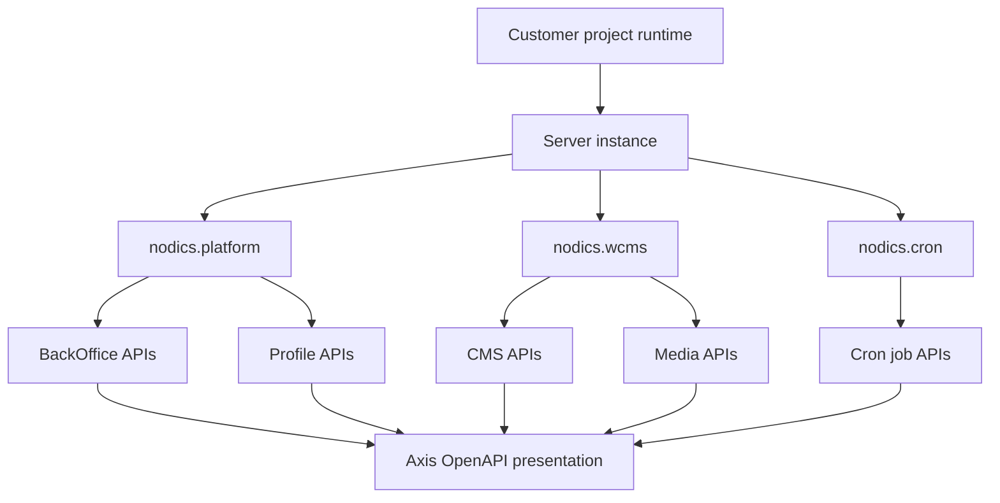

# Swagger and OpenAPI reference

Axis includes a documentation entry for Swagger and OpenAPI because business
operators, developers, and support teams need a safe way to understand which
backend contracts are available in the current runtime. The important rule is
simple: Axis presents API reference information; it does not become the API
owner, schema owner, or runtime discovery authority.

The OpenAPI reference must follow the registered runtime and module graph. A
local project may run Platform, WCMS, Cron, and later other functional modules
in one server or in multiple servers. Axis should show the API groups that the
backend says are available for the authenticated identity and active runtime,
not every repository that exists on disk.

## Who this helps

Business users use this page to understand what capability areas are exposed:
identity, BackOffice, content, media, data import, data export, registry,
module health, and future module workspaces. They do not need to read every
operation, but they should be able to see which capability owns the API and
whether it belongs to the current project.

Developers use this page to find request paths, payload shapes, response
contracts, error models, and authorization expectations before writing a
frontend client, backend integration, or customer extension.

Operators use it to check runtime readiness. If a module is registered but its
API category is disabled for a server, the OpenAPI reference should make that
boundary visible without encouraging direct browser calls that bypass governed
workspaces.

## Grouping model

OpenAPI information should be grouped first by runtime or server context, then
by functional module, then by technical module or API category when that helps
the reader. This matches the Nodics mental model:

This structure prevents two common problems. First, it avoids a giant flat API
list where beginners cannot tell which module owns a route. Second, it avoids
hardcoding `core`, `platform`, `wcms`, or `cron` into frontend assumptions. The
backend tells Axis what is available and authorized.

## Backend authority

The backend owns:

- which runtime servers are live;
- which functional modules are mandatory, optional, registered, and active;
- which API categories are enabled for the server;
- which OpenAPI or Swagger contracts are available to the current identity;
- which operations are public, authenticated, admin-only, internal, or
  disabled;
- which examples, schemas, tags, and deprecation notes are safe to expose.

Axis owns:

- navigation to the Swagger/OpenAPI reference page;
- readable grouping, filtering, and searching;
- empty, loading, unauthorized, disabled, and degraded states;
- links to the backend-owned Swagger UI when the backend exposes one;
- beginner-friendly explanation of what each group means.

Axis must not scrape backend source files, inspect local framework folders, or
invent API contracts from route naming. If the backend does not provide a safe
contract, Axis should say the reference is unavailable for that runtime.

## Example reading flow

A new developer who wants to build a Media screen should not start by guessing
URLs. The safe flow is:

1. open Axis and authenticate as an authorized employee;
2. open Documentation, then Swagger/OpenAPI reference;
3. select the current runtime, for example the local WCMS server;
4. find the WCMS functional module group;
5. open the Media API category;
6. read allowed operations, payload fields, error responses, and examples;
7. implement a typed Axis client against the documented contract;
8. verify with unauthorized, unavailable-category, malformed-response, and
   success scenarios.

For example, a page may show Media as active but data import as disabled. That
does not mean Axis should hide the entire documentation product. It means the
Media API group can be read, while import operations must explain that the API
category is disabled for this runtime.

## Customize and extend safely

Customer projects may customize the OpenAPI presentation by adding project
copy, grouping labels, warning text, examples, or links to customer project
documentation. They should not change the backend contract identity in Axis.

If a customer module extends Platform or WCMS, the functional module identity
can still be the standard module. The reference may show an implementation or
extension note, but the visible grouping should not become confusing customer
branding unless the project intentionally exposes a separate capability.

Future modules should contribute their own OpenAPI metadata through their
backend module or runtime registration path. Axis should discover the group
through BackOffice and render it using the same generic OpenAPI page instead of
adding one hardcoded route per module.

## Common mistakes

- Scraping local source folders to find routers. Axis must use backend-owned
  discovery and authorization.
- Showing every API from every installed package. Only APIs available for the
  current runtime and identity should appear.
- Assuming a module is operational because a Swagger tag exists. Registry,
  activation, server availability, and API category enablement are separate
  signals.
- Embedding an unsafe Swagger UI that can execute unauthorized requests.
  Interactive execution must respect authentication, CSRF, permission, and
  environment policy.
- Treating examples as production credentials or secrets. Examples must be
  safe, synthetic, and non-sensitive.

## Verification

OpenAPI reference work is accepted when Axis can load the Swagger navigation
entry, request backend-owned runtime/module API metadata, group APIs by
runtime and functional module, show disabled or unauthorized categories safely,
open backend Swagger UI only through approved links, and avoid source-folder
inspection. Tests should cover empty metadata, malformed metadata, unauthorized
users, disabled API categories, multiple runtimes, module registration changes,
keyboard navigation, mobile layout, and production build behavior.
