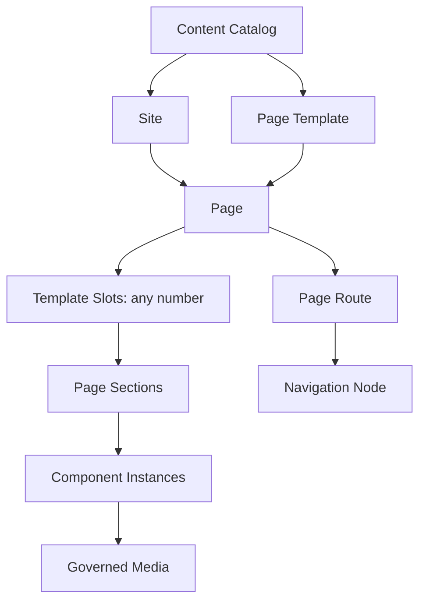
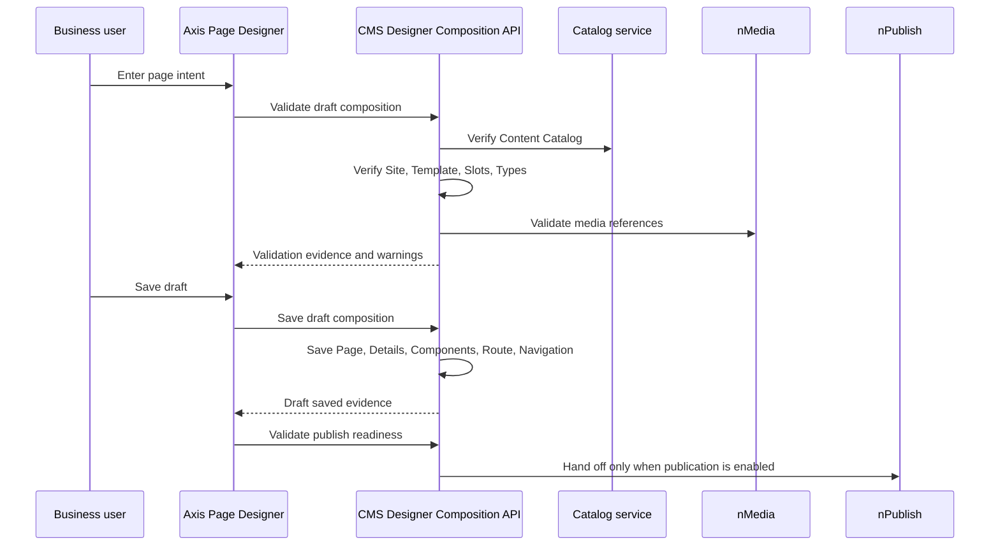

# Axis Page Designer

Axis Page Designer is the business-user workspace for creating and maintaining
WCMS page composition without asking users to open every low-level schema table
first. It is designed for people who think in terms of sites, pages, sections,
components, text, images, routes, and navigation. It still stays inside the
backend-owned Nodics contract.

The important sentence is this: Page Designer is a guided authoring client, not
a second CMS engine.

## Why Page Designer exists

Low-level schema workspaces are powerful, but they are not a friendly first
experience for most business users. A content author normally does not want to
start by understanding `cmsPage`, `cmsComponentDetail`,
`cmsComponentMedia`, route records, navigation nodes, renderer mappings, and
slot cardinality. They want to create a useful page safely.

Page Designer gives that user a smoother path:

1. choose the content universe;
2. choose the site;
3. choose a page template;
4. see the template's available slots;
5. create sections;
6. add text or component records;
7. attach governed media;
8. assign a route and navigation entry;
9. validate the draft before publishing.

That improves adoption because beginners see the business process first and
the underlying records second. Developers and operators still get the same
governance, permissions, audit, generated schema services, media authority,
and publication boundaries.

## Catalog-first model

The Designer follows the WCMS catalog-first model. The Content Catalog sits at
the top. A Site belongs to or is governed by that catalog. Pages belong to the
Site. Reusable definitions such as page templates, slot definitions,
component types, and renderer mappings live inside the same governed content
universe.

Do not read the diagram as “every page has three slots.” Slot count and slot
names are defined by the selected backend template. One template might expose
only `article`; another may expose `navigation`, `article`, and
`relatedResources`; a customer landing page may expose `hero`, `body`,
`gallery`, `pricing`, and `footerPromo`. Axis reads the backend contract and
renders that structure.

## What Axis owns

Axis owns the browser experience:

- the route `/content/designer`;
- cards, checklist, wizard panels, preview tree, and visible flow;
- typed API clients that call CMS Designer APIs;
- optimistic form state before a user saves;
- accessibility, responsive layout, loading, empty, failure, and recovery
  states;
- tests proving the UI follows backend authority.

Axis does not own:

- catalog records;
- CMS Site records;
- page, template, slot, component, route, navigation, or media records;
- documentation or importable CMS data;
- media storage keys, upload policy, delivery URLs, or provider settings;
- publish lifecycle or staged-to-online activation;
- business permissions.

## Backend authority

The backend owns the actual operation through secured CMS Designer
Composition APIs. Those APIs are exposed by the CMS module under the
`cmsAuthoring` API exposure category. A delivery-only server may disable that
category at server or environment level, but the reusable WCMS module owns the
default authoring contract.

The browser never calculates release checksums, never writes directly to a
database, never stores page data as local truth, and never bypasses the media
or publication contracts.

## Business-user flow

The friendly Designer flow should feel like this:

| Step | User language | Backend authority |
| --- | --- | --- |
| Select catalog | “Which content area am I working in?” | `catalog.catalog` with `catalogType = CONTENT` |
| Select site | “Which website or workspace gets this page?” | `cms.cmsSite` |
| Select template | “What kind of page structure do I need?” | `cms.cmsPageTemplate` |
| Review slots | “Where can I place content?” | `cms.cmsSlotDefinition` |
| Create page | “What is the page called?” | `cms.cmsPage` |
| Add sections | “Which parts of the page exist?” | `cms.cmsComponentDetail` placement |
| Add components | “What text, card, banner, list, article, or widget appears?” | `cms.cmsComponent` |
| Attach media | “Which governed image/document/video is used?” | `cms.cmsComponentMedia` plus `media` validation |
| Assign route | “Which URL opens the page?” | `cms.cmsPageRoute` |
| Assign navigation | “Where does this page appear in menus?” | `cms.cmsNavigationNode` |
| Publish readiness | “Is this safe to make visible?” | CMS validation and nPublish |

## Developer guidance

When a developer adds Designer behavior, start from the backend contract. If a
new component type is needed, add a CMS type code, renderer mapping, property
schema, media schema, template/slot rule, and Axis renderer. Do not add a
hardcoded “component kind” that exists only in the browser.

When a new operation is needed, check whether an existing generated schema
operation or CMS Designer Composition operation already owns it. Add a typed
client method in Axis only after the backend operation exists. Keep every
client method bounded: explicit endpoint, explicit response parsing, timeout,
no credentials in URLs, no redirects, and no local persistence of content.

## Customize and extend safely

The safest customization path is backend-first and configuration-first. A
customer project can add a new content experience by providing a content
catalog, site, page template, slot definitions, component type codes, renderer
mappings, sample pages, and media policies in its own backend-owned data pack.
Axis should then discover those capabilities from WCMS and render the same
Designer workflow. The project should not fork Axis just to add a new slot name
or page type.

For example, a customer documentation portal may define a
`partnerDocsTemplate` with `hero`, `article`, `videoWalkthrough`, and
`relatedLinks` slots. The Designer must allow those four slots because the
template owns the structure. Axis can improve the experience with clearer
labels, hints, and preview grouping, but WCMS still decides whether the slots,
component types, media references, and route are valid.

When code customization is required, keep the seam narrow:

- add backend CMS contracts first;
- expose the operation through a secured authoring API category;
- add or reuse an Axis typed client;
- add a renderer only for presentation;
- add tests proving that Axis does not become the content authority;
- document the business journey, developer extension point, and operations
  controls in the owning backend documentation pack.

This keeps customer extensions upgradeable. A partner can replace or extend a
component renderer, create a new template, or add a custom authoring panel
without changing the meaning of Catalog, Site, Page, Slot, Component, Media,
Route, Navigation, or Publish.

## DevOps and operations guidance

Operators should treat Designer authoring as a mutable CMS capability. It
requires WCMS, Catalog, Media, Profile, BackOffice, and sometimes Publishing
to be available. If a production topology separates authoring from delivery,
enable `cmsAuthoring` only on the authoring runtime. A delivery-only runtime
can still resolve published CMS pages without allowing users to save drafts.

For troubleshooting, start with the backend chain:

1. Is the user authorized for `cms.backoffice.view` and
   `cms.backoffice.manage`?
2. Is the `cmsAuthoring` API exposure category enabled?
3. Does the selected Site belong to the selected Content Catalog?
4. Does the selected Template expose the slots the user is editing?
5. Are component type and component type group rules satisfied?
6. Are media references valid in nMedia?
7. Is the route unique for site, path, locale, and channel?
8. Is publishing enabled, and is the draft ready for that lifecycle?

## Common mistakes

- Creating a frontend-only page model because it is faster than learning the
  CMS schema chain.
- Assuming every page has `header`, `main`, and `footer` slots. Slots are
  template-owned and can be any number.
- Letting Axis store media paths, provider keys, or delivery URLs.
- Treating a visual preview as publish authority.
- Saving a route before checking uniqueness per site, locale, and channel.
- Adding component types in TypeScript without backend type codes and renderer
  mappings.
- Hiding backend validation errors behind generic browser errors.

## Verification

Designer work is acceptable when:

1. `/content/designer` loads only from authorized backend navigation.
2. The page explains catalog-first ownership and arbitrary template slots.
3. The typed client can retrieve the backend authoring model.
4. Draft validation rejects wrong catalog/site, unknown template, unknown slot,
   disallowed component type, invalid media reference, and duplicate route.
5. Draft save calls CMS-owned APIs and does not persist content in browser
   storage.
6. Media associations go through `cmsComponentMedia` and nMedia validation.
7. Publish readiness does not activate content without CMS/nPublish authority.
8. Axis tests, backend CMS tests, live smoke, and fresh local acceptance pass.
