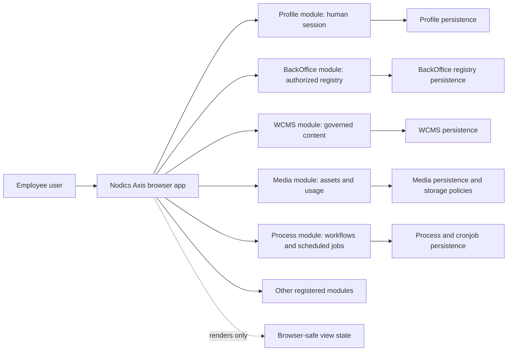

# Axis Architecture and Ownership

## Why this page matters

Axis looks like a normal web application when a user opens it in the browser,
but it is not the authority for Nodics business behavior. It is the employee
workspace that lets people discover, use, and operate capabilities that are
owned by backend modules. That difference is important for business users,
developers, operators, security reviewers, and AI tools.

If Axis becomes a second backend, every customer project becomes harder to
secure and harder to customize. The browser would start carrying rules that
belong in Profile, BackOffice, WCMS, Cron, Workflow, Commerce, or a customer
extension module. The same validation could then exist in two places, one
workflow could be started from two authorities, and one permission decision
could be interpreted differently by the browser and the backend. Nodics avoids
that by keeping Axis reusable, thin, governed, and contract-driven.

Think of Axis as a well-designed control room. It shows switches, screens,
alerts, forms, and dashboards. The control room helps a human operate the
system safely, but it does not become the power plant, the billing engine, the
workflow engine, the CMS, or the security system.

## Decision

Nodics Axis is a reusable Back Office browser application deployed once for
each Nodics-based customer project. The Axis process and the Nodics backend
processes are built, started, scaled, deployed, and rolled back independently.
One Axis deployment must not switch between customer projects or federate
their backend endpoints.

This decision keeps a clear authority boundary:

- Nodics backend modules own business rules, persistence, authentication
  enforcement, authorization, workflows, pipelines, integrations, secrets,
  tenant governance, runtime contracts, and module APIs.
- Axis owns browser rendering, interaction, accessibility, responsive behavior,
  client-side usability, and non-authoritative view state.
- Profile authenticates human users and owns the human identity/session
  contract.
- BackOffice returns the caller's authorized, browser-safe module registry,
  navigation, capability, schema, and compatibility metadata.
- WCMS owns governed content, sites, page routes, components, renderers,
  templates, content catalogs, and documentation pages delivered through CMS
  contracts.
- After bootstrap, Axis calls each authoritative module directly. BackOffice
  does not proxy normal CMS, job, workflow, configuration, or business traffic.

## Reader journeys

Different readers should take different value from this page:

- A business user should understand that Axis gives one governed place to
  operate many business capabilities without copying business rules into the
  browser.
- A developer should understand where a new page, renderer, typed API client,
  backend route, data import, or customization belongs.
- An architect should understand how the per-project boundary supports
  modularity, customer overlays, separate deployments, and future functional
  modules.
- A security reviewer should understand that the browser receives only
  permission-filtered, browser-safe data and never becomes a credential,
  workflow, or persistence authority.
- An operator should understand how Axis can be rolled back without rolling
  back backend data, and how backend modules can scale or fail independently.
- An AI tool should understand that it must discover the owning module before
  writing code, tests, or documentation.

## Deployment model

Axis is deployed per customer project, not as one global application that can
switch between unrelated projects.

```text
Customer project A
  Axis deployment A
    -> Profile A
    -> BackOffice A -> authorized module discovery
    -> WCMS A
    -> Media A
    -> Process A
    -> project A extensions

Customer project B
  Axis deployment B
    -> Profile B
    -> BackOffice B -> authorized module discovery
    -> WCMS B
    -> Media B
    -> Commerce B
    -> project B extensions
```

Axis deployment A must never discover, select, or call project B endpoints.
Whether a project's Nodics modules run together in one local server or as
distributed module servers does not change the browser contract.

## Authority model diagram



The browser is allowed to hold presentation state: selected tab, expanded
section, search text, temporary form draft, and cached response data governed
by frontend query rules. It is not allowed to hold authoritative rules:
permission truth, workflow truth, catalog truth, schema truth, credential
truth, import truth, or runtime-health truth.

## Contract authority

Axis consumes versioned backend contracts such as OpenAPI, Profile
authentication, BackOffice bootstrap, permissions, schemas, content delivery,
module operation metadata, and data import/export contracts. Generated or
handwritten Axis clients are consumers of those contracts; they do not become
contract authorities.

Axis must not:

- import source from the Nodics framework checkout;
- embed backend services or persistence;
- reproduce authoritative validation or permission decisions;
- execute workflows, pipelines, integrations, AI tools, or arbitrary scripts in
  the browser;
- store service credentials, cronjob credentials, database credentials, or module
  secrets;
- create a second registry, schema authority, runtime loader, endpoint
  federation layer, or content ownership layer;
- treat route text, menu labels, or display names as operational identifiers.

Client-side validation may improve usability, but every target module must
validate and authorize the request independently.

## Business example: one project, one Axis

Imagine a retail partner using Nodics for employee onboarding, content
management, media governance, scheduled jobs, and future commerce operations.
The partner wants one employee workspace where a merchandiser can edit content,
an administrator can configure users, and an operator can check module health.

Axis solves this by discovering what the project has enabled. If the project
has Profile, WCMS, Media, and Process, Axis shows the authorized pages for those
capabilities. If Commerce is not registered, Commerce pages are not shown. If a
user does not have a permission, the menu and direct route must not become a
back door. The backend still rejects the request.

This protects business adoption because the workspace grows with the project.
The customer does not need a new Back Office application for every module, and
they do not need browser code changes to hide capabilities that are not live.

## Developer example: adding a workspace

When a developer adds a new Axis workspace, the first question is not "which
React component should I write?" The first question is "which backend module
owns this behavior?"

Example: a future Workflow dashboard.

1. The Workflow backend module defines the runtime API, permission codes,
   schemas, status definitions, and operation rules.
2. BackOffice exposes browser-safe navigation and capability metadata only for
   authorized users.
3. Axis adds a typed Workflow client, route renderer, UI components, loading
   states, empty states, error states, responsive behavior, and tests.
4. Documentation is written in the backend-owned content pack of the module
   that owns the documentation topic.
5. Axis never decides whether a workflow may be approved, rejected, retried, or
   cancelled. It asks Workflow and renders the result.

This sequence keeps customization safe. A customer extension can override the
backend Workflow behavior while the functional module identity remains
`nodics.process`. Axis still presents "Workflow" because the customization
extends the capability rather than creating a new product identity.

## Operations example: deployment and rollback

Axis can be released independently from backend modules. That is useful, but it
also creates a responsibility: Axis must fail safely when a backend capability
is absent, older, newer, disabled, or temporarily unavailable.

Safe behavior includes:

- show recovery content when CMS content cannot be loaded;
- show a clear unavailable state when BackOffice registry discovery fails;
- hide or disable an action when the backend says the operation is not
  available;
- keep old data visible only when it is clearly marked stale;
- never invent a successful operation after a failed request;
- make frontend rollback possible without changing persisted backend data.

For example, if a new Axis release supports a cronjob feature that the running
processServer does not yet expose, the page should say the capability is not
available for this runtime. It should not guess the endpoint, construct a URL
from a label, or show a fake success.

The Cron Operations workspace follows the same rule. Axis may show a governed
job-control panel after the authenticated bootstrap exposes a live `cronjob`
connection. The panel saves job definitions through Cron-owned schema APIs and
requests create, run, start, stop, pause, and resume through Cron-owned command
routes. Axis does not own scheduler state, node eligibility, overlap policy,
job execution, handler selection, retries, or job logs. Those remain inside
`nodics.process/modules/cronjob`.

Cron lifecycle routes require the `cronjob.lifecycle.manage` permission. A
button being visible in Axis is not enough; the backend still authorizes the
route. If the permission is absent, the frontend must surface the backend
denial and keep the local view unchanged until a refreshed backend contract
proves otherwise.

## Security boundary

Human browser authentication remains separate from module-to-module and CronJob
authentication. Axis may receive only browser-safe configuration,
human-session material approved by the Profile browser-security contract, and
permission-filtered module metadata. Passwords, access tokens, refresh tokens,
service credentials, and secrets must never be written to browser storage,
URLs, logs, screenshots, telemetry, static data files, or documentation
examples.

Axis security work must consider:

- authentication and session expiry;
- authorization for menu discovery and direct route access;
- enterprise and tenant isolation;
- CSRF, CORS, CSP, and clickjacking protections;
- request timeouts and redirect rejection;
- safe error messages that do not leak secrets or stack traces;
- auditability of backend operations;
- least-privilege data projection from BackOffice and target modules.

Detailed session, refresh, revocation, CORS, CSRF, CSP, and audience behavior
must be documented only after the corresponding backend contracts are approved
and implemented.

## Documentation ownership

Axis documentation is also backend-owned content. The frontend repository owns
renderers and browser behavior, but it does not own importable documentation
data.

The ownership rule is:

- framework documentation belongs to the framework documentation module;
- Axis product documentation belongs to the backend Axis module under
  Platform;
- customer project documentation belongs to the customer project;
- functional module documentation belongs to the functional module that owns
  the behavior;
- temporary plans are not runtime content and must not be presented as
  implemented capability.

This keeps documentation modular. A project can install framework docs, Axis
docs, and project docs without mixing their ownership or forcing the frontend
repository to carry backend data.

## Customize and extend safely

Create customer behavior in the customer backend project and customer
presentation in its Axis project layer. A frontend extension may add a focused
page, renderer, typed client, hook, and mirrored test, but it must continue to
consume the owning Nodics module's versioned API and permission contract.

The smallest safe extension is one new renderer file plus one typed registry
entry for a backend-issued logical renderer key. Do not copy BackOffice
discovery, create a browser module registry, move validation or workflow into
React, or edit reusable Nodics framework source. Prove the extension with
contract-version, unauthorized, malformed-payload, responsive, integration,
accessibility, and production-build tests. Rollback removes the project
registry entry while leaving the backend authority and persisted data
unchanged.

## What AI tools must do before coding

Before changing Axis or any Axis-owned backend data, an AI tool must:

1. identify the functional module that owns the behavior;
2. identify whether the change belongs in backend framework, backend customer
   project, frontend renderer, documentation content, or test data;
3. inspect existing contracts and avoid creating a parallel authority;
4. prefer configuration and extension over editing out-of-the-box framework
   behavior;
5. add or update documentation where a user-facing behavior, contract,
   boundary, or operation changes;
6. run the smallest meaningful tests first, then the broader acceptance gates
   required by the changed surface.

If ownership is unclear, stop and clarify rather than writing code in the
nearest convenient folder.

## Verification expectations

Every Axis slice must identify:

1. its authoritative backend owner and versioned contract;
2. its Axis presentation and local-state responsibilities;
3. authentication, authorization, tenant, and data-exposure boundaries;
4. tests belonging to each repository;
5. documentation belonging to each repository;
6. local recovery behavior when the backend is absent or disabled;
7. rollback behavior for frontend and backend releases.

Implementation must cover applicable positive, negative, boundary, contract,
security, responsive, accessibility, integration, recovery, and regression
behavior. Run the module-specific documentation checks and the repository
validation gates before release-oriented commits.

## Common mistakes

- Treating `nodics.axis` as a backend data owner. Axis is a frontend renderer;
  importable CMS records, documentation records, registry data, permissions,
  and API contracts are owned by backend modules or customer projects.
- Adding a route because the page looks useful, without proving the owning
  module is registered, active, and authorized for the current identity.
- Naming customer overlays as new functional modules when they only customize
  the standard capability. A customer Platform extension still presents as
  Platform unless the business intentionally creates a separate capability.
- Fixing a frontend gap by bypassing Profile, BackOffice, WCMS, or nMedia.
  Axis can improve presentation, validation, empty states, and guided flows,
  but backend modules remain the authority for business mutation.
- Documenting only the happy path. Architecture documentation must explain
  failure, rollback, security, and ownership because those are the areas that
  become expensive when the product grows.
