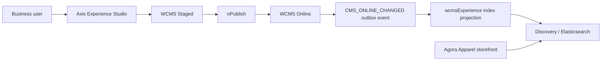
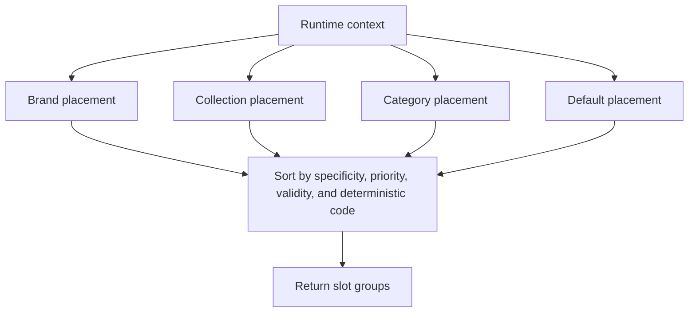

# Axis Experience Studio and Targeted CMS Experiences

Axis Experience Studio is the business workspace for deciding which published
CMS components appear for a specific storefront journey. It does not replace
Page Designer, Product Search, Commerce, or Publishing. It gives business
users a governed way to say:

“When a shopper is on this kind of page, with this journey context, show these
hero banners, editorial strips, featured product rails, and supporting
messages.”

The important boundary is this: the component is still content, and the rule is
not a component. A component remains a renderable CMS record. An experience
placement is backend configuration that resolves one or more components for a
runtime context.

## Why this exists

Storefront pages are rarely one-size-fits-all. The product listing page for
`/shop` might need a broad seasonal banner. The listing reached from a
collection tile might need a collection-specific hero. A brand journey might
need a brand story, campaign image, featured product rail, and trust message.
Later, the same mechanism can support customer segment, region, device,
language, loyalty tier, or campaign personalization.

Without Experience Studio, teams usually choose one of two weak patterns:

- create many hardcoded pages that duplicate layout logic;
- put conditional frontend code in the storefront for every campaign.

Both approaches become expensive. Experience Studio keeps the decision in the
backend-owned WCMS experience capability and lets the frontend ask for the
resolved experience for the current request.

## Ownership model

| Area | Owner | Notes |
| --- | --- | --- |
| CMS components | WCMS | Hero banners, rich text, image cards, promo strips, product rails, and containers stay normal content records. |
| Experience placements | `wcmsExperience` | A placement decides where, when, and for whom components are eligible. |
| Publication lifecycle | `nPublish` | Draft/Staged/Online promotion remains governed by publishing. |
| Content indexing | Discovery / Elasticsearch projection | Published placements and component projections are indexed for fast delivery. |
| Storefront rendering | Agora Apparel or another consumer site | The site renders the returned components with registered renderer keys. |
| Axis authoring | Axis Experience Studio | Axis provides the business UI, preview tools, and index-status visibility. |

Axis is not the system of record for experience data. It is the control room.

## End-to-end flow



At runtime the storefront should not scan thousands of CMS records or execute
every rule in memory. It calls the delivery API with a compact context, and the
backend resolves from the indexed placement projection.

## Axis screens

Experience Studio starts with four practical views.

```text
Experience Studio
├─ Overview
│  ├─ explains the flow
│  ├─ shows the required permissions
│  └─ links to Page Designer and schema workspaces
├─ Placements
│  └─ opens the governed schema workspace for wcmsExperience.cmsExperiencePlacement
├─ Preview
│  ├─ page type
│  ├─ route path
│  ├─ slot
│  ├─ target type and target code
│  └─ resolved components grouped by slot
└─ Index Status
   ├─ projection health
   ├─ indexed placement count
   └─ last refresh / lag diagnostics
```

The Placements screen is deliberately schema-backed. That keeps the first slice
safe and consistent with Nodics module contracts. Later, Experience Studio can
add a richer visual placement wizard on top of the same backend entity.

For beginners, the safest mental model is simple: create the content first,
then create the placement that decides when that content appears. If the
preview looks wrong, check the target type, target code, slot, and publication
state before changing storefront code.

## Placement fields

These are the fields a business user or developer should understand before
creating a targeted experience.

| Field | Purpose | Example |
| --- | --- | --- |
| Site | Which storefront or channel owns the placement | `agora-apparel` |
| Page type | Which type of page is being targeted | `PRODUCT_LISTING`, `COLLECTIONS`, `BRAND` |
| Slot | Where the component should render | `hero`, `promo-strip`, `featured-products` |
| Target type | Which journey key controls the match | `DEFAULT`, `CATEGORY`, `COLLECTION`, `BRAND` |
| Target code | The specific target value | `clothing`, `new-arrivals`, `atelier-minimal` |
| Component code | Published CMS component to render | `agora.collection.clothing.hero` |
| Renderer key | Storefront renderer contract | `commerce.hero.banner`, `commerce.product.carousel` |
| Priority | Ordering among competing matches | `100` |
| Specificity | Tie-breaker for more precise rules | `BRAND` beats `DEFAULT` |
| Locale / channel | Optional delivery constraints | `en`, `web` |
| Region / device | Optional personalization constraints | `AE`, `desktop` |
| Valid from / valid to | Campaign timing | Back-to-school week |
| Publication status | Authoring lifecycle | `STAGED`, `ONLINE` |
| Delivery status | Whether delivery may use the placement | `ACTIVE` |

## Runtime request examples

A normal product listing can use a default placement:

```text
/shop?page=1&pageSize=10
```

A category listing adds category context:

```text
/shop?category=clothing&page=1&pageSize=10
```

A collection journey adds collection context:

```text
/shop?collection=new-arrivals&page=1&pageSize=10
```

A brand journey adds brand context:

```text
/shop?brand=atelier-minimal&page=1&pageSize=10
```

The product result set is still returned by Commerce/Search. The page-level
experience components are resolved by WCMS Experience for the same request
context. This creates a mixed page: search results plus targeted CMS content.

## Collection journey example

Goal: when a shopper clicks the “New arrivals” collection tile, the listing
page should show a collection-specific hero, a small editorial message, and a
featured product carousel chosen by the business team.

1. In Page Designer or the component workspace, create or update the hero
   component.
   - Component: `agora.collection.new-arrivals.hero`
   - Renderer: `commerce.hero.banner`
   - Title: `Fresh silhouettes, just landed`
   - Image: a governed media record, not a hardcoded frontend asset
   - CTA: `/shop?collection=new-arrivals`

2. Create the editorial strip component.
   - Component: `agora.collection.new-arrivals.strip`
   - Renderer: `commerce.promo.strip`
   - Message: `Soft layers, modern neutrals, and refined everyday shapes`

3. Create the featured carousel component.
   - Component: `agora.collection.new-arrivals.featured`
   - Renderer: `commerce.product.carousel`
   - Query: `collection=new-arrivals&featured=true`
   - Limit: `8`

4. In Experience Studio, open Placements and create three placements.

| Slot | Target type | Target code | Component | Priority |
| --- | --- | --- | --- | --- |
| `hero` | `COLLECTION` | `new-arrivals` | `agora.collection.new-arrivals.hero` | `100` |
| `promo-strip` | `COLLECTION` | `new-arrivals` | `agora.collection.new-arrivals.strip` | `90` |
| `featured-products` | `COLLECTION` | `new-arrivals` | `agora.collection.new-arrivals.featured` | `80` |

5. Open Preview.
   - Page type: `PRODUCT_LISTING`
   - Route path: `/shop`
   - Target type: `COLLECTION`
   - Target code: `new-arrivals`
   - Expected result: three resolved slots.

6. Publish through the normal CMS publication flow.

7. Check Index Status.
   - The projection must show the latest published placement revision.
   - If the projection is stale, the storefront should continue using the last
     active Online state rather than a draft.

8. Verify in the storefront.
   - Open `/shop?collection=new-arrivals&page=1&pageSize=10`.
   - Confirm the hero, strip, carousel, filters, sort, and product cards align
     with the header content width.

## Brand journey example

Goal: when a shopper opens an Atelier Minimal brand page, show brand-specific
storytelling before the product grid.

1. Create brand content components.
   - `agora.brand.atelier-minimal.hero`
   - `agora.brand.atelier-minimal.story`
   - `agora.brand.atelier-minimal.featured-products`

2. Create placements.

| Slot | Target type | Target code | Component | Renderer |
| --- | --- | --- | --- | --- |
| `hero` | `BRAND` | `atelier-minimal` | `agora.brand.atelier-minimal.hero` | `commerce.hero.banner` |
| `brand-story` | `BRAND` | `atelier-minimal` | `agora.brand.atelier-minimal.story` | `commerce.editorial.story` |
| `featured-products` | `BRAND` | `atelier-minimal` | `agora.brand.atelier-minimal.featured-products` | `commerce.product.carousel` |

3. Preview with:

```text
pageType=PRODUCT_LISTING
routePath=/shop
targetType=BRAND
targetCode=atelier-minimal
```

4. Publish and verify:

```text
/shop?brand=atelier-minimal&page=1&pageSize=10
```

The product cards should come from the search query `brand=atelier-minimal`.
The banner, story, and carousel should come from the resolved WCMS experience.

## Default fallback example

Goal: when no collection, brand, or category-specific experience exists, show a
safe default listing experience.

1. Create a default hero.
   - Component: `agora.shop.default.hero`
   - Renderer: `commerce.hero.banner`
   - Message: `Explore refined everyday apparel`

2. Create a default promo strip.
   - Component: `agora.shop.default.promo`
   - Renderer: `commerce.promo.strip`
   - Message: `Free shipping, easy returns, and secure checkout`

3. Create placements.

| Slot | Target type | Target code | Component | Priority |
| --- | --- | --- | --- | --- |
| `hero` | `DEFAULT` | `*` | `agora.shop.default.hero` | `10` |
| `promo-strip` | `DEFAULT` | `*` | `agora.shop.default.promo` | `10` |

4. Preview with no target code or with `DEFAULT/*`.

5. Verify `/shop?page=1&pageSize=10`.

Fallback content must never hide more specific content. A collection, brand, or
category placement with matching context should override the default placement
for the same slot.

## Resolution precedence

When several placements match one request, the resolver must choose a stable
and explainable result.



The exact specificity order is a backend contract. The important operational
rule is that the result must be deterministic. Two users with the same site,
page type, locale, channel, target, and time window must get the same ordered
component list unless a personalization attribute intentionally changes it.

## Performance contract

Experience targeting must be fast enough for storefront delivery.

- Published content is indexed after Online activation.
- Runtime delivery resolves from the indexed projection.
- The resolver should filter by site, page type, slot, target type, target
  code, locale, channel, validity, and delivery status before ranking.
- The frontend should request only the slots it can render.
- `wcmsExperience.resolver.maxComponents` protects against oversized responses.
- Product grids remain paginated by Search/Commerce. Agora Apparel currently
  uses page size `10` for listing pagination.
- Preview APIs may return extra debug evidence, but public delivery must not.

If the index is stale, the system should prefer the last known Online
projection over executing broad rule scans on every storefront request.

## Security and preview boundary

Experience Studio uses authoring APIs. Public storefront delivery uses delivery
APIs. Do not mix the two.

| API type | Caller | Preview mode | Notes |
| --- | --- | --- | --- |
| Authoring preview | Axis user with permission | Allowed | Can include diagnostic evidence. |
| Public delivery | Storefront runtime | Forced off | Must not expose draft or staged content. |
| Index status | Axis user with permission | Not applicable | Operational visibility only. |

Recommended permissions:

- `WCMS_EXPERIENCE_VIEW`
- `WCMS_EXPERIENCE_EDIT`
- `WCMS_EXPERIENCE_PREVIEW`
- `WCMS_EXPERIENCE_PUBLISH_STATUS`

Business users can manage content safely only when these permissions are
paired with normal CMS authoring and publishing permissions.

## Troubleshooting

| Symptom | Check first | Likely fix |
| --- | --- | --- |
| Preview returns no components | Target type/code and page type | Create a matching placement or default fallback. |
| Storefront shows old banner | Index Status | Republish or wait for the Online change projection to refresh. |
| Draft content appears in Axis but not storefront | API boundary | This is expected until publish. |
| Wrong component appears | Priority and specificity | Raise the specific placement priority or fix overlapping defaults. |
| Image missing | Media reference | Confirm the CMS component uses a published governed media record. |
| Renderer missing | Renderer key | Register the renderer in the consuming storefront. |
| Too many components | Slot query and max components | Tighten target rules or reduce slot response limit. |

## Relationship with Page Designer

Page Designer creates and manages the page and component structure. Experience
Studio decides when those components should appear for a journey context.

For example, Page Designer may create a reusable `commerce.hero.banner`
component. Experience Studio can then place that component for:

- all shop listings;
- only the New arrivals collection;
- only the Atelier Minimal brand;
- only the Clothing category;
- a future customer segment or region.

This is why Experience Studio can later become part of Page Designer without
changing the backend contract. The authoring experience can merge visually, but
the data model should stay clear: content is content; placement rules resolve
content.

## Customize and extend safely

Start with configuration before code. A business team should be able to change
labels, campaign copy, hero images, product carousel queries, placement order,
validity dates, and fallback messages from backend-owned WCMS records and
Experience Studio placements.

When a new journey type is needed, add the backend contract first. For example,
if the business wants loyalty-tier targeting, add the allowed context key,
delivery validation, indexing projection, preview evidence, and security rules
inside `wcmsExperience`. Then expose it in Axis as another governed field or
guided selector. Do not add a hidden storefront-only condition.

When a new visual block is needed, add a CMS component type and renderer key
first. Then implement the renderer in the consuming storefront. This lets the
same component appear on `/shop`, category pages, brand pages, collection
pages, or campaign pages without duplicating business data.

When project-level customization is needed, keep it in the project module. The
framework module should provide reusable capability and contracts. Agora
Apparel can provide customer-agnostic sample placements and content data, but a
real customer project should customize its own components, media, placement
records, and publication lifecycle.

## Common mistakes

- Treating an experience placement as the component itself. The placement only
  decides eligibility and order; the component owns renderable content.
- Reading draft content on a public storefront. Public delivery must resolve
  only Online, delivery-active projections.
- Hardcoding banner images in the frontend. Images should be governed media
  records attached to CMS components.
- Creating separate frontend routes for every collection or brand when a query
  plus targeted CMS components would solve the journey.
- Running broad in-memory rule scans at request time. Published placements
  should be projected into Discovery or Elasticsearch for fast lookup.
- Forgetting fallback placements. Every page type should have a safe default
  so a shopper never sees an empty experience area.
- Letting two equal-priority placements compete without deterministic ordering.

## Verification

Use three levels of verification before calling an experience ready.

1. Backend contract verification
   - The placement schema is wrapped under the module name.
   - Required fields validate at import time.
   - Public delivery forces preview mode off.
   - Authoring preview requires the correct Axis user permission.
   - Online publication emits the indexing event.

2. Axis verification
   - Experience Studio appears in the Content area.
   - Placements opens `wcmsExperience.cmsExperiencePlacement`.
   - Preview resolves collection, brand, category, and fallback examples.
   - Index Status shows enough evidence for an operator to diagnose stale
     projections.

3. Storefront verification
   - `/shop?page=1&pageSize=10` shows default content and ten products per page.
   - `/shop?collection=new-arrivals&page=1&pageSize=10` shows collection content.
   - `/shop?brand=atelier-minimal&page=1&pageSize=10` shows brand content.
   - Filters, sort, pagination, hero banner, promo strips, and product cards
     align with the header content width.
   - Desktop, tablet, and mobile layouts remain visually balanced.

## Business-user checklist

Before publishing a targeted experience, confirm:

- the component exists and uses the right renderer;
- images and product associations are governed backend data;
- the placement target matches the intended URL query;
- a default fallback exists for the page type;
- preview resolves exactly the expected slots;
- index status is healthy after publish;
- storefront visual QA passes on desktop, tablet, and mobile.

This workflow gives business users control without making the storefront a rule
engine and without forcing developers to release code for every campaign.
