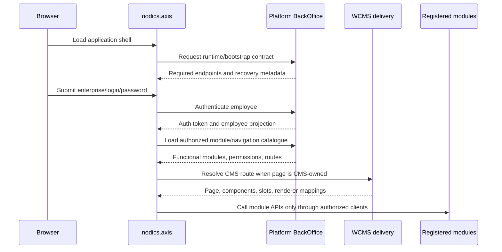

# Nodics Axis

Nodics Axis is the reusable Back Office frontend for a single Nodics-based
customer project deployment.

Canonical user and contributor documentation is authored in the backend-owned
Platform `axis` module under `docs` and deterministically
generated into this module's committed CMS import release under `data/core`.
The Axis frontend repository owns only executable browser renderers and static
recovery behavior; it must not own backend-importable CMS data.

Axis is a client-side web application. It authenticates human users through
Profile, retrieves an authorized bootstrap contract from Back Office, and then
calls the authoritative APIs of discovered Nodics modules directly.

## Why Axis exists

Axis gives business users and operators one governed workspace for a Nodics
customer project. Without a workspace like Axis, every module would either
need to create its own administration UI or teams would manage runtime data
through ad-hoc scripts and direct database edits. Both paths create duplicate
authority and make permission, audit, recovery, and tenant boundaries harder
to prove.

Axis solves that by staying deliberately thin. The backend decides which
modules are active, which pages are authorized, which documentation products
exist, which APIs are exposed, and which operations a user can perform. Axis
turns those contracts into a usable experience: login, navigation, dashboards,
module registry, content workspaces, documentation, API reference, schema
workbench, media management, imports, operational health, and future governed
business workspaces.

## Reader mindset

For a business reader, Axis is the operational face of Nodics. It shows that a
modular backend can still feel like one coherent application to employees. It
also protects adoption cost: a new functional module can contribute metadata,
documentation, pages, and APIs without asking every customer to rebuild the
frontend from scratch.

For a developer, Axis is the renderer and interaction layer. It owns React
components, typed clients, safe CMS renderers, shell behavior, routing guards,
accessibility, loading states, recovery screens, and frontend tests. It does
not own backend-importable data, business services, schemas, permissions,
content records, or module registration.

For an operator or DevOps reader, Axis is a deployable browser artifact whose
public configuration points to Platform. Backend endpoints, module connections,
content-pack status, and documentation products are discovered at runtime.
Production deployments can replace `axis-config.json` without rebuilding the
frontend, but they must not place credentials or private values into browser
configuration.

## Beginner mental model

Imagine a secure office building. Platform is the reception and control desk.
WCMS is the document and content library. Cron is the scheduled operations
room. Other modules own their own specialized work. Axis is the employee
portal that lets authorized people reach those rooms. The portal does not move
the rooms into itself; it checks the building directory and opens only the
doors the backend says this employee can use.

## Boundaries

- Nodics remains the backend and API authority.
- Axis contains presentation and interaction behavior, not authoritative
  business logic.
- Every customer project has an isolated Axis deployment.
- Axis does not depend on whether Nodics runs as a monoServer or distributed
  module servers.
- CMS descriptors can select Axis-owned components but cannot deliver
  executable frontend code.

See
[Axis Architecture and Ownership](architecture-and-ownership.md) for the
per-customer deployment model, repository responsibilities, contract authority,
security boundary, and verification expectations.

See [Frontend Technology Stack](frontend-technology-stack.md) for the
approved tools, state ownership, styling decision, repository shape, and
dependency-governance rules.

Use the [Feature Delivery Checklist](feature-delivery-checklist.md) for
repository-boundary analysis, security, contract testing, accessibility,
documentation placement, and completion evidence for every Axis slice.

Read the
[Axis Implementation And Documentation Contract](implementation-and-documentation-contract.md)
for partial-discovery rules, repository placement, required use cases, and the
acceptance contract followed by human developers and AI tools.

See [CMS Delivery and Renderer Integration](cms-delivery-and-renderers.md)
for the resolved-page client, trusted renderer boundary, validation rules,
cache isolation, and login integration.

See [Documentation Content In Axis](documentation-content.md) for dynamic
Framework, Swaggers, Nodics Axis, and future project documentation sources;
per-product CMS catalogs; the import-ready Axis content pack; renderer
ownership; security boundaries; and failure behavior.

See [Module Health](module-health.md) for backend-driven operational
navigation, the typed registry client, module and node readiness presentation,
security boundaries, responsive behavior, and extension rules.

See [Imports and Exports](imports-and-exports.md) for immutable init, core,
and sample release discovery, validation, installation, history, security, and
the intentionally disabled export surface.

See [Employee Login, Recovery, Screen Lock, and Dashboard](employee-login.md)
for startup discovery, employee-only authentication, persistent BackOffice
policy consumption, protected routing, logout, and failure recovery.

## How Axis discovers capability

Axis starts from public runtime configuration, then asks Platform for a
low-disclosure bootstrap contract. After authentication, BackOffice returns
authorized navigation, module catalogue metadata, module connections,
documentation sources, feature flags, and user/session context. Axis does not
invent module state from local files and does not assume that a module is safe
to render merely because a frontend component exists.

This is the same principle used by the module registry. Core, Platform, and
WCMS are mandatory for the current Axis experience. Optional modules such as
Cron can be observed by runtime servers and then registered, activated,
deactivated, or deregistered through the governed lifecycle. The UI must update
from the backend response after each operation rather than requiring a manual
refresh.

## Prerequisites

- Node.js 24
- npm 10 or 11
- A local Nodics backend when integration behavior is required

## Start locally

Start the Nodics Kickoff backend servers in separate terminals:

```bash
cd ../nodics.kickoff
npm run start:platform
npm run start:wcms:staged
npm run start:wcms:online
npm run start:process
```

Install and start Axis:

```bash
npm ci
npm run dev
```

Axis runs at <http://localhost:3100>.

## Environment and runtime configuration

Copy `.env.example` to `.env` and configure the local/build values there.
The repository includes a safe local `.env`; Git ignores it so each developer
or deployment can use different values.

```dotenv
AXIS_BACKOFFICE_BASE_URL=http://localhost:4300
AXIS_ENTERPRISE_CODE=default
AXIS_PROJECT_CODE=nodics.kickoff
AXIS_CLIENT_CONTRACT_VERSION=1
AXIS_REQUEST_TIMEOUT_MS=10000
AXIS_BROWSER_SESSION_CSRF_COOKIE_NAME=nodics_axis_csrf
AXIS_ASSISTANT_MAXIMUM_EVENT_BYTES=65536
AXIS_ASSISTANT_RECONNECT_WINDOW_MS=120000
AXIS_ASSISTANT_IDLE_TIMEOUT_MS=45000
AXIS_DEV_HOST=0.0.0.0
AXIS_DEV_PORT=3100
AXIS_STRICT_PORT=true
AXIS_BUILD_SOURCEMAP=true
```

Vite validates these values and generates `/axis-config.json`:

```json
{
  "backofficeBaseUrl": "http://localhost:4300",
  "enterpriseCode": "default",
  "projectCode": "nodics.kickoff",
  "clientContractVersion": 1,
  "requestTimeoutMs": 10000,
  "browserSessionCsrfCookieName": "nodics_axis_csrf",
  "assistantMaximumEventBytes": 65536,
  "assistantReconnectWindowMs": 120000,
  "assistantIdleTimeoutMs": 45000
}
```

Axis loads that document and then obtains the active Profile and CMS endpoints
from BackOffice's low-disclosure public bootstrap. Axis does not maintain a
second module endpoint list.
Invalid or unavailable configuration produces a recovery screen instead of
attempting authentication.

`.env` and `axis-config.json` are public configuration, not secret stores.
Never place passwords, tokens, API keys, private keys, or credentials in them.
Only explicitly named `AXIS_*` variables are consumed; Axis does not expose
arbitrary environment variables to browser code.

For production, the generated `dist/axis-config.json` may be replaced during
deployment so endpoints can change without rebuilding Axis. Serve it with
`Cache-Control: no-store`. Serve hashed assets with long-lived immutable
caching.

## Quality commands

```bash
npm run format:check
npm run lint
npm run typecheck
npm run test
npm run build
npm run verify
```

The implemented Gold and Charcoal foundations, responsive shell, recovery
states, accessibility behavior, and extension rules are documented in
[Axis Design System And Static Shell](design-system-and-shell.md).

The implemented authenticated Assistant CMS route, renderer hierarchy,
direct-module connection validation, and typed HTTP client are documented in
[Axis Assistant Frontend](assistant-frontend.md).

The implemented Schema Workbench discovery, schema browser, bounded record
list, relationship editor, record detail, Create, Update, and governed Delete
are documented in
[Axis Schema Workbench](schema-workbench.md).

## Current scope

The current foundation proves the frontend runtime boundary, safe startup, CMS
delivery/renderers, employee authentication, secured BackOffice bootstrap,
CMS-driven login/recovery/lock pages, idle screen locking, protected dashboard
routing, logout, the CMS-driven Assistant workspace shell, typed Assistant HTTP
contracts, authenticated resumable SSE transport, isolated Assistant
presentation state, and the CMS-driven Schema Workbench browser with
direct-module schema discovery, bounded record reads, relationship
coordination, record detail, generated Update, and governed Delete. The
Operations workspace includes Module Health with permission-filtered
navigation, module summaries, on-demand registered node details, and governed
refresh. The Content area now includes the first Page Designer foundation:
a catalog-first, backend-governed composition workspace for sites, templates,
dynamic slots, sections, components, media references, routes, navigation, and
publish-readiness validation.

## Axis startup flow



This flow is important because Axis should not guess. It does not decide that
Cron exists because a menu item was coded. It does not decide that a component
is safe because a TypeScript component exists. It asks the backend which
functional modules are registered, active, live, and authorized for the user.

## Backend-owned content rule

Axis is a renderer. It can contain React components, route guards, query
clients, shell behavior, typography, responsive layout, accessibility behavior,
and tests. It should not own database-importable CMS content. Login page
content, documentation pages, module navigation, and renderer mappings are
backend-owned data contracts.

| Content | Owner |
| --- | --- |
| Framework documentation | `nodics.docs` |
| Axis product documentation and Axis shell content | `nodics.platform/modules/axis` |
| Kickoff project documentation | `nodics.kickoff` |
| Customer-specific documentation | The customer project or customer extension module |
| Browser renderer implementation | `nodics.axis` |

This rule protects partners. A partner can replace, theme, or extend Axis
without losing the backend-owned records that define what the business user is
allowed to see.

## Beginner mental model

Think of Axis like a governed control room. The control room has screens,
buttons, navigation, forms, and panels. But the control room does not own the
factory machines. Platform owns identity and module registration. WCMS owns
content and media. Cron owns scheduled work. Other functional modules own
their own business APIs. Axis makes those capabilities usable for employees.

When Axis cannot reach BackOffice, it shows recovery mode. When it cannot
resolve a CMS route, it shows CMS recovery. Those states are not failures of
styling; they are intentional safety rails that stop the browser from
inventing behavior.

## Customize and extend safely

Use Axis as the reusable frontend base and place customer-specific pages,
renderers, typed clients, theme composition, and CMS presentation data in the
customer Axis project. Keep customer business services, schemas, workflows,
permissions, and API implementations in its Nodics backend project.

The smallest extension adds one focused feature directory, one backend-driven
navigation or renderer contract, and mirrored tests. Do not modify reusable
framework behavior for customer needs, hardcode backend-owned labels, create a
parallel module registry, or move authorization into the browser. Prove
startup, permission, contract-version, malformed-data, failure recovery,
responsive and WebView, integration, regression, and production-build
behavior. Rollback removes the customer registration and deployment artifact
without mutating Nodics-owned persisted contracts.

## Common mistakes

- Do not put CMS import data into `nodics.axis`; backend-owned content belongs
  in the owning module or customer project.
- Do not hardcode documentation products, module endpoints, or registry states
  in the browser.
- Do not duplicate Profile authentication or BackOffice authorization in
  frontend state.
- Do not treat a visible menu item as permission to call an API; use the
  authenticated bootstrap and backend response contracts.
- Do not embed backend Swagger UI in an iframe; open it as a separate page and
  render the read-only OpenAPI reference inside Axis.

## Verification

The Axis product is healthy when a beginner can start from the login page,
authenticate through Profile, land in the governed workspace shell, discover
backend-authorized navigation, open Documentation, see Framework, Swagger,
Axis, and customer documentation products, use System and Integrations,
Content, Media, Imports and Exports, Module Registry, and Schema Workbench
without browser-owned authority, and recover clearly when a backend capability
is unavailable. Developers should also run the package verification gate and
confirm no importable backend data lives in the frontend repository.
