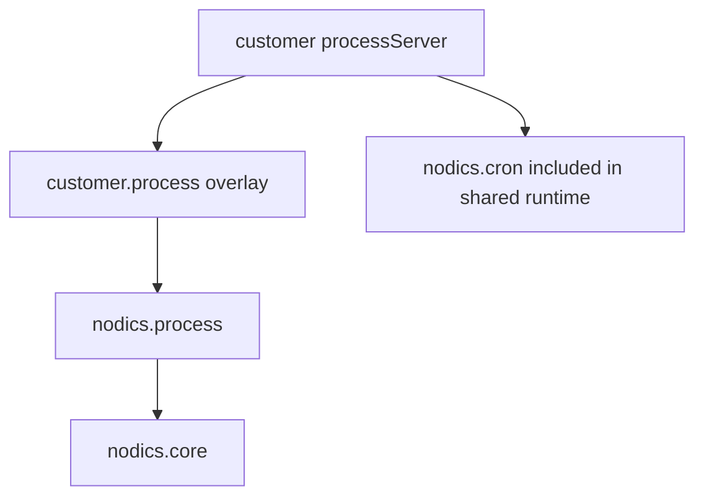

# Custom Project Extension Guide

Customer projects may customize Process behavior without renaming the functional
module. A customer module can extend or override standard behavior, but Axis and
BackOffice should still show the capability as Process.

## Example topology

The server can include Cron and Process together for operational simplicity,
while ownership remains clear.

## What belongs in a customer extension

- custom task assignment rules;
- domain-specific action adapters;
- additional graph validation policies;
- extra audit metadata with safe redaction;
- environment-specific timer/SLA rules;
- customer documentation and sample workflows.

## What should not be customized casually

- published version immutability;
- permission checks;
- audit event creation;
- backend graph validation;
- module identity exposed to Axis.

Changing those weakens trust in the automation platform.

## Documentation ownership

Framework Process docs belong in nodics.process. Customer process docs belong in
the customer project module or project documentation pack. Axis only renders
imported content; it should not own backend documentation data.

