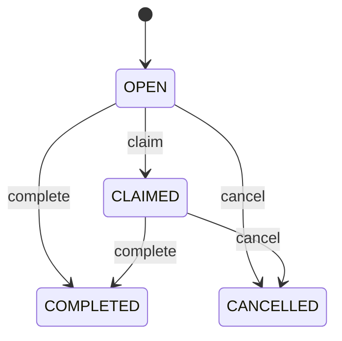

# Build Your First Human Task Flow

Human tasks are the bridge between automation and people. A task tells an
operator, reviewer, merchandiser, support agent, or approver what needs human
attention.

## Example business scenario

A content editor changes a page. The change should not go live until someone
reviews it. The process creates a task called `Review content`. The reviewer can
claim it, assign it, complete it, or cancel it.

## Task fields you should understand

| Field | Why it matters |
| --- | --- |
| `code` | Stable task identifier for audit and support. |
| `instanceCode` | Links the task to the running process instance. |
| `nodeCode` | Shows which workflow step produced the task. |
| `assignee` | Person, queue, or group expected to work on it. |
| `status` | Current state such as `OPEN`, `CLAIMED`, or `COMPLETED`. |
| `dueAt` | Optional SLA date for operations. |

## How Axis should present task work

Axis should show tasks as business work, not as raw database rows. A good task
screen answers:

1. What process created this task?
2. What business object is affected?
3. Who owns it now?
4. What action can I take safely?
5. What happened before this task?

The detail timeline answers the fifth question by reading Process audit events.

## Developer customization

Customer modules can customize assignment without editing standard Process
source. For example:

- route enterprise onboarding approvals to an enterprise admin queue;
- route product publishing approvals to merchandising;
- route logistics exceptions to warehouse operations;
- route refund approval tasks to finance.

The customization should live in the customer or domain module, not in Axis.
Axis renders authorized actions; Process owns task lifecycle.

