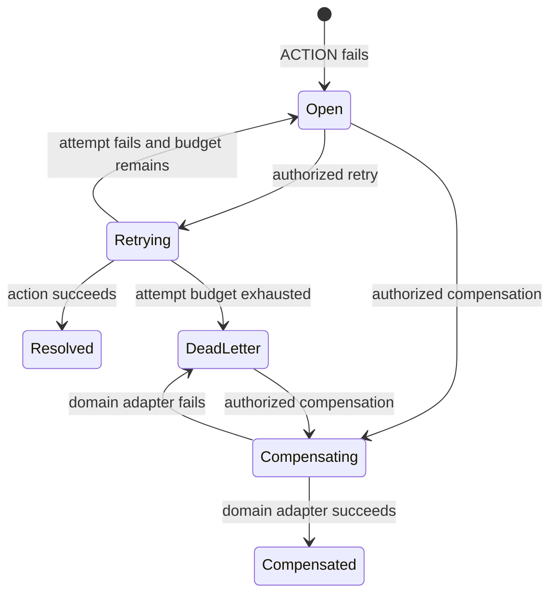

# Incident, Retry, and Compensation Operations

This guide explains what happens when an automated workflow step fails and how
an operator safely recovers it. Process owns the orchestration incident. The
business module still owns the action and any reversal of business state.

## The recovery lifecycle



An ACTION failure creates one `processIncident` containing the instance,
published definition version, failed node, stable error code, current attempt,
maximum attempts, optional next retry time, and declarative adapter references.
Raw exception payloads and secrets must not be copied into incident evidence.

## What an operator sees

The incident list is the recovery work queue:

```http
GET /nodics/process/v0/incidents?status=OPEN
Authorization: Bearer <access-token>
```

Open the incident before acting. Confirm the definition version, node, error
code, attempt budget, next retry time, and related instance. Refresh if another
operator may be working on the same incident.

| Operation | Permission | Result |
| --- | --- | --- |
| List or read incidents | `process.incident.read` | Returns bounded recovery evidence. |
| Retry failed ACTION | `process.instance.retry` | Re-executes the same published ACTION and continues only after success. |
| Run compensation | `process.instance.compensate` | Dispatches the node's registered domain compensation adapter. |

## Retry safely

Send the attempt number you inspected. This optimistic check prevents an old
browser tab from spending a newer retry attempt.

```http
POST /nodics/process/v0/instances/orderApproval-001/retry
Authorization: Bearer <access-token>
content-type: application/json

{
  "expectedAttempt": 1,
  "correlationId": "support-case-4831"
}
```

On success, the incident becomes `RESOLVED` and the instance continues from the
transition after the failed ACTION. On failure, the attempt increments. The
incident returns to `OPEN` while budget remains or becomes `DEAD_LETTER` after
the final attempt. Retry policy is bounded to ten attempts and a maximum delay
of 24 hours even when project configuration is incorrect.

## Compensate safely

Compensation is not a generic database rollback. A workflow node may declare a
registered compensation adapter, for example an Order-owned reversal command.
Process invokes that adapter and records orchestration evidence; the domain
module validates its own state, idempotency, authorization, and reversal rules.

```http
POST /nodics/process/v0/instances/orderApproval-001/compensate
Authorization: Bearer <access-token>
content-type: application/json

{
  "payload": {
    "reasonCode": "PAYMENT_CAPTURE_FAILED"
  }
}
```

If no compensation adapter is declared, the API fails closed. Operators must
not substitute a direct database edit. If compensation fails, the incident is
dead-lettered and the instance keeps `compensationStatus: FAILED` for manual
investigation.

## Developer contract

An ACTION node can declare retry and compensation without embedding executable
code in the graph:

```json
{
  "code": "reserveInventory",
  "type": "ACTION",
  "action": {
    "moduleName": "nodics.commerce.inventory",
    "operation": "reserve"
  },
  "retry": {
    "maximumAttempts": 3,
    "delayMs": 5000
  },
  "compensation": {
    "moduleName": "nodics.commerce.inventory",
    "operation": "release"
  }
}
```

Both declarations must exist in the configured action-adapter allowlist. The
adapter implementation lives behind a domain service or facade. Unknown or
unavailable adapters fail closed.

## Operational checklist

1. Confirm the incident belongs to the intended tenant and instance.
2. Read the stable error code and current attempt; never expose secrets in notes.
3. Resolve the external cause before retrying, when applicable.
4. Pass `expectedAttempt` and a correlation identifier.
5. Confirm `process.incident.resolved` or `process.incident.compensated` audit evidence.
6. Escalate dead-letter incidents instead of repeatedly bypassing policy.
7. Test domain compensation idempotency and partial-failure behavior before production qualification.
