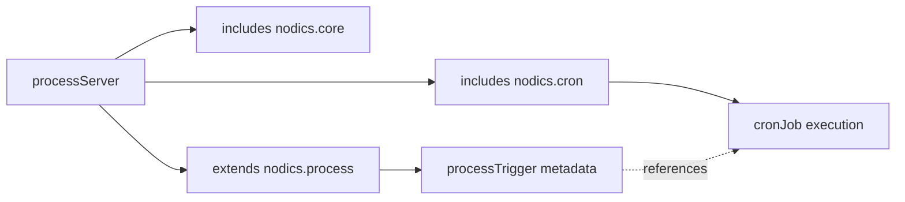

# Process and Cron Shared Runtime

Process and Cron can run together in one runtime server when a partner wants a
smaller topology. This is useful for local development, small installations, or
customers who want business process automation and scheduled jobs without
running many microservice processes.

## The key rule

Shared runtime does not mean shared ownership.

| Concern | Owner |
| --- | --- |
| Process definitions | `nodics.process` |
| Published workflow versions | `nodics.process` |
| Runtime instances and tasks | `nodics.process` |
| Trigger relationship metadata | `nodics.process` |
| Cron job definition | `nodics.cron` |
| Scheduler firing and retries | `nodics.cron` |
| Domain business action | Domain module |
| UI rendering | `nodics.axis` |

## Example topology

The trigger can reference a Cron job code. It does not become the Cron job.
Cron still decides when the job fires. When a Cron-owned job wants to start a
process, it calls the Process API with a secured runtime identity.

## Why this is attractive for partners

Partners often start with one server for operational simplicity. Later they may
split runtimes when scale, isolation, or team ownership requires it. Nodics
should support both without changing functional module identity.

This keeps the mental model stable:

- Process console shows workflows and automation relationships.
- Cron console shows jobs and scheduler behavior.
- Axis can place both under "Business Process & Automation".
- Backend ownership still protects maintainability.

## Safe lifecycle behavior

Cron can be registered, activated, deactivated, and deregistered through the
module registry. Process APIs should remain reachable even when Cron is
deregistered, because Process definitions and tasks are not owned by Cron.

The local acceptance smoke proves this by exercising Process runtime first and
then verifying the Cron registry lifecycle.

## Continue

- [Runtime Instance and Task Lifecycle](runtime-lifecycle.md)
- [DevOps and Runtime Topology](devops-topology.md)
