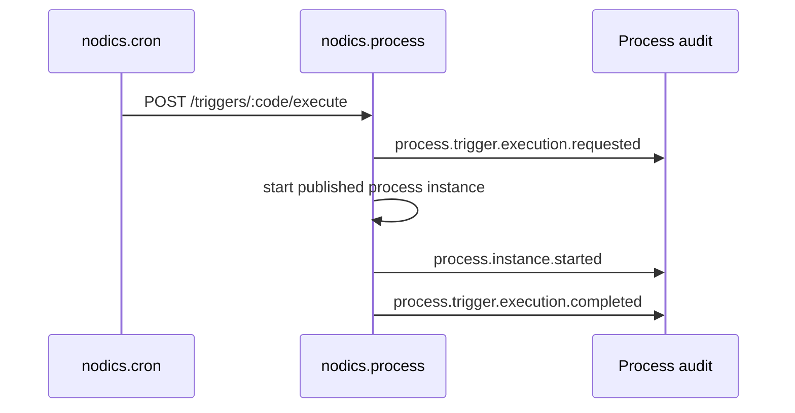

# Scheduled Automation and Cron Triggers

Scheduled automation connects time-based execution to business workflows. Nodics
keeps the ownership boundary explicit:

- nodics.process owns process definitions, trigger relationships, instances,
  tasks, and audit.
- nodics.cron owns job scheduling, firing, retry timing, and scheduler runtime.

## Why this split exists

If Process owned Cron jobs directly, workflows would become a hidden scheduler.
If Cron owned process definitions, scheduled jobs would become a hidden workflow
engine. Keeping the boundary clear makes the system easier to test, operate, and
customize.



## Trigger lifecycle

| State | Meaning |
| --- | --- |
| `DRAFT` | Relationship exists but is not executable. |
| `ACTIVE` | Authorized scheduler can execute it. |
| `PAUSED` | Keep metadata but do not execute. |
| `ARCHIVED` | Historical relationship; cannot be updated or executed. |

Axis should make this lifecycle obvious. A business user should not need to
guess why an automation did not run.

## Runtime execution contract

The execution API requires an active trigger. The scheduler should pass a
correlation or idempotency key.

```http
POST /nodics/process/v0/triggers/dailyContentApproval/execute
Authorization: Bearer <runtime-token>
content-type: application/json

{
  "correlationId": "cron-fire-2026-08-09T10:00:00Z",
  "context": {
    "source": "cron",
    "businessDate": "2026-08-09"
  }
}
```

Process starts the referenced workflow and records audit evidence. Cron remains
responsible for deciding when to call this endpoint and how to retry scheduler
failures.

